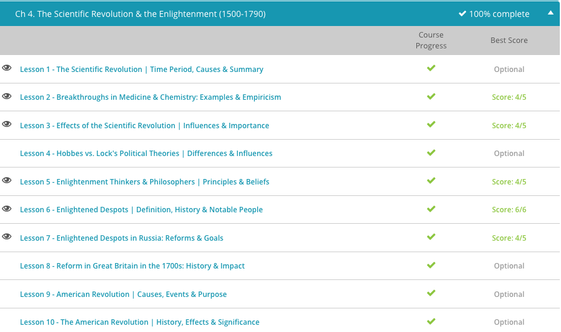

### Andrew Garber
### March 6 2024
### CLEP Western Civilization II
### Chapter 4: Scientific Revolution and Enlightenment

#### 4.1. The Scientific Revolution
 - The Scientific Revolution is a complicated and disjointed movement upon whose periods and actors historians do not always agree. Some scientists of the period built on the works of those who came before them. Others made their own contribution strictly from their own observations and at times contradicted the evidence and conclusions of their contemporaries. With that caveat made, many historians claim that it began with Copernicus and ended with Isaac Newton 150 years later. 
 - Those seem to be arbitrary, but for the purposes of defining them that is fine - arbitrary is fine for nebulously defined periods.
 - Copernicus was the first(ish) person to propose a heliocentric model of the universe(our solar system). He published a book called *On the Revolutions of the Heavenly Spheres* in 1543. The Catholic Church was not a big fan of this, as it contradicted their view of the Bible, and for good reason. The Bible says that the sun "rises" and "sets," which is an observation you can make from the perspective of the Earth, but not the sun. This was a big deal at the time, and Copernicus was afraid to publish his work until he was on his deathbed(or near it).
 - Next up is Tycho Brahe, who was a Danish astronomer(and generally hooligan) who did a lot of work improving on astronomical instruments and making accurate observations of the stars. He believed that the Earth was the center of the universe due to the stars being stationary - we know that they aren't stationary, but are so far away that they appear to be.
 - Johannes Kepler, yes the guy who the laws and the telescope are named after, was Brahe's assistant though definitely more talented than his boss. He was a mathematician and astronomer who used Brahe's advanced observational techniques and equipment to improve upon the Copernican model. He discovered that the planets' orbits were not circular, but slightly(or greatly, depending on the planet) elliptical. Kepler was further able to derive a mathematical equation (known today as 'Kepler's Third Law') that could be used to determine orbital periods and speed.
 - Next is one of the greatest thinkers in human history, Galileo Galilei(definitely top 20 all-time, in my book). He was an Italian physicist, mathematician, astronomer, and philosopher--as well as businessman who made a ton of money from his inventions--who dramatically improved the telescope, and used it to observe the solar system. He discovered phases on Venus, moons orbiting Jupiter, and even proved that Venus revolved around the Sun and not the Earth. This was fairly monumental, as it was sensory evidence--not just mathematical--that contradicted the Church's teachings. He published *Dialogue Concerning the Two Chief World Systems* in 1632, which portrayed those defending the geocentric model as simpletons, the character *literally* named *Simplicio*(which is some excellent trolling). The Catholic Church was not amused and put him on trial for heresy. He was found guilty of a *suspicion* of Heresy, and sentenced to house arrest for the rest of his life. He died in 1642.
 - Next, we get to the actual inventor of the Scientific Method, Sir Francis Bacon. He was an English philosopher and statesman who believed that the goal of the sciences was to improve the human condition. He thought that the way to achieve that was by collecting data and making observations, and then using inductive reasoning to come up with general principles. He was also a strong advocate for the separation of science and religion, which was not too common at the time. Good on him.
 - Bacon published several works in the early seventeenth century that rejected Ptolemaic methodology in favor of empiricism. Bacon claimed that all knowledge came first from observation, and he laid out a rigorous investigative method, similar to ancient Greek schools like the Stoics--who were not totally empricist, but believed that all knowledge *came* from sense experience and had to be interpreted rationally. 
 - Another mathematician turned philosopher was the Frenchman, René Descartes. Active in the mid-seventeenth century, Descartes formulated a new worldview that still drives many of the smartest physicists today: that the world is made up of basic units governed by basic, natural laws. Descartes' theories, which have become known as Cartesianism, attempted to partially reconcile the heliocentric universe with the existence of a Christian God by separating the deity from the universe he created. The Cartesian God had created a mechanically perfect universe, one which did not need his direct intervention - ideas which weren't exactly popular with the Church but would morph into Deism(which influenced many American revolutionaries, including Thomas Jefferson and Benjamin Franklin).
 - The thinker whose work many historians consider to be the culmination of the 150 years of scientific and philosophical innovation is Isaac Newton. Newton was an accomplished mathematician and later alchemist who puzzled constantly over the natural world and the laws which governed it. Newton dabbled in optics, discovering that white light was composed of all the different colors of the rainbow. However his greatest triump would come with the publication of the *Mathematical Principles of Natural Philosophy* in 1687, which contained his three laws of motions and the law of universal gravitation. It was, to put it simply, groundbreaking and would change the way that people viewed the world. His advances in physics inspired a general societal shift towards scientific reasoning and rationality.

#### 4.2. Breakthroughs in Medicine and Chemistry
 - Medicine before the scientific revolution was largely based on the work and teachings of Galen, who would be the personal doctor of the Roman Emperor Marcus Aurelius and a few others. 
 - Many of Galen's techniques were based on observation and experimentation, and he made many dissections on humans and animals. Although this methodology was largely lost in the West, over the next millennium, his theories were widely accepted as fact throughout Western Europe. Most prevalent and important of these theories was that Galen believed sickness was caused by imbalances in the four humors and temperaments of the body. Being too cold, too hot, too wet, or too dry could throw these humors out of balance and cause illness in someone.
 - These ideas were largely unchallenged until the Scientific Revolution, and included terrible techniques like bloodletting, which was based on the idea that the humors were carried in the blood and could be removed to restore balance. This was dumb for a miriad of reasons, but mostly because it actually made the body weaker and more susceptible to disease.
 - Most people in the Middle Ages still believed in the Aristotelian model of the world, which stated that all substances in the world were composed of combinations of four basic elements: fire, air, water, and earth. It is hard to overstate the influence of Aristotle in Western Europe before the Scientific Revolution, he was simply known as *The Philosopher* - not *a* philosopher, *The* philosopher. 
 - Arguably, the first man who began this change in Western Europe was the Swiss-born chemist Paracelsus. Active in the first half of the 16th century, Paracelsus favored experimentation as the key to understanding the world, and he rejected common practices like bloodletting and the theory that disease was caused by bodily imbalances.
 - Whereas Paracelsus provided a new, more accurate theoretical framework for medical theory, much of the observation and discoveries about the human body were made by his Flemish contemporary, Andreas Vesalius. Vesalius made countless dissections of the human body, making important discoveries which contradicted Galen's maxims; for instance, Vesalius correctly identified that the human heart had four chambers. Galen, who had likely based his conclusions on the dissections of dogs, claimed it only had two.
 - The Irish-born Robert Boyle also made contributions to medicine and chemistry. Despite Boyle being an avid alchemist, he was an accomplished empiricist who famously claimed he believed only the things which he had learned from experimentation. He is famous throughout modern chemistry and physics as the discoverer of Boyle's Law, which states that the volume of a gas varies inversely with pressure - a law still taught in every chemistry and physics class today.
 - The discoveries of these fledgling physicians and chemists and their emphasis on empiricism paved the way for further discoveries and deeper understanding of the human body and chemicals in the century to come. Indeed, the English physician William Harvey took many of these new principles to heart. After receiving training in Italy, Harvey returned to England to teach and practice and was even named court physician to King James I. In 1628, he released his On the Motion of the Heart in which he announced his discovery that blood was continuously pumped throughout the body by the heart and that the body contained a fixed amount of blood. This marked a landmark in medicine, and it was a further step away from the teachings of Galen and the Aristotelian model of the world.

#### 4.3. Effects of the Scientific Revolution 
 - The increased emphasis placed on experimentation and empirical knowledge during the Scientific Revolution caused many philosophers and scientists to rethink the very nature of knowledge itself. Skepticism among these groups of thinkers grew over Early Modern society's view of the world and the accepted truths on which it was based.
 - Rather than accepting knowledge based on revealed truths, those who espoused the principles of the Scientific Revolution believed that truth and fact lay through firsthand observation and experimentation. For example, the philosopher René Descartes famously took these skeptical views to their theoretical limit, questioning even his own existence. He ceased his own skepticism only through realizing that the very act of thinking about his own existence proved his existence. Nietzsche would actually disprove this, by saying that it had to be extended and re-ordered to "I still live, I still think: I still have to live, for I still have to think." While this oratorical flourish is not as pithy as "I think, therefore I am," it is more accurate and less solipsistic. I can go way more into this, but I won't.
 - Astronomy was critical here, as it challenged--provably by observation--that Church statements were wrong. For example, the work of Copernicus and Kepler displaced Earth from the center of the universe, which inherently questioned the church's view that Earth and humanity, in particular, was chosen by God and rightfully resided in the center of His universe.
 - Furthermore, the discovery of natural laws caused many philosophers to rethink the nature, or even existence, of God and his role in the universe. This was also challenged by some of the ideas forwarded by several philosophers that the universe's laws could be quantified mathematically. After all, if the world was governed entirely by natural laws, such as magnetism or gravity, there was little room left for the intervention of a divine actor. These notions led some to adopt Deism and the mechanistic universe adopted by the Frenchman René Descartes. Deism was a belief that God created the universe and its fundamental laws, and then left it running like a clock with no further intervention.
 - These ideas challenged several central tenets of Early Modern Christianity, both Catholic and Protestant, and angered several church authorities throughout the 17th century. The Italian astronomer and champion of the telescope, Galileo Galilei, was imprisoned in 1633 by Pope Urban VIII. Although he was released only six months later, he continuously faced the prospect of imprisonment and house arrest for the remainder of his life. 
 - The heliocentric, Copernican model of the universe had further ramifications for how humans viewed themselves. The previous, geocentric model fit well with the standard, Christianity-driven view of humanity. As God's chosen creation, it only made sense that the planet humanity occupied was the center of the universe.
 - However, the removal of the Earth from the universal center - indeed, the placing of humanity on a relatively tiny planet orbiting the enormous sun with other, often larger planets - questioned the fundamental importance previous thinkers had conferred upon humanity and its place in the universe. In doing so, by making ourselves less important, we actually made ourselves more important as it was now our actions that would determine our fate, not the whims of a divine actor(while people still believe in God today, the idea that all of your actions are pre-determined by God and thus ambition is counter to Christian morality is no longer a popular view).

#### 4.6. Enlightened Despots
 -  Enlightened despotism and its equal, enlightened absolutism, are terms historians use to describe the policies of several 18th-century European monarchs. They are despots (or absolutists) because they continuously worked to centralize all the power within their nation in the monarchy at the expense of provincial nobles and national or provincial assemblies.
 - Somewhat paradoxically, many of these despots also embraced the Enlightenment, an 18th-century intellectual trend that espoused rational thought, empiricism, and individual rights and liberties. These monarchs attempted to improve their states through the personal implementation of Enlightenment ideas while at the same time maintaining, or even enhancing, monarchical-control over the affairs of the state.
 - In effect, you ended up with a paternalistic state, where the monarch was the father of the nation and the people were his children. In doing so, the population trusted--implicitly, or according to state doctrine--that the monarch was acting in their best interest to protect them and improve their lives. This was a very different view of the state than the one that had been held for centuries, where the monarch was a divine actor who was to be obeyed without question.
 - Whereas halfhearted attempts at enlightened rule failed in France, wholesale embrace of the Enlightenment succeeded wildly in Prussia. Frederick II of Prussia, often referred to as Frederick the Great, was King of Prussia from 1740 to 1786. He gained his moniker largely due to battlefield successes; he invaded Silesia in 1740 and retained the territory throughout the War of Austrian Succession and the ensuing Seven Years' War despite facing a larger, better funded alliance of France, Russia and Austria.
 - In addition, he was also an avid reformer. Though he demanded absolute power in affairs of the state, he famously proclaimed himself the 'first servant of the state' and tried to rule with a mind toward what was best for Prussia and not just himself. Part of this was his soldierly instinct to discipline, order, and a sort of "commander's care for his troops" that he extended to his subjects. Indeed, Frederick embraced Enlightenment ideals by granting Prussians further freedoms. He granted universal religious toleration throughout Prussian territory, and even granted the press a degree of freedom of speech. In addition, Frederick expanded individual rights within his realm, abolishing torture and speeding up legal proceedings, granting his citizens a certain amount of due process. 
 - Frederick enhanced the country's infrastructure as well, building roads and bridges and enriching the provincial backwaters through agricultural reforms meant to improve crop yield and farm organization. His reforms of the Prussian educational system were not only intended to improve the quality of Prussian schools, but also expand enrollment. This also went a long way to helping to indoctraine young children in Prussian ideology, where service to the state was the aim. When Frederick died after 46 years on the throne, he left his beloved Prussia as arguably the strongest nation in central Europe.
 - The enemy of Frederick the Great's lifetime was Hapsburg Austria and the first female monarch of the line, Maria Theresa. Maria Theresa's father, the Holy Roman Emperor Charles VI had left Austria reeling financially and militarily upon his death in 1740 - the same year Prussia invaded Silesia. She greatly centralized authoirty, improved the tax system, and reformed the military. While democratic-minded people would not applaud it, she decreased the meetings of the provincial assemblies and increased the power of the central government--her. She set the stage for one of the greatest enlightened despots of all time, her son Joseph II.
 - That son, Joseph II, formally took the Austrian throne in 1780 upon Maria Theresa's death, although he had been ruling the Holy Roman Empire and portions of Austrian affairs since his mother appointed him Holy Roman Emperor and co-regent of Austria in 1765. Joseph's series of reforms in his ten years of personal rule until his death in 1790 have been termed Josephism by historians. Josephism embraced several ideals of the Enlightenment, but only so far as they strengthened the crown and state authority.
 - For example, his 1781 Edict of Toleration granted Protestants virtually equal status with Catholics, which Joseph enacted despite his personal, fervent Catholicism. It also lifted nearly all restrictions on Jews, and oppressive religious institutions, including many Austrian monasteries, were dissolved and their lands and finances forfeited to the crown. Administratively, Joseph continued the centralizing of power in the monarchy and streamlining of the bureaucracy that his mother had begun. 

