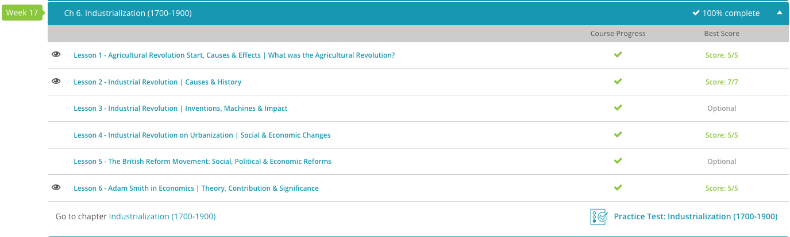

### Andrew Garber
### March 19 2024
### CLEP Western Civilization II: Chapter 6: Industrialization

#### Agricultural Revolution
 - The Agricultural Revolution was a period of technological improvement and increased crop productivity that occurred during the 18th and early 19th centuries in Europe. New patterns of crop rotation and livestock utilization paved the way for better crop yields, a greater diversity of wheat and vegetables and the ability to support more livestock. These changes impacted society as the population became better nourished and healthier. The Enclosure Acts, passed in Great Britain, allowed wealthy lords to purchase public fields and push out small-scale farmers, causing a migration of men looking for wage labor in cities. These workers would provide the labor for new industries during the Industrial Revolution.
 - In many ways, British agriculture advanced more rapidly than any other European nation. The increased agricultural production of the 18th century can be traced to four interrelated factors: The increased availability of farmland, A favorable climate, More livestock, Improved crop yield
 - The available farmland increased due to changes in landholding patterns spurred on by new methods of cultivation. Previously, the open-field system was prominent. This system was problematic because it allowed part of the land to remain unplanted at all times in order to avoid depleting the soil. Since growing crops removes nutrients from the soil, a field must be replenished in order to continue to yield food. One solution to this situation was to continue to move crops to different land. This was not feasible in Great Britain because the country lacked a large percentage of available land. Instead, farmers began to utilize barren soil by planting different crops, such as clover or turnips. These plants have roots rich in nitrogen, a necessity for replenishing soil. The cultivation of turnips was important because they could be left in the ground through the winter. This ultimately led to an increase in livestock because these plants were also utilized for grazing.
 - Several innovators created tools that greatly influenced the new agriculture. For instance, a significant step forward was pioneered by Jethro Tull, an English agriculturist. He perfected a horse-drawn seed drill that planted seeds in well-defined rows instead of scattering them, making harvesting far more efficient and decreasing seed loss to birds.
 - During this time, new crops were becoming popular in Europe. For instance, potatoes and maize were brought from America and introduced to Europe. These crops were grown in large scale after 1750. In particular, the potato became a staple crop in places such as Ireland and Germany. Because this crop was incredibly easy to grow, was high in carbohydrates, calories and essential vitamins and could be stored successfully, it became a necessity for many of Europe's poor.
 - Landowners began to enclose fields that were formerly open. With the advent of new farming techniques, the old system of cooperative farming villages ended. In England, Parliament aided this process by enacting legislation legalizing the enclosure of agricultural land. This legislation forced small farmers to work for large landholders or move to cities to pursue other wage labor. While this sounds bad, most of these small farmers were already in poverty--frequently below a subsistence level--and the acts provided for the consolidation of land to a degree that allowed them to become skilled or semi-skilled laborers in the new industries that were emerging.

#### Adam Smith, Ricardo, and Malthus
 - I don't even need the lesson for this one! Adam Smith was a Scottish economist and philosopher who wrote "The Wealth of Nations" in 1776. He is considered the father of modern economics and capitalism. He believed that the economy should be left to regulate itself and that the government should not interfere. He believed that the "invisible hand" of the market would guide the economy to prosperity. He also believed that the division of labor, towards greater specialization as the ultimate end-state, was key to the growth and propserity of an economy. He also wrote a book called "The Theory of Moral Sentiments" which was about ethics and human nature, specifically that the unintended consequences of our self-interested actions--greed, for example--directly leads to the betterment of society. By being greedy in our own self-interest, we are employing and enriching others, and thus society as a whole. 
 - According to Smith, people have a capacity for reasonable judgment that is often underestimated and should not allow politicians or philosophers to impose unreasonable government regulations on them. He was an advocate of laissez-faire thinking, which was a policy of minimal government intervention in the economy. HOWEVER, he did encourage government spending on things that the private market would not do well, such as some kinds of infrastructure, and a minimal social safety net.
 - Another influential economist was David Ricardo. Born in London on April 18, 1772, he was the third of 17 children. At the age of 14, he began working with his father, who was a successful stock broker. He was Jewish, but converted to Christianity at the age of 21 which made him an outcast in his family. This forced Ricardo to leave his father's business and start his own.
 - As a broker, he was able to save money to retire at the age of 42. With his first career over, he looked to politics for his next challenge. Ricardo read Adam Smith's book Wealth of Nations in 1799. He was so intrigued by the concepts in Smith's work that he began studying economics himself. In 1810, he produced his first publication, The High Price of Bullion, a Proof of the Depreciation of Bank Notes, which argued for the use of metallic currency. Ricardo's most famous work, Principles of Political Economy and Taxation, a book I have read, and I belive is the invention of the term "Political Economy", though I could be wrong, was published in 1817. In this book, he introduced a labor theory of value--that the value of a good is determined by the amount of labor that goes into producing it. He also introduced the concept of comparative advantage, which is the idea that countries should specialize in producing goods that they can produce most efficiently and trade with other countries for goods that they cannot produce as efficiently. This is the basis for the modern free trade theory.
 - The labor theory of value is, to put it simply, stupid, but his work on comparative advantage is still considered to be one of the most important ideas in economics. It is the basis for modern world trade.
 - Reverend Thomas Malthus was born on February 13, 1766 in England. He has had an enduring effect on economics and even the work of Charles Darwin. In his autobiography, Darwin cited Malthus' Essay on the Principle of Population as inspiration for his theory of natural selection. In this work, Malthus wrote that, man, if left unchecked, was capable of producing far more offspring than the world resources could handle.
 - His conclusion was that if offspring were not regulated, eventually famine would become a global problem. While this might be true in the most limited sense, Malthus was wrong in the long run. He did not account for, could not account for, technological improvement that led to greater yields in agriculture and the ability to support a larger population. He believed that wages were a self-regulating population control. If wages were high, people would have more children, and if wages were low, people would have fewer children. This has actually proven the opposite, as when a nation is wealthy, the opportunity cost--the cost of not working, or pursuing other interests--of having children is so high that families have far fewer children. This doesn't include the proportionally higher cihldcare costs as well. *Shoutout South Korea - You guys are in a rough spot*
 - Malthus was wrong on populations, Ricardo was wrong on the labor theory of value, and Smith wasn't wrong about much of anything--except for gold and silver as the only viable instruments of a medium of exchange, but that was the predominant dogma at the time.

