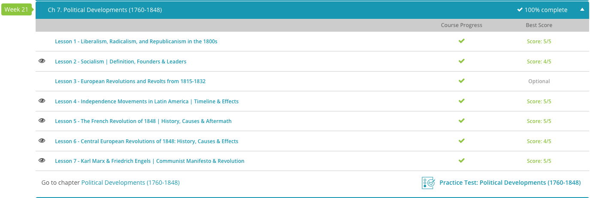

### Andrew Garber
### CLEP Western Civilization II
### Chapter 7: Political Developments
### March 22 2024

#### 7.2. Socialism
 - To a socialist, the economic and social health of the community were more important than that of the individual. Some even went as far as to call for a ban on private-property ownership. In order to put their ideologies into practice, socialist reformers began putting their money where their mouth was.
 - One such man was Robert Owen, a rich industrialist who had caught the socialist fever. In the beginning of the 19th century, he purchased a mill in Scotland and chose to supply his workers with not only a safe work environment, but social needs, such as clean housing, schooling, and even childcare. Perhaps shocking socialism critics, the mill prospered despite the extra money spent on caring for its workers.
 - This didn't work when exported to Indiana though, where Owen set up a factory commune with the same principles and expaned facilities which failed due to in-fighting among the workers. Ironically the commune was named New Harmony. On a side note, some historians feel it also failed due to its workers unwillingness to actually work.
 - Another such 19th century socialist reformer was Charles Fourier. Like Owen, Fourier believed people would be most happy and productive in an environment of cooperation. Also like Owen, he worked to create self-sustaining communities. Because he felt these communities could offer protection, they were named, phalansteries, after an ancient Greek military formation known as the phalanx.
 - Along with offering protection from economic ills, Fourier felt his phalansteries should also be places of pleasure. Members should be able to choose jobs they enjoy, rather than being relegated to tasks. Building on this idea of pleasure, monogamy was seen as optional within the community. Rather than being constrained by pair bonds, community members were encouraged to see each other as free members of the human family. Despite the protection and pursuit of pleasure these communities promised, they met the same fate as the commune of New Harmony. In fact, none of them even lasted a decade.
 - Economic incentive is a powerful force, and it was the lack of it that led to the failure of these communes. Nobody would ever repeat this mistake - no wait, I'm wrong. Apparently a whole bunch of countries based their economic systems on this same idea. Whoops.

#### 7.4. Independence Movements in Latin America
 - Toward the close of the 18th century, the revolutionary bug that had spread throughout Europe and North America made its way to Latin America. Finally, after hundreds of years of European domination, the people of Latin America were ready to ring the bells of freedom.
 - Like the disenfranchised of the American and European revolutions, the lower classes of Latin Society had reached their fill. Creoles, Mestizos, and Mulattoes, who were all of mixed ancestral descent, were no longer willing to take a back seat to those of pure European blood. Thus, revolution came to Latin America.
 - In Haiti, revolution was led by Toussaint L'Ouverture. As a free man, L'Ouverture led the native, enslaved population of Haiti in revolt against their European masters. Occurring in 1791, this rebellion was victorious, seeing the freedom of enslaved Haitians within a decade. Although the year 1802 saw them once again threatened by the forces of Napoleon, who desired to retake Haiti, the freedom-hungry Haitians refused to be vanquished. Finally, in 1804 the Haitians declared their official independence. Perhaps just as significant, their success rocked the institution of slavery all over the Americas. Pretty soon, unrest was spreading to other Latin American countries.
 - In Mexico, the Catholic priest Miguel Hidalgo also decided it was time to throw off the chains of Europe. On September 16, 1810, he and his followers rose up in revolution against Spain. However, they were not as successful as their Haitian counterparts. Although they had some initial success, they were unable to take the capital city. Hidalgo was captured and executed in 1811. Despite this, September 16th is commemorated as Mexico's Independence Day.
 - Taking up Hidalgo's revolutionary mantle, rebels were finally able to overthrow the Spanish. In the 1820s, the free Republic of Mexico was born. Despite this, the country struggled from huge internal strife and underdevelopment.
 - Similar scenes played out in Central America as local leaders rebelled against Spain and together created the United Provinces of Central America. Although they began as one, these free areas soon became the independent states of Guatemala, Honduras, Nicaragua, Costa Rica, and El Salvador.
 - Perhaps the most famous of all 19th-century Latin American revolutions occurred in South America. Led by Simon Bolivar, known to history as The Liberator, a republic in Venezuela began to form. Following this, the areas of Colombia, Peru, Bolivia, and Ecuador were liberated. As other South American territories began to rebel against Spain, Bolivar had a vision for the formation of one nation under the name Gran Colombia. However, feuding among the groups made this impossible. Instead, independent nations like Colombia, Venezuela, and Ecuador were born. Bolivar died, never having seen his dream of a united South America come to fruition, but his legacy lived on in the hearts of the people he had freed.

