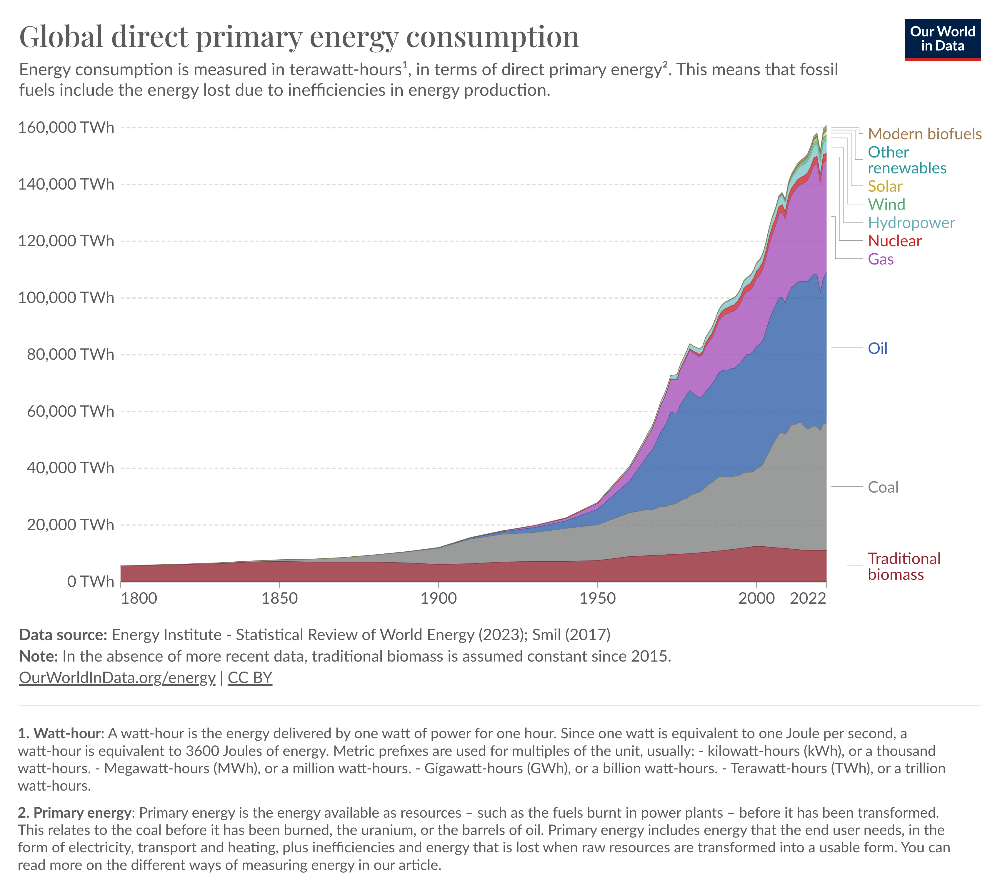

### Andrew Garber
### February 22 2024
### Early Days of the Steam Engine

#### Prompt:
```markdown
Create a summary session on the early days of steam egine, and its immediate impacts on the industrial landscape of the 18th and early 19th centuries.
```

#### Outline:
 - I. Introduction
 - II. Who Invented the Steam Engine?
 - III. What made the steam engine so important?
-  IV. Conclusion

#### I. Introduction
Only one invention surprasses the steam engine in terms of its effect on human civilization, the printing press, for its unparalleled ability to perpetuate and spread the ideas of human civilization. The steam engine runs a close second, as it was the first human creation that allowed our species to harness nature in a fundamentally new way - not just an improvement on nature, but a fundamental change in the way humans interacted with the world. In doing so, the steam engine allowed an exponential increase in human productivity, instead of just a linear increase (even if a very steep linear increase like water wheels), allowing for a new era of human history - the Industrial Revolution which marked our species entry into the modern era. 

#### II. Who Invented the Steam Engine?

The steam engine was not a one-from-nothing stroke of genius, but rather a series of incremental improvements on a basic principle. The first thing that could be called a steam engine was the Aeolipile, invented by Hero (or Heron, depending on the source) of Alexandria in the 1st century AD. We only know of it because Vitruvius, a Roman architect, included it in his foundational book "De Architectura". The Aeolipile was a simple device, a sphere with two nozzles on opposite sides, mounted on a pivot. When the sphere, filled with water, was heated, steam would escape from the nozzles, causing the sphere to spin. While technically a steam engine, it was not practical for a number of reasons, foremost of which was that it was never actually seen as something that could be used for work, and was instead seen as a curiosity. It soon faded into obscurity, and something like it was not recorded again for more than a millennium.

The first practical steam engine was invented by a British engineer named Thomas Savery in 1698. Savery's engine was simple, and only mildly effective, but had the true parts of a steam engine as we know it today - a boiler and an isolated steam tank. The vacuum created by the condensation of steam in the tank(after shutting it off from the boiler) would draw water up from a well, or more commonly, from a mine. While it had practical applications and was far more powerful than horse-driven pumps, it was not very efficient and was prone to explosions. It was also not very powerful and was only used in very specific applications. Still, it was the first time that steam was used to do truly useful work and set the stage for the next major development.

This next major development did not have to wait long, as in 1712 Thomas Newcomen, another British engineer, invented the atmospheric engine, which could give continuous--though fairly low intensity--power to a machine, though this was not his intended for this function. His version of the steam engine improved on Savery's by adding a piston, under which a vacuum would be created that could draw water in a pumping application. This used steam at atmospheric pressure instead of high pressure, dramatically decreasing the explosion risk. This engine was used widely in mines to pump water out, allowing mining to go far deeper than ever before and increasing the yields of mines significantly. The major flaw, that would inspire the next major development, was that the cylinder was totally cooled and then reheated with every stroke, dramatically decreasing efficiency and effectiveness.

James Watt is *the* name that comes to mind when one thinks of the steam engine, and for good reason - he made the engine(or design/style of it) that changed the world. The story of how he came to be working on steam engines, and how he came to the expertise that allowed him to do so, is a fascinating one, but outside the scope of this exploration. To summarize, Watt was a Scottish instrument maker who was asked to repair a Newcomen engine in 1763 for the University of Glasgow, where he was working as the official Mathematical Instrument Maker. This engine had never run for long, and the faculty wanted to see if he could fix it. Watt figured out what the problem was fairly quickly, the cylinder of the engine cooled down with every stroke due to the condensation of steam, and had to be reheated by some amount before the next. It took almost a year for him to find the solution, but he eventually did - a separate condenser, which would keep the cylinder hot and the condenser cold, allowing for a dramatically more efficient cycle. Developing the engine was too expensive for Watt himself, so he sold a large share to a speculator named John Roebuck, who then made poor business decisions and sold it to a man named Matthew Boulton, a semi-successful manufacturer who saw in Watt's engine an enormous potential for increasing the power of civilization. Watt's engine, even in its first form, at least doubled the power of Newcomen's and cut down on fuel costs significantly. It was also far more versatile and could be used for a wide variety of applications, from pumping water to powering mills to driving locomotives. Watt's engine was the first to be used in a wide variety of applications and was driving the industrial revolution in Britain by the end of the 18th century.

No satisfying answer can be given to the question, 'Who invented the steam engine?' with a single name, as it was the product of multiple iterations of improvements, and the work of a great many people. However, the name that is most often associated with the steam engine is James Watt, and for good reason - he took the idea of the steam engine and made it into the world-changing technology that it was. He was the first to make the steam engine safe, reliable, and powerful enough to be used in a wide variety of applications, and while the other inventors do not deserve to be forgotten, Watt's contribution is the name that should be remembered. 

#### III. What made the steam engine so important?

> "Science owes more to the steam engine than the steam engine owes to science." - Lawrence Joseph Henderson 

The impact of the steam engine, while not instant, was immediate and far-reaching in its consequences. In Britain, Watt and Boulton's engine was quickly put into service in coal mines and ironworks--its second commercial employment was at John Willkinson's Ironworks in 1776, who was another seminal figure in the Industrial Revolution--and by 1800 when the patent expired, there were 500 Watt engines in use. Factories, specifically in textiles, were some of the first commercial industries to use the steam engine, and the increase in per-worker productivity allowed for the first mass production of goods in human history. This single application of the steam engine, and the associated industry-specific machinery like the spinning jenny and power loom, took the textile industry from a small-scale, rural, and home-based industry serving the *needs* of the population to a titanic, urban, and factory-based industry serving the *wants* of the population. Clothes are a small example, but the sheer sociological change of a good that had been produced for a functional need to a commodity made for style and the *desire* of individuals was critically important, and unparalleled when extrapolated to the rest of the economy. 

A major secondary effect was the dramatic growth in human precision in science and engineering as at the time, as measuring and tolerancing beyond a tenth of an inch wasn't common. While the first Watt engines were far more efficient than previous iterations, they were still losing a lot to poor precision in manufacturing, being significantly improved by the application of Wilkinson's boring machine to the manufacture of steam engines, allowing for a far-finer tolerance on the interior bore of the engines. The Watt engine, which powered hundreds of machines in a single factory, became the model for high precision in manufacturing, leading to all other industries following suit. While few notice the impacts of precision in daily life, it is a fundamental aspect of the modern world, and step-changes in precision are as much a part of the story of human prosperity as anything else.

In a broader sense, the energy wealth--that fundamental currency of civilization--of humanity was never more increased by a single technology or innovation than by the steam engine. While the atomic age allowed for a far greater amount of energy to be harnessed in absolute terms, the percentage increase in energy wealth was far greater with the steam engine. Before the steam engine, the only sources of non-animal/human power were water and wind, and both of these were only practicable in extremely limited geographic areas. The steam engine could be used anywhere and was not limited by the weather, the time of day, or the season. Give it coal or wood, and you had more power than anything else in history. This is not hyperbole, according to [www.encyclopedie-energie.org](https://arc.net/l/quote/dsmqgmim), in 1800 the world consumption of energy(in MTOE, or million tons of oil equivalent) was 305 - 7 from coal, 298 from traditional biomass: wood, charcoal, manure. Note that this does not include the energy from wind or water, but that does not change the fundamental point, as by 2000, the world consumption of energy was 9,242 MTOE and has continued to accelerate to nearly 15,000 MTOE today.

Without the steam engine, this unbelievable increase in energy wealth--a measure near-directly tied to human prosperity--would have been impossible. Even today, with all of the advances in technology and energy generation, in oil, natural gas, and nuclear power, they still spin steam turbines to generate electricity, effectively just an incredibly advanced and efficient version of the original technology. More than that, it was the single flake of snow that started the avalanche of innovation and productivity growth we call the Industrial Revolution. For a direct visual correlation between energy wealth and human prosperity, consider these two graphs:




In both graphs, human wealth and energy consumption were relatively constant for most of human history--asymptoting near zero--and then the industrial revolution hit, caused by the steam engine, and both skyrocketed. Critics of this correlation often argue that the graphs are selectively chosen or that the associated increase in wealth and energy consumption contributes to pollution and climate change, making the negatives of industrialization outweigh the positives. However, these criticisms overlook two critical points. First, the surge in energy wealth has ushered in the most significant advancements in human prosperity, population growth, and life expectancy ever recorded. Secondly, climate change is a *luxury* problem, the good kind that only comes from being so prosperous that you might actually be able to have it happen to your species. Climate change is a serious issue, but the same industry that brought us to this point by harnessing industry in service of prosperity is the industry that will follow that same model to overcome the challenge it presents. It is a technical problem, and much like Watt inventing his condenser to solve the problems of previous iterations of the steam engine, we will find a solution by harnessing the power of industry and innovation.

#### IV. Conclusion

This is in no way an exhaustive exploration of the steam engine, nor was it meant to be. I would gladly spend a decade writing about the development and impacts of the steam engine, but for this limited scope, I hope to have provided a brief but comprehensive understanding of the steam engine and its impacts, why we all owe it, and its inventors, a debt of gratitude. The society we live in today, the civilization our species has created, is intimately tied to this single invention, a token of human genius and ingenuity, and a testament to the power of human industry and the human mind. The steam engine, and the industrial revolution it sparked, is the most important event in human history, and the single greatest driver of human prosperity and wealth.

#### Sources:
 - [Britannica](https://www.britannica.com/technology/history-of-technology/Steam-locomotive)
 - [World History Encyclopedia](https://www.worldhistory.org/article/2166/the-steam-engine-in-the-british-industrial-revolut/)
 - [Brittanica 2](https://www.britannica.com/technology/steam-engine)
 - [The Economic Historian](https://economic-historian.com/2022/01/steam-engine/)
 - [University of Houston](https://engines.egr.uh.edu/cdlist/rainsteamspeed/8)