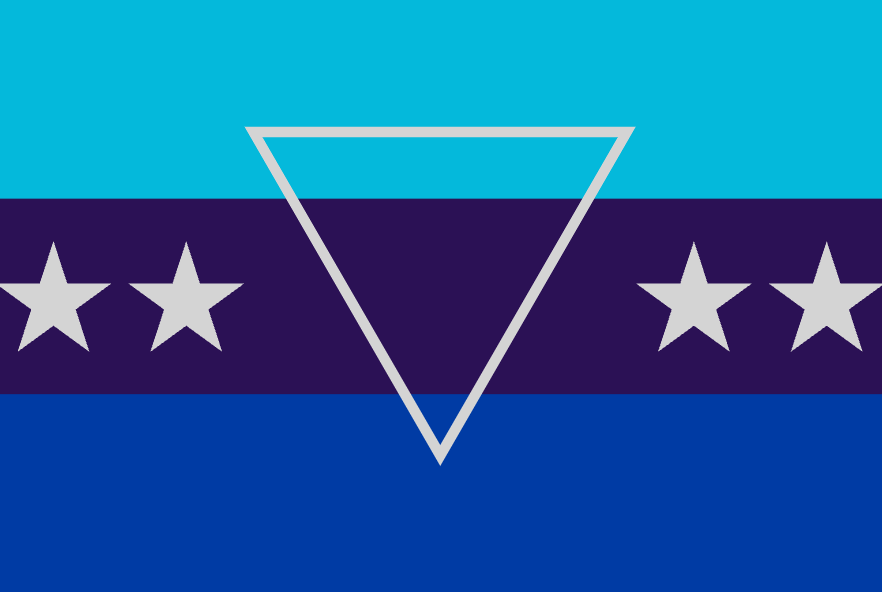
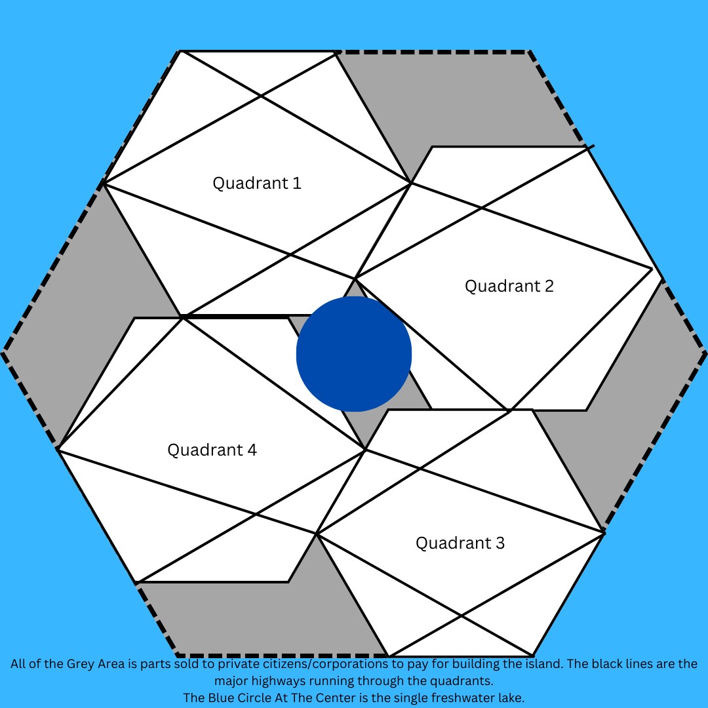

### Andrew Garber
### World Geography
### Design A Country Final Project

I would place it about 100 miles off of 30 degrees north, 75 degrees west or roughly 100 miles east of central South Carolina. It will get a mild version of the four seasons, but be quite mild in the winter with longer summers. It will have forests, but because it is an island it will not have much arable land. There would be sharp cliffs, but the rest of it would be one flat plain. There would be a singular large lake in the center, perhaps 5 square miles in area. The goal of the island would be to create a single planned mega-city focused on technological creation. The island itself would be the city, and it would be divided into four major administrative quadrants. The island itself is also a hexagon, because it is man-made and is the best shape. Due to the flat nature of the plain the city is built on, there would be few natural impediments to construction. There are few natural resources on the island, so the city would have to import food and any raw materials it needs - it would make up for this by becoming the technological center of the world. The climate would be mild, with a long summer and a short winter. There would be a free immigration policy, with the only requirement being that you have to work/study, and must not be a criminal. The culture would, as a result of this, be an incredibly blended version of all cultures with a focus on merit and capability. The economy of the city/country/island(one and the same) would be initially funded by investment from individuals and corporations in order to secure inital rights to a desired plot of land, or to be one of the first citizens. The government would be a direct technodemocracy, with the citizens voting on issues that reach a certain threshold of public support via the internet. 

The Flag Would Be: , with the turqouise representing the ocean, the purple representing the uniqueness of the island, the blue represneting the ocean, the triangle representing the unity of the people, and the 4 stars representing the 4 quadrants of the city/island.

The Map looks like this: 