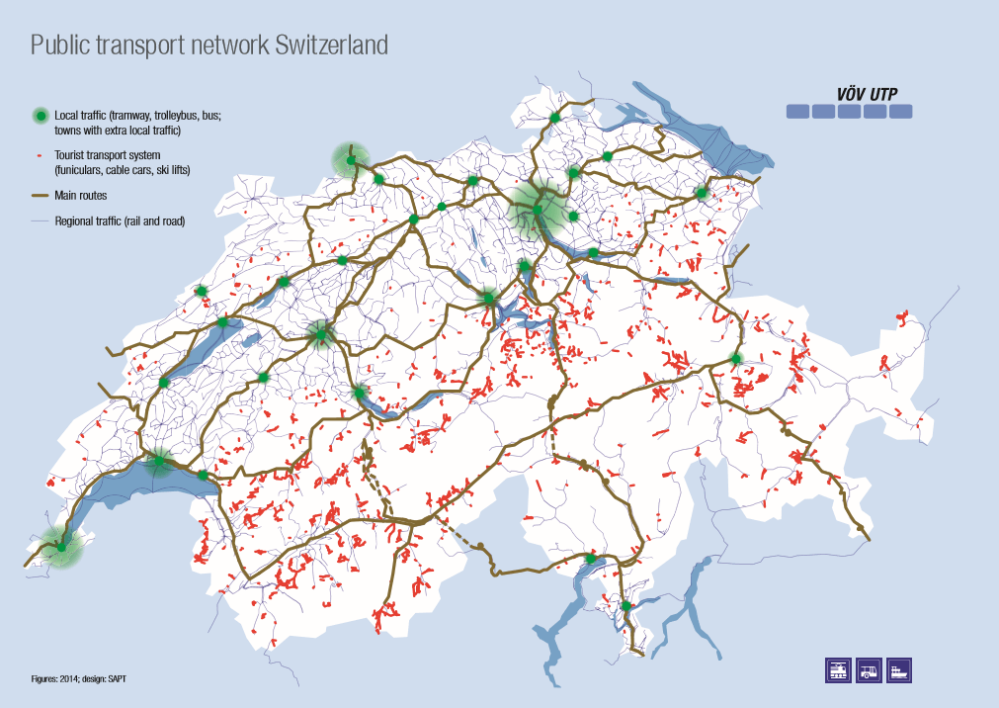

### Andrew Garber

### Independent Study

### Case Study 1

### II.1.a: Why is Switzerland in the Schengen Area but not the EU itself?

The European Union is the greatest attempt at creating at supranational state that has yet been attempted, and it has brought a great deal of prosperity to the continent as per its original intent. However, it did not create a singular state but stopped short of that; instead, it is a collection of states that simply work together on a number of mutually beneficial issues including trade, development, and justice. Switzerland, long known for its neutrality, non-interventionism, and strongly independent culture, is a lone gap in the map of European Union members in Central and Western Europe. A seemingly inconsistent outlier to its otherwise independent streak, Switzerland is a member of the highly integrated Schengen Area, an agreement between 27 nations to abolish their national borders with each other allowing for the free movement of people, goods and capital. In this case study, an examination of the reasons for Switzerland not joining the EU will be presented, as well as the delineated reasons for joining the Schengen Area. This examination will be made through the lens of states and their people prioritizing independence and national sovereignty as major aims unto themselves.

#### II.1.a.i: Why Switzerland declined to join the EU

Switzerland has a long history of independence and neutrality in European and world affairs. It has served as the crossroads of Europe for centuries, and has been a place of refuge for those fleeing persecution, war, or strife as a function of its liberal policies and political non-alignmnet. In fact, Swiss neutrality has become an integral part of Swiss national identity, and they have not participated in a foreign war since 1815(Switzerland was involved in the Napoleonic Wars). This cycle of long periods of neutrality and isolationism forging a stronger sense of national identity and independence has moved Swiss culture and politics into one deeply skeptical of foreign entanglements. This manifested itself in the 1992 decision(50.3% to 49.7%) to not join the wider European Economic Area(EEA), and the 2001 decision(76.8% to 23.2%) to not join the EU. The biggest reason for this disparity is the relative increase of political integration required by becoming a full EU member in comparison to the less stringent EEA. The reasons for the Swiss population's desire to remain outside of the EU can be mainly be credited to four main points: Swiss national identity, lack of security concerns, too wealthy to gain dramatic benefits, and the Swiss system of direct democracy.

##### II.1.a.i.a Swiss National Identity and Isolationism

The cycle of long periods of isolationism creating a stronger sense of Swiss identity as distinctly separate and thus making them more isolationist has become a dominant force. Both its geography and internal divisions - the varied nationalities that over generations began to see themselves as Swiss - have played a role. In terms of geography, Switzerland is incredibly difficult to invade due to the mountainous terrain and the fact that these "choke points" are easily defensible. The majority of the passes through the Alps leading into Switzerland are over a thousand meters in elevation, and the small number of them suitable for lage scale military operations(see map below) would make logistics in an invasion exceedingly costly. Adding to this, there are few natural resources in Switzerland and thus little reason to embark on an obviously expensive and difficult invasion. Regarding internal divisions, Switzerland is a country of four official languages and contains populations who were historically tied in their culture to the German, French, and Italian states. Many of the twenty-six cantons have populations that could have been sympathetic to the states that surrounded them, and thus an active policy of neutrality was necessary to prevent internal divisions from spilling over into the international arena. Generations were needed in order to build a sufficiently cohesive Swiss culture, and by the time that culture was enshrined it contained neutrality as a key element. This policy of neutrality was formalized in 1815 at the Congress of Vienna in order to ensure a buffer state between France, Italy, and Germany(The Day Switzerland Became Neutral), and has been a cornerstone of Swiss foreign policy ever since.

This individuation and neutrality in Swiss foreign policy sits in stark relief when compared to the EU's Common Foreign and Security Policy(CFSP), which is a key part of the EU's supranational identity. The CFSP is designed to create a common foreign policy for the EU, so that it can be seen as a more coherent actor on the world stage instead of merely a trade-bloc with a common market. While the strength of the CFSP has come into question - the war in Ukraine(The New York Times) showed the EU's inability to form a single foreign policy - the very concept of a common foreign policy is anathema to Switzerland and was a key decision in the continued rejection of EU membership.

#### II.1.a.i.b Swiss Lack of Security Concerns

While nobody advocates that greater security concerns are a good thing for a nation, the lack of such concerns for Switzerland has been a notable factor in its foreign policy decisions. Switzerland has not been involved in a foreign war since 1815, and has not been invaded since 1798. This is due to geography, the lack of natural resources, and the fact that Switzerland has not been a major player on the European foreign policy stage(it was not a player in the wars fought between colonial powers or the power struggles for German unification), especially in comparison to its far larger neighbors. A notable exception to this was the Second World War, where Switzerland was bordered by the Axis powers of Germany, Italy, and Vichy France - however, the risk-reward calculation for invading the mountainous country was not worth the effort for the Axis powers, especially in consideration of the economic benefits that Switzerland provided to the Axis powers, notably access to Swiss banking, arms manufacturing, and international organizations like the Red Cross.

In relation to Swiss dealings with the EU, the lack of security concerns has led the EU's Common Security and Defense Policy(CSDP), which is the EU's attempt at cohesive defense policy to not be very enticing to the Swiss. The main tenets of this are collective response to threats and mutual defnse in the event of an attack, though NATO is still the primary collective force structure in Europe. While the CSDP has been criticized for its lack of cohesion and effectiveness(Tandfonline), even if Switzerland joined the EU it wouldn't have any use for a collective defense policy because there are no security concerns that would necessitate it. Latvia, Estonia, Lithuania, Poland, Romania, and Bulgaria all have active security concerns due to their proximity to Russia, and thus the CSDP is an attractive part of EU membership for them. Switzerland has no such concerns, and thus no need for the CSDP - another strike against EU membership for the Swiss. In addition, even if Switzerland desired the effects of the CFSP, the continued failure of the body to act in a coherent manner while still requiring upfront and ongoing costs(the related European Defense Fund had a budget of 8 billion Euros for the 2021-2027 period) would make its offer even less attractive to the Swiss.

#### II.1.a.i.c Switzerland is too wealthy already to gain dramatic benefits from EU membership

Switzerland is one of the wealthiest nations on earth(ranked 9th according to the world bank, see 'GDP per Capita by Nation' in bibliography). While the sources of this wealth are varied, the fact remains that Switzerland has a very high standard of living(ranked 6th in the world, according to Numbeo, see 'Standard of Living by Country' in bibliograpy). While Europe as a whole is wealthy, Switzerland far outstrips the EU in terms of GDP per capita and thus the promises of economic growth sound hollow compared to the economic growth that a nation like Romania, Bulgaria, or Croatia could expect.

Source: Eupedia, Eurostat for 2019 GDP in PPS per Capita by NUTS2 Region in 2019

Switzerland would benefit from EU membership, but the benefits would be far less significant and when considering the diplomatic, political, and tax overheads of EU membership(approximately 6 billion per year, as a function of GDP/Cost compared to nations with similar GDP) it adds a layer of skepticism to the idea of joining the EU. When looking at the map, Switzerland stands out as a huge green dot in the center of Europe, and while Germany, France, Austria and Italy are certainly wealthy nations, the benefits of protectionism and economic nationalism for Switzerland have benefited the Swiss economy. Already, the Swiss economy is highly integrated with the EU, but on its terms(European Parliament) - they have a number of bilateral agreements with the EU that allow for trade favorable to both parties, without the need for EU membership. This allows Switzerland to maintain its independence and neutrality while still reaping the benefits of trade with the large population and economic base of the EU, with Germany alone being 14.55% of its exports and 19.29% of its imports(The World Bank).

#### II.1.a.i.d Swiss System of Direct Democracy

In the annals of political science, direct democracy is frequently viewed as "the one that got away", potentially excellent if implemented but requiring too much citizen participation to be truly effective. To more accurately define the terms, Switzerland is a semi-direct democracy wherein citizen input is taken and an elected executive branch puts the will of the citizenry into action. The term "direct democracy" will be used in this exanimation for the sake of simplicity, and because Switzerland labels itself as such. Despite this, the Swiss system of direct democracy is absolutely unique in the world, is a foundation of Swiss political culture, and is a major reason for the rejection of EU membership.

It is important to put the Swiss system of direct democracy into perspective, some of its cantons have been practicing democracy since the 14th century - it has been implemented at the national level since the end of their civil war in 1848, at which point communication infrastructure was still in its infancy. For the Swiss implementation of direct democracy, there are two primary mechanisms: the referendum and the popular initiative. The referendum is a vote on a law that has been passed by the Swiss parliament, and the popular initiative is a vote on a law that has been proposed by the Swiss people. In order for a referendum to be called, 50,000 signatures must be collected within 100 days of the law being passed. In order for a popular initiative to be called, 100,000 signatures must be collected within 18 months of the law being proposed. In both cases, the law is put to a vote and must be passed by a double majority - a majority of the people and a majority of the cantons. Thus, the Swiss system of direct democracy offers a direct way for the Swiss people to influence the laws that govern them, giving them an explicit veto over laws that do not find favor with the people. If Switzerland joined the EU, it would limit the impact of referendums and popular initiatives, due to EU exclusive competencies(areas where the EU has sole authority) over areas like trade, agriculture, and customs(European Commission). In addition, the EU has shared competencies(areas where the EU and member states share authority) over areas like the environment, consumer protection, and transport. This would dramatically inhibit the areas of policy that the Swiss people could influence, and is thus a direct threat to their political culture.

> While this is not a discussion of political systems for a global nation, there are valuable lessons to be learned from the Swiss system of direct democracy which we will return to later.

### II.1.a.ii Why Switzerland joined the Schengen Area

#### II.1.a.ii.a Swiss Economic Benefits from the Schengen Area

While Switzerland is too wealthy to truly "jump-start" its economy with EU membership, the Schengen Area allows for a boost to its tourism, agricultural, and manufacturing sectors through the removal of border controls leading to greater movement of goods and people. In addition, the ability to reliably recruit from the large labor pool of the EU allows for a more flexible and dynamic labor market to the benefit of both parties. In fact, this benefit to the labor market - which makes sense in the context of Switzerland's comparatively small population and high GDP per capita - has led to approximately 6.5% of the Swiss labor force residing in neighboring countries(EU nations) and commuting to work in Switzerland(De Gruyter). This is an exmplary example of the benefits of the Schengen Area to Swtizerland(or any nation) - it allows for the labor pool to not be a limiting factor in economic growth, and allows for the free movement of people to where they can be the most productive. See chart below for the growth in cross border commuting from 2005-2015 (De Gruyter).

In regards to the economic benefits that Switzerland has gained from being a part of the Schengen Area, the removal of border controls has allowed for a greater flow of goods and people between Switzerland and the EU. The benefits for tourism are quite plain, as choosing between one destination where you have to go through border control and one where you do not is a simple differential in effort for the consumer. Swiss tourism has grown steadily since the implementation of the Schengen area, and despite the industry shocks of the COVID-19 pandemic it is expected to continue to grow(Statista, "Swiss Tourism Growth"). In industrial sectors, we see some of the major benefits of economic integration between Switzerland and the EU through their membership in the Schengen Area and the bilateral agreements that they have with the EU - benefits that would only be accentuated by being part of a singular global nation. Foremost among these is "The Agreement on Mutual Recognition in relation to Conformity Assessment"(EUR-Lex "The Agreement on Mutual Recognition") which allows for general standardization of goods in regards to terminology, testing, and certifications among other provisions. This allows Swiss manufactured goods to be marketed to the EU without the need for additional testing or certification, and vice versa, which is a notable friction point(increasing costs and time) for trade between nations which do not share such an agreement. This agreement is symbolic of other agreements that Switzerland has with the EU, and the benefits that they bring to the Swiss economy.

To pull directly from "The Agreement on Mutual Recognition in relation to Conformity Assessment", friction will be minimized as both parties agree that, "In order to avoid duplication of procedures when Swiss and Community requirements are deemed equivalent, the Community and Switzerland shall mutually accept reports, certificates and authorisations"(Page 3, The Agreement on Mutual Recognition in relation to Conformity Assessment). While this function may seem minimal to the layman, it is a major boon to _both_ the economies of Switzerland and the European both as a measure unto itself and as an example of the numerous similar agreements for similar purposes. While these bilateral agreements are not a part of the Schengen Area itself, they are very much a function of it, allowing for close economic and cultural ties to be forged between Switzerland and the EU.

#### II.1.a.ii.b Benefits to travel for Swiss citizens

While of personal rather than overarchingt political or economic importance, the benefit to the Swiss citizen(and thus those who vote in Switzerland's direct democracy) of frictionless travel to the rest of the nations within the Schengen Area deserves note. When the people of a nation are those who directly(in comparison to more representative democracies) make decisions as to the direction of their nation, the direct personal benefits to them are a major factor in their decision making. Dangling a carrot in the form of greater ease of travel - no border checks, no need to get out your passport - is a strong political tool, and one that was notable in the effort to join the Schengen Area. When considering that the referendum to join the Schengen Area passed with only approximately 55% in of the vote in 2005, and a referendum in 2020 to end the agreement failed resoundingly with only 38% of the vote in favor of the move(BBC), it is clear that the benefits of the Schengen Area to the Swiss people are a major factor in their decision making. More than this, it is notable that initial resistance - a significantly closer vote in 2005 - became a more overwhelming support for their continued membership and semi-integration with the EU - such a trend is notable in regards to initial resistance to the idea of a global nation, and the possibility of a similar growth in support for the idea once some of the initial fears are assuaged and the benefits start to become apparent.
