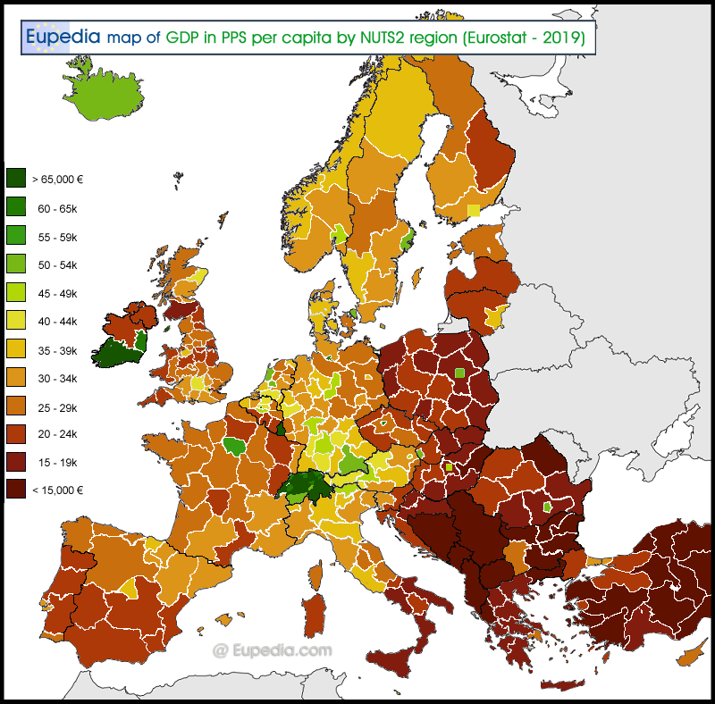

### Andrew Garber

### Indpependent Study

### I: Premise and Introduction

#### I.1 The Vision

Earth is a single planet, made home by humanity. As far as can be
observed, we are the single greatest species to have ever existed, and
have the potential to do so much more. Yet, for a single species, we are
remarkably divided. Our tribal past lives on today in the form of
nations, borders, and boundaries. Within one nation, you can walk from
one end to the other as a member in good standing, but cross a line on a
map, and you are a foreigner: an outsider, a stranger, a potential
enemy. More than culturally but teleologically, you are deemed unworthy
of the greatness of that nation's people, of its history, of being part
of its future. It is them against us, and we are always the good guys.
This is the world we live in, a world of division, one in which every
individual lives a smaller life, a life less than they could have lived,
a life less than they deserve for being isolated from their fellows.
Tribalism was a useful evolutionary tool for survival, it allowed us to
collect and distribute resources more efficiently, protect ourselves
from outside threats, and eventually provide the caloric surplus to
support a more advanced civilization: specialization, justice, trade,
war. Organization of people into groups, and groups of groups, was one
of humanity's greatest achievements--self-organization of disparate
members of a species into civilizations. But that was then, and this is
now. Earth does not hold many civilizations, but one--it has done so for
the last seventy years, and it is time to recognize that fact. This
examination does not seek to denigrate that past, but to recognize that
is the past, and in this present it is a hindrance to the further
acceleration of progress. A considerable portion of humanity lives
beneath their dignity as members of our species not for lack of access
to resources, but for lack of opportunities to make the most of their
talents, and to be rewarded thereof.

This is not a call for unification on cultural or imperial grounds. Many
individuals, leaders, and nations have sought to unify the world under
their banner, to make the world in their image, to make the world their
own to support their own ends. This is not that. This is not an
examination of a conquered world, nor a utopian one: it is an
examination of a world that has already been conquered throwing off the
intellectual, societal, and political shackles of the past.

Despite the prevailing air that we have never been worse, done worse, or
looked to a worse future, a worse fate, we have never been better. We
have never been more capable of greatness, of goodness, of justice and
cooperation in the uplifting of our species to one of mythology.
Humanity, not just the species but the civilization, the culture, the
society, the world, has the potential to be _of_ one. Not one people,
not one culture, not one society, but one nation. A world of people and
peoples, of ideas and collaboration, of innovation and prosperity, of
peace and justice. A world without borders, without boundaries, without
friction between fellows, without the artificial constructs of the past
that hold us back from a united future. A Global Nation.

#### I.1.A Why not Borders?

If a value is given to being alongside ones own race, culture,
ethnicity, or other division of humanity that is based on some quirk of
birth, then a border between "us" and "them" is necessary and valuable.
That is the lesson of tribalism: independent civilizations of humanity
developed by focusing the efforts of "us" against "them", and the
borders between them were the physical manifestation of that division.
But when taken to consider that those subdivisions of humanity, an
evolutionary IFF(Identification Friend or Foe) system, are in fact
arbitrary, then the value of borders--being among like
individuals--becomes not only unjust but a hindrance to the political,
economic, cultural, and technological progress of humanity.

The modern nation, one of boundaries keeping its people--aligned by
birth within its area as deserving of its specific and unmatched
greatness--from the rest of humanity, is a direct descendant of the
ancient fiefdom, harkening back to the rights of the ruler and his
subjects. As David D. Warren says in his "The Nature of the Nation-State
System", "Each member-state has certain characteristics entitling it to
admission-a defined territory, a permanent population, the capacity to
enter into relations with other states, and most important of all,
sovereignty. For every state is the supreme law-maker and law-enforcer
within its defined territory, recognizing no external authority as
superior to itself. (Warren, n.d., p. 149),", which is a remarkably
similar set of characteristics to those of the Oath of Supremacy of 16th
century England, "I ... do utterly testify and declare in my conscience
that the Queen's Highness is the only supreme governor of this realm,
... in all spiritual or ecclesiastical things or causes, as temporal,
and that no foreign prince, person, prelate, state or potentate hath or
ought to have any jurisdiction, power, superiority, pre-eminence or
authority ecclesiastical or spiritual within this realm; (What is
Corruption," n.d.)." These connections are not accidental but are the
result of the evolution of the nation-state from the dynastic state, one
in which the force of the ruler--gaining legitmacy from god, arms, or
other means--was the only force that mattered, and the area in which
that force was applied to the exception of all others was his state.

When defined in these terms, the boundaries of the state being the sole
region in which a monopoly on force can be maintained to the exclusion
of others--even with the consent of the governed--these boundaries seem
less like the natural divisions of humanity into groups for just and
efficient resource distribution, and more like the arbitrary divisions
into rulers' fiefdoms. Even in a modern democratic(or representative)
state, to jealously guard the borders of the state, of the democracy, to
those who are born within it, or jump through sufficient hoops to be
admitted, is to deny the potential of the individual to be a member of
what its guardians would freely admit to be a "superior" nation. If the
nation whose borders must be guarded is so far greater, wiser, more
just, and the productivity of one person is greater than none, then the
nation is less than it could be by the exclusion of that person. More
than this, nations built upon principles of liberalism--the democracies
and republics, the most just and free of the world's nations--are
sacrificing these pricinples upon the altar of the political boundary.
While freedom of speech, the press, religion, and assembly are held as
the highest of values, the freedom of movement, of association, of
trade, without the interference of the state, are held as secondary to
the state's monopoly on force within its borders to the pursuit of its
"national interest". This careful sacrifice of equally great pillars of
the liberal tradition upon which these states are built for the purposes
of centralizing and fortifying the state's authority within its borders
has become self-perpetuating, and self-interested, as the consenting
governed have dealt themselves greater shares of the state's wealth
through ever more social programs, and thus seek to protect their share
of the pie by limiting the number of those who can partake in it.

Even if you believe that self-contained, homogeous ethnic or
nationally-identify groups have the right to exclude others from their
territory, even that must be weighed against the opportunity cost of
frictionless trade with other such polities, let alone the inclusion of
a larger--and potentially more skilled--workforce from outside of the
defined ethnic/national group. Excluding the workforce arguement, import
duties and tariffs in trade between two individuals or enterprises in
different nations are a tax on the consumer and the economy as a whole,
and decrease the quantity of purchasing the consumer could do without
these measures. In addition, if purchasing from abroad, the extra-markup
on the goods--for example, clothing--decreases the total market
able/willing to purchase an enterprises' product, and in doing so
stifling world economic growth or innovation that would benefit the
consumer through lower prices, higher quality, or more variety. The
United States, the world's largest economy, places a 75.8% import duty
on knitted or crocheted clothing, and an 83.3% duty on non-knitted or
crocheted clothing. Despite this, almost every label on a piece of
clothing bought in America will say "Bangladesh", "Pakistan", or
"Vietnam", despite these heavy duties. In effect, the consumer is paying
a tax to the state for the privilege of buying a product that is not
made in America, and the state is using that tax to fund its social
programs, or to protect its domestic industry(which is paying for the
high import duties on foreign goods through lobbying). This is not a
case unique to the United States of America, but instead illustrates how
much "friction", wasted money, time, and effort, is spent through
economic borders--subsidies, tariffs, import duties, and other
measures--that could instead vanish and lead to a more prosperous world.

In totality, nationalities, ethnicities, and other divisions of humanity
are human fictions: invented for the purposes of survival, perpetuated
for the purposes of further advancement of humanity, and then for their
own sake either for the purposes of the state or the individual, senn as
valuable ends in themselves. Political boundaries are the physical
manifestation of these fictions, and are unnecessary, unjust, and a
hindrance to the progress of humanity. Our world grows more connected,
more prosperous, more peaceful, and more just when these boundaries are
removed, and without political boundaries artificially dividing
humanity, why have more than one nation representing humanity?


#### I.1.B What does a Global Nation Solve? (Why not separate nations without borders?)

The Global Nation will not bring about utopia on Earth by its nature,
but it would bring about a world that is more prosperous, more peaceful,
more just, and more innovative than the world of today. It would bring
us one step closer. The Global Nation would bring about a world in which
the resources wasted on international conflict, direct or indirect,
trade-wars or shooting wars, could be left in the pockets of the people,
and allow them to allocate those resources to their own ends. The
compulsion of the state spending its citizens money to protect them from
the opponent state doing the same is a waste of resources in a
singularly rational sense, and necessarily unjust in a moral sense. The
purpose of the Global Nation is not to expand the reach of the state
horizontally, across the Earth, nor vertically, into the lives of its
citizens, but to eliminate the state interference in the daily lives of
citizens that was previously done for the purpose of state-to-state
competition.

To return to David D. Warren's "The Nature of the Nation-State System",
his definition--one widely accepted in principle in the political
science field--of three of the fundamental characteristics of a modern
state being, "a defined territory ... the capacity to enter into
relations with other states ... every state ... \[being\] the supreme
law-maker and law-enforcer within its defined territory, recognizing no
external authority as superior to itself (Warren, 149)," make it clear
that the modern collection of states are engaged in more of a
protection-racket, justified upon the consent of the citizenry for lack
of a better option, than a collection of just and free societies
coexisting with different values and cultures. Some may support the
elimination of boundaries between states allowing for free-trade and
travel, but support the maintenance of our current collection of states
for the purposes of competition, and ensuring that people of distinctive
views or characteristics can live in a society that reflects those views
or characteristics. This is a noble goal, but it is not one that is
served by the current system of states, nor one that would be achieved
by keeping that system of states and removing the borders. In addition,
if you keep the current system of states--with huge disparities in
taxation systems to fund social programs--you end up with a natural
incentive for mass migration to social services and mass-flight of
capital to lower-tax jurisdictions. The Global Nation, in its
elimination of boundaries, removes the incentive for mass migration to
social services, as whatever the degree of social services anywhere
would be equaled anywhere else[^1] and the incentive for mass-flight of
capital to lower-tax jurisdictions, as the tax rate would be the same
everywhere. In addition, the welfare of the citizenry is better ensured
by the greater economic growth that would result from the elimination of
barriers to trade and the movement of people, allowing a more efficient
market to produce more goods and services at lower prices, and allowing
to purchase more of them due to lower taxes and the elimination of
import duties and tariffs.

This economic growth of a global nation wouldn't just be ensured by the
greater consumer purchasing power and the greater efficiency of the
market, but by the greater rate of innovation that would result from the
elimination of barriers to the movement of people and ideas. Silicon
Valley, the most innovative place on Earth for the last 50 years, is so
because of the high concentration of innovative people and capital in
one place. In the modern day this concentration is notably restricted
due to the difficulty of moving to the United States, and as such
smaller sub-concentrations of talent have sprung up in other places
around the world. This is absolutely a good thing, not having all of the
world's innovation in one place, but all of these places could benefit
from more, and more diverse, talent and capital. Not only would the
Global Nation assist in the education of the billions lacking it in the
world, but it would allow for the free movement of those educated
individuals to the places where they could best use their talents: not
restricting them to their home countries or the countries that would
take them. The benefits of technology rapidly flow horziontally across
the world and vertically down the cost-axis, so the addition of more
people to the world's most innovative places(a force multiplier) would
lead to a greater rate of innovation, and the subsequent improvement to
human prosperity. This notably hasn't been achieved by the
states-without-borders model of the European Union, in-part due to their
own difficult immigration policies, but also due to a continual focus on
individual states' interests in _each_ having a piece of the pie, a
small tech-hub of their own, rather than one-city or one-region having
the whole pie and the effects radiating outwards.

Contrary to the popular perception of monoculture states as more stable
than multicultural ones, it is one of the logical followings of the
elimination of individual states--and thus their dependence on smaller
blocs of voters to maintain power--that the Global Nation would be more
tolerant of different views, cultures, and peoples than the current
system of states. This would not be due to government-mandated
"cut-outs", but due to a systemically level playing field for all
individuals, and the lack of a political incentive to be against "the
other". There will always be factions within a democratic state of any
form, it is simply the nature of individuals to politically organize
with those they can agree with on issues that are important to them, but
in a nation where you can't expel, persecute, or otherwise intimidate
those to which you hold prejudice to leave your nation, tolerance
becomes more likely. In addition, with the greater flow of people and
ideas across the world, the greater rate of innovation, and the greater
economic growth, the incentive to be against "the other" is lessened, as
the benefits of cooperation with "the other" are more apparent. There
will certainly be prejudiced people in a Global Nation, but the systemic
incentives to act on that prejudice are lessened, and the benefits of
cooperation with those you may otherwise be prejudiced
towards--immigrants, people of different religions, people of different
x, y, or z--are more apparent.

#### I.1.C: The Structure, Function, and Benefits of the Formation of a Global Nation

<!-- Thesis -->

The jealously-guarded divisions between nations hinder human progress,
prosperity, and fellowship by restricting the free movement of people,
ideas, goods, and capital. The formation of a Global Nation that
eliminates these barriers is desirable to enable humanity to reach its
full potential across all spheres of life. This paper will examine the
historical attempts at forming a Global Nation, or the closest
approximations thereof, propose potential economic and political
structures for a world government, explore the societal and cultural
implications, and analyze the immense benefits of a unified world,
including accelerated economic growth, increased innovation, greater
cultural exchange, and a more just and peaceful society. Ultimately, the
unification of humanity under a single flag is necessary for us to
overcome the challenges we face, safeguard our planet and our species,
and achieve our highest aspirations as a species.

#### I.1.D: Preconditions, Premises, Terminology, Assumptions, and Non-Relevant Topics

Before proceeding further, it is necessary to establish some
preconditions, premises, terminology, assumptions, and non-relevant
topics for the discussion of a Global Nation. Some things are necessary
to be established, while it must be cemented that others cannot or will
not be covered in this paper as they are either not relevant or cannot
be established with sufficient certainty to be worthy of inclusion or
debate. Definitions, and a strict adherance to the scope and focus of
this examination, are necessary to ensure that the intended examination
of the benefits of a Global Nation is not lost in the weeds of
irrelevant or unprovable topics. Ensuring the scope of this examination
to subjects that can be reasonably examined, and that will hold material
influence on the stuctures, practices, and benefits of a Global Nation,
is fundamental to a holistic view of the interconnections between the
political, economic, social, and cultural spheres of a Global Nation.

1.  The term "Global Nation", instead of coming up with a name for what
    this government would call itself, will be used to describe the
    world government that is the focus of this examination. While
    tempting to come up with a name for this government, it is not
    necessary for the examination of the benefits of a Global Nation,
    and would only serve to distract from the examination of the
    benefits and structures of a Global Nation in a general sense
    instead of this specific one. More than this, allowing the people of
    the world to decide what they would call their nation binding all of
    humanity together would be symbolically and functionally important
    as a demonstration of the democratic power, and process, in the
    Global Nation.
2.  First and foremost, it must be established that this examination is
    not one of the political, social, or economic factors that would
    lead to the formation of a Global Nation--this paper will not set
    out a scenario in which the people/nations of the world decide to
    form a Global Nation, but will instead examine the potential
    benefits and structures of such a formation. There is simply no way
    to predict how that could actually happen, and even if there were,
    it would not materially affect the examination of the benefits and
    structures of the end result.
3.  Related to the first point, it must be assumed that the world is in
    a fundamentally similar state to today, meaning no nuclear war, no
    world war, no second-black-death, etc. The structure of a global
    nation working to help the world recover from a nuclear war has
    fundamentally different goals, and thus a different resultant
    structure, than a global nation working to expand the propserity of
    the world and its people.
4.  It must be assumed that the people of the world do not desire a
    monarchy, dictatorship, plutocracy, or any other form of government
    that is not the people holding the power of the state in some form.
    Debating the relative merits of dictatorship vs monarchy vs
    democracy(in all its forms) is a worthy topic for a work on
    political philosophy, but not for this examination of the benefits
    of a Global Nation.
5.  It must be assumed that the people of the world desire the
    unification, meaning no resistance groups, separatist movements, or
    exceptions(North Korea, Iran, etc.). This is for two reasons: first,
    this is not a conquering of the world, but a unification of it, and
    second, the additional structures of dealing with resistance groups,
    separatist movements, or exceptions would be a significant deviation
    from the examination of the benefits of a Global Nation.
6.  All matters pertaining to military matters will not be excluded from
    this examination of the benefits of a Global Nation for two reasons:
    first, I am not a military expert, and this is not a general staff
    plan, and second, the retaining or dissolution of a military is a
    matter for the citizens and or representatives of the Global Nation
    to decide, not arbitarily decided by the author of this paper. In
    order to make that arbitrary decision, a scenario would have to be
    set up in which the Global Nation was formed, and that has
    previously been excluded.
7.  The transition period of fazing out old institutions, bodies,
    structures, and practices will not be included in this examination
    save for a few specific cases that will materially affect the
    proposed structures of the new institutions, bodies, structures, and
    practices. This returns to the first point, that the scenario in
    which the Global Nation is formed is not the focus of this
    examination, instead the benefits and structures of the eventual
    Global Nation are.
8.  The common political terms "left" and "right", so common to rhetoric
    and in the general vernacular, will not be used in this paper. What
    is "left" and what is "right" is specific to the political climates
    of individual nations, and the philosophies themselves that are said
    to be represented by these terms hold no allegiance to these terms.
    Instead, the philosophies themselves will be used, such as
    "democratic socialism" or "libertarianism" if mentioned instead of
    "left" and "right".
9.  GDP and GDP per capita are the primary metrics we will be using to
    measure the economic success/power of nations in this paper, and the
    potential benefits of a Global Nation. "Happiness", "Standard of
    Living", and other metrics are too nebulous, specific to
    individuals, and based on psychological instead of economic factors
    to be of use in this examination. GDP and GDP per capita are not
    perfect, but they do--to a reasonable degree--measure economic
    power, innovation, and influence of a nation, and thus are the best
    metrics for this examination.
10. The term "Corruption" will be defined as, "the abuse of entrusted
    power for private gain (Transparency)." This is the definition used
    by Transparency International, and is the most widely accepted
    definition of corruption in the political science field. While a
    more specific definition could be used, anti-corruption is such a
    fundamental part of the governing focus of a Global
    Nation--especially considering that many of the places pre-Global
    Nation have suffered from endemic corruption--that a more specific
    definition would limit the scope of anti-corruption measures.
11. All institutions, employees, funds, debts, patents, and other
    remnants of the previous world of states will be transferred to the
    Global Nation, unless otherwise specified. This is not a paper on
    _how_ the transition to a Global Nation would be handled, but some
    of the remnants of the previous world of nation states(debts and
    patents most notably) will materially affect the proposed structures
    of the new institutions, bodies, structures, and practices of the
    Global Nation, and thus must be included in this examination.

### Footnotes:

### Andrew Garber

### Independent Study

### Case Study 1

### II.1.a: Why is Switzerland in the Schengen Area but not the EU itself?

The European Union is the greatest attempt at creating at supranational
state that has yet been attempted, and it has brought a great deal of
prosperity to the continent as per its original intent. However, it did
not create a singular state but stopped short of that; instead, it is a
collection of states that simply work together on a number of mutually
beneficial issues including trade, development, and justice.
Switzerland, long known for its neutrality, non-interventionism, and
strongly independent culture, is a lone gap in the map of European Union
members in Central and Western Europe. A seemingly inconsistent outlier
to its otherwise independent streak, Switzerland is a member of the
highly integrated Schengen Area, an agreement between 27 nations to
abolish their national borders with each other allowing for the free
movement of people, goods and capital. In this case study, an
examination of the reasons for Switzerland not joining the EU will be
presented, as well as the delineated reasons for joining the Schengen
Area. This examination will be made through the lens of states and their
people prioritizing independence and national sovereignty as major aims
unto themselves.

#### II.1.a.i: Why Switzerland declined to join the EU

Switzerland has a long history of independence and neutrality in
European and world affairs. It has served as the crossroads of Europe
for centuries, and has been a place of refuge for those fleeing
persecution, war, or strife as a function of its liberal policies and
political non-alignmnet. In fact, Swiss neutrality has become an
integral part of Swiss national identity, and they have not participated
in a foreign war since 1815(Switzerland was involved in the Napoleonic
Wars). This cycle of long periods of neutrality and isolationism forging
a stronger sense of national identity and independence has moved Swiss
culture and politics into one deeply skeptical of foreign entanglements.
This manifested itself in the 1992 decision(50.3% to 49.7%) to not join
the wider European Economic Area(EEA), and the 2001 decision(76.8% to
23.2%) to not join the EU. The biggest reason for this disparity is the
relative increase of political integration required by becoming a full
EU member in comparison to the less stringent EEA. The reasons for the
Swiss population's desire to remain outside of the EU can be mainly be
credited to four main points: Swiss national identity, lack of security
concerns, too wealthy to gain dramatic benefits, and the Swiss system of
direct democracy.

##### II.1.a.i.a Swiss National Identity and Isolationism

The cycle of long periods of isolationism creating a stronger sense of
Swiss identity as distinctly separate and thus making them more
isolationist has become a dominant force. Both its geography and
internal divisions - the varied nationalities that over generations
began to see themselves as Swiss - have played a role. In terms of
geography, Switzerland is incredibly difficult to invade due to the
mountainous terrain and the fact that these "choke points" are easily
defensible. The majority of the passes through the Alps leading into
Switzerland are over a thousand meters in elevation, and the small
number of them suitable for lage scale military operations(see map
below) would make logistics in an invasion exceedingly costly. Adding to
this, there are few natural resources in Switzerland and thus little
reason to embark on an obviously expensive and difficult invasion.
Regarding internal divisions, Switzerland is a country of four official
languages and contains populations who were historically tied in their
culture to the German, French, and Italian states. Many of the
twenty-six cantons have populations that could have been sympathetic to
the states that surrounded them, and thus an active policy of neutrality
was necessary to prevent internal divisions from spilling over into the
international arena. Generations were needed in order to build a
sufficiently cohesive Swiss culture, and by the time that culture was
enshrined it contained neutrality as a key element. This policy of
neutrality was formalized in 1815 at the Congress of Vienna in order to
ensure a buffer state between France, Italy, and Germany(Pauchard 2014),
and has been a cornerstone of Swiss foreign policy ever since.


This individuation and neutrality in Swiss foreign policy sits in stark
relief when compared to the EU's Common Foreign and Security
Policy(CFSP), which is a key part of the EU's supranational identity.
The CFSP is designed to create a common foreign policy for the EU, so
that it can be seen as a more coherent actor on the world stage instead
of merely a trade-bloc with a common market. While the strength of the
CFSP has come into question - the war in Ukraine(Stevis-Gridneff and
Erlanger 2023) showed the EU's inability to form a single foreign
policy - the very concept of a common foreign policy is anathema to
Switzerland and was a key decision in the continued rejection of EU
membership.

#### II.1.a.i.b Swiss Lack of Security Concerns

While nobody advocates that greater security concerns are a good thing
for a nation, the lack of such concerns for Switzerland has been a
notable factor in its foreign policy decisions. Switzerland has not been
involved in a foreign war since 1815, and has not been invaded since 1798. This is due to geography, the lack of natural resources, and the
fact that Switzerland has not been a major player on the European
foreign policy stage(it was not a player in the wars fought between
colonial powers or the power struggles for German unification),
especially in comparison to its far larger neighbors. A notable
exception to this was the Second World War, where Switzerland was
bordered by the Axis powers of Germany, Italy, and Vichy France -
however, the risk-reward calculation for invading the mountainous
country was not worth the effort for the Axis powers, especially in
consideration of the economic benefits that Switzerland provided to the
Axis powers, notably access to Swiss banking, arms manufacturing, and
international organizations like the Red Cross.

In relation to Swiss dealings with the EU, the lack of security concerns
has led the EU's Common Security and Defense Policy(CSDP), which is the
EU's attempt at cohesive defense policy to not be very enticing to the
Swiss. The main tenets of this are collective response to threats and
mutual defnse in the event of an attack, though NATO is still the
primary collective force structure in Europe. While the CSDP has been
criticized for its lack of cohesion and effectiveness(Bergman and Müller
2021), even if Switzerland joined the EU it wouldn't have any use for a
collective defense policy because there are no security concerns that
would necessitate it. Latvia, Estonia, Lithuania, Poland, Romania, and
Bulgaria all have active security concerns due to their proximity to
Russia, and thus the CSDP is an attractive part of EU membership for
them. Switzerland has no such concerns, and thus no need for the CSDP -
another strike against EU membership for the Swiss. In addition, even if
Switzerland desired the effects of the CFSP, the continued failure of
the body to act in a coherent manner while still requiring upfront and
ongoing costs(the related European Defense Fund had a budget of 8
billion Euros for the 2021-2027 period) would make its offer even less
attractive to the Swiss.

#### II.1.a.i.c Switzerland is too wealthy already to gain dramatic benefits from EU membership

Switzerland is one of the wealthiest nations on earth(ranked 9th
(Bergman and Müller 2021)). While the sources of this wealth are varied,
the fact remains that Switzerland has a very high standard of
living(ranked 6th in the world, ("Standard of Living by Country" n.d.)).
While Europe as a whole is wealthy, Switzerland far outstrips the EU in
terms of GDP per capita and thus the promises of economic growth sound
hollow compared to the economic growth that a nation like Romania,
Bulgaria, or Croatia could expect.


Source: Eupedia, Eurostat for 2019 GDP in PPS per Capita by NUTS2 Region
in 2019

Switzerland would benefit from EU membership, but the benefits would be
far less significant and when considering the diplomatic, political, and
tax overheads of EU membership(approximately 6 billion per year, as a
function of GDP/Cost compared to nations with similar GDP) it adds a
layer of skepticism to the idea of joining the EU. When looking at the
map, Switzerland stands out as a huge green dot in the center of Europe,
and while Germany, France, Austria and Italy are certainly wealthy
nations, the benefits of protectionism and economic nationalism for
Switzerland have benefited the Swiss economy. Already, the Swiss economy
is highly integrated with the EU, but on its terms(Krentz 2024) - they
have a number of bilateral agreements with the EU that allow for trade
favorable to both parties, without the need for EU membership. This
allows Switzerland to maintain its independence and neutrality while
still reaping the benefits of trade with the large population and
economic base of the EU, with Germany alone being 14.55% of its exports
and 19.29% of its imports("GDP per Capita by Nation" n.d.).

#### II.1.a.i.d Swiss System of Direct Democracy

In the annals of political science, direct democracy is frequently
viewed as "the one that got away", potentially excellent if implemented
but requiring too much citizen participation to be truly effective. To
more accurately define the terms, Switzerland is a semi-direct democracy
wherein citizen input is taken and an elected executive branch puts the
will of the citizenry into action. The term "direct democracy" will be
used in this exanimation for the sake of simplicity, and because
Switzerland labels itself as such. Despite this, the Swiss system of
direct democracy is absolutely unique in the world, is a foundation of
Swiss political culture, and is a major reason for the rejection of EU
membership.

It is important to put the Swiss system of direct democracy into
perspective, some of its cantons have been practicing democracy since
the 14th century - it has been implemented at the national level since
the end of their civil war in 1848, at which point communication
infrastructure was still in its infancy. For the Swiss implementation of
direct democracy, there are two primary mechanisms: the referendum and
the popular initiative. The referendum is a vote on a law that has been
passed by the Swiss parliament, and the popular initiative is a vote on
a law that has been proposed by the Swiss people. In order for a
referendum to be called, 50,000 signatures must be collected within 100
days of the law being passed. In order for a popular initiative to be
called, 100,000 signatures must be collected within 18 months of the law
being proposed. In both cases, the law is put to a vote and must be
passed by a double majority - a majority of the people and a majority of
the cantons. Thus, the Swiss system of direct democracy offers a direct
way for the Swiss people to influence the laws that govern them, giving
them an explicit veto over laws that do not find favor with the people.
If Switzerland joined the EU, it would limit the impact of referendums
and popular initiatives, due to EU exclusive competencies(areas where
the EU has sole authority) over areas like trade, agriculture, and
customs(European Commission). In addition, the EU has shared
competencies(areas where the EU and member states share authority) over
areas like the environment, consumer protection, and transport. This
would dramatically inhibit the areas of policy that the Swiss people
could influence, and is thus a direct threat to their political culture.

### II.1.a.ii Why Switzerland joined the Schengen Area

#### II.1.a.ii.a Swiss Economic Benefits from the Schengen Area

While Switzerland is too wealthy to truly "jump-start" its economy with
EU membership, the Schengen Area allows for a boost to its tourism,
agricultural, and manufacturing sectors through the removal of border
controls leading to greater movement of goods and people. In addition,
the ability to reliably recruit from the large labor pool of the EU
allows for a more flexible and dynamic labor market to the benefit of
both parties. In fact, this benefit to the labor market - which makes
sense in the context of Switzerland's comparatively small population and
high GDP per capita - has led to approximately 6.5% of the Swiss labor
force residing in neighboring countries(EU nations) and commuting to
work in Switzerland(Parenti and Tealdi 2022). This is an exmplary
example of the benefits of the Schengen Area to Swtizerland(or any
nation) - it allows for the labor pool to not be a limiting factor in
economic growth, and allows for the free movement of people to where
they can be the most productive. See chart below for the growth in cross
border commuting from 2005-2015 (De Gruyter).


In regards to the economic benefits that Switzerland has gained from
being a part of the Schengen Area, the removal of border controls has
allowed for a greater flow of goods and people between Switzerland and
the EU. The benefits for tourism are quite plain, as choosing between
one destination where you have to go through border control and one
where you do not is a simple differential in effort for the consumer.
Swiss tourism has grown steadily since the implementation of the
Schengen area, and despite the industry shocks of the COVID-19 pandemic
it is expected to continue to grow("Swiss Tourism Growth" n.d.). In
industrial sectors, we see some of the major benefits of economic
integration between Switzerland and the EU through their membership in
the Schengen Area and the bilateral agreements that they have with the
EU - benefits that would only be accentuated by being part of a singular
global nation. Foremost among these is "The Agreement on Mutual
Recognition in relation to Conformity Assessment"("AGREEMENT between the
European Community and the Swiss Confederation on mutual recognition in
relation to conformity assessment" 2017) which allows for general
standardization of goods in regards to terminology, testing, and
certifications among other provisions. This allows Swiss manufactured
goods to be marketed to the EU without the need for additional testing
or certification, and vice versa, which is a notable friction
point(increasing costs and time) for trade between nations which do not
share such an agreement. This agreement is symbolic of other agreements
that Switzerland has with the EU, and the benefits that they bring to
the Swiss economy.

To pull directly from "The Agreement on Mutual Recognition in relation
to Conformity Assessment", friction will be minimized as both parties
agree that, "In order to avoid duplication of procedures when Swiss and
Community requirements are deemed equivalent, the Community and
Switzerland shall mutually accept reports, certificates and
authorisations"(Page 3, The Agreement on Mutual Recognition in relation
to Conformity Assessment). While this function may seem minimal to the
layman, it is a major boon to _both_ the economies of Switzerland and
the European both as a measure unto itself and as an example of the
numerous similar agreements for similar purposes. While these bilateral
agreements are not a part of the Schengen Area itself, they are very
much a function of it, allowing for close economic and cultural ties to
be forged between Switzerland and the EU.

#### II.1.a.ii.b Benefits to travel for Swiss citizens

While of personal rather than overarchingt political or economic
importance, the benefit to the Swiss citizen(and thus those who vote in
Switzerland's direct democracy) of frictionless travel to the rest of
the nations within the Schengen Area deserves note. When the people of a
nation are those who directly(in comparison to more representative
democracies) make decisions as to the direction of their nation, the
direct personal benefits to them are a major factor in their decision
making. Dangling a carrot in the form of greater ease of travel - no
border checks, no need to get out your passport - is a strong political
tool, and one that was notable in the effort to join the Schengen Area.
When considering that the referendum to join the Schengen Area passed
with only approximately 55% in of the vote in 2005, and a referendum in
2020 to end the agreement failed resoundingly with only 38% of the vote
in favor of the move("Switzerland Stays in Schengen" 2020), it is clear
that the benefits of the Schengen Area to the Swiss people are a major
factor in their decision making. More than this, it is notable that
initial resistance - a significantly closer vote in 2005 - became a more
overwhelming support for their continued membership and semi-integration
with the EU - such a trend is notable in regards to initial resistance
to the idea of a global nation, and the possibility of a similar growth
in support for the idea once some of the initial fears are assuaged and
the benefits start to become apparent.

### Andrew Garber

### Independent Study

### Case Study 2

## Introduction: The United Nations

The United Nations is an international organization founded in 1945
after the Second World War by 51 countries(those who had declared war on
Germany and Japan, as well as Poland, which hadn't assembled a full
government yet, the Byelorussian and Ukranian Soviet Socialist
Republics, Denmark, and Argentina) committed to "save succeeding
generations from the scourge of war ... to reaffirm faith in fundamental
human rights ... to establish conditions under which justice and respect
for the obligations arising from treaties and other sources of
international law can be maintained, and to promote social progress and
better standards of life in larger freedom." (United Nations n.d.).
There was hope among many, from Einstein (American Museum of Natural
History n.d.) to Gandhi (Schlictmann n.d.) to Truman[^2] (Dam n.d.),
that the UN would be empowered to create a worldwide federal state[^3].
These hopes were dashed almost instantly by the Cold War, and the UN has
since been relegated to a largely symbolic role, with the Security
Council--the supposed "world police"--being unable to act in many cases
due to the veto power of its permanent members(the Russian invasion of
Ukraine being a recent example).

This case study will examine why the UN isn't a world government, and
whether it could be the foundation of a world government in the context
of this project. In it, an examination of the UN's most aggressive
activism, the United Nations fighting under a single flag--the flag of
the United Nations itself--in the Korean War, and its decline in power,
influence, and relevance since then. The hope that underscored the
fantastic jubilation of the UN's founding (The United Nations n.d.) that
resulted from a collaboration between the widest array of nations to
create something more powerful than themselves by their
efforts--Vyacheslav Molotov, Anthony Eden, and Edward Stettinus all
chaired the San Francisco Conference that created the UN--has been
replaced by a cynical view of the UN as a powerless, irrelevant, and
corrupt organization. The world government that I am proposing must
capture those same idealistic aims that the UN was founded upon, but
most also act with justice, decisiveness, and power over the populations
it encompasses.

## The UN In Action: Entering, and Figting, the Korean War

This section will examine the political and military actions of the UN
in the Korean War but is expressly not a military history of the Korean
War. The actual fighting of the Korean War is not relevant to this case
study--the UN's political and military organizational actions relating
to the Korean War are. The UN combined military command was the most
uncompromisingly powerful and decisive action the UN has ever taken in
support of its ideals and is the closest the UN has ever come to acting
as a truly unified world government. That the UN's action in intervening
in the Korean War was a defense of its ideals is not hyperbole, but a
fact--the first sentence of the UN's resolution (UNSCR n.d.) encouraging
member states to provide military aid to South Korea is, "The Security
Council, Having determined that the armed attack upon the Republic of
Korea by forces from North Korea constitutes a breach of the peace."
While other minor interventions have been made by the UN, the Korean War
was _the_ exemplar of the UN's ideas being defended by nations across
the world under the banner of the UN.

The picture of the UN's unity in the Korean War is not as rosy as it
seems, however. The UN's intervention in the Korean War was only
possible because the Soviet Union was boycotting the UN Security Council
at the time, and thus unable to veto the resolution (Gaiduk 2006).
Despite this, that the UN's most decisive action to stand up for its
ideals was only possible because of the absence of one of its two most
powerful members is a damning indictment of a supposed foundation for a
world government. The UN's intervention in the Korean War was arguably
successful, but in a limited scope--Truman was firmly against any
escalation of the war that could lead to a direct nuclear confrontation
with the Soviet Union, and the war ended in a stalemate that persists to
this day. Thus, while the UN's intervention in the Korean War was a
direct, decisive action in support of its ideals, that paints a far too
auspicious picture of the UN's power, influence, and viability as the
foundation for a world government. The UN's intervention in the Korean
War was only possible because of the absence of one of its two most
powerful members, its actions limited by the threat of nuclear war[^4],
and its intervention did not set a precedent for further decisive action
in support of its ideals it was the high-water mark of decisive UN
action in support of freedom, liberty, and human rights.

## The Descent of the UN: The Decline of the UN's Power and Influence

Similar to the previous section, this will not be a history of the UN -
instead, it will examine two specific actions/inactions of the UN that
signify its decline from relevant power in international politics to a
largely symbolic organization capable of only international aid. The
Russian seizure of Crimea in 2014, and the Russian invasion of Ukraine
itself starting on February 24, 2022. While the time jump between the
Korean War and Russian actions regarding Ukraine in the 21st century is
large, it is evidence of the underlying faults in the UN at large and
the Security Council in particular that the same problems that made the
UN's decisive action in the Korean War not-so-decisive have been
exacerbated to the point that the UN is incapable of acting cohesively
in the face of a direct violation of its ideals by one of its most
powerful members.

While the seizure of Crimea by Russia in 2014 was briefly remarked upon
and then left to fester in the background by the media and general
public across the world, this is the kind of event that should have been
an excellent opportunity for an organization like the UN to use its
theoretical power and clout to punish Russia for its illegal invasion
and seizure of a sovereign nation's territory. Instead, the UN held a
meeting of the security council which stated that "'Support was
expressed for the unity, territorial integrity, and sovereignty of
Ukraine. The Council agreed that it was important that all political
actors in Ukraine exercise maximum restraint and called for an inclusive
dialogue recognizing the diversity of the Ukrainian
society.'"(Biharprabha 2014). In addition, the largest UN-coordinated
step in response to the Russian seizure of Ukraine was to pass a
resolution calling upon states not to recognize the annexation of Crimea
by Russia (United Nations Press 2014), this message is undercut by the
fact that for the 100 votes in favor, 11 voted against, and 58
_abstained_. Irrespective of the UN, the United States, EU, and Japan
imposed sanctions on Russia (Butchard 2022), but these were easily
circumvented by Russia through third-party countries and the sanctions
were largely ineffective. When summed up, the UN's response to one of
its members having its territory seized by _another member_ was to pass
a resolution that was largely ignored, and to call for "restraint" and
"dialogue" between the two parties. This is not the response of a real
power in international politics, but the response of a near-powerless
organization unable to do anything to meaningfully effect a conflict
between two of its members.

The follow-up to the Russian seizure of Crimea was the Russian invasion
of Ukraine in 2022. While the direct cause for the invasion cannot be
put at the feet of the UN's inaction in 2014, it did nothing to dissuade
Putin from further action in trying to seize/puppet Ukraine. The UN's
response to this was equally pathetic--the UN General Assembly(as Russia
is a member of the Security Council, and would veto any motion against
itself) passed a resolution demanding the Russian Federation withdraw
its military forces from Ukraine (EEAS n.d.). While this was a more
overwhelming passage than the resolution to support South Korea, passing
with 141 votes in favor, 5 against, and 35 abstentions, it is still a
symbolic gesture - all of the military aid, sanctions, and other
indirect actions taken in response to the Russian invasion in support of
Ukraine were taken by individual nations or other organizations, not the
UN. The UN's first purpose was to be the crossroads of international
politics where a world order of peace, justice, and stability could be
maintained, but it has failed structurally to do so since its inception.
NATO has proven a more effective organization (NATO n.d.) in supporting
Ukraine, *a non-member*than the UN has been in supporting the
sovereignty of its member state from a more powerful aggressor. The UN's
complete and utter failure to support Ukraine in 2014, and its continued
failure to do so since the start of the invasion in 2022, is a live and
ongoing autopsy of the structural failings of the UN. If the UN cannot
act in any physical way to support its own member states' sovereignty,
it does not come close to being classified as an organization, let alone
a world government - it falls far short of this designation, and without
serious structural reform, it will continue to do so.

## Is it a Foundation for a World Government?

After examining the supposed "high-water mark" of the UN's strength and
power in support of its founding ideals in the intervention in the
Korean War, and the state of dereliction and impotence that has become
apparent in the UN as highlighted by the Russian actions in Ukraine, it
may seem superfluous to seriously consider the UN as a foundation for a
world government. However, in recognition of its wide reach--if not its
power--and the fact that it is the closest thing to a _universal_ world
government that exists, it is worth examining whether the UN could be
reformed into the foundation for a world government to be built upon.

While the answer, depending on political persuasion, maybe resounding in
the positive or negative, there is considerable nuance to this question.
Most notably, in how we define "foundation"--what "world government" is
defined as was done in the "Terms and Procedures" section of this
work--as there are two main ways to do so in this context. First, would
be a literal foundation--the UN as an organization would be continued
and expanded upon to become the world government this exploration is
seeking to create. Second, would be a figurative, ideological
foundation--the UN's ideals, goals, and aims would be included, built
upon, or otherwise incorporated into the world government this
exploration is seeking to create. For this exploration, the UN will be
examined as an ideological foundation for a world government due to the
undue effort it would take to structurally deconstruct the UN, and
because of the general cynicism and distrust of the UN that has been
built up over the past 70 years.

In terms of a fundamental ideology, the UN is extremely optimistic and
idealistic--but not nearly as complete or specific as an institution
like the European Union(European Commission n.d.), which within its
preamble immediately states, "it is necessary to strengthen the
protection of fundamental rights in the light of changes in society,
social progress and scientific and technological developments by making
those rights more visible in a Charter.". In direct contrast, the most
specific that the UN charter gets in its preamble is, "to establish
conditions under which justice and respect for the obligations arising
from treaties and other sources of international law can be
maintained"(United Nations n.d.). This is not to attack the UN Charter
as a poorly written document, but simply to state that in modeling a
world government on the UN, a wide-ranging technical addition to the
UN's fundamental ideals would have to be made. This decreases the value
of building upon the UN's ideals as a foundation for a world government,
if only because the UN's fundamentally idealistic foundation brought
them to a state of near-irrelevance in international politics and
widespread denigration by the general public.

Finally, and most importantly, if the world government that this paper
is proposing is to truly thrive, it has to have its ideals and values
related to its creation--not those taken from an organization founded in
an era of both great optimism for humanity and fierce competition
between the two most powerful nations on Earth. The UN's ideals, while
noble, idealist, and optimistic, should be referenced for the core goals
of the world government, but not as the foundation for it. The United
States, the wealthiest, most powerful, and most influential nation on
Earth, was founded on the ideals of "life, liberty, and the pursuit of
happiness" (National Archives n.d.), but then codified those ideals into
an amendable constitution--the world government of this paper is not a
tacked-on fourth-layer of government, but a fundamental reorganization
of the world and its functioning. The UN's ideals, in their lack of
specificity and codification, are too interlinked with its structural
failings to act as the foundation of a world government. The world
government of this paper must be founded on its ideals, and act with
vigor and decisiveness within its borders as a defender of virtues it
chose for itself, not those chosen by an organization that has failed to
live up to them.

### Andrew Garber

### Independent Study

### Case Study 3

## Introduction: The League of Nations

The League of Nations was an international organization founded in 1919
after the Paris Peace Conference, mainly at the behest of U.S. President
Woodrow Wilson. The League was established primarily as a means of
preventing future wars, even stating so as its first goal in its
charter, "to promote international co-operation and to achieve
international peace and security by the acceptance of obligations not to
resort to war, by the prescription of open ... relations between
nations, by the firm establishments of the understandings of
international law as the actual rule of conduct among Governments"
(League of Nations n.d.). The League was, in effect, a desire to remake
the Concert of Europe(Lascurettes n.d.) after crippling Germany and
breaking up Austria-Hungary, a system of international relations that
had focused on the maintenance of a balance of power between the major
European powers. The League was to be a more modern version of this
system, with the United States as a significant player and was to be a
forum for resolving international disputes and a means of collective
security. Despite this aspiration, the League was almost immediately
defunct but took two decades to die, and its failure to police the
aggressive actions of the Fascist powers in the 1930s gave way to the
Second World War. For the purpose of learning from the League's failure
in the context of designing a World Government, it is crucial to explore
the League's lack of adoption and enforcement power.

### Note

Considering the time period of its founding and, indeed, the
circumstances that precipitated the First World War, it must be noted
that the age of nationalism was in full swing. Nationalism, the belief
that one's nation is superior to all others due to its culture, history,
and language, was the predominant political philosophy[^5] of the second
half of the 19th century and the first half of the 20th century. This is
no longer the case, and the dominant political philosophy of the 21st
century is globalism[^6], which has led to greater international trade
and limited international cooperation. Thus, when comparing the lessons
of the League of Nations to the construction of a World Government in
the 21st century, it is likely that the World Government would get a
comparative tailwind relative to the nationalism of the 20th century
that the League of Nations faced.

## The League of Nations' Lack of Adoption

The value of an international organization designed to prevent war and
foster cooperation between nations is directly proportional to the
number of nations that are members of the organization. The League of
Nations was founded in 1919, and by 1935, it had reached its peak
membership of 58 member states. While that sounds impressive that the
U.S.--the nation that provided the most significant supporter for the
League, Woodrow Willson, and the most powerful economy in the world--did
not ratify the Treaty of Versailles and thus did not join the League, it
made the League near dead on arrival. More than this, nations were
allowed to leave the League, and many did so when it went against their
interests or criticized their actions. Japan left after being condemned
for its invasion of Manchuria(Brown 1933), with no consequences, and
Germany because of the refusal to allow rearmament to parity with the
other European powers(Neurath n.d.). A person cannot walk out of a
courthouse when being tried for a crime, saying that they do not
recognize the court's authority, and then go back to doing the crime,
but that is the lack of power the League had. Without the support and
influence of its most potent (potential) founding member and no means of
keeping its members in the organization, the League of Nations was
doomed to fail.


## The League of Nations' Lack of Enforcement Power, and the Necessity for True Sovereignty

While the last section briefly touched upon the lack of enforcement
capability for the League of Nations, this is a foundational structural
constraint for the World Government--how much latitude do interior
organizational units hold relative to the top-level World Government--so
it deserves further exploration. Even in comparison to the previously
explored U.N. (II.2), the power of the League to make decisions was
limited. In Article 11 of the charter, the firmest statement on their
opposition to conflict(and how they would oppose it) is, "Any War or
threat of war ... is hereby declared a matter of concern to the whole
League, and the League shall take any action that may be deemed wise and
effectual to safeguard the peace of nations."(League of Nations n.d.).
While this sounds like a strong statement against war, it prescribes no
powers or actions within its scope that the League may take in case of
war--it was, in effect, a bluff that it would maintain some form of
power long enough that the members would later give it greater
franchise. The total toothlessness of the League of Nations is evident
in its charter, and even had the United States been a strong early
supporter pushing for a more powerful League against the threat of
actual war between the League and whatever infringing nation, it would
have been unlikely to act militarily. The League of Nations was a paper
tiger, incapable of managing its internal members or enforcing its own
decisions; the World Government _must_, as a function of being a state,
be able to do both.

This is the greatest difference in comparing the E.U. (II.1), the U.N.
(II.2), or the League of Nations to the World Government of this paper.
While the E.U. holds considerable sway over its member states, it is
incapable of actual interior police action against a malfeasant member
state, and the U.N. went from calling for(and coordinating) the defense
of South Korea to tiny protests against the seizure of Crimea and
follow-up full-scale invasion of Ukraine by Russia. The World Government
is a state, not an organization, union, League, or alliance. It must be
able to enforce its top-level(what would be called "federal" in the
United States, but we have not yet defined the relationship between the
World Government and its smaller organizational units) laws and
decisions like any State can on its territory. The world is the
territory of the World Government, and the pre-unification nations are
gone, holding no sovereignty in the same way that Alberta, Bavaria, or
California do not hold sovereignty in Canada, Germany, or the United
States. Why is true sovereignty within its domains critical instead of
the limited sovereignty of the E.U. or the U.N.? The answer is simple:
the limited sovereignty of the E.U. and the U.N. cannot make the
state-level sovereignty actions necessary for true governance. In the
same way that Canada can force Alberta to do something, the World
Government must be able to force a province/regional governmental unit
to do something. This is the only way that true governance can be
achieved: by elevating the power of the World Government to the same
level as any other state - just with no competitors.

### Andrew Garber

### Independent Study

### Case Study 4

## III.1: What is the economic philosophy of the world government?

Discussions of government economic philosophy are some of the most
contentious and divisive in both academia and society at large. While
the term "government economic philosophy" is broad and can encompass a
wide range of topics, the definition most useful for this examination is
the government's role in the economy - specifically, how much
intervention the government has in the economy. This is a spectrum, with
polar opposites frequently but not always being correlated with
political ideologies. What governmental structure the Global Nation has
is a question addressed elsewhere in this paper, so this corollary will
not be considered in this instance. At one far end of the spectrum is
anarcho-capitalism, where the government plays no role in the economy
save for the purchase of goods to facilitate its existence, largely to
enforce contracts and protect property rights. At the other far end of
the spectrum is communism, which can take a wide variety of forms, but
in its purest form(as advocated by Marx and Engels) is an economy where
the means of production are communally owned by the workers(the
proletariat), and economic decisions are made by democratic vote to
fulfill the needs of all citizens. This has proven impossible to
implement in practice, but given that we are creating a theoretical
government from scratch, we will consider it possible. However, it is
important to note that communism has frequently been implemented as a
command economy, where the state is the sole owner of the means of
production as a "steward of the citizens"[^7] and makes all economic
decisions on a theoretical basis of fulfilling the needs of all
citizens. In the middle of this spectrum is the descriptively named
"mixed economy", where the government plays a role in the economy, but
the majority of economic activity is left to the private
sector--specifically, with private entities owning the means of
production and acting in their self-interest. The government's role in a
mixed economy is to regulate the private sector to remove monopolies,
ensure fair competition[^8], and provide public goods and services that
the private sector cannot or will not provide, such as is decided by the
voters.

Three different "groups" of economic philosophy, and some associated
comparisons among nations that have adopted these philosophies(or
subvariants thereof), are discussed in the following sections.
Approximately mid-way between the mixed economy and anarcho-capitalism
we find the first group, that of Friedrich Hayek and Milton Friedman. It
is important to note that while Hayek and Friedman are often put
together, they are not identical in their beliefs, however, they
incorporate enough range while maintaining a similar core that they can
be grouped for the purposes of this examination. The second group, just
on the communist economy side of the mixed-economy midpoint, is that of
John Maynard Keynes and William Beveridge. It is important to note that
Beveridge was far less original in his proposed economic planning than
Keynes, but was instrumental in providing the political steps to such an
implementation as the Welfare State in the United Kingdom. Finally, the
third group, at the communist end of the spectrum, is that of Karl Marx
and Friedrich Engels, the originators of the communist political--and
thus economic--philosophy. With our three groups established, we will
then compare some nations employing these philosophies historically, and
the results of their economic policies: East and West Germany, South and
North Korea, and the United States and Finland. None of these
comparisons are perfect illustrations of the economic philosophies they
are meant to represent, but are simply the closest tangible examples of
the philosophies in practice.

### III.1.a.a: Hayek & Friedman

Before noting the similarities in what they recommended for government
economic policy, it is first important to note the differences in their
beliefs - while they were fundamentally similar in many ways, they were
not of one mind nor one "school"[^9]. The two great differences between
the two, making their processes for reaching similar _policy_
conclusions far different, are their views on monetary policy and
methodology. Hayek, as a member of the Austrian school of economics,
based his economic precepts on theoretical and philosophical grounds,
while Friedman, as a member of the Chicago school of economics was an
empiricist in his methods in much the same way as Keynes[^10]. When
Hayek was awarded his Nobel Prize in 1974, he made this stark
methodological difference clear in his acceptance speech, "The Pretense
of Knowledge", saying, "The correlation between aggregate demand and
total employment, for instance, may only be approximate, but as it is
the _only_ one on which we have quantitative data, it is accepted as the
only causal connection that counts. On this standard there may thus well
exist better 'scientific' evidence for a false theory, which will be
accepted because it is more 'scientific', than for a valid explanation,
which is rejected because there is no sufficient quantitative evidence
for it(Hayek 1974)." In this way, Hayek was a strong critic of the
empirical methods of Keynes(and as a result, Friedman), and instead used
a priori reasoning - technically less "scientific" than empirical
methods, but based on humanistic logic and deduction. While in economics
circle Austrian economics is often seen as a "fringe" school, not truly
economics but rather a philosophy, and thus not to be considered in the
same light as "real" economics, Hayek's Nobel Prize seems a strong
refutation of this claim as well as the consistent praise of Austrian
economics by other schools.

The most practicable difference between the two was their views on
monetary policy. Friedman was the founder of monetarism, the belief that
gradual adjustments in the money supply could stabilize economic
activity under pressure of inflation, deflation, or recession. He was a
supporter of a non-gold standard fiat currency, that money has value
because as a society it is endowed as a store of value and medium of
exchange. He supported this belief with a remark in his book, _Free to
Choose_, "After World War II cigarettes were widely used as money in
Germany during the period when the occupation authorities enforced
ceilings on prices in legal currency that were well below the levels
that would have cleared the market. The result was to destroy the
usefulness of the legal money... Ludwig Erhard's monetary reform ended
that instructive--and destructive--episode(Friedman 1980)." Hayek, on
the other hand, desired a strong, stable, and non-inflationary currency
and saw the gold standard as the poster child for such a currency. He
was very much of the Austrian School of Economics canon in this regard,
seeing money as "an institution which originates not in a decision by an
individual or a group of people but as a spontaneous order arising out
of countless uncoordinated efforts to overcome the problems and
inefficiencies inherent in bartering. (Ravier 2020). He was not
advocating for a total return to the gold standard, as has been falsely
claimed, but rather a return to a currency that was not subject to the
whims of a central bank. In his book, _The Denationalization of Money_,
he wrote,"The main result at this stage is that the chief blemish of the
market order which has been the cause of well-justified reproaches, its
susceptibility to recurrent periods of depression and unemployment, is a
consequence of the age-old government monopoly of the issue of money. I
have now no doubt whatever that private enterprise, if it had not been
prevented by government, could and would long ago have provided the
public with a choice of currencies, and those that prevailed in the
competition would have been essentially stable in value and would have
prevented both excessive stimulation of investment and the consequent
periods of contraction (Hayek 1976)." While there is a well-justified
critique here that legally nothing prevents private enterprises from
doing this, was a necessary component of a free market economy and a
free society. In support of that point, he linked this to the research
that would win him the Nobel Prize, the boom-bust character of the
business cycle, that in varying the money supply in support of political
goals, the government was sending inaccurate signals to the market
leading to malinvestment and the subsequent bust, which would then
inevitably become a justification for further government intervention.
This political implication of an unstable money supply links back to
_The Road to Serfdom_, that given an opportunity to intervene, even
under just and moral pretenses, the government will always do so as it
is within the nature of the individual in government to do so. Despite
their differences, both Hayek and Friedman used their divergent beliefs
on monetary policy as support for their protection and grounding of a
free society, holding to the principles of liberty and freedom that they
both held dear.

With these differences established--which may seem dramatic, but were
more academic than principled--it is important to discuss the
similarities in belief between these two men, which far outweigh their
differences. First and foremost, both were strong advocates of the free
market in how it served for the most efficient allocation of resources
and as a fundamentally necessary component of a free society. Hayek, in
his most famous work, _The Road to Serfdom_, wrote, "Wherever the
barriers to the free exercise of human ingenuity were removed, man
became rapidly able to satisfy ever-widening ranges of desire. ... To
appreciate what it meant to those who took part in it, we must measure
it by the hopes and wishes men held when it began... that by the
beginning of the twentieth century the working-man in the Western world
had reached a degree of material comfort, security, and personal
independence which a hundred years before had seemed scarcely possible.
... With the success grew ambition--and man had every right to be
ambitious(Hayek 2007)." Friedman, in his book _Free to Choose_,
references Adam Smith in how the free market helps to positively impact
the wealth of all members of society, "In the past century a myth has
grown up that free market capitalism--equality of opportunity as we have
interpreted that term--increases such inequalities \[of wealth, income,
and opportunity\], that it is a system under which the rich exploit the
poor. Nothing could be further from the truth. Wherever the free market
has been permitted to operate, wherever anything approaching equality of
opportunity has existed, the ordinary man has been able to attain levels
of living never dreamed of before(Friedman, M)." These are strikingly
similar sentiments in regards to the positive effects of the free market
on society, and the bastion of a free society that the free market is.
That both of them took their economic beliefs to societal and political
conclusions is the critical point here, as it underscores how important
it is to define the economic philosophy of the Global Nation as the
foundation for building its political institutions upon, because doing
the opposite would inevitably find the government as the arbiter of the
economy, and thus the arbiter of society. In their beliefs on this
matter, they touch upon a critical point of alignment, that the human
desire for growth--growth in living standards, growth in opportunity,
growth in wealth--is a fundamental part of human nature, something to be
encouraged and not stifled. In stifling this growth, the government
would be acting as if above human nature, and thus above the people it
claims its legitimacy from. This point is the unavoidable subtext, and
sometimes text, of their economic beliefs, and is a critical distinction
from the other economic philosophies we will discuss.

More important than their sentimental similarity, however, is their
policy similarity. Both were strong advocates of the free market[^11]
and strong critics of the Keynesian economic policies that were the
dominant drivers of government economic policy at the time[^12]. Both
believed that in trying to ensure full employment, and thus equality of
outcome, the government was not only overstepping its moral bounds but
was also misallocating resources and stifling the growth of human wealth
and prosperity. To properly define this alignment, we have to discuss
the personal alignment of both men: both were liberals in a
semi-classical sense. As Hayek says in _The Road to Serfdom_ in a
well-articulated explanation of the tenets of liberalism, "in the
ordering of our affairs we should make as much use as possible of the
spontaneous forces of society, and resort as little as possible to
coercion ... in particular, all the difference between deliberately
creating a system within which competition will work as beneficially as
possible and passively accepting institutions as they are(Hayek 2007)."
These spontaneous forces of society are the individual's actions in
society, and the positive-sum effects that come therefrom - Adam Smith's
invisible hand ensuring that all parties in a transaction are better off
than they were before. Friedman's broadside against central planning in
_Free to Choose_ is done in reference to the centrally-planned economy
of the Soviet Union, "The attractiveness of different jobs in the Soviet
Union often depends on the opportunities they offer for extralegal or
illegal moonlighting. A resident of Moscow whose household equipment
fails may have to wait months to have it repaired if he calls the state
repair office. Instead, he may hire a moonlighter--very likely someone
who works for the state repair office. The householder gets his
equipment repaired promptly; the moonlighter gets some extra income.
Both are happy.(Friedman 1980)." This example of the spontaneous forces
of society--of human nature--naturally inclining towards the free
market, a system of mutual benefit, and an anti-planned economy
exemplifies the tenets of liberalism that Hayek and Friedman defended.

However both of these reference the salient point that both Hayek and
Friedman recognized the economy as a system for the transmission of
information, an epistemological system through the price and
availability of goods and services. This is a point they both made, that
no person, group of people, computer, or other entity could conceive of
the variety of factors that define the "correct" number of goods and
services an economy should produce and at what price. This is commonly
known in economics as the "economic calculation problem", but has also
been called the "knowledge problem", as it is fundamentally concerned
with how knowledge[^13] is transmitted and used in economic planning.
Hayek, in his Nobel Prize acceptance speech, "The Pretense of
Knowledge", which spoke largely to this issue said, "Into the
determination of these prices and wages there will enter the effects of
particular information possessed by every one of the participants in the
market process -- a sum of facts which in their totality cannot be known
to the scientific observer, or any other single brain. It is indeed the
source of the superiority of the market order, and the reason why, when
it is not suppressed by the powers of government, it regularly displaces
other types of order, that in the resulting allocation of resources,
more of the knowledge of particular facts will be utilized which exists
only dispersed among uncounted persons, than any one person can
possess(Hayek 1974)." The critical factor in this statement is the
"dispersed" nature of the knowledge among the participants in the
market, such that no amalgamation of it could be more efficient than
everyone acting based on their knowledge for their own self-interest.
Friedman, in his book _Free to Choose_, makes the same point by quoting
Leonard Read's essay, "I, Pencil", which he also wrote a foreword for,
quoted here, "I know of no other piece of literature that so succinctly,
persuasively, and effectively illustrates the meaning of both Adam
Smith's invisible hand---the possibility of cooperation without
coercion---and Friedrich Hayek's emphasis on the importance of dispersed
knowledge and the role of the price system in communicating information
that 'will make the individuals do the desirable things without anyone
having to tell them what to do.'"(Read 1958). As he _mentions_ Hayek's
work in this area, and combines it with the invisible hand of Adam
Smith--the supreme metaphor of liberalism--the alignment of Hayek and
Friedman on this issue is clear. Coercion, or more generally, government
intervention in the economy, is not only unnecessary, but it is also
counterproductive as **any** governing body, no matter how large, lacks
the knowledge necessary to make the correct decisions.

The question remains, what is the benefit to the citizens of the Global
Nation--**not** the Global Nation itself as measured by power over its
people--of having a government aligned with the economic philosophy of
Hayek and Friedman? Simply put, the benefit would be a world-spanning
society that is free, prosperous, and just. The government would play
the role of referee in the economy, ensuring only that the opportunity
for market forces to decide market winners is preserved, and that
equality of _opportunity_(no systemic barriers to entry, such as gender,
ethnicity, or class) is maintained for the citizenry. The end-state of
this would be a society where the individual is free to pursue their own
ends, sometimes contrary to the ends of others, but when taken in the
aggregate the society is better off for it. In addition, this society
would be near-perfectly innovative, as with the elimination of barriers
to movement and trade, the society would be able to take advantage of
the dispersed knowledge of the market to the greatest extent possible,
harness the greatest possible degree of human ingenuity, and combine to
create goods and services that are the most desirable and useful to the
most people.

This is not to say that this government is _objectively_ perfect, as no
government can be. Optimizing for liberty and opportunity will always be
done to the detriment of individual equality of outcome, which is a
trade-off that should be examined. This is where the next set of
thinkers, Keynes and Beveridge, found a middle ground between the free
market and the communist economy, a semi-redistributionist welfare state
that would, in their view, allow for some of the dynamism of the free
market to be preserved and a degree of equality of outcome to be
achieved.

### III.1.a.b: Keynes & Beveridge

In the same way that Hayek and Friedman are often put together due to
similarities in their political and economic beliefs, Keynes and
Beveridge can be put together due to the similarities in what their
policy implementations look like when put into practice. Their policy
recommendations themsleves are far from identical, but they are similar
enough that they provide a 'band' of economic policy--and its effects on
public policy--that can be analyzed in the same way as Hayek and
Friedman. There are two critical points of difference between the two,
which are the basis of their policy recommendations and the structural
implementation of those policies. These differences--outstripped by
their similitaries, but notable in defining the outer boundaries of
their 'band' of thinking--are given context when examined under the lens
of their professions: Keynes was an academic, and then a practicing
economist, while Beveridge was a civil servant. These professions unto
themselves do not arbitrarily lend support to either of their policy
recommendations, but they are telling of the different methods and
mindsets that each man held while conceiving of their policy
recommendations and their implementation.

Beveridge, an academic and later Lord in the House of Lords, was the
author of the Beveridge Report--officially, "Social Insurance and Allied
Services"--which was the basis for the reorganization and expansion of
the social welfare system in the United Kingdom. The report contained a
comprehensive detailing of the problems of the existing welfare system,
specifically regarding inadequacies, inconsistencies, and inequalities
across the various disbursements and services. The report also contained
a comprehensive plan for the reorganization and expansion of the welfare
system, which included but was explicitly not limited to the
establishment of a National Health Service, a comprehensive system of
social insurance, and a system of family allowances. Beveridge clearly
states that at the beginning of the report in a section titled 'Three
Guiding Principles of Recommendations', saying "organisation of social
insurance should be treated as one part only of a comprehensive policy
of social progress. Social insurance fully developed may provide income
security; it is an attack upon Want. But Want is one only of five giants
on the road of reconstruction... The others are Disease, Ignorance,
Squalor and Idleness.(Beveridge, W)". The critical phrase here is "a
comprehensive policy of social progress", which fully signaled
Beveridge's focus on a governmental policy of active assistance[^14] of
its citizens. An in-depth exploration of how Beveridge proposed tackling
the other "giants" is beyond the scope of this examination, but put
simply it was similar to his proposal for dealing with Want: government
programs raising money from higher taxes and then using that money to
provide services and assistance to its citizens under the thesis that no
other entity could or would do so as effectively or justly as the
government that the citizens had elected.

This foundation for government reforms in its dealings with the
economy--specifically that of how the government, while raising money
from its citizens, should take care of its citizens--was fundamentally a
different focus from that of Keynes. While Beveridge, due to his
position and experience as a civil servant--a man of government
policy--was focused on what government could do _for_ its citizens,
Keynes, an economist, was focused on what government could do _to_ the
market to ensure its proper functioning, helping its citizens by the
correct functioning of the market. Keynes, in his most famous work, _The
General Theory of Employment, Interest, and Money_, wrote "If the
Treasury were to fill old bottles with banknotes, bury them at suitable
depths in disused coalmines which are then filled up to the surface with
town rubbish, and leave it to private enterprise on well tried
principles of laissez-faire to dig the notes up again ... there need be
no more unemployment and, with the help of the repercussions, the real
income of the community, and its capital wealth also, would probably
become a good deal greater than it actually is. It would, indeed, be
more sensible to build houses and the like; but if there are political
and practical difficulties in the way of this, the above would be better
than nothing(Keynes 1936)". While this quote is often taken out of
context, as a literal exhortation by Keynes that the government should
fund _any_ make-work project, his statement at the end that building
homes--things that people want and need, as well as being a productive
use of resources--is better than nothing is the critical point. He
believed that a net-positive use of resources, as allocated and directed
by the government, would be better than direct unemployment insurance or
other forms of direct assistance. The goal here was not the direct
assistance of its citizens, as Beveridge proposed, but the stimulation
of aggregate demand in the economy, in effect 'spinning it up' by
multiples of the original government spending. This is the basis of
Keynesian economics, that the government should spend money on
infrastructure, public works, and other projects--or cut taxes, but this
strand has been forgotten in government implementation of programs
called 'Keynesian'--to stimulate the economy out of what he deemed
inevitable[^15] depressions and recessions that would occur in a free
market economy. Contrary to popular belief, the New Deal was _not_ a
Keynesian policy, both as _The General Theory_ was published in 1936,
three years after the beginning of the New Deal, and as the greater
model for the New Deal was direct cajoling of private industry to
decrease price _and_ increase wages--through the National Recovery
Administration--which is a direct contradiction of basic economic
principles, and didn't work. After this failure, the New Deal's
make-work projects--specifically the Civilian Conservation Corps and the
Works Progress Administration--were more in line with Keynesian policy,
but were not _of_ Keynes, and were secondary to the direct relief
programs of the New Deal.

Historical misconceptions aside, one of the critical ideas of Keynesian
economics is what has been dubbed the "Multiplier Effect", that any
spending--though in the case of Keynesian recommendations for government
spending--will have an amplified effect greater than the original
spending. The basis for much of Keynesian policy is that when private
sector spending drops in a recession period, the 'bucket' of the economy
needs to be filled by the government to eventually allow the private
sector to take over again. While in non-recession periods, the
multiplier effect of private spending--a \$100,000 piece of equipment
produces a \$200,000 profit, which is disbursed to shareholders for
investment or spending--in recession periods the government will be the
only one willing to spend, for the sole purpose of rekindling the fire
of aggregate deamnd, and the multiplier effect of government spending
will bring back private spending. As Investopedia puts it in their
article on Keynesian economics, "The multiplier effect ... an injection
of government spending eventually leads to added business activity and
even more spending. This theory proposes that spending boosts aggregate
output and generates more income. If workers are willing to spend their
extra income, the resulting growth in gross domestic product (GDP) could
be even greater than the initial stimulus amount(Keynesian Economics
Theory: Definition and How It's Used" 2023)". This does not, however,
mean that Keynesian economics is a"spend as much as possible" policy, as
the multiplier effect is not infinite, and the government can spend too
much, leading to inflation and other negative effects. Keynes recognized
this, but considered the risk of inflation to be less than the risk of
continued depression so urged for measures to achieve high
employment(even full employment) and a stable economic base even if it
meant a later period of inflation.

Despite the stated continuance of free market principles as part of the
policy recommendations of both Keynes and Beveridge, the state-planning
ends that would inevitably come with the full adoption of their policies
are not in doubt. Dan Hegelund, in his paper "The Keynesian/Austrian
Debate", quotes Keynes in his letter to Hayek--in a review of _The Road
to Serfdom_--on his voyage to the Bretton Woods conference, "'The
central controls necessary to ensure full employment will, of course,
involve a large extension of the traditional functions of government...
I should say that what we want is not no planning, or even less
planning, indeed I should say we almost certainly want more. But the
planning should take place in a community in which as many people as
possible, both leaders and followers, wholly share your own moral
position... Moderate planning will be safe if those carrying it out are
rightly oriented in their own minds and hearts to the moral
issue.'"(Hegelund, D). Despite his vocal agreement with Hayek's
assertion that planning would lead to totalitarianism, he both endorsed
planning and the extension of government control over the economy and
did so while on the way to a conference that would create the
International Monetary Fund and the World Bank, two agents of economic
planning and control on the international level. If we assume that
Keynes was not lying in his earlier endorsement, saying "'In my opinion
it is a grand book. We all have the greatest reason to be grateful to
you for saying so well what needs so much to be said. You will not
expect me to accept quite all the economic dicta in it. But morally and
philosophically I find myself in agreement with virtually the whole of
it; and not only in agreement with it, but in deeply moved
agreement.'(Hegelund 2012)", then his genuine belief that planners of
strong moral and philosophical character would be able to plan in a way
that would not lead to totalitarianism is an indictment, as it either
shows that he didn't read the book, that he didn't understand it, or
that his stated agreement with Hayek was not truthful. Hayek's key
chapter in _The Road to Serfdom_, titled "Why the Worst Get on Top", is
a systematic expansion of the age-old axiom that "power corrupts, and
absolute power corrupts absolutely". The power to plan the economy is
the power to plan society, and that power is not something that can be
wielded without force, and thus without the potential--and
eventual--corruption of the wielder in some form. Keynes' recognition of
these dangers but willing--even eager--disregard of them with the simple
addendum that the planners should be of "rightly oriented" moral
character is a cut at his credibility, and muddies the waters of his
policy recommendations with an uncomfortable and unanswerable question:
who is to decide who is "rightly oriented"?

Beveridge's hidden support of state planning is less hidden, despite his
claim early in the Beveridge Report that "The state in organising
security should not stifle incentive, opportunity, responsibility; in
establishing a national minimum, it should leave room and encouragement
for voluntary action by each individual to provide more than that
minimum for himself and his family(Beveridge, 1942)". This evidence is
furnished by his close connection with Beatrice and Sidney Webb, and the
Fabian Society at large, and his statement[^16] that what was happening
in Germany at the time, the rise of National Socialism, was an attempt
to defend the last vestiges of free market capitalism -- in effect
equating the free market as a fundamental part of fascist ideology.
Hayek rebuts this in a 1933 memo to Beveridge, "National Socialism is a
genuine socialist movement, whose leading ideas are the final fruit of
the anti-liberal tendencies which have been steadily gaining ground in
Germany since the later part of the Bismarckian era... The collectivist
and anti-individualistic character of German National Socialism is not
much modified by the fact that it is not a proletarian but middle-class
socialism(Hayek, 2007)". The common rebuttal to this is that Germany had
many large corporations who exercised huge influence over the Nazi
Regime and supported its rise and continuation, but this is the
characteristic of totalitarian socialistic states--corporatism:
Mussolini's Italy and even the great Communist revolutionary Lenin
initially desired 'state capitalism' as a step on the way to communism.
The narrow initial goals of Beveridge's report were not designed to
create a totalitarian state, but one that included more and more
economic planning as time went on in a fundamentally democratic
socialist manner. This is evidenced in his book, _Full Employment in a
Free Society_, where he argued for state encouragement of enterprise
towards the goal of full employment, "since some change of work is
inevitable in a progressive society and must mean some losing of jobs,
those who are handicapped by age in finding new jobs should have some
special help in doing so...A Labour Exchange backed by sympathetic
public opinion might do much to get all the old men's places for the
older men and leave to the younger generations the task of finding and
forcing fresh openings for themselves...The perpetual favouring of
younger men merely for their youth, in filling obs within the competence
of older men, makes for unemployment. It would not happen in a socialist
community with employment unified. In an individualist community it is
an anti-social act and should be recognized as such(Beveridge 1944)".
The state being encouraged to take an active role in the policing of
'anti-social' acts is an indicator of the long-term negative direction
that Beveridge's policies leave a door open to.

The critical point of alignment--despite differences in their policy
recommendations for the execution of their shared belief--is that the
government should be an active participant, to some degree, in the
management and direction of the economy for what it sees as tbe benefit
of its citizens. This is a critical point of distinction between the
economic philosophies of Hayek and Friedman, as well as those of the
next set of thinkers, Marx and Engels. To the question of what benefit
the citizens of the Global Nation would have from a government aligned
with the economic philosophy of Keynes and Beveridge, looking to the
United Kingdom and the modern United States[^17] is instructive. The NHS
in the United Kingdom and the Affordable Care Act in the United States
are both examples of government programs designed as replacements for
private services in the belief that the government--in how they fund and
operate it--can provide a service better and more justly than the
private sector. If this is believed to be true, that the government can,
and if so should, provide services for reasons of justice and
efficiency, then a strong welfare state on a global scale could be
created by the adoption of their ideas. This government would take an
active role in the welfare, living conditions, and assistance thereof of
its citizens--a paternal state, in a good way, if this belief is held to
be true. This also requires the assumption, as Keynes did, that by
selecting planners of desirable/judged moral character, the government
can implement planning and redistributive measures without a slide into
totalitarianism. This isn't something that can be quantitatively
measured or predicted, so must simply be taken as a matter of faith in
discussion of this political and economic philosophy.

Two people who strongly believed that the government could do this
justly had to do so to _avoid_ tyranny and oppression of the masses,
were Marx and Engels. Their economic philosophy, "communism", is the
most extreme form of government intervention in the economy--at its full
extent, it first _becomes_ the economy and then dissolves it, leaving a
system of socialism and total equality. The case of "world communism"
has not been tested, but communist theoreticians have previously claimed
that communism would work more efficiently and justly when extrapolated
to the greatest quantity of human and natural resources. This question,
whether the implementation of communism as the political and economic
philosophy of the world government would work due to the total planet's
resource base, is the subject of the next section.

### III.1.a.c: Marx & Engels

In discussion of the philosophy of Marx and Engels--of which there are a
few notable gaps, but nothing so significant as to be comparable to
Keynes and Beveridge, or Hayek and Friedman--a common addendum to the
failure of nations embracing communism[^18] to achieve the goals of
communism and prosper is that the true world revolution, the elimination
of external bourgeois threats and the achievement of world communism,
didn't occur and that with the whole world's population and
resources--as it would be in a global nation--it would allow for
communism to work. To answer this question, of whether a global nation
truly makes communism work, we must first explore briefly what communism
is, how it was implemented in reality, and whether the world government
could make it viable in the future.

The theory of Communism was first articulated to the wider public in
their 1848 pamphlet, _The Communist Manifesto_, where Marx and Engels
laid out their vision for a society where the state would wither, the
means of production--agricultural, but primarily industrial factories
and workshops--would be collectively owned by the workers, and the
distribution of goods and services would be based on the principle of
"from each according to his ability, to each according to his needs".
This principle effectively means that everyone would work to the
greatest measure of their ability, and then receive goods and services
from a collective pool produced by the whole society with a share
according to their personal needs: food, shelter, clothing, and other
daily necessities[^19]. The need for this system is based on the
cornerstone belief, without which the rest of the theory falls apart,
that capitalist economic systems are inherently exploitative, that the
capitalist bourgeois steels the excess profit of the proletarian worker,
and that the only way to achieve a just society is to eliminate this
class and the system that supports it. Marx and Engels said this quite
clearly in the Communist Manifesto, "But does wage-labour create any
property for the labourer? Not a bit. It creates capital, i.e., that
kind of property which exploits wage-labour, and which cannot increase
except upon condition of begetting a new supply of wage-labour for fresh
exploitation. Property, in its present form, is based on the antagonism
of capital and wage labour(Marx and Engels 1848)". This antagonism is
the basis of the Marxist theory of class struggle and the root of their
plan for how to subsume the capitalist system and replace it with one
sharing the fruits of labor equally.

The implementation of this theory in the real world has been a failure,
as evidenced by the collapse of the Soviet Union and the continued
failure of the People's Republic of China to achieve the goals of
communism through communist policy[^20], but this end-state doesn't
provide the "why" of the failure. The fundamental reason for the
failure, as Schumpeter pointed out, is that the capitalist is not an
exploiter on a fundamental structural level--the character of an
individual capitalist may vary as much as that of a worker--but a
partner in the increase of total societal wealth and prosperity
alongside the worker. Marx supported his theory primarily with history,
not economics, in his analysis that the capitalist system was simply the
downstream version of the feudal system, that the capitalists were, "two
and only two classes, those owners, capitalists, and those have-nots who
are compelled to sell their labor, the laboring class or
proletariat(Schumpeter, J)". In the same way that the serfs were
exploited by the lords, the workers are exploited by capitalists,
according to the Marxian claim. This is proven in the first line of the
Communist Manifesto, "The history of all hitherto existing society is
the history of class struggles(Marx and Engels 1848)". In his flawed
economic analysis, Marx had three foundational failings: the labor
theory of value, the zero-sum nature of the economy, and the inability
of the capitalist system to provide social mobility.

The labor theory of value, the idea that the value of a good or service
is directly determined by the quantity of labor the production of a good
or service required, that "two commodities will trade for the same price
if they embody the same amount of labor time, or else they will exchange
at a ratio fixed by the relative differences in the two labor
times(Labor Theory of Value" 2023)". David Ricardo and Adam Smith, the
two most influential economists before Marx, both held this theory as
part of the basis for their economic examination but it was
fundamentally flawed. The theory failed to account for the skill of the
laborer, their productivity, and the demand for the good or service. The
labor theory of value was the basis for Marx's claim that the capitalist
was an exploiter, as the capitalist would pay the worker less than the
value of the good or service they produced, and thus"steal" the excess
value as the profit of his enterprise, subsequently reinvesting this
profit into his enterprise to expand his control over the means of
production. Under communism, the labor theory of value would be the
basis for the distribution of goods and services, and the worker would
have the same productivity as under capitalism: thus by changing the
method by which he was rewarded for his labor the worker and his
community would receive the full value of his labor. This fundamental
misunderstanding characterized the entire theory of communism, as it
both supported the cornerstone claim that the capitalist was an
exploiter and set forth the desirable mechanism in the eyes of
communists to replace the capitalist system.

Marx's two other functional flaws in his communist economic theory, that
the economy was fundamentally zero-sum and that the capitalist system
could not provide for social mobility(thus, the capitalists and workers
were systemically entrenched in their opposition) are entirely
interlinked. The zero-sum nature of the economy, that the wealth of the
entire society was fixed(or very nearly so) and that any increase in
wealth to the capitalist necessarily came at the expense of the worker,
was the basis for which Marx claimed that the exploiters, capitalists,
would never allow for social mobility: the rise of the worker to the
rank of a capitalist, to occur. Schumpeter tackles this very directly,
"Supernormal \[above average\] intelligence and energy account for
industrial success and in particular for the _founding_ of industrial
positions in nine cases out of ten... It is true that one does not
ordinarily attain the status of capitalist (industrial employer) by
saving from a wage or salary in order to equip one's factory by means of
the fund thus assembled...Many a factory in the seventeenth and
eighteenth centuries was just a shed that a man was able to put up by
the work of his hands, and required only the simplest equipment to work
it. In such cases the manual work of the prospective capitalist plus a
quite small fund of savings was all that was needed--and brains, of
course(Schumpeter 1942)". The capitalist system, as Schumpeter points
out, is not a zero-sum game, nor one that prohibits the rise of the
worker to the rank of capitalist through the use of his labor and
savings. Additionally, Schumpeter points out the seventeenth and
eighteenth centuries specifically, as if to say that this became less
possible as time went on, but this is unsubstantiated. In truth, the
opposite is true: the cost of entry into the capitalist class, that of
the producer of goods and services, has decreased as time has gone on.
The steam engine, the internal combustion engine, the computer, and the
internet have all decreased the barrier of entry to the production of
new goods and services. The capitalist system is not a zero-sum game,
and the rise of the worker to the rank of the capitalist is not only
possible, but has been a common occurrence throughout history: nearly
all of the great industrialists of the 19th and 20th centuries were not
born into the bourgeois class, but rose to it through their efforts and
ingenuity.

With no economic or sociological foundation for the abolishment of
capitalism and the establishment of communism, one question remains:
does the resource pool of a global nation, that of the whole world,
allow communism to be practically implemented? This may seem an academic
question, as with the previously stated criticism of Marx and Engels'
end state accepted, it wouldn't be a desirable end. This is true, but
does give an insight into the potential economies of scale and greater
utilization of comparative advantage that a global nation allows for
irrespective of the economic philosophy of its government. Simply put,
the scale of resources that a communist government could reorganize--a
dictatorship of the proletariat in service of redistribution of wealth
from the bourgeois--would be immense. In the mind of a communist
theoretician, the resources of the world could be managed to their
fullest extent--no wasteful, greedy bourgeois stealing and mismanaging
the resources--and all of the world's citizens could be provided for in
a just and equitable manner. However, this viewpoint is not only flawed
in its economic and sociological aspects but runs contrary to the
historical precedent here[^21]. Richard Pipes, in his wide-ranging study
of the Russian Revolution and early years of communist rule, "The
Russian Revolution", says, "The narrowly economic objective of Soviet
industrial policies under War Communism was, of course, to raise
productivity. Statistical evidence, however, suggests that the effect of
these policies was precisely the contrary. Under Communist management,
industrial productivity did not merely decline: it plunged at a rate
which suggested that, if the process continued, by the mid-1920s Soviet
Russia would be left without any industry(Pipes 1990)". He then backs
this claim with a set of statistical indices, quoted below:

> I. Overall Large-Scale Industrial Production \[1913 Indexed at 100\]
>
> 1913 100
>
> 1917 77
>
> 1919 26
>
> 1920 18
>
> II. Output of Selected Industrial Goods 1920 (1913 = 100)
>
> Coal 27.0
>
> Iron 2.4
>
> Cotton yarn 5.1
>
> Petroleum 42.7
>
> III. Productivity (in constant rubles) of the Russian Worker
>
> 1913 100
>
> 1917 85
>
> 1918 44
>
> 1919 22
>
> 1920 26
>
> IV. Number of Employed Industrial Workers
>
> 1918 100
>
> 1919 82
>
> 1920 77
>
> 1921 49

Russia was not nearly as economically developed as the Western nations
upon which Marx and Engels primarily based their theories, but by
looking at the figures above of what happened to Russian industry under
War Communism--the first attempt at implementing communism in Russia,
which was abandoned and retried more fully under Stalin--it is clear
that the implementation of communism was not only a failure but a
catastrophic one. The resources of the world, as "scientifically
managed" by the Soviet Union, were not only not managed to their fullest
extent, but were mismanaged to the point of near-total collapse. In
addition, Russia(and then the whole Soviet Union), is not a small
resource pool, but one of the largest in the world--especially in terms
of natural resources and the population at the time--and the belief that
more resources, not fewer, would allow for effective management of the
economy to desirable ends becomes less and less tenable. A huge
bureaucracy, 7,505,010 in 1939(Lewin 1996)--acknowledged to likely be an
underestimate in the same source--failed to manage the resources of the
Soviet Union to the same degree of effectiveness as the semi-capitalist
Tsarist economy that preceded it, let alone to the degree of
effectiveness that contemporaneous fully(or nearly) capitalist economies
were able to achieve. The idea that the resources of the entire world
could be intelligently managed by some group of planners taking in
statistical data and making decisions based on it is not only a flawed
one from economic, sociological, and epistemological perspectives but
has been tested and found wanting in the real world.

### III.1.a.d: Conclusion and Recommendation

The question of what economic philosophy the Global Nation should adopt
is a critical one, as the economic philosophy of the world
government--one which by definition has no external competitors--will
affect the lives of every citizen of the world. Based on this analysis
of the economic philosophies of Hayek and Friedman, Keynes and
Beveridge, and Marx and Engels, it is clear that the optimal economic
philosophy for the Global Nation is that of Hayek and Friedman with some
specific modifications under Rawlsian principles[^22]. The government
should be a strict referee in the economy, ensuring that the market is
free and fair, that the opportunity for market forces to decide market
winners is preserved, and optimizing for equality of opportunity for all
citizens. This is where the Rawlsian principles come in, as minimal, but
necessary government services--which both Hayek and Friedman
endorsed--should be provided to ensure that all citizens have the
opportunity to participate in the market and society can utilize their
unique talents and abilities to the fullest extent. Specific
applications of this Rawlsian/Hayekian/Friedmanian economic philosophy
could include things like unemployment insurance, but would not include
things like government-run healthcare, as the government should not be
in the business of providing services that the private sector can
provide more efficiently and justly. The government should also be
active in anti-monopoly efforts, not in cases of businesses simply being
large(that is the inherent goal of businesses), but in cases where
businesses are acting as command economies within the market, preventing
the market from functioning as it should. This is not a perfect system,
as no system can be, but by optimizing for liberty and opportunity while
ensuring that the starting line is roughly equal for all citizens, the
Global Nation can create a society that is free, prosperous, and just.

---

### Andrew Garber

### Independent Study

### Wealth Transfer Case Study

#### From Outline:

```markdown
III.2: How would the numerically greater but significantly poorer areas of the world be brought up to the level of the numerically smaller but significantly richer areas of the world?

- III.2.a: Is a short term "wealth drain" from the wealthy areas to the poorer areas of the world, directed in some measure by the government, to dramatically speed up development to ensure long-term stability of the Global Nation necessary? At what scale should this take place? [Must link back to III.1.a, and the economic philosophy of the Global Nation to ensure consistency]
- III.2.a.a: Case Study on the Marshall Plan, and how it was a success.
  - II.2.a.a.i: Caveat that the Marshall Plan was between nations, not an internal wealth transfer which is what this would be.
  - II.2.a.a.ii: Caveat that the Marshall Plan was a short-term wealth transfer, not something that was a continuous mechanism of wealth transfer.
  - II.2.a.a.iii: Caveat that the Marhshall Plan was also a counter to the Soviet Union, and not just a humanitarian/developmental effort.
- III.2.a.b: Outline a 2nd Marshall Plan, but for the world as a whole, but how the most effective thing will be the implementation of strong institutions and the opening of barriers, not direct wealth transfer.
```

### Case Study

In accordance with the economic philosophy of the world-government, the
question of ensuring the rapid development of the less-developed areas
of the world is a pressing one both economically and politically, as the
centrifugal forces of a huge wealth disparity could threaten the
stability and political legitimacy of the Global Nation. The question of
how to bring the numerically greater but significantly poorer areas of
the world up to the level of the numerically smaller but significantly
richer areas of the world is a complex one, especially in consideration
of the long precedent that this implementation would set for the future
of the Global Nation. The economic philosophy of the Global Nation, as
explored previously, equivocally does not support or provide for a
continual anti-wealth-inequality mechanism, but rather a system of
strong institutions and the opening of barriers to ensure that the
wealth of the world grows in totality instead of being redistributed
from a fixed-sum pool. However, the question of whether a short-term
"wealth drain" from the wealthy areas to the poorer areas of the world,
directed in some measure by the government, to dramatically speed up
development to ensure long-term stability of the Global Nation is
necessary is a pressing one. Relevant historical precedents for this are
lacking, as States are generally not in the business of adding
territorially those areas that are significantly poorer than themselves,
but the post-World War II Marshall Plan is a notable example of a
successful short-term wealth transfer from a richer area to a
significantly poorer one--even if it is for reasons of war rather than
poor economic development in the first place--that greatly accelerated
the economic growth of Western Europe and provides for strong, lasting
ties between the United States and Europe.

#### Historical Background & Caveats

George C. Marshall, Chief of Staff of the United States Army during
World War II, and then Secretary of State under Truman, proposed the
Marshall Plan in 1947 as a way to rebuild Europe following the
devastation of World War II. There was widespread worry that the
economic instability of Western Europe: high inflation, unemployment,
and a lack of food and housing, would lead to the spread of communism.
The Marshall Plan was signed into law by President Truman in
1948--really, the "Economic Cooperation Act of 1948", but forever known
as The Marshall Plan--granting \$5 billion in aid to 16 European
countries over four years - this number would rise to \$13.6 billion by
1951, approximately \$190 billion in 2024 dollars. While this was a
large amount of money, especially when taken as a percentage of USD GDP
at the time(giving away \$5 billion to start from a GDP of \$274.5
billion), it was still a small amount of money compared to GDP of the
recipient nations. The justifications for the Marshall Plan were
wideranging from the humanitarian, the economically self-interested, and
the geostrategic. The economic and geostrategic justifications
principally interest this examination and Marshall himself stated them
well, "Aside from the demoralizing effect on the world at large and the
possibilities of disturbances arising as a result of the desperation of
the people concerned, the consequences to the economy of the United
States should be apparent to all. It is logical that the United States
should do whatever it is able to do to assist in the return of normal
economic health in the world, without which there can be no political
stability and no assured peace ("Marshall Plan (1948)" 2022)." The
Marshall Plan helped to rapidly, if not instantaneously, rebuild Western
Europe, but this economic blessing wasn't able to be felt in the Soviet
Union and Eastern Europe, as the Soviet Union refused to participate in
the Marshall Plan and forbade its satellite states from participating as
well. Without this, and under the strain of rebuilding its own shattered
lands, the Soviet Union was unable to provide the same level of economic
support to its satellite states, leading to a widening economic gap
between Western Europe and Eastern Europe that would lead to greater
privations for the people of Eastern Europe and a yawning technological
and economic gap between the two spheres of global influence.

Economic growth in Western Europe was rapid following the implementation
of the Marshall Plan, though not entirely due to it--equally critical,
and as a condition of receiving Marshall Plan aid, was the opening of
trade barriers(part of the Bretton Woods system) and the establishment
of strong institutions to ensure that the aid was used effectively. The
Marshall Plan, and its accompanying second-order institutional effects,
"made a decisive contribution to the renewal of the transport system,
the modernization of industrial and agricultural equipment, \[and\] the
resumption of normal production(Notre Dame International Security Center
2023)." This effect, not buying the development of a whole region but
sparking it with a short-term infusion of capital and long-term
technological cooperation and trade, is a model that could be used to
bring the less-developed areas of the world up to the level of the more
developed areas of the world. However using the Marshall Plan as a
direct model for this needs to be done with a few caveats, notably that
the Marshall Plan was between nations, not an internal wealth transfer
which is what this would be; that the Marshall Plan was a short-term
wealth transfer, not something that was a continuous mechanism to ensure
total economic parity, and that the Marshall Plan was a geostrategic
counter to the spread of Communism(as pushed by the Soviet Union).

All of these caveats are interconnected as a function of it being an
inter-state wealth transfer, it was never in question that the United
States would keep doing it forever. The issue of precedents is critical
here though, as the United States was clearly not endowing itself with
the responsibility to ensure the continued economic growth of Western
Europe, but rather primarily to ensure that Western Europe did not fall
to Communism. The Global Nation, however, if it did not explicitly state
that it was a one-time event, would be setting a precedent for continual
wealth transfers from the richer areas to the poorer areas of the world
forever, becoming a political football and a source of contention
between any two areas of the world. It is not difficult to imagine a
follow-up where a wealthy area of the world with low economic growth
rates demands a wealth transfer from another wealthy area of the world
with higher economic growth to stimulate it, or from the Global Nation
at large, entirely divorcing the original intent and casting the
economic philosophy of the World Government aside. It must be
fundamentally established that this is a one-time event, and that the
Global Nation will not be in the business of redistributing wealth from
the richer areas to the poorer areas of the world, that this is purely
for the sake of jump-starting the economic growth of the less-developed
areas of the world to ensure the long-term stability of the Global
Nation and the whole world's prosperity as a result.

#### The Second Marshall Plan

With those caveats and modifications to the mechanism of the Marshall
Plan in mind, it is possible to outline a "Second Marshall Plan" for the
wealthier nations of the world to make a one-time endowed transfer of
wealth to the less-wealthy areas of the world to kickstart their
developmnent. It is critical to state that the direct infusion of
capital will be less important than the establishment of strong
institutions and the opening of trade barriers, but these go
hand-in-hand to stimulate local entrepreneurship and let that growth
connect with local and global markets without the crippling weight of
corruption and tarriffs. While it may appear to be putting the cart
before the horse to say that strong instituions and the opening of trade
barriers are more important than the direct infusion of capital,
corruption by itself(tarriffs will be discussed in a later section) is a
significant drag on economic growth and development, with Africa
providing a clear case of this, "Africa loses \$128 billion a year to
corruption, equivalent to 50% of its tax revenues and 25% of its GDP.
... These figures make it clear that corruption remains a major
challenge to sustainable economic growth, good governance, peace and
stability, which are requirements for tangible economic development in
Africa. (Njangang, Asongu, and Mouchili 2024." However with the
establishment of strong anti-corruption, pro-growth institutions, the
opening of trade barriers, and the infusion of capital either directly
or through second-order effects like the building of infrastructure, the
less-developed areas of the world(Africa, South America, South Asia)
could be brought up to the level of developed areas of the world(North
America, Europe, Oceania) rapidly and in doing so ensure the long-term
stability of the Global Nation and accelerate the growth of the world's
prosperity as a whole.

Upon that justification, the question naturally arises of what form this
"Second Marshall Plan" would take, how it would be implemented, and how
much it would cost. An exact figure nor a precise plan is possible to
predict ahead of time, as it would likely be a matter of cosniderable
political wrangling in the convincing of many nations to join the Global
Nation, but based on the Marshall Plan it would be possible to make a
fair estimate. As previously stated, the Marshall Plan gave
approximately \$13.6 billion in aid to 16 European countries over four
years, and when taken as a percentage of US GDP in 1948 when the program
began(\$274.5 Billion), it represented just under 5% of one year's GDP.
While it was a tremendous amount of money, for the benefit it gave both
parties it was a great deal, and a similar percentage infusion of
capital from the developed areas of the world could have similar
effects. The wealthy areas of the world[^23], under their reorganized
nature in the Global Nation, with a yearly GDP(in their current form of
nation states) of \$57,470,602 million in 2022, or \$57.4 trillion, to
the world's 47 least developed countries("Annex A. The least developed
country category: criteria for inclusion and graduation" n.d.)[^24],
reorganized as part of the Global Nation, splitting on a case-by-case
basis where the money would be most effective in accelerating economic
development--notably, not on a per-capita or per-ex-nation basis--and
raising the standard of living of the people of that area. At the 5% of
GDP rate, this would be 2.87 trillion dollars, and spreading that over
five years would decrease the yearly cost to the wealthy areas of the
world to \$574 billion among them. This is a significant amount of
money, but the first, second, and third-order effects of this would be a
tremendous boon to the world as a whole, and would go far to ensure the
long-term stability of the Global Nation as well as the raising of all
areas to the level of the most developed areas of the world, and then
beyond.

Notably, this is to be strictly non-precedential in legal and political
terms, and to be established as such in the documents establishing the
program. The Marshall plan was not designed to be a continual mechanism
of wealth transfer, but rather a one-time event to ensure geostrategic
alignment and economic growth among those nations that were most in need
of it, and who could otherwise turn to Communism and the Soviet Union
for support. The precedent of the Marshall Plan has been co-opted in the
United States as that of a justification for foreign aid and development
assistance in any circumstance that may arise[^25], but in the Global
Nation this kind of precedent would be hugely dangerous and undercut the
economic philosophy of the Global Nation. Functionally, the
eccentricites and political realities of the Global Nation require a
one-time infusion of capital to jump-start the economic growth of the
less-developed areas of the world built upon the foundation of strong
institutions and the opening of trade barriers, and not a continual
mechanism of wealth transfer from the richer areas to the poorer areas
of the world. The establishment of strong institutions and the opening
of trade barriers are the most effective ways to ensure the long-term
stability of the Global Nation and the growth of the world's prosperity,
and the direct infusion of capital is a secondary mechanism to ensure
that the less-developed areas of the world are brought up to the level
of the most developed areas of the world, in order to ensure the
stability and prosperity of the Global Nation and the world as a whole.

#### Footnotes:

-
-
-

### Andrew Garber

### Independent Study

### Taxation Structures for the Global Nation

#### From Outline:

> "Our new Constitution is now established, everything seems to promise
> it will be durable; but, in this world, nothing is certain except
> death and taxes." - Benjamin Franklin (NCC Staff)

In seeking to establish a global nation, how it will be organized, its
economic philosophy, its political structures, what the social and
cultural impacts will be, and how it will be governed, all of these come
as downstream implementations--or not--of how the Global Nation's
government will be funded. Perhaps no question is more fiercely debated
than taxes in the modern political discourse around the world--and it is
no less important in the context of the Global Nation. This section will
discuss the various taxation structures of Denmark, the United States,
and Canada, and how they balance the social services they provide with
the economic growth, freedom, and innovation they foster. The relative
merits of ranking these against each other is not a burden this section
will bear, but instead illustrate which of these goals most align in the
abstract and implementation with the economic philosophy of the Global
Nation.

Denmark is renowned in many circles as a nation with a high standard of
living, a strong social safety net, and a high level of government
services. This is a direct result of their government's economic
philosophy emphasizing large government services for individual comfort.
This unavoidably has a cost[^26], and Denmark's tax rates are among the
highest in the world, with specifically high rates on personal income,
sales tax, and a 25% value-added tax (PWC 2024). The result of this has
been a high median standard of living, low poverty rates, and a high
level of happiness among its citizens--ranking second in the world
behind Finland, a nation with a similar economic philosophy ("Highest
Taxed Countries 2024" 2024). However, this high level of taxation has
stifled industry to a large extent, with low social mobility and a lack
of entrepreneurship and innovation. The few major industries in Denmark
have had to move up-market to stay competitive with other nations with
lower tax rates, lower wages, and more innovation. Technology imports
are high, and services make up a disproportionate number of jobs, 78.81%
in 2022(Statista Research Department 2024), relative to their GDP,
66.31% in 2022(Statista Research Department 2024). This is a direct
result of the high tax rates and the lack of innovation and
entrepreneurship that comes as a consequence of that choice. When the
difference between rich and poor is small in absolute terms, but tax
rates go up dramatically, there is little incentive to innovate, to take
risks, or to start a business. Moreover, those who have a natural
inclination to do so(or to work in high-tech industries) frequently find
better job opportunities, higher wages, and lower taxes in nations with
differing economic philosophies. Denmark was already a comparatively
well-developed, high-income nation when it adopted this economic
philosophy, and it has been able to sustain it as a result, however as a
model for a Global Nation, it is not ideal as the entire world under the
Global Nation would need to start and maintain a rate of rapid economic
growth which simply isn't feasible under this economic philosophy, nor
is it compatible with the economic philosophy of the Global Nation
previously established.

Canada presents an example of a halfway point between Denmark and the
United States in terms of taxation and government services. Canada has a
"mid-level" taxation, and representative economic philosophy, which
tries to balance social services with the insurance of continued
domestic innovation and industry. How successfully Canada has achieved
this cannot be determined, as several external factors assist and
detract from this goal: it is important to briefly examine these as the
world as a whole would, under the Global Nation, hold sway over all of
these external factors. Prime among these factors is proximity to the
industrial, innovative powerhouse of the United States. This leads to a
relatively easy flow of capital, technology, and labor between the two
nations("U.S. Relations with Canada. Bilateral Fact Sheet." 2022), and
has allowed Canada to leverage this proximity to maintain technological
and industrial competitiveness despite higher taxes and a smaller
skilled labor base. This is counteracted by the large number of skilled
workers(specifically in high-tech or industrially relevant fields) who
leave Canada for the United States, where job opportunities may be more
plentiful, wages higher, and taxes lower(Singer 2023). Critically, this
technological innovation accelerated by Canadian expats in the United
States does flow back into Canada, but certainly not to the same degree
as if it were done domestically--which, as a function of proximity to
the United States and the economic philosophy of Canada is significantly
smaller in scale. Another factor here is natural resources: Canada has
large oil, natural gas, and mineral reserves which have been a major
boon to Canadian industry and government coffers. These resources have
provided a positive external boost to Canada's economy, allowing for a
somewhat greater allocation of resources to social programs than
otherwise would be possible. However, these--unlike some other
nations--are not the primary driver of the economy nor does it fund
seemingly infinite social services.

As specifically pertains to taxation, Canada has a progressive tax
system, with roughly average rates of taxation on personal income
compared to other OECD nations("Taxing Wages, 2024, Canada" 2024), it
has higher capital gains taxes which are set to climb further, and a
lower barrier at which the highest tax bracket is reached, and a 12.4%
Standard VAT rate("Taxing Wages, 2024, Canada" 2024). On average, this
has led to a relatively stable economy, a high level of labor force
participation, and a respectable level of innovation and industry.
However, this has all been achieved while in continual deficit spending,
and a fairly high level of government debt without the economic growth
to match. In addition, Canada has a poor and worsening productivity
problem, "Back in 1984, the Canadian economy was producing 88% of the
value generated by the US economy per hour. That's not great. But by
2022, Canadian productivity had fallen to just 71% of that of the United
States. Over this same period, Canada also fell behind our G7 peers,
with only Italy seeing a larger decline in productivity relative to the
United States(Rogers 2024)". This is a direct result of the economic
philosophy of Canada which through its taxation and government spending
has not been able to foster the innovation and industry necessary to
keep up with the United States, and has actively decelerated higher-tech
industry and innovation. Canada's economic philosophy is one of balance,
and it is on a high-wire act between the United States and Denmark, and
it is not clear that it will be able to maintain this balance in the
long term. Simply put, it is being thoroughly outcompeted by the United
States in terms of personal opportunity: why would a Canadian who went
to an elite university(subsidized by the Canadian government) stay in
Canada when they could make more money, have more job opportunities, and
pay less in taxes in the United States? The only justification for doing
so is a sense of national pride or the social services provided by the
government, but as more of the highest productivity talent leaves
Canada, the less likely it is that the next generation will stay. While
Canada has maintained a respectable level of industry and innovation,
and rapid economic and productivity growth, as well as personal
opportunity, are the key tenets of the economic philosophy of the Global
Nation, Canada is not a directly applicable model for the Global Nation.

The United States of America, while not representing a Nozickean minimal
state, holds _comparatively_ few government social services relative to
other highly developed nations. As much as any state can be said to hold
a single economic philosophy, the United States holds one--and a
political culture around it--of greater personal freedoms over
government services, though as a function of the comparatively low
taxes, there is continuous political pressure to increase government
services. Despite admittedly high government debt, and disproportionate
expenditures on military spending compared to other nations, the United
States has maintained low levels of taxation: a tax-to-GDP ratio of
27.7% in 2023("Taxing Wages - the United States" 2024), 6.3% lower than
the OECD average. While this cannot be directly correlated as the whole
reason that the United States remains the world's largest economy and
predominant innovative power, it certainly plays a notable part. In
addition, the structure of how taxation works in the United States is a
major factor in its economic success: the United States has a relatively
low corporate tax rate and no VAT, making entrepreneurship and
consumption far more attractive. Even in the comparatively emphasized
taxation of personal income, the United States holds lower than the OECD
average with a tax wedge for an average married worker with two children
at 19.7% in 2023, compared to the OECD average of 25.7("Global Tax
Burden on Labor, 2021" 2021). The United States has a welfare system,
but it is far less generous than other nations and is primarily focused
on the elderly and the poor. This is seen by the 24% percent of tax
revenue that is spent on social services, compared to the 29% average
across the rest of OECD nations("Global Tax Burden on Labor, 2021"
2021).

It is also important to note that due to the more distinct federalist
structure of the United States, the states themselves have a large
amount of control over their taxation and spending, and this has led to
a wide variety of taxation structures and government services across the
nation. This creates a gradient of states more desirable for
entrepreneurship and business and states more desirable for social
services. Unfortunately, the United States has a tax code that is
notoriously difficult--and economically inefficient--to comply with. In
the words of the Tax Foundation, which proposed a tax reform plan in
2023, "While any one provision may be justified as supportive of one
group or another, like an incumbent industry or an established subset of
taxpayers, the accumulation of complicated preferences combined with
high income tax rates is not supportive of newcomers or new sources of
economic growth. Rather, it suppresses the dynamic forces of a healthy
economy, reducing incentives to work, save, and invest(McBride et
al. 2023)." According to their numbers, 1.4% of GDP--\$313 billion per
year--is lost to tax compliance costs, which is an obvious, and
significant, drag on the economy. Their proposal, "Details and Analysis
of a Tax Reform Plan for Growth and Opportunity", draws heavily from
Estonia's tax system, which is known for its simplicity and efficiency.
This would be structured around, "A flat tax of 20 percent on individual
income combined with a generous family allowance to protect low-income
households. All other major credits, deductions, and preferences would
be eliminated except the current-law Earned Income Tax Credit (EITC), a
more stable Child Tax Credit (CTC), and tax-preferred savings accounts
... A distributed profits tax of 20 percent in lieu of our current
overly complex regime for taxing domestic and foreign profits earned by
corporations and pass-through businesses ... \[and\] Elimination of
taxes at death and simplified treatment of capital gains to remove the
burden of unnecessary compliance and administrative costs. (McBride et
al. 2023)" While the Tax Foundation's plan is not a direct model for
what this examination will propose for the Global Nation, it is
illustrative of the difficulties in compliance and the economic
inefficiencies of the current tax code in the United States.

In a general sense, the United States has been able to maintain a high
level of economic growth, innovation, and industry, while providing a
respectable level of social services. Despite this, the necessity for
the provision of many of those social services--such as subsidized
health care--is only necessary due to the high cost of health care in
the United States, which is a direct result of the government's
involvement in the health care industry, "For decades, total spending on
medical care was about 3 to 5 percent of national income. It is now 12
or 13 percent and rising. The acceleration of spending dates from the
introduction of Medicare and Medicaid in 1965. ... I cited figures on
hospital cost per patient day, adjusted for inflation. The cost was
twenty-six times as high in 1989 as it had been in 1945(\$545 compared
with \$21); personnel per occupied hospital bed was seven times as
high(4.6 compared with 0.7), while the number of hospital beds per 1,000
population had been cut in half(from 10.3 to 4.9) ... Those seven times
as many people per hospital bed are not people who are attending to
patients; they are mostly filling out government requirements (Friedman
1993)."[^27] While this is not an examination of how the Global Nation's
regulation will be different from the United States, it is important to
note that much of those taxes to social services in the United States
_could_ be made unnecessary by a more efficient and less
overly-regulated industry. Despite all of these negatives, the United
States remains the most innovative and economically powerful nation in
the world, and as such points as a top arrow of a trend line of taxation
and government services that the Global Nation should follow.

This examination of the taxation structures of Denmark, the United
States, and Canada, illustrates the range of possibilities in taxation
structures and their trade-offs. There is no optimal taxation structure,
but choosing one that is in line with the economic philosophy of the
Global Nation is the key here as the taxation structure of a government
provides a window into the model of government that it is, and the
actions it can or will take. The economic philosophy of the Global
Nation is one of rapid economic growth, innovation, and industry--both
as a means to ensuring political stability with a huge disparity in
income and cost of living and as an end in itself--and the taxation
structure of the Global Nation should reflect and accelerate these
goals. Such a tax could take the form of a "Minimally Graduated
Progressive Tax"(from here referred to as MGPT), where it is a scaled
bracket system based on three major percentages of income, with those
brackets being relative to the average income of the Global Nation
subdivision. With only three brackets for companies and personal income,
12-15-18%, the MGPT would be simple to comply with and produce a
significantly smaller tax burden than almost any other high-development
country while still providing sufficient funding for the operations of
government in line with the economic philosophy of the Global Nation. To
ensure that a taxpayer--company or individual--is not penalized for
earning more money, the MGPT would be structured such that you pay the
relative tax rate on all income up to the top of that barrier: i.e. 12%
on all income until the cap on the bottom bracket, 15% on all income
until the cap on the middle bracket, and 18% on all income over that.
This would ensure that the tax burden is not a disincentive to earning
more money and would provide a stable and predictable tax environment
for businesses, individuals, and government. The only allowable
deduction for businesses will be a total deduction of costs for research
and development, and while this may seem to undercut the desire for
simplicity, the broader effects to accelerate innovation and the
resultant benefit outweighs this. The virtues of the MGPT in specific
application to a Global Nation is that even if the cost of living and
the average income of the region is significantly lower than the average
of the Global Nation, local government services can still be affected
similarly because the cost of providing infrastructure, defense, and
other government services scales down nearly-linearly(though not
perfectly) with the lower tax revenue. At the highest level, the Global
Nation's government--not a regional subdivision--would be able to
slightly "pick up" the lowest regions of the Global Nation, as a tiny
shift in tax revenue from the highest earning regions would provide a
significant boost to the lowest earning regions, and its positive
externality on the economies of the highest earning regions would be
significant due to increased demand and economic activity.

While a flat sales tax could be a valid replacement for this, the
systemically regressive nature of a sales tax would be a disincentive to
consumption, and it doesn't work well with high-service economies, "When
the first state sales taxes emerged in response to dire state and local
revenue needs during the Great Depression, tangible goods accounted for
most of personal consumption. Most states chose not to apply sales tax
to services because they would be more difficult to administer, and such
exemptions weren't nearly as expensive. Today, services account for
about 70% of all personal consumption, and most of those transactions
are not subject to sales tax. (Brainerd, Jackson)." This is magnified by
the fact that only some regions of the Global Nation would be highly
service-based, and others would be highly industrial, making taxing one
more than the other a notable equalizer.

Another system that _could_ prove a systemic incentive to innovation,
industry, and growth could be a Georgist Land Value Tax, that land
should be a fundamentally taxed resource, and promote development
without recourse to external speculation or government intervention.
More than this, the most efficient use of that land is promoted as
owning more land than you use/need is economically discouraged while
developing that land as highly as possible is encouraged as you are not
taxed for that improvement. However, problems with this system are in
its application, not in theoretical principle. As Dick Netzer in his
report on the subject notes, "the property tax usually provides
negligible revenues, because of low nominal rates, low and inaccurate
valuations, and poor collection experience. Almost everywhere, the basic
requisites of good administration are lacking(Netzer 1998)." While the
issues of low nominal rates can be argued--perhaps correctly--the issues
of inaccurate valuation and poor collection, as well as the difficulty
and inefficiency of assessing the value of the unimproved land make the
mechanism for implementing this tax system difficult to conceive or base
the Global Nation's policy on. In addition, the huge regional
distortions between highly industrialized, urbanized regions of the
Global Nation and those poorly means that the value of unimproved land
would not be as consistent a source of tax revenue for some regions of
the world as less of it has been improved or utilized at all.

With those alternative systems proposed, the natural question of why
corporations from lower income subdivisions who would be far into the
top bracket in their normal operating region wouldn't
relocate/re-headquarter themselves to a wealthier subdivision to be
taxed at a lower rate comes to the fore. The question is in large part
based on a false premise, as companies already do this to a far greater
degree--next to no taxes--via current nations acting as tax shelters for
global operations. From the perspective of the Global Nation, there is
no escape from tax avoidance, as there is nowhere else to go nor the
disincentive to hold on to cash as a result of the MGPT only taxing
income once, and not taxing retained earnings or continually held
wealth. While it isn't good for the highest-earning corporation in a
low-income region to try to minimize their tax burden by moving to a
high-income region, any action of compulsion to "hold" corporations in
place would be a disincentive to growth, innovation, and industry, and
would be a direct contradiction of the economic philosophy of the Global
Nation. In addition, just re-headquartering does not remove the need for
the corporation to operate in the region where it is making money, and
that operation does include paying employees, who then pay taxes. While
in an ideal world, the corporation would keep its headquarters in the
region where it primarily operates, and pay that highest rate of tax,
even if it fled to a region where it would be in the middle or bottom
bracket, taxes are still paid compared to the current system of
near-total tax avoidance by many corporations today.

The economic, and wider ranging political and societal benefits, of am
MGPT are numerous. The stability of the tax system for government and
taxpayer, the simplicity of the tax code, the structural incentives
towards entrepreneurship, innovation, and economic growth, as well as
the interplay with the more general economic philosophy of the Global
Nation resulting in greater citizen well-being. While each of these
could be dissected in minute detail, a high-level overview of the
macro-trends is more appropriate and more generally illustrative of the
benefits of an MGPT.

The stability and simplicity of an MGPT are elements that both build
trust and ensure that the tax system is not a disincentive to economic
activity. The variability of the tax code in the United States, for
example, is used as a political tool to reward individuals or groups who
are politically connected, and as a by-product create a system that is
difficult to comply with, economically inefficient, and visibly unfair.
The simplicity of an MGPT--percentages based on the relative income of
the region--would ensure that the tax code is not a political tool and
that paying taxes isn't a time-consuming and expensive process. The
reason that this examination includes a defined tax system instead of
leaving it up to the leaders of the Global Nation to decide then is for
this specific reason--the incentives to change the tax code for
political gain, misappropriate funds to buy citizen loyalty, or to grow
the government beyond its necessary size all become far more difficult
when the tax system to fund all of these actions is predefined, and
simple and stable to begin with. Trust in government, something
rightfully lacking in many if not most nations, becomes even more
critical as the breadth of government scales up geographically to
encompass the entire world. If one part of a diverse world feels it is
being exploited by the taxman, that trust is broken, and the Global
Nation is at risk of fracturing. The simple and stable MGPT is a bulwark
against this, accepting the differing wealth levels of different parts
of the world but taxing them at the same rate, and providing a stable
expectation of what the government will do with that money.

The incentives towards entrepreneurship, innovation, and economic growth
are the most critical elements of the MGPT. The Global Nation's economic
philosophy puts rapid economic growth, accelerating technological
innovation, and incentivizing entrepreneurship as a tool for societal
betterment at the core of its values. The MGPT is a direct reflection of
this, as it is a tax system that provides an extremely marginal
disincentive to earning more money--likely less than what that extra
money would make for its possessor in the stock market, especially with
the high economic growth the Global Nation is designed around--while
ensuring that innovation isn't penalized due to its being deductible.
With low tax rates and low compliance costs--as well as the adjoining
general economic philosophy of allowing the free market to work on a
level playing field--there is a strong incentive, especially in
underdeveloped regions of the world with new access to capital,
technology, and strong anti-corruption measures, to start businesses
serving their regions and the world at large.

Both the lower and higher income areas of the world get strong
benefits--which accelerate each other--from the total business deduction
of research and development costs. For the wealthy areas of the world
where strong research and development ecosystems are already in place,
the deduction of these costs from a tax bill would provide a strong
incentive to reinvest profits in research and development to ensure that
the business remains competitive as a function of reducing your tax
bill. For the poorer areas of the world, the deduction of these costs
would provide a strong incentive to start businesses that are research
and development heavy, especially as labor costs--even for scientists
and engineers--are significantly lower than in the wealthy areas of the
world. In doing this, a global innovation ecosystem is created where
creative destruction is the norm, and the best ideas and businesses rise
to the top, regardless of where they are from. With a market of 8
billion people no longer limited by artificial borders, and where the
best minds have the resources and incentives to devote themselves to the
most pressing problems, the Global Nation would be able to accelerate
technological innovation and economic growth to a degree never before
seen. This would, consequently, raise the standard of living for all
citizens of the Global Nation, and ensure continued stability and growth
as a consequence of itself.

### Andrew Garber

### Independent Study

### Elimination of Trade Barriers Case Study

#### Case Study

The elimination of trade barriers, going hand-in-hand with the free
movement of people, is one of the key reasons for giving up the world's
current system of individual nation-states and forming a Global Nation.
Global trade, and its direct corollary, human well-being, is
significantly hampered by the segmentation and fracturing of markets
into fiefdoms to be guarded for local political gain. This has,
throughout history, been the rule of the day, and even in the remembered
hay-day of free trade in the later stages of the Cold War, protectionism
and artificial trade barriers were constant, "basic realities did not
deter the Reagan administration from severely restricting steel imports
from 1982 onward. In 1984, Congress enacted a trade bill that contained
a short-supply provision intended, as a congressional conference report
noted, "to protect domestic purchasers of steel products from undue
hardship due to an inability to obtain adequate supplies from domestic
sources." ... Reagan's steel quotas destroyed far more jobs than they
saved. Professor Hans Mueller estimated that the quotas resulted in
thirteen jobs lost in steel-using industries for each steelworker's job
saved. The Institute for International Economics estimated that quotas
were costing the equivalent of \$750,000 a year for each steel job
saved. A 1984 Federal Trade Commission study estimated that steel quotas
cost the US economy \$25 for each additional dollar of profit netted by
American steel producers (Bovard 2024)." This example, heinous on its
own, is even more so when the global perspective--how much economic loss
to big Japanese and Korean steel producers, how much economic loss to
the global economy for not being able to buy American goods made with
cheaper steel--is taken into account. We hold free trade within nations,
between provinces and states, towns and cities, as a given, but the
moment a border is crossed it becomes the most contentious issue. The
frequent argument is that jobs are lost because labor conditions,
environmental laws, or other political-economic factors make producing
elsewhere more worthwhile. However, is that not true of environmental
laws, labor conditions, and a variety of other factors between two
cities or between two states? The blatant hypocrisy of the argument is
that it is not about the conditions of the workers or the environment,
but about holding a bargaining chip that can be thrown to the passes or
used at the high-stakes table of international politics. In the Global
Nation, saved from these petty squabbles, the market would operate far
more efficiently for lack of artificial trade barriers; the creation of
new goods, products, and services would be greatly accelerated and the
unquestionable ability of industry to raise the level of human dignity
and well-being would be unleashed. Much as letting the brightest minds
in any field from across the world harness their gifts and talents in a
new, more efficient, and more productive way, so too would the Global
Nation's definitional lack of trade barriers allow the spontaneous
forces of industry to do the same. If one needs proof, one may start
with the American steel industry, "If protection actually produced
competitiveness, American steel manufacturers would have become world
leaders long ago. Steel tariffs are one of the most brazen
anti-industrial policies, a lasting warning of the incorrigibility of
politicians chasing votes and campaign contributions. The future of
trade policy is crucial to the future of liberty. Every restriction on a
foreign seller is a control over an American buyer. It should not be a
federal crime to charge low steel prices to American manufacturers
(Bovard 2024)."

<!-- We can justify free trade as the natural order, and protectionism as contrary to this and just attack it for what it is. -->

Adam Smith upended the mercantilist(protectionism as a general
philosophy instead of just a tool) order of his day when he said, "What
is prudence in the conduct of every private family, can scarce be folly
in that of a great kingdom. If a foreign country can supply us with a
commodity cheaper than we ourselves can make it, better buy it off them
with some part of the produce of our own industry, employed in a way in
which we have some advantage(Smith 1776)," as part of his _Wealth of
Nations_. At a fundamental level, irrespective of differences in
economic philosophy, the elimination of trade barriers is a positive-sum
decision in allowing _individuals_ to specialize in what they are
competitively advantaged in, trade for what they are not, and through
cooperate in spontaneous organization increase the total sum of wealth
and prosperity available to humanity[^28]. Former Congressman Ron Paul
put it more plainly, "If I had to grow my own food, make my own clothes,
build my own house, and teach my own children, our family's living
standard would plummet to a subsistence, or below-subsistence, level.
But if I practice medicine, and allow others with more talent as
farmers, builders or tailors to do what they do best, we are all better
off: Precious capital and labor are directed to the areas of most
productivity, and through voluntary trading, we all benefit. This
principle works just as effectively on a national and worldwide scale,
(Paul 1981)." We are allowing David Riccardo's comparative advantage to
work its magic according to its very nature[^29] when we allow
individuals to trade and organize freely, and with the total collapse of
barriers propping up non-competitive enterprises, the capital and labor
that was being wasted on them will funnel into more productive and
efficient enterprises. This fundamental change in world economic framing
means that the economy, for individuals and greater society, will switch
from being 'externally competitive'--trying to economically bludgeon
each other to get the largest slice of the pie--to 'internally
competitive'--trying to increase the size of the pie for everyone, and
in doing so increase the size of their slice. This mindset shift, that
economic power isn't a tool for political power, but a tool _of its
nature_ of increasing human well-being, is the key to understanding the
economic benefits of the Global Nation, starting with the elimination of
trade barriers.

A historical example that exemplifies the terrific horrors of trade
barriers between political entities, and what benefits can come from
their elimination, than Germany before and after the implementation of
the Zollverein. The Zollverein was, technically, the first inter-state
customs union in the world, and a precursor to the singular customs
union that would become Prussia(later the German Empire) once full
unification happened in the late 19th century. The parallels between the
Zollverein, and the Global Nation are striking--if not perfect--and
provide a window into predicting the future through a similar thread of
humanity's past. The historical context necessary for an understanding
of the necessity of forming a unified customs union in Germany(initiated
by Prussia) was the continual splintering of German states under the
rule of the Holy Roman Empire. Following the Napoleonic Wars, the German
states were left in a state of economic ruin, and the number of trade
barriers between the two geographically close states was staggering, "As
early as the fourteenth century in England an Englishman referred to the
multiplicity of customs in Germany as _miram Germanorum insaniam_\[the
strange madness of the Germans\]. The comment is equally applicable to
the state of affairs at the end of the eighteenth century, when some
three hundred rulers, virtually unchecked by any central authority,
levied such customs and excise as they pleased ... It is estimated that
in 1790 there was some eighteen hundred customs frontiers in
Europe(Henderson 1959)." This state of affairs, producing, "much the
same effect as ligatures which prevent the free circulation of blood
(Weightman 2007)," harmed the economic well-being of German-states and
their people, led to significant underdevelopment relative to its
rapidly industrializing neighbors France, Britain, and Austria[^30], and
caused continual tension between the states. The Zollverein was an
attempt to solve all of these problems in one fell swoop, and largely
did so, "During 1833, Prussia managed to get agreement from a large part
of the old Holy Roman Empire, including List's \[Friedrich List\]
Würtemberg, to join a customs union comprising fourteen states and 23.5
million people. At dawn on 1 January 1834 the wagons began to roll
through open toll gates and within a few years the _Zollverein_ was
judged to be a tremendous success in promoting commerce and industry
(Weightman 2007)." This is not to say that the Zollverein was a perfect
solution, nor was it a total juggernaut of a free trade philosophy, "In
reality, the _Zollverein_ underwent many adjustments during its
existence and was both a protectionist measure in relation to those
outside it, and a free trade measure for those within its boundaries. It
was certainly an economic success, with revenue from duties nearly
doubling between 1834 and 1845 (Weightman 2007)." This must be tempered
by two qualifiers: the first is that the Zollverein was implemented in
an era when trade over significant distance was only for the most
valuable of goods, and the second is that the Zollverein paved the
way--economically, before politically--of Bismarck's unification of
German states. The existing economic ties between the states, the
increased economic well-being of the people, and the increased market
range for industry to sell to, all contributed to the political
unification of Germany.

The parallels between the free-trade customs union of the Zollverein and
the economic growth it inspired, followed by German unification and the
economic juggernaut it became, and the Global Nation are notable. At the
beginning of the 19th century, the surrounding states of Austria,
France, and Britain were all far more industrialized than the disparate
German states, and by 1890 it had surpassed France in steel production
and was catching Britain. By 1914, Germany was second only to the United
States in total economic size and held outsized economic and political
influence across Europe due to its high level of industrialization.
Entrepreneurs, capital, and labor were free to move across the German
states, and the number of companies being founded--something less common
than in Britain or the United States due to a state-centric societal
structure--exploded, "The _Gründerjahre_ ('founders' years'), as the
years after unification were called, saw 857 new companies founded with
a capital of 1.4 billion talers---more new companies and investment in
the private sector than in the previous 20 years. Dividends reached an
astounding 12.4 percent. The railway system almost doubled in size
between 1865 and 1875. ("Germany: The economy, 1870-90" n.d.)." This
boom in economic activity, and the increase in human prosperity it
inspired, "An immediate consequence of expanding industrial employment
was a sharp drop in emigration; from an average of 130,000 people per
year in the 1880s, the outflow dropped to 20,000 per year in the
mid-1890s ("Germany: The economy, 1870-90" n.d.)," is a direct result of
the elimination of trade barriers and the free movement of capital and
labor. As could be predicted, as internal political struggles forced
through greater protectionism in the last years of the 19th century and
the pre-WWI years, the economic growth of Germany slowed and the
political situation became more tense. The Global Nation, by its very
nature and its economic philosophy, would structurally not allow for the
same kind of protectionism that Germany fell into and would allow for
the continual explosive rate of economic growth that Germany experienced
in the 19th century.

The free movement of people comes hand-in-hand with the elimination of
those political boundaries--manifested as trade barriers, or borders--in
the rapid economic growth that the Global Nation would experience. A
part of the Zollverein not previously mentioned was that after a
time--it wasn't an immediate part of the treaties--the restrictions on
the movement of people were steadily decreased and following the
unification of Germany, the movement of people was unrestricted
internally. This allowed for the brightest minds in any field to
congregate in the most economically productive areas for their
particular talents--Essen and the Ruhr Valley for steel and machining,
Berlin for politics, culture, and the arts, and so on--which increases
the efficiency of market function. When individuals have the opportunity
to congregate with others in their same fields, learn from each other,
work together, find capital and labor to work with, and so on, the rate
at which new goods, products, and services are created and brought to
market is greatly accelerated. This was dramatic in Germany alone, the
Ruhr Valley was likely the highest single concentration of industry in
the world over such a large area, but when applied over the whole world
the potential market efficiencies are staggering. It is impossible to
predict where and why the next great center of industry, technology, or
art will be, but there is no reason to suggest that a single hub will
control them all. More likely, a greater number of people in a specific
field will congregate in a few main hubs, but the number of these
sector-specific hubs will be far greater. For example, Silicon Valley
encompasses technology and software as a monolith, but in the future, it
may be that there are 10 or 20 Silicon Valleys across the world, each
specializing in a _specific_ field of technology or software. This holds
good historical precedent from Germany, China with its multiple
semi-specialized economic zones[^31], the United States with its organic
economic hubs semi-devoted to specific fields(Seattle, San Francisco,
New York, Detroit, etc.), and many others throughout history, and the
Global Nation would only accelerate this process.

The elimination of trade barriers in combination, and accelerated by,
the free movement of people, is a key downstream effect of the economic
philosophy of the Global Nation and its political nature as a single
entity. The benefits of this elimination are numerous but can be summed
up as the increase in the total sum of wealth and prosperity available
to humanity, and the increase in the rate of new goods, products, and
services being created and brought to market, all due to the
minimization of artificial governmental barriers to market function and
the free movement of capital, labor, goods, and ideas. The historical
example of the Zollverein and the economic growth it inspired, followed
by German unification closely parallel the path this examination
envisions for the Global Nation. Germany went from a series of
squabbling, disparate states that were being territorially hemmed in and
economically overpowered by its neighbors, to a unified, industrial
juggernaut that took a commanding place on the world stage in the realms
of economic, military, and political power; all within less than a
century due to greater, and then total, unification. The Global Nation,
being unthreatened and unthreatening to external powers due to their
being none and the total nature of its reach, would be able to expand
upon the economic growth of Germany but on a global scale.

### Andrew Garber

### Independent Study

### Anti-corruption

Corruption is the foundational cause of untold suffering and misery in
the world. Its nature is insidious, and its effects are far-reaching -
it eats away at the fabric of our society, creating a culture of
distrust, apathy, and a lack of accountability in daily life. Nations
that are successful in combating corruption are almost always more
prosperous, more stable, and more equitable as a function of having done
so, and it makes it easier to fight corruption in the future. The
opposite is also true - corrupt nations are almost always less
prosperous, less stable, and less equitable as a function of being
corrupt, and their current corruption makes it easier to be corrupt in
the future. To begin with, corruption has been defined in this
examination as, "the abuse of entrusted power for private gain", the
definition used by Transparency International. While there are valid
critiques of this definition as being too broad when taken in the scope
of the wide disparity in levels of corruption across the world, and the
aggressive nature of the needed anti-corruption measures, broader is
unfortunately necessary.

The causes of corruption, much like the economic decisions of any
individual or group, are too varied to be accurately calculated, but
some major causes are known. The first is a voluntary motivation to look
for a competitive advantage, special treatment, or "service" from a
government official. Another is to counter the real or perceived threat
of an economic or personal competitor doing the same or to counter the
real or perceived threat of a government official abusing their power.
This is especially problematic because it creates a culture of
preventative bribery, and thus those being bribed can use their power to
solicit more widely. A third cause of corruption is a lack of a strong,
active judiciary--or an actively complicit one--to police and root out
corruption. If the part of the government that is supposed to be the
most independent and act as a monitor of the other branches is itself
corrupt, or severely diminished in scope(perhaps due to lack of funding
for it _by_ the corrupt), then the other branches of government are free
to act with impunity. The fourth cause of corruption is geographic
dispersion: if people, and the government officials they are bribing,
are spread out over a wide area, it is much harder to police and root
out corruption. While very high population density can cause a similar
problem, when only a few people are the governmental officials in a huge
area, the number of people to be bribed to get one's desired end is
fixed and easier to execute upon. This is a chicken and egg problem for
developing nations, as the corruption makes it harder to grow enough of
a tax base to build the infrastructure to police and root out
corruption, which would then allow for a larger tax base to be built.
The fifth, and final to be examined here, cause is a lack of
transparency in government and the associated culture of apathy towards
politics in society that results: if the people do not care about what
their government is doing, then the government can do whatever it wants.
This is the factor which the Global Nation, if done poorly, is most
susceptible to relative to the world's current disparate nations. One
silver lining in a large number of disparate states is that a more
transparent state can generally outcompete a less transparent one, as
the people in the more transparent state can see what their government
is doing and hold it accountable which makes the state more stable and
prosperous. This is why, among other reasons, the Global Nation must
have a strong, active, and holistic anti-corruption policy. Now, a brief
examination of how the Global Nation's anti-corruption policy will work
for each of the causes of corruption.

To fight the voluntary motivation for corruption, the first step has to
be the elimination of the need for corruption. Government employees
should make a similar amount to their private sector counterparts for a
similar role at a similar level[^32] such that government officials
don't have to take bribes to put food on the table--something not
uncommon in the developing world. Argentina, which is currently seeking
to reform itself but has decades of corruption to overcome, is a good
example of this, especially its police force, "Interacting with
Argentina's police carry a high risk of corruption. The police force is
among the most corrupt institutions in the country and its actions are
cited as arbitrary and politicized ... Businesses report that the police
cannot be consistently relied upon to enforce law and order ("Argentina
Risk Report" 2020)." While police officers may seem a unique case, more
likely to be corrupted by their on-the-street interactions with the
public, it is due to this that they are a good example of the need for a
strong, active, and holistic anti-corruption policy. Police officers are
the most visible instrument of government, and if the public sees them
as non-receptive to bribes and actively working to root out corruption,
then public trust as a whole will increase. This same principle applies
to all government employees, and the Global Nation must be vigilant in
ensuring that all government employees are held to the highest standard
of conduct. Singapore, which went from a corrupt, poor, post-colonial
nation to an economic juggernaut based on being an oasis for business in
East Asia due to its strict anti-corruption policy[^33], has an official
government Code of Conduct, "which sets out the high standards of
behaviour expected of public officers based on principles of integrity,
incorruptibility, and transparency ("Singapore's Corruption Control
Framework" n.d.) This is a tool that the Global Nation should adopt, a
clear, concise, and easily understood handbook for the right and just
actions of servants of the public trust. By making the need for
corruption lessened, the boundaries of what constitutes corruption
clearer, and the consequences of corruption more severe, the Global
Nation can fight the voluntary motivation for corruption.

The strategies and techniques, as well as the effects of the fight
against the voluntary motivation for corruption, does much to counter
the preventative motivation for corruption, but a few specific
strategies are needed. First among these is an anti-corruption office or
agency, which is independent of the other branches of government, where
people can report corruption without fear of retribution. This can only
work if _what_ corruption is, and the penalties for it are clearly
defined and widely understood--which comes back to the Code of
Conduct--and if the office is well-funded and staffed with competent
people to investigate quickly and efficiently. If a business owner
suspects a competitor of soliciting government officials for special
treatment, the impulse to do the same must be replaced with the impulse
to report the competitor(and the government officials) to root out
corruption entirely. The World Bank, which funds developmental projects
in areas of the world which need them most, has begun to include this as
part of its approach, "The Bank Group's independent Sanctions System
includes the Integrity Vice Presidency, which is responsible for
investigating allegations of fraud and corruption in World Bank-funded
projects. Public complaint mechanisms are built into projects to
encourage and empower oversight, and projects are actively supervised
during implementation ("Combating Corruption" 2023)." In the case of the
World Bank, the effect of this approach comes under some doubt because
it doesn't hold the prerogatives of a state, but the mechanism itself is
sound. The United States itself does something similar in an attempt to
decrease global corruption with the Office of Overseas Prosecutorial
Development, Assistance, and Training (OPDAT)[^34], "Programs are
tailored to host country legal infrastructures as well as international
norms and standards. OPDAT coordinates these efforts with the U.S.
interagency and the international community ("Office of Overseas
Prosecutorial Development, Assistance, and Training (OPDAT)" n.d.)."
This is a different angle on the same approach, and a combination of the
two would provide a sound basis--even if internal instead of
external--for the Global Nation's anti-corruption policy.

Fighting the third cause of corruption, a lack of a strong, active
judiciary, is a more difficult task because of its disparate nature. In
wealthy areas, a few might be able to be bribed, but the vast majority
of judges are incorruptible. In poor areas, the opposite is true. The
difficulty is in punishing corrupt judges without hampering the ability
of the non-corrupt judges to do their jobs, all while acting
simultaneously as a check on the other parts of the government trying to
root out their corruption. Many authoritarians have used pretexts of
anti-corruption to take political opponents off the board, and the
Global Nation must be vigilant against this. The United States is
failing in this right now--though much of that has to be put down to the
politically fraught nature of this--concerning Associate Justice of the
Supreme Court Clarence Thomas's Quarter-Million Dollar Loan being
largely forgiven by a friend and conservative political donor, "So, the
documents we've seen indicate Justice Thomas received a \$267,000 loan
to buy a luxury RV and never repaid most--- and likely not even a dollar
---of the money that his friend originally loaned him. This has legal
consequences ... The tax code makes clear that in instances where debt
is canceled, forgiven, or discharged for less than the amount owed, the
borrower must report the amount canceled or forgiven as income for tax
purposes (Wyden 2024)." While the most egregious thing here isn't the
tax evasion but the fact that a Supreme Court Justice is taking--and
being forgiven of--quarter-million-dollar loans from political donors,
something that is unfortunately legal in the United States, it must be
in the Global Nation to have a judiciary that is truly independent and
active in rooting out corruption. The Judiciary should be paid well for
their legal acumen, and shouldn't need to take bribes, but that isn't
what Judge Thomas did - he was paid well and still took a bribe because
save for impeachment(or tax evasion prosecution), what he did was legal.
The Global Nation's anti-corruption policy must legally prohibit these
kinds of actions, and the judiciary--as well as a separate, independent
anti-corruption office--must be able to investigate and prosecute them.

Fighting the fourth cause of corruption, geographic dispersion is an
interesting case for the Global Nation. The structure of the government
will be explored in this examination later, but regardless of the
structural specifics, the Global Nation is gigantic--the whole
Earth--with a high disparity in population density across its surface.
There are few ways to systemically root out this kind of corruption save
for those methods that work to make a more honest, transparent
government as a whole, and to work with the population to make
corruption a societal ill. Russia, despite being a thoroughly corrupt
nation as a whole, struggles with this issue specifically, and
especially as it relates to its military. Russia is simply huge, and has
military bases spread over its entire area, sometimes hundreds of miles
from the nearest neighboring base. This, in addition to the strong
centralization focus, means that officers and enlisted men have big
incentives for corruption without much threat of oversight. In the mind
of Russian commanders in the period between the end of the Soviet Union
and the beginning of the war in Ukraine, it didn't matter if the tanks
could move more than a few kilometers before breaking down, as long as
you had that many tanks under your command to report. In the words of
Philip Wasielewski, "Graft and corruption skyrocketed after 1991. During
the First Chechen War (1994-1996), Russian soldiers and officers sold
weapons, ammunition, and sometimes armored vehicles to Chechen
rebels.\[38\] Russian peacekeepers in the Balkans resold fuel from
United Nations stocks and engaged in other types of graft.\[39\] In one
case, when a Russian airborne battalion finished its tour of duty, its
soldiers flew home on a military transport while its officers drove to
Russia in a convoy of over 120 stolen vehicles (Wasielewski 2023)." This
extends to bases, and corruption as a phenomenon more generally. When
fewer parties have more power, and the investigative authorities are
spread out over a wide area, it is much easier to be corrupt. Specific
mechanisms to fight this kind of corruption are difficult to come by, so
the Global Nation must rely on the previously stated mechanisms of a
strong judiciary to punish corruption, an active anti-corruption office
to root out corruption, a transparent and well-paid government to build
trust in its citizenry, and a society that is actively engaged in the
political process to hold the government accountable all of which will
make this kind of corruption less likely.

To fight the last cause of corruption examined here, the nebulous and
difficult-to-pin-down effects of a lack of transparency in government
and the associated cultural effect of greater apathy towards the
government, all of the previous techniques must be used in concert, and
in conjunction with a general governmental philosophy towards
transparency and openness with its citizenry. To combat this cause of
corruption, no additional punishment or investigatory mechanisms are
needed, but structural mechanisms for the continuous sharing of
information, policy, and decision-making processes are. More than just
combatting societal malaise and apathy towards the government,
transparency directly combats corruption by making it harder to hide,
"There is a general consensus that transparency - a situation in which
information about a decision-making process is made publicly available
and can easily be verified both in terms of the rules and the identities
of the decision makers - increases the probability of detection of
corruption ("University Module Series: Anti-Corruption, Transparency as
a precondition" n.d.)." This focus on making information publicly
available, allowing it to be easily verified, and making the identities
of the decision makers clear provides an exponential effect on measures
to improve citizen's trust and ownership of their government. The reason
that having an active, engaged citizenry is so important is that without
it the government, with its monopoly on force, can do whatever it wants:
including being corrupt. There are virtuous and vicious cycles here that
need to be fostered and fought against in turn, that a transparent
government leads to greater citizen trust and engagement, which leads to
a more transparent government, and that a corrupt government leads to a
citizenry stuck in the belief that the government is corrupt and can't
be changed, which provides the foundation of apathy and disengagement
that allows the government to be corrupt. Specific measures that can be
taken to foster this kind of transparency are the publication of all
government decisions, the minimization of interest groups in the
decision-making process, a total ban on 'soft-money' political
donations[^35], a line-item type tax bill that shows where every dollar
of tax money is going, as well as various other measures related to
political engagement systems that will be discussed in the citizen
participation section of this examination. When citizens are engaged in
the political process, when they feel that their voice matters and holds
equal weight to the voices of their peers, and when they can see what
their government is doing with the legitimacy they have given it, then
corruption is much less likely to occur and can be more easily rooted
out when it does.

Anti-corruption policy and strategy are key for any nation, but in a
Global Nation where no external competitor can work to keep the Global
Nation honest, it must be structurally done so from the beginning. The
Global Nation as a governmental entity must be fundamentally obsessed
with rooting out corruption in its ranks, as doing anything less would
sacrifice the mandate of the people to the whims of the corrupt. Key
strategies that must be employed--and new strategies must be developed
from lessons learned--are the elimination of the need for corruption by
ensuring that government employees don't _need_ corruption to survive,
the creation of an independent anti-corruption office to actively
investigate and root out corruption, the creation of a strong judiciary
to punish corruption when it is found, and the fostering of a
transparent government that actively seeks the input and accountability
of its citizenry. These strategies, when taken together, will provide
the beginnings of a holistic anti-corruption policy to ensure that the
Global Nation is a place where the rule of law cannot be perverted by
the corrupt, and where the people can know that their government is
truly their own.

### Andrew Garber

### Independent Study

### Hold-Overs

#### Response

Unifying the world's nations into a single entity would include the
transfer of government structures, infrastructure, debt, patents,
intellectual property, and other assets. While this is a monumental
task, it is not unprecedented. This will not be narrative fiction of how
the Global Nation could go about this, but rather an examination of how
to structure such a transition to ensure maximal efficiency, minimal
disruption, and to ensure that the transition to a Global Nation works
in concert with the plans for the Global Nation's future. This task is
complicated by the comparative dearth of historical examples, as cases
of nations unifying are far rarer than splitting apart in recent
history, so a necessarily small sample size must be called upon. Each of
these issues will be examined in turn with a specific focus on how this
political action--this is not an ordered economic transition, that is
left for the market's spontaneous organization--would accelerate the
Global Nation's goals, and how it sets up for the future success of the
Global Nation.

To begin with, the machinery of government: police, tax collectors,
military[^36], and other government employees would be retained and
employed by the Global Nation. Without question, a large number of these
employees would be let go over time, but starting from scratch without a
bureaucracy on day one of the Global Nation would be a disaster. While
the faults of the old governments would be retained in the personnel
that would be used for the transition to a Global Nation, under a new
system some of the sycophants and self-serving individuals would perhaps
change their ways under the new philosophy of the ascendant Global
Nation. More than this, the functions of the retained individuals would
be modified but not removed, as the necessity of a police force, tax
collection, and bureaucracy (all of which will change in form and
function) don't go away with the creation of the Global Nation. Tax
collection would look different because of the new taxation system and
economic philosophy, policing would look different in many parts of the
world due to the Global Nation's anti-corruption focus, and the
bureaucracy would look different due to the more minimal part the Global
Nation will be playing in the economy compared to pre-unification
nations, but most of the functions would in essence remain.

The example of the semi-retenance of the East German government's
bureaucracy after German reunification is a good example of how this
could be done. This example is not perfect, as much of the East German
government was let go, but this was due to the completely contrary
political and economic systems of East and West Germany. According to
Hellmut Wollmann, "The GDR's state was typical of the (post-Stalinist)
'socialist' state model based on the dual structure of the intertwined
state and communist party apparatus which, by 1990, was made up of
around 1000 administrative units with about 2.1 million functionaries
and employees (Wollmann 2021)." Much of the East German government was
let go for either ideological or functional reasons--not a socialist
state, the market managed production, not the government--but large
portions of the staff were retained or retrained for the new government,
"the new _Land_ governments were faced with the decision of whether to
liquidate the administrative units 'inherited' from the GDR state or
retain and fit them into a new organisational architecture. In pursuit
of this task, 'often the ruins of the former administrative structure
with its personnel and material equipment became a quarry for the new
administrative units' (Wollmann 2021)." This provides a valuable insight
into merging the world's governmental structures, created for their own
government's economic and political systems, into a single entity with a
unity of purpose. The Global Nation's economic and political systems as
defined in this paper are significantly different from those of the
current world's nations, somewhat as a function of it being a single
entity, but not opposites as East and West Germany were. The scale of it
would be much larger, and many of the states unified into the Global
Nation would have similarly large and complex governmental structures
for citizen and economic control as East Germany did, but the principle
of retaining and retraining the staff--save for high-level officials and
those who are ideologically opposed to the Global Nation's goals--is a
good one.

The question of governmental debt is an existential one for the
formation of a Global Nation, one without a clear answer. In the case of
individuals buying foreign or domestic government debt, it would go
against the spirit and goals of the Global Nation--not to mention the
economic philosophy, which holds with the liberal tradition in
considering property rights to be fundamental--to not honor those
obligations as they were made in the pre-integration parts of the
integrated Global Nation. In the case of State-to-State debt, there are
valid arguments for both wiping the slate clean as it would effectively
be the Global Nation owing itself, and for transferring the debt to the
Global Nation and functionally administering it as a 'gradient' to tax
distribution until the amount owed is paid--the taxpayers of the
debt-holder paid for the debt, the debtor got benefit from it so they
should pay for it. Both of these must be explored, as a plan to deal
with the debt is fundamental to the economic and political stability of
the Global Nation, and planning for the scope of its operations.

Beginning with the "wiping-the-slate-clean" option, two historical
examples raise themselves as obvious examples[^37]: the Confederate
States of America, and the 1953 London Debt Agreement forgiving much of
West Germany's debt. The Confederate States of America, a government
based on insurrection against the United States, was not held
responsible for its debt after the American Civil War because it didn't
exist anymore: this is a notable caveat to its use as a historical
example, but the fundamental principle remains. The United States
Constitution's 14th Amendment clearly states, "neither the United States
nor any State shall assume or pay any debt or obligation incurred in aid
of insurrection or rebellion against the United States, or any claim for
the loss or emancipation of any slave; but all such debts, obligations
and claims shall be held illegal and void ("Amendment XIV" 1868)." Given
the non-existence of the government that incurred the debt--and its
illegitimacy, something not applicable to nations pre-unification--the
debt was absorbed by the United States government. The 1953 London Debt
Agreement, on the other hand, was a case of a government forgiving the
debt of another government. The London Debt Agreement was a plan to
strengthen the West German economy as a matter of geostrategic necessity
by waving and changing the terms of debts from the Treaty of Versailles
and the inter-war period. The costs of WWI were tremendous, and it was
politically as well as economically necessary to foist the costs of the
conflict on the defeated parties: in the case of Germany, 132 billion
marks were owed to the victors. The Weimar Republic delayed or failed to
pay the greater portions of these debts, and much of what was paid was
paid indirectly from American loans. This literal case of "taking a loan
from Peter to pay Paul" became untenable for the German economy
following the Great Depression, and tranches of default and
renegotiation followed. The struggle for debt/reparations payments was
finally mostly resolved during the inter-war period with the Lausanne
Conference of 1932, but this didn't end the problem for post-war West
Germany. "West Germany did not yet have full sovereignty, however, and
one of the obstacles to its full independence was the outstanding issue
of the defaults of the 1930s. As the legal successor state to the
defunct German Reich, West Germany recognized its responsibility for the
state debt. The Allies also wanted the Federal Republic to accept
responsibility for ensuring the payment of private debts, which strictly
speaking was not its responsibility as the Reich's successor state
(Guinnane 2015)." The London Debt Agreement was a way to resolve the
greater part of this issue, and it did so by forgiving large parts of
the debt and making the terms on it far easier for the German government
to pay. Large portions of the debt were even pushed off until the
nebulous future point of the reunification of Germany, under the idea
that the whole of Germany had been responsible for the debt in the past,
and so only half of the country shouldn't bear the burden of it. In
addition, not having the specter of so much debt would allow the German
economy and industry to grow, providing a partner in the geostrategic
struggle against the Soviet Union. This offers a fair point of view for
the resolution of the inter-governmental debt of the pre-unification
debts of the nations that make up the Global Nation - rapid economic
growth is a central point of the economic philosophy of the Global
Nation, and perhaps the best way to ensure that is to not have the
burden of the debt of the past. Despite this, another point of view must
be considered: the _regions_[^38] that got the benefit of the
pre-unification debts should be held liable to those that bought the
debt by some mechanism for the benefits received.

The principles for the institution of a mechanism to have
pre-unification debt obligations be reflected in Global Nation
government spending--though no direct example of this exists because
nations infrequently unify--can be taken from the reunification of
Germany, and the dissolution of Yugoslavia. The reunification of
Germany, despite its differences from the Global Nation's unification,
is a good example of how to handle the debt of the pre-unification
entities. The West German government(Federal Republic of Germany, but
"West Germany" for simplicity here) simply assumed the debt of the East
German government(German Democratic Republic, but "East Germany" for
simplicity here) as a part of the reunification process. This was not a
simple matter, but it was a necessary one for the reunification of the
two Germanys. The "cost" of gaining the rest of Germany back for the
unifying party, West Germany, was the assumption of the to-be-unified
party's debt, and it was not as if the East German people wouldn't be
helping to pay it down, as they were now part of the same country.
Additionally, many state-owned enterprises in East Germany--Communist
East Germany was a command economy--were sold off to private investors,
and the proceeds were used to pay down the debt. This is something that
will be done in the Global Nation and could help offset debt obligations
between former regions of the unified Global Nation. For example, upon
unification of Russia into the Global Nation, the state-owned
enterprises of the Russian Federation would be sold off to private
investors--even without the need to repay debts, just as a function of
the economic philosophy of the Global Nation--and the proceeds would be
used to pay down the debt, both individual and state-to-state debt, of
the region that was the Russian Federation. In the case of the debt of
the former state of Yugoslavia following its dissolution, the debt was
divided between the new states that were formed from the dissolution.
The two largest justifications for the splitting of the debt, unity of
benefit and undue enrichment, explained by Guido Acquaviva as, "such
debts are obligations under a sort of 'droit superdtatique', 'une
institution de droit sui generis'\[62\] for which the entire fortune and
all sources of income of the debtor state are responsible within the
limits of the territory as it existed at the moment when the debt was
contracted; it is this whole territory that remains burdened by it ...
\[and\] a justification by generally recognized considerations of aequum
et bonum, bona fide.' When a state contracts a debt, it should not be
allowed subsequently to disallow it and get away with an 'undue
enrichment.' (Acquaviva 2002)." Both of these principles, used in the
splitting of the debt of the former Yugoslavia via a formula regarding
population and economic output of the now-split-regions, have a likeness
in the newly unified Global Nation. The regions that benefited from
having the capital of the pre-unification nations should not be allowed
to get away with an "undue enrichment" at the expense of the regions
that provided the capital, expecting to be paid back.

Both of these arguments have merit, and both hold feasible unity with
the doctrines of the economic philosophy of the Global Nation, but the
question must be answered from this examination and not be a matter left
to representatives of the Global Nation upon unification. This issue,
symptomatic of the larger issue of the transition to a Global Nation,
must be answered before the unification of the world's nations into a
single entity, otherwise, too much political infighting will occur in
the direct self-interest of the regions that make up the Global Nation.
This issue would create pseudo-national divides within the Global
Nation, running contrary to the direct reason for being _of_ the Global
Nation. The debt of the pre-unification nations must be handled in a way
that is fair to all regions of the Global Nation, while not standing in
the way of economic growth as well as political and economic
interconnectedness that is the primary benefit of the Global Nation. The
solution, of these two, that best fits these criteria is that of the
debt of the pre-unification nations being assumed by the Global Nation,
and a differential distribution of tax revenue _at the Global
Governmental Level_ to pay down the debt of the regions that got the
benefit of the pre-unification debt. This would allow the taxes owed to
regional governments to be specifically allocated for their regions,
while the 1/3 of the Global Nation's tax revenue that is distributed at
the Global Governmental Level[^39] would be distributed to a
proportionally greater degree to the creditor regions, and a
proportionally lesser degree to the debtor regions until the balance
between any two regions is paid off. The only aside to this is that
debts from international organizations, such as the World Bank, the
International Monetary Fund, and the United Nations, would have to be
forgiven, as they are from funds provided by the world's nations, and
the Global Nation would be paying itself back. This is not a perfect
solution, but without honoring the debts of the pre-unification nations,
the Global Nation wouldn't be fully making good on the commitments of
its parts and would foster a sense of arbitrary division within the
Global Nation. Within years of the unification of the world's nations
into a single entity, the debt of the pre-unification nations would be
paid off--starting first with those owed to individuals and then moving
on to pre-unification state-to-state debts--and the Global Nation would
be free from this burden. Without this, the specter of unequal treatment
would hang over the Global Nation, and the political and economic unity
of the Global Nation would be in jeopardy.

The issue of patents and intellectual property being unified into a
single common "market" is a thorny, but not insurmountable, issue.
Returning to the example of German unification, both states were members
of international intellectual property organizations, and so the patents
of both states were largely able to be directly merged with priority
given to the patent holder who filed first. The German Patent and Trade
Mark Office described the process, "After 3 October 1990, the DPA had to
ensure the processing of the IP rights existing or applied for in the
GDR. For this purpose, 111,000 GDR patents, namely 97,000 economic
patents (Wirtschaftspatente) and 14,000 exclusive patents
(Ausschließungspatente), were integrated into a common register. German
patents confer their holders the right to exclusive use of their
invention for a limited period of time. In the GDR, such right of use
was referred to as an exclusive patent ("30 Years of German Unity - two
German patent offices merged to become one office" 2020)." This model is
a useful one for the Global Nation, as some nations--despite
international agreements on some standard patent and intellectual
property practices--have separate classes or types of patents beyond the
standards. A direct "translation" of these non-standard types into the
standard types would be necessary, with the "right-of-way" going to the
patent holder who filed first no matter which country they originally
filed in. Terms of patents, conditions for filing, and other such
details would be standardized but are out of the scope of this
examination. A fair patent system is a critical part of ensuring a
highly innovative economy by allowing inventors to recoup their research
and development costs--something aided by the tax structure of the
Global Nation--and by ensuring that true patent holders are rewarded for
their work, the progress of the Global Nation will be accelerated.

The transition from a system of disparate, competitive nations based on
unique political and economic systems to a single entity with a unified
political and economic system is a monumental task, but not a reason to
avoid the creation of the Global Nation. This process of combination,
elimination, and restructuring would provide the Global Nation with a
strong foundation for the future and would ensure that the Global Nation
would hold the tools--and restrictions--necessary to ensure the
achievement of its goals. It is undeniable that the legacy of the
pre-unification nations would be felt in the Global Nation, but it is
the responsibility of the Global Nation to ensure that these legacies
are managed and then put to rest in a way that ensures the principles
and reasons for the Global Nation's creation are upheld. The Global
Nation would be a new entity, but ignoring or sweeping away the efforts
and commitments of the pre-unification nations would be a disservice to
the Global Nation and its citizens. Upon the completion of an orderly
transition, the Global Nation would be in an unparalleled position
historically to accelerate the progress of humanity, and to ensure that
the future of the world is one of peace, prosperity, and liberty.

### Andrew Garber

### Independent Study

### Government Structure

#### Outline

<!-- TODO: When revising, add something about naming the provinces just by number. We want to eliminate a kind of "allegiance" there. -->

Operational structures of government reflect the values, beliefs,
priorities, and attitudes of the people they serve at the time of their
creation. The Global Nation is no different, but holds a unique position
in that it is a new nation, created from the voluntary unification of
separate nations, and holding a diverse population--the whole of
humanity--with a wide range of beliefs, values, and priorities. In
reference to the fundamental question of how the Global Nation would be
structured, and in deference to the preconditions of this examination
which ensure that the Global Nation be democratic[^40] not autocratic or
monarchic, the systemic form of this government would have to be
federal, unitary, or some combination of the two--all other options fall
outside this scope, or outside of the scope of practicality[^41]. To
disambiguate, this is not a question of the structures of how citizens
participate in the government of the Global Nation nor how much
day-to-day control they have over the government compared to elected
representatives, but rather how the government is structured and how it
is organized for its operations.

To further define the terms in question here, Federalism is defined in
the Stanford Encyclopedia of Philosophy as "sovereignty in federal
political orders is non-centralized, often constitutionally, between at
least two levels so that units at each level have final authority and
can be self governing in some issue area. Citizens thus have political
obligations to, or have their rights secured by, two authorities.
(Follesdal 2022)", and can be specifically useful to "accommodate
differences among populations divided by ethnic or cultural cleavages
yet seeking a common, often democratic, political order (Follesdal
2022)". This is to be contrasted with its opposite--in this very
specific context, though not in general political science--the unitary
model, which is defined as "a governing system in which a single central
government has total power over all of its other political subdivisions
(Longley 2022)". In the current world of nation-states, the United
States unarguably carries the flag for the federalist model, while the
majority of other nations, including France and China as prime examples,
follow the unitary model. It is important to note that a calculation of
an "optimal" government structure is impossible and that most nations
operating on a federalist or unitary model incorporate elements,
practices, and policy recommendations from the other model as they see
fit. Absolutes in government structures are an impossibility due to the
spontaneous nature of human society and the continually changing world
these societies exist in.

The implementation of the Federalist model in the United States has, to
an incalculable extent, been successful in its ability to accommodate
differences among populations and accelerate the United States' growth
and development to that of the most economically, politically, and
culturally powerful nation in the world. The principles, reasoning, and
philosophy behind the Federalist model come _largely_ from the helpfully
titled "Federalist Papers" by Alexander Hamilton, James Madison, and
John Jay. In these articles, the authors argue for the necessity of a
federalist model to ensure the rights of the people, the balance of
power in the federal government, between the state and federal
governments, and the stability of the nation. In doing so, they
recognized what all conceptions of the political structure must, "Among
the most formidable of the obstacles which the new Constitution will
have to encounter may readily be distinguished the obvious interest of a
certain class of men in every State to resist all changes which may
hazard a diminution of the power, emolument, and consequence of the
offices they hold under the State establishments; and the perverted
ambition of another class of men, who will either hope to aggrandize
themselves by the confusions of their country, or will flatter
themselves with fairer prospects of elevation from the subdivision of
the empire into several partial confederacies than from its union under
one government (Hamilton, Madison, and Jay 1787)". This is to say, the
Federalist model is not perfect, but it does an admirable job at
restraining the power of the government--to the consternation of the
intellectual desire to continually influence society in favor of the
'right' way--and ensuring the rights of the people.

This is not to claim that the unitary model is incapable of ensuring the
rights of the people or the balance of power in the government, but
rather that the federalist model makes that the central pillar for all
governmental design choices. The unitary model, as seen in France[^42]
is primarily oriented around operational efficiency and standardization,
with the central government being the most 'direct' representation of
the people, and thus having total dominion over the sub-governments.
Some of the benefits of the unitary form of government are that it is
easier to implement and change policy, the total scope of bureaucracy is
smaller, and the central government does not require the level of
cooperation for policy implementation that a federalist government
does--smaller, faster, more nimble. France's national character makes it
a poor data point for generalization, but on a strictly policy level, it
does show some of the potential drawbacks as well. Mixing the nature of
the unitary model with French national character, "this state-society
relationship a specific pattern of policy processes emerges. The state
often formulates policies unilaterally, without first consulting groups
that may be affected (Daemen and Schap 2000)". This leads to the common
protests and strikes that France is known for, as the people feel that
they are not being heard by the government. This is partly due to the
unitary nature of the government, but also due to the French national
character, so this must be taken as something to be balanced by
federalist elements in the Global Nation, but not as a reason for total
rejection of the unitary model. Another obvious drawback of the unitary
model is that it is, by its nature, unitary - the Global Nation holds a
scope of diversity unparalleled among even the most heterogeneous of
nation-states, and a unitary model _could_ struggle with a political
environment aligned on ethnic or geographic lines instead of ideological
ones. This is an issue that will be explored in more depth in the
cultural and social sections of this examination, but within the context
of government structure, it is a possible constraint to be aware of and
consider.

To reach its goals of political stability, rapid economic growth, and
the acceleration of human development in its many forms, the
organizational structure of the Global Nation must be a combination of
federalist and unitary elements and arranged in a unique way: an
"objectively scaleable" structure. The elements here are directly
related to both the tax policy--distribution of resources between
government levels--and the "structure of action" of the government, how
decisions are made, how they are implemented, how much lee-way different
entities have in the implementation of policy within the bounds of the
Global Nation. To clarify the term "objectively scaleable", this
strictly does not refer to the scaling up of government power,
authority, or influence over the daily lives of its citizens; rather, it
refers to the scaling of the structure of government itself based upon
the geographical or population bounds an entity covers. For example, a
city government holding a population of 10,000 should near-linearly be
one-tenth the size of a city government holding a population of 100,000,
which should be one-one-hundredth the size of a state or province
government holding a population of 1,000,000, and so on. This
near-linear scale--with some adjustments for the direct desires of the
local citizenry in their participation in government, and specific
considerations for the unique needs of geography and
population--continues to the "federal"[^43] government of the Global
Nation. This is not a "federalist" structure, nor is it a "unitary"
structure, but a unique combination of the two that allows for the most
efficient and effective government structure possible for the Global
Nation. Concerning tax policy, 1/3 of all tax revenue collected by the
Global Nation would be distributed to the federal government, 1/3 to the
state/province governments, and 1/3 to the local governments. This is
not a simplification, this is a necessity for the Global Nation to
function effectively and efficiently, and to ensure a strong balance of
power while also helping the total world with Global efforts and helping
keep local knowledge and needs in the hands of the local governments.
This is, in essence, a "scaled down, distributed version of central
structure and philosophy" that allows for the most effective
concentration of talent and resources at the level of government that
can best utilize them, while also ensuring that the scope of government
is very difficult to expand beyond the bounds expressly determined by
this examination. Harkening back to the economic philosophy of the
Global Nation,

Exploring the specifics of the implementation of this structure,
starting at the local level provides a holistic view of what the
scaled-up operational principles of objectively scaleable government
look like. Due to the directly proportional nature of the tax revenue
distribution, local government would hold comparatively greater
responsibility for action than in the majority of pre-unification
nation-states where the vast majority of taxes are funneled to the
regional or federal level. Despite this, due to the significantly
smaller scope of government itself under the Global Nation and its
correspondingly lower taxes, the primary functions of most local
governments would be in policing, local infrastructure development, and
providing a local vehicle for higher-level policy implementation. This
is not to say that local governments would be powerless, but considering
the considerably smaller scope of government in general, many of the
previous responsibilities of local governments are no longer in the
purview of government at all. For example, education is not a government
responsibility, but a private one where the value of an education is
determined by the individual and the market, not by the government. This
is not to say that a local or state/provincial government couldn't
provide vouchers or other forms of assistance to those within its
purview, but they couldn't raise taxes beyond the set caps defined in
the section on taxation policy to do it. Any new initiatives of the more
local forms of government would have to both conform to the founding
principles of the Global Nation and be paid for by reallocating
resources from the existing total pot of resources, not by raising
taxes. In reference to the Federal level regarding this point, it would
be incapable of doing this as it cannot enact a policy
non-universally--doing so out of the total sum of funds would be a
violation of the principles of the Global Nation, save for the
short-term "Second Marshall Plan" discussed previously--and thus exempts
itself from this specific area. In addition, given whatever funds are
not allocated elsewhere, the local government would be responsible for
the execution of policy initiatives that are decided upon by the local
legislature and population, _as long as they are not in opposition of
the principles of the Global Nation nor policy at higher levels of
government_. This is a key point, as local governments must act as both
the most direct point of input for the population into how they are
governed while also being a direct subsidiary entity in many ways of the
Federal government of the Global Nation. It is also the sole power of
the local government to deploy funds for the sole in-built "welfare
policy" of the Global Nation, unemployment insurance. The specific
details of how long unemployment benefits last for, how much they
are--something relative to the cost of living in the area--is up to the
local government's legislature and citizenry to decide upon, but is paid
for in proportion from the town/city, state/provincial, and federal
levels of government.

Moving up to the state/provincial level[^44], the county or intermediary
level between the town/city level and the state is eliminated in this
organization. At this level, the main functions of government would
include infrastructure development on a larger scale, facilitating
coordination and unity of policy implementation between town/city level
governments, and implementing wider scale policy initiatives decided
upon by the state/provincial legislature and its citizens. While this
does sound very familiar to the local government, that is exactly the
point--they are, in effect, the same entity but scaled up. While the
reach of the state/provincial government is slightly larger
proportionally due to additionally being responsible for the
coordination of policy between local governments, the scope of
government is limited by the same fundamental principles as the Global
Nation as a whole. Namely, that government should be strictly limited in
its scope and power to influence the lives of its citizens through
coercion beyond the most basic of functions. It is not powerless, it
implements policy voted upon by the citizens and legislature and acts as
a vehicle for the implementation of higher-level operational policy with
its attached branch offices of the executive departments, but the
in-built bias of the Global Nation--the policies that fit within the
scope of the constitutional authority of the Global Nation--is strongly
in favor of individual freedom of action, and against the arbitrary
dictates of government. Of the funds not already apportioned, the
majority of it would go to projects that wouldn't be funded at higher or
lower levels due to, respectively, their scale being too small or too
big to either be a universally applicable policy or a policy inside of a
single town/city. This might include, in a mountainous state/province,
the construction of a new road connecting many smaller towns/cities, or
the construction of an irrigation canal benefitting several towns/cities
in a heavily agricultural state/province. These kinds of projects which
are too big of a scope for a single local government to take on but not
a universally applicable policy would be the primary purview of the
state/provincial government, acting both as the executor of the policy
itself and also connecting relevant local governments to assist as well
as departments of the executive branch in-so-far as they hold knowledge
and resources that would be useful in the implementation of the policy.

Scaling up to the widest scale imaginable[^45], the federal level of a
Global Nation, the functions of this level do once again increase
slightly more than proportionally to the state/provincial level, but the
aims and principles remain the same. The addition of the executive
departments [^46], something that the executives of lower levels do not
hold--instead liaising with the branch offices of the departments--and
the legislature's rule-making regarding their initiatives and the funds
they are allocated, are the primary additions at this level. The
executive departments are not, as in the pre-unification states,
semi-autonomous fiefdoms acting at the direction but not the instruction
of the executive branch using funds allocated in a politicized
manner--either too broad strokes or for the direct benefit of an
individual crafting the budget--but are instead the specialized
execution arms of the executive branch. The purpose of the system of
departments in the Global Nation is to ensure that the policy decided
upon by the legislative branch and the citizenry, delegated to the
executive branch for implementation, is carried out most effectively and
efficiently. This is most effectively achieved by the departments
acting--through the skills of specialized staff in positions where their
unique knowledge or abilities are most useful--as the executor of
deliberately narrow slices of policy, and not as the creator of any of
its own. Without direct citizen participation in the operations and
decisions of the executive departments, and in trying to limit their
ability to act as independent administrative fiefdoms while also
maximizing the output of taxpayer funds, the departments are most
effective when operating in a highly vertical manner from the Federal
down to the town/city level. In addition to the operational control and
rule-making for the departments, the primary arms of implementing policy
at all levels, the Federal level of government would also feature
policies voted on by the legislature and the citizenry that are too
large in scope for a state/provincial government to take on or are
universally applicable(a tax cut, an expansion of rights, the funding of
a program for the benefit of all citizens, etc.).

It is valuable to return to the point regarding lower levels of
government being a vehicle for the implementation of higher-level
policy, as this mechanism means that a branch office of a department of
the executive branch would be located in the local government, and would
be responsible for the local specifics of policy implementation in this
area. This is, in function as well as in form, not a miniaturized or
local version of a higher-level department but simply a distributed arm
of the higher-level department. This is to say, the local branch office
of a singular department at a lower level of government liaises with and
works in concert with the executive of the lower level following the
guidelines and policies of the department at a higher level. How this
would work in actuality is that the lower level government--paying for
half of the department office's budget for its operations at that
level--would hold partial sway over the direction, placement, or other
factors of how a policy or project was to be carried out(assume it
wasn't pre-determined from above) but would not have the ability to
order the department office to act in a way that was in opposition to
the guidelines set by the department at a higher level. This is to
ensure that the policy is carried out most effectively and efficiently
and that the department is acting as the executor of policy, not as the
creator of it which is the role of the legislature and the citizenry.
This is the critically unique aspect of the Global Nation's government
structure, one that allows a high degree of local flexibility, something
important due to the wide range of cultures, geographies, and
populations that the Global Nation encompasses, while also ensuring that
the policy remains in unity with the principles of the Global Nation as
an institution and the will of the citizenry as a whole. An additional
check on the departments is that lower forms of government have the
right to deny funding for specific projects--though not department
offices as a whole--dependent on a referendum of the citizens within
that town/city or state/province. This check, which should be used
sparingly, allows for the citizenry of a specific area to push back
against higher-level dictates that they feel do not align with their
values or needs, ensuring that the Global Nation is always acting in
service of the public trust. Finally, in regards to the executive
departments, it is essential that relative to the executive departments
of pre-unification nations they must be much smaller in scope to be
highly specialized in their function and minimally political in their
operations. The goal is for each department to be as full of experts in
their field as possible, giving a tool to the executive branch that
doesn't have to be reformed and purged of political appointees every
time a new administration comes into power. For example, the
pre-unification United States Department of Transportation[^47] has
separate Aviation, Highway, Maritime, Railroad, and Transit
administrations, all of which should be separate departments in the
Global Nation(if some or all aren't eliminated) to ensure that the most
specialized knowledge is being used in the most effective way possible.
In trying to coordinate all of these under a single department, their
operations are less efficient and less effective, and the same would
only be magnified at the Global level.

### Andrew Garber

### Independent Study

### Citizen Participation

#### From Outline

    - IV.3: Structures for Citizen Participation/Government Structure.
    - IV.3.a: How would the Global Nation be structured to allow for citizen participation in government? Would it be a direct democracy, a representative democracy, or something else entirely?

     - IV.3.a.i: Tie back to Switzerland, and their implementation of direct democracy.
     - IV.3.a.ii: The United States as a general example of a representative democracy
     - IV.3.a.iii: "Architecture of a Technodemocracy" by Jason M. Hanania, and how certain elements of techodemocracy would be a good fit for the Global Nation.
     - IV.3.a.iv: The structure of citizen participation in the Global Nation as a triad of direct democracy, representative democracy, and technodemocracy(not technocracy) into a cohesive form, and how it interacts with a system of objectively scalable government.

#### Response

Throughout history, the citizenry of a state has held varying degrees of
influence over the actions, policies, and decisions of their state(in so
much as it was 'their' state at all). As a pre-condition of this
examination, the Global Nation must be structured in such a way that it
could be correctly considered a "Democracy", and the previous sections
have laid out the groundwork for this both morally, as it relates to the
Liberal foundation of the Global Nation, and systemically, as the
organizational structure of the Global Nation includes a system of
government that takes in the direct will of the people. This still
leaves a wide range of possibilities for what such a system of citizen
participation could look like, and as no "optimal" systems exists, a
series of trade-offs must be made to create a system that fits the
unique constraints and goals of the Global Nation. A wide range of
systems are available for consideration, but in seeking the fine
principles to combine into a cohesive whole, brief examinations of the
direct democracy of Switzerland(previously mentioned in \[II.1.a.\]),
the representative democracy of the United States, and the
technodemocracy of Jason M. Hanania's _Architecture of a
Technodemocracy_ will be made, and useful principles co-opted, combined,
and re-imagined for the Global Nation.

Switzerland, as mentioned in \[II.1.a.\]: "Why is Switzerland in the
Schengen Area but not the EU itself?", is a direct democracy--a unique
fixture in the world of modern states--with two primary mechanisms for
direct citizen participation: the referendum and the initiative. The
referendum is a vote on a law that has been passed by the Swiss
parliament, and the initiative is a vote on a law that has been proposed
by the Swiss people. Both of these allow the will of the people[^48], in
separate ways, to hold large sway in the rules of the state that holds
legitimacy as a result of their grace. What makes these mechanisms
astounding, and useful for the Global Nation, is that these same
mechanisms have been in place since the middle of the 19th century, when
infrastructure for intellectual, political, and cultural connectivity
was far more primitive than it is in even the least developed regions
today. That Switzerland has prospered under this system and did so even
before the advent of modern communication technology, is a direct
contradiction to the popular conception of any form of direct democracy
as too cumbersome or feeble to be effective. More than this, the Swiss
system of direct democracy also includes a legislative branch of elected
representatives, who also hold the power to draft laws and pass them to
the consideration of the people. Despite this, the Swiss system of
professional political representation is unmistakably different from
that of the United States or France, "The National Council and the
Council of States meet separately for three-week sessions four times a
year. The two chambers debate all constitutional amendments before
putting them to the popular vote. They also adopt, amend or repeal
federal legislation(About Switzerland)", but this frequency is less
symptomatic of the Swiss system as a whole and more wholly
representative of Swiss political culture. This form of hybrid direct
and representative democracy(referred to henceforth as simply "hybrid
democracy") is an invaluable model for the Global Nation, as it allows
for the direct consultation of the people, their direct input and
suggestions into the laws that govern them, a veto over laws which may
prioritize the interests of the government over its people, and a system
of elected representatives who can use their experience and character to
act as the people's delegate in the day-to-day functioning of the state.

The United States, partly as a function of its federalism but also as an
intentional choice of its framers, is a representative democracy with
several intermediaries between the direct will of the people and the
decisions that affect them. In many ways, this is a useful function of a
highly compartmentalized representative model, as different branches and
levels of government can be structured as checks on each other to avoid
the concentration of power in any one place, and to incentive
cooperation between different groups of people to achieve political aims
of mutual interest. While not referring to the United States
specifically, Alonso, Keane, and Merkel bring this point to the fore,
"Representative government was also hailed as an effective new method of
apportioning blame for poor political performance; a new way of
encouraging the rotation of leadership, guided by merit. Right from the
beginning, some critics thought of it as a form of elected aristocracy,
but that rather understated another claimed advantage of representative
democracy: that it cleared space for political minorities and
competition for power that in turn enabled elected representatives to
test out their political competence in the presence of others (Alonso,
Keane, and Merkel 2011)." These are significant virtues of the
representative model, and these become even more important when
considering the huge area and population of the Global Nation. The
system is not without its flaws--both in the United States, and as a
general model--as the actions of the representatives are necessarily
disconnected from those who empowered them, and the constituents of a
representative are not entirely homogenous in opinion. While the models
of Switzerland and the United States both include representative
elements, in this view the United States' model falls prey to the
criticisms of representative democracy more strongly, "It frustrates
collective action by splintering the _demos_ \[populace\] and by
disconnecting the exercise of power from its rightful source; an active
_demos_ \[populace\] is replaced by political professionals who protect
powerful particular interests. Representation makes a mockery of the
power-principle of democracy, majority rule: 'majorities are artifacts
manufactured by money, organization and the media' (Alonso, Keane, and
Merkel 2011)." This underscores, albeit slightly exaggerates, the
importance of direct mechanisms of citizen participation in the Global
Nation, especially considering the total political scale of the Global
Nation.

Technodemocracy, as described by Jason M. Hanania in _Architecture of a
Technodemocracy_[^49], is a system of government that uses technology to
allow for the direct participation of the citizenry in the day-to-day
functioning of the state, keeps the state accountable, and allows for
the state to be more directly responsible for acting contrary to the
interests of the voters. The foundational tenets of it are rapid
peer-to-peer communication, electronic(internet/blockchain) voting on
day-to-day and long-term issues, and the power of the people to recall
their representatives at any time. As Hanania describes it, "each group
member would have communication power, option power, decision power, and
accountability power, equal to that of any other group member, including
representatives. The representatives would simply carry out the
decisions of the group (Hanania 2018)." This is a powerful model for the
Global Nation, as it allows for the day-to-day management to be
off-loaded to representatives as long as they act righteously in service
of their constituents, with an immediate and continual check on their
power. The structure of Hanania's technodemocratic model is far more
extensive than this, but functionally the keys are explained in this
example.

The Global Nation's system of citizen participation would combine the
fundamental principles of a hybrid direct and representative democracy,
the checks and balances of a specifically compartmentalized
representative democracy, and modern improvements on democracy itself
through the use of technology in the form of a technodemocracy. This
system would include the relevant useful mechanisms from each of these
and counterbalance their flaws through thoughtful combination and
re-imagining, and would functionally allow for the direct will of the
people to be enacted in the day-to-day functioning of the state, their
representatives' interests being held in direct correlation to their
constituents, and the public trust maintained and expanded as a function
of the state's total and immediate accountability to the people. While
the daily operations of this system at the Town/City, State/Province,
and Federal levels would be different in the scale of the decisions and
policies implemented, the structure would be nearly identical. Before
looking at that, the structure of the executive must be addressed, as
the executive is as much a representative of the people as the
legislative. While direct recall of the executive is an attractive
notion in theory--an identical system to that of the legislative branch
wherein if the executive is not acting in the direct interests of the
citizenry they can be removed after a petition of a certain percentage
of the citizenry--the Global Nation's executive, and those of the lower
levels structured in the same way, need the stability of a fixed term to
avoid the chaos of something akin to the "Year of the Four Emperors" in
Rome. While a direct recall measure might work well at the Town/City
level, or possibly even the State/Province level, at the Federal level
it is functionally untenable as the executive, elected for their
experience and character, must be allowed to govern under the mandate of
that election. Checks and balances still do exist, as the agenda of any
executive must be doubly approved by the citizenry and the legislature
as a function of the unique dual legislative process of the Global
Nation, and the judiciary holds a similar check on the executive as it
does in the United States. The executive must be allowed to exercise
their power, perhaps even in the face of public opposition, as long as
they are within the bounds of the law of the Global Nation, and subject
to censure by the citizenry and the legislature as a matter of course.
return to the legislative branch, the unique dual legislative process of
the Global Nation is worthy of a more thorough inspection to flesh out
the mechanisms and reasoning behind it. The total elimination of an
elected representative's power to draft and pass laws--as well as the
other functions of the elected legislature: impeachment, approving
judicial nominations, and more--would be a significant loss, for the
experience and character of the elected representatives is a valuable
asset to the state, and to their constituents. To avoid either the
people's direct legislative authority being merely a rubber-stamp on the
decisions of the elected legislature, or the reverse happening, the
Global Nation's system of dual legislature makes these bodies equal in
legislative power. Both the citizenry and the elected representatives
must approve any law by majority vote--no fillibuster, no
super-majorities save for veto override--with a proportion of the
citizenry of any level(perhaps 10%) having to sign a petition to put it
on the ballot. This system allows for the direct input of the citizenry
into the laws that govern them while ensuring that a minimum of nuisance
bills get on the ballot. The executive, as mentioned, has veto power
over any law, but this veto can be over-ridden by a 60% vote of the
legislature--if a representative does not vote to override the veto
against the will of their constituents, they can be recalled--adding a
specific check on the executive's power to the legislature's toolbox.
This legislative process applies equally to the Town/City,
State/Province, and Federal levels, with the only variable being the
number and form of the legislative bodies at each level. A final point
of uniqueness in the direct voting process of the Global Nation is the
inclusion of an "explainer section" on the ballot, where the citizenry
can read a summary of the law, its implications, and the arguments for
and against it, these will be drafted by the legislature ahead of the
vote, and if the citizenry finds them to be biased or incomplete as a
function of partisanship or incompetence, those representatives involved
can be recalled. The clear counterargument to the idea that a key
function of the representative form of government is to willingly
delegate the day-to-day functioning of the state to those with greater
understanding and experience and that it would take too much time and
effort for the citizenry to be informed on every issue. These would be
valid concerns in an era of limited communication and education, but in
the information age where anyone can inform themselves on the
particulars of any issue to a moderate degree of depth, these concerns
are less valid. In addition, if the citizenry is so poorly reared in the
ways of governance and issues that affect their lives, the state may not
be sufficiently open and transparent--see \[III.5\]--in what issues face
that level of government, what the implications of those issues are, and
what actions have been taken in remedy. In addition, the issues of the
tyranny of the majority aren't valid in the face of the alternative and
are significantly minimized in a system where the role of government in
the economy and the lives of the citizenry is so much more limited in
comparison to almost any other pre-unification state. In consideration
of the technological marvels of the modern age, the Global Nation's
system of citizen participation is not only possible but a moral
imperative in the face of the rule of the few over the many, no matter
how democratic the election that put them there.

#### Footnotes

### Andrew Garber

### Independent Study

### Political Problems to Address

#### Response

The pre-unification world of nation-states had many problems that the
disunity, factionalism, and artificial division of these states did not
help to solve. The formation of a Global Nation in accordance with the
principles, procedures, and policies outlined in this examination would
not immediately make these problems vanish. It is the express purpose of
the Global Nation to hold sufficient safeguards to avoid using the
state's monopoly on force and considerable resources to increase its
power--even if only accidentally--to try to solve these problems. The
Global Nation is so designed to eliminate the need for a state to solve
these problems because the elimination of artificial barriers and an
increase in the flow of information, resources, and talented individuals
will allow for the self-organization of individuals and groups to solve
these problems. These pre-existing, "humanity-wide" problems such as
climate change, the obesity epidemic, and others similar in nature are
not solvable by edict or dictate of the Global Nation, but by the
choices and actions of individuals and groups within the Global Nation.
However, there are specific problems that fundamentally affect the
political structure of the Global Nation, inherent to the nature of its
structure, that must be addressed to defend the Global Nation from its
internal weaknesses.

Foremost among these problems is the lack of external competitors to
keep the global nation in check through competition or to provide an
external model of comparison. The Global Nation will, definitionally, be
the only state in the world. There have been several cases in the
history of states so asymmetrically powerful in their "scope" that they
lose direction politically[^50] without an external force to balance
against which fosters an internal culture of stagnation, cut-throat
politicking, and societal malaise. This is seen most starkly in the late
Roman Republic and for the whole of the Roman Empire almost immediately
after the fall of Carthage, even when large or even existential threats
appeared. Following the fall of Carthage, a sense of total superiority
set in among Rome's political elite that they could master any threat
that came to them, giving them a license to jockey for position even in
controversion of the state's highest interests. While the culture of
Ancient Rome is far different from that of any in the 21st-century
world, the story of, "a population once devoted to national service and
personal honor, was torn to shreds by growing wealth inequality,
partisan gridlock, political violence and pandering politicians, and
argues that the people of Rome chose to let their democracy die by not
protecting their political institutions, eventually turning to the
perceived stability of an emperor instead of facing the continued
violence of an unstable and degraded republic (Daley 2018)" holds a
lesson for the Global Nation. The ascension of Julius Caesar was not a
solution to the societal malaise, but a symptom of it: so many crises
had been allowed to fester, so many emergencies declared, and so many
political norms--not to mention laws--broken that the false promise of a
single man who could heal the wounds of the state was believed. The
stakes for the Global Nation could not be higher, no political entity
_could_ be more powerful on Earth, so every effort and every safeguard
must be taken to prevent a similar fate.

What safeguards could be taken? Before enumerating specific mechanisms,
it is important to note that at the formation of the Global Nation, the
"founding class" of leaders should be encouraged towards the
implementation of their own legal and normal restrictions on their
power. Much as the first generation of American statesmen set the tone
for over a hundred years of a generally minimal state leaving the
citizenry to live without the spectre of government intervention, the
first generation of leaders of the Global Nation should be encouraged to
ferment an attitude of government restraint and self-restriction. First
among these, and relating to the system of citizen participation and
representation in the Global Nation, the amending of the Constitution of
the Global Nation should be made as difficult as possible. While the
desire for a government that is "light on its feet" and able to respond
to the needs of the citizenry is a noble one, the Global Nation must be
designed to be able to withstand the pressures of a political class--as
one will inevitably, though unfortunately, form--that would seek to
change the rules of the game to their advantage. A threshold of 80% in
the legislature and an 80% popular referendum should encourage only
necessary, common-sense changes to the Constitution. While this
mechanism may slow the pace of governmental change and structural
innovations in the Global Nation, this is dually compensated for by the
much more nimble structure of citizen participation using e-voting
measures, and the value of holding back an increase in the power of the
state given the unparalleled stakes of the Global Nation.

Another safeguard that protects the Global Nation from the potential of
internal rot in the political sphere from a lack of an external forcing
function is another constitutional mechanism: a defined
impossibility--save for it being overturned by an amendment--of taxes
being raised beyond the fixed brackets, and collected in the manner
defined in \[III.3\] which eliminates the possibility, so far as is
possible, of the state entering the cycle of "bread and games" political
patronage that symbolized the internally rotted Roman Republic. The
Global Nation, while inevitably being led by a political class, must be
designed from the outset to be as resistant to the efforts of the
political class to use the state's resources to fight their own party or
issue battles as possible. The state is the mechanism of governance for
the entirety of humanity, it being misused for the smallest of political
ends is a disservice to the citizenry they are nominally serving. By
fixing the backstop of the tax system in place--it can always be
lowered, which would of course be welcome--the Global Nation can avoid
the downward spiral of so many pre-unification states that came before.
The demands of the citizenry for redistribution of wealth from those who
have it to those who do not use government power as the tool, envy by
another name, or for the greater accumulation of wealth by the political
class and their benefactors[^51] rob the spirit of personal
responsibility and the dignity of the individual in favor of anger and
resentment, foundationally weakening the Global Nation and in the end,
making that same anger and resentment part of the bedrock of the state.

The Global Nation also faces serious criticism in the face of Cardwell's
Law, that states can only be innovative--what he called "technically
creative" most of the time--for limited periods, at which point the
leading state will move at the pace of every other state. The function
of the leading state is as the pack leader, the one that sets the most
aggressive pace of development which other states mimic and compete with
fractionally until the forces of political economy make it fall back to
the mean rate of innovation, waiting for another to burst ahead. In the
words of Joel Mokyr who has studied this phenomenon of political economy
extensively, "Sooner or later the forces of conservatism,
the"if-it-ain't-broke-don't-fix-it," the
"if-God-had-wanted-us-to-fly-he-would-have-given-us-wings," and the
"not-invented-here-so-it-can't-possibly-work" people take over and
manage through a variety of legal and institutional channels to slow
down and if possible stop technological creativity altogether.
Technological leaders like 17th-century Holland or early 19th-century
Britain lost their edge and eventually became followers (Mokyr 1994)."
This presents a thoroughly existential threat to the basis of the Global
Nation's mission, rapid economic growth to increase the well-being of
humanity as a result of the unimpeded flow of information, talent, and
resources to increase the efficiency of the spontaneous organization of
individuals and groups to areas of maximum benefit. With the talent flow
of the entire world, the startups of the Global Nation would be both far
more efficient in innovation per individual, while also having a
considerably wider market to sell to. If this premise is flawed by
Cardwell's Law, the Global Nation would be holding humanity back from
its potential, not advancing it. While poking holes in Cardwell's Law
and declaring it null, and not an issue, may suffice at the most basic
level, Cardwell's law is symbolic of the structures necessary to combat
the negative potential effects of the gargantuan civilizational inertia
that the Global Nation possesses.

In part, the mechanisms defined earlier to avoid the increase of scope
in government: the difficulty of amending the Constitution, and a fixed
tax system expressly designed to incentivize innovation do help to
counter this problem. However, some part of the solution to Cardwell's
Law is to be found in a mechanism of government that does not
outrageously distort the price system of the market and does not attempt
to pick winners and losers in the economy. The use of e-voting and
public referendums outlined in \[IV.3\] raises the possibility of
referendums deciding on prizes for inventions/achievements desired by
the citizenry of any level of government. The citizens of that region
would not be the only ones getting the benefit of it, so if a town
funded a prize for a new type of solar panel, the entire Global Nation
would benefit from the invention, making the funding/reward somewhat
asymmetrically disadvantaging the region that funded it, but this could
be counteracted by the increased economic activity in that region from
the invention. This mechanism, not writing into law who the winner is
but what the winner will get--including the standard reward for the
invention of new technology, a temporary monopoly on the technology in
the form of a patent--incentivizes the innovations directly desired by
the citizenry, uses taxpayer funds to get technologies and improvements
without favoring established companies, and does not drastically distort
the price system of the market because the government is not purchasing
the technology, but simply rewarding the inventor. This mechanism,
applied at the highest or lowest levels of government, with
corresponding rewards and votes from the citizenry, would be a powerful
tool to combat Cardwell's Law. In a general sense, a government that
abides by the general principle of not picking winners and losers in the
economy, but rewarding those who achieve goals deemed worthy by the
citizenry and its representatives, would be a government that would be
able to avoid the stagnation of Cardwell's Law and ensure continued,
rapid economic and technological growth.

Tyranny of the majority, defined by Oxford Reference as, "If the
majority rules, what is to stop it from expropriating the minority, or
from tyrannizing it in other ways by enforcing the majority's religion,
language, or culture on the minority ("Tyranny of the Majority" n.d.),"
is a problem fundamental to democracy in any form. Structurally, it is
mitigated to a certain extent by federal systems that divide power into
more local majorities to allow for sectors of differing majority
opinions, and by representative democracy by allowing for the election
of representatives who are accountable by elections to the majority
opinion of their constituents. Despite this, on the scale of the Global
Nation, and with as many differences of religion, language, culture,
geography, industry, and other factors as there are in the world, the
tyranny of the majority is a serious concern. The Global Nation must
hold a fundamental organizational antagonism to oppression by government
monopoly on force, and in doing so ensure that the will of the people is
still heard. The mechanisms for this have already been described, but
deserve to be expanded upon, including the smaller role of government in
general, meaning that any tyranny has a considerably smaller area of
effect; the objectively scaleable nature of the Global Nation's
governmental organization combines the benefits of a federal
system--diversity of opinion--with the benefits of a unitary
system--standardization of governmental organization--which allows for
the citizenry to have a voice in local, regional, and global matters and
have their voice distinctly heard; and the use of e-voting and public
referendums to allow for the citizenry to have a direct say in the laws
and policies that govern them. The Global Nation, by its nature, is a
government that is designed to be as responsive to the will of the
people as possible, while incorporating a philosophy of individual
rights and responsibilities that is designed to protect the individual
from the state being co-opted by those seeking to impose their own
beliefs on the wider population.

As examined in \[III.1\], the economic philosophy of the Global Nation,
the role of government in the economy, and more generally in the lives
of the citizenry, is to be kept to as far a minimum as is feasible. The
Global Nation is designed to act as a vehicle for the greater voluntary
coordination of individuals to solve their problems, something not best
facilitated by the government using the individual's resources in the
expansion and perpetuation of a paternalistic state. This original
function helps to minimize the potential of a tyranny of the majority
because the government, in most spheres of life, has little to no
influence: the personal lives of individuals are expressly unregulated
by the state save for the most basic of laws--child labor, age of
consent, etc.--and the economic lives of individuals are left up to the
choices of the individual, not a central authority, to decide. For
example, an example of an area where a majority might want to enforce
their will on a minority in the cultural realm such as language, the
Global Nation would have no power to do so. A national language is, as a
function of the many hundreds of languages spoken in the world, not
defined in the constitution of the Global Nation, and so only an
amendment at the 80% threshold at the Federal Level could change that.
More than this, it would be clear to the citizenry that no one but such
a local majority in one region--those who spoke only that
language--would be rewarded by such a change, and so the incentive for a
speaker of another language to vote for such a change would hard to
find. The Global Nation, by carefully defining the scope of government
and by using its wide diversity of opinion to its advantage, can
minimize the potential for tyranny of the majority to take hold.

The objectively scaleable organizational structure of the Global Nation,
as described in \[IV.2\], is a powerful tool in itself to combat the
potential negative effects of a tyranny of the majority. By allowing for
a modicum of regional autonomy at the local and provincial levels to
account for the specifics of local culture, geography, and industry, all
while maintaining a fundamentally similar structure of government at all
levels, the Global Nation can allow for the citizenry to have--as long
as it is within the scope of the Global Nation's constitution--the
government policies and programs that they desire, and avoid the ones
they do not. While inevitably _some_ laws and programs at any given
level of government will be unpopular or undesired by a portion of the
citizenry, the Global Nation's structure and system of citizen
participation allows for the citizenry to directly act to change those
laws and programs without having to rely solely on the election of
representatives to do so. In doing so, the Global Nation lives up to its
mandate to be as responsive to the direct will of the people as
possible, and in doing so allow the citizenry to go about their lives
with the least amount of interference from the state.

#### Footnotes

### Andrew Garber

### Independent Study

### Preventing Mono-Cultural Dominance

#### Response:

The awe-inspiring scale of the Global Nation, encompassing the whole
world and all of its people, is threatened by the potential for
political entities[^52] to form along cultural lines and a form of
mono-cultural dominance through political means to be established. In
pre-unification states, political parties founded for the specific
advancement of a single ethnicity, religion, geographic region, or other
cultural identity fomented artificial divisions outside of political
ideology, through the pretense of an "us vs. them" mentality. These
parties, and other spontaneous social movements like them, have
exemplified and magnified some of the worst humanity is capable of
throughout history, from genocide, civil war, the suppression of human
rights, and the definite political and economic distinction between
people based on their cultural identity. However, equally contrary to
the principles of freedom, individual liberty and responsibility, and
self-determination, is the idea of government using its power to prevent
the formation of these spontaneous social groupings, which in itself
would be the exact kind of tyranny this measure would be meant to
prevent. Fundamentally, this problem offers a question for the nature of
the Global Nation, the greatest conceivable multicultural society: what
is multiculturalism in the Global Nation, how is it different from the
multiculturalism of the pre-unification world, and how is social
dominance by a single culture--whatever that culture may be--to be
prevented, if at all?

As explored in the Economic Philosophy of the Global Nation \[III.1\],
the Global Nation adheres to a strongly Liberal[^53] economic
philosophy, which asserts strong individual rights in the political
sphere more generally. As Irene Bloemraad defined it, "Under classical
liberalism, all people must be treated the same, and governments should
remain blind to particularities of ethnicity, religion, or national
origin. They should not, for example, provide public funding for
cultural minority groups," which is countered by the modern
multiculturalist approach, which "argues that cultural neutrality in
public institutions is impossible. Since democracy is based on
government by the majority, minorities face disadvantages in the public
sphere despite laws guaranteeing certain rights and freedoms (Bloemraad
2011)." The Global Nation, structurally designed to counter Tyranny of
the Majority \[IV.4\], does reasonably defend against this as a
functional safeguard against the growth of tyranny in any form,
including this. More strongly though, the idea of a government that must
treat people differently to make them equal, as Hayek asserted, is
fundamentally flawed. The Global Nation, to maintain internal stability
and uphold its values must enforce its continence as a non-arbiter of
culture, a self-organizing phenomenon impossible to dictate. A policy,
not of mandated equality, but of mandating that all people are equal
under the law bar none is the only way to abide by the Global Nation's
purpose as the vehicle for the greatest possible freedom and prosperity
for all people by the elimination of the legal, economic, and political
barriers that have historically divided them. That is what
multiculturalism in the Global Nation must be: not the government
forcing people to see each other as equals, but the government treating
all people as equals, and letting that radiate outwards into the
culture. This is a different kind of multiculturalism to that of most
Western pre-unification states[^54] which have attempted to legislate
multiculturalism into existence, largely due to being expressly
non-equal in their treatment of different groups at the time of their
inception. The modern political philosophy of multiculturalism endorses
a view that "social equality is enhanced when governments explicitly
recognize cultural minorities, valorize pluralism, and accommodate the
cultural needs of groups. In this way, if a legislature mandates store
closings one day a week to give workers a day of rest, businesspeople of
different religious faiths should be able to choose the day they close
rather than having a Sunday closing --- rooted in Christian traditions
--- imposed upon them (Bloemraad 2011)," provides a stark contrast to
the Global Nation's approach to a situation such as this, which would be
to not mandate store closings at all, let the business owner decide, and
let the market judge if the business owner's decision was a good one by
the increase or decrease in market share. The pre-unification states'
approach to multiculturalism holds a distinct disadvantage in that the
legal rights of many people were not originally equal, with certain
groups actively selected as the "true" citizenry and others actively
discriminated against, which eventually led to the government stepping
in and attempt to rectify the situation, by which point a legacy of
political, economic, and social inequality had formed in the roots of
the society. The Global Nation, by contrast, is founded on the principle
of equality under the law and thus does not need to legislate legal
equality between groups, as it is the foundational principle of the
state itself.

In the question of political parties formed along the lines of cultural
identity, the Global Nation must strictly avoid any intervention in
their formation, as they are simply manifestations of the spontaneous
social order. Even if one accepts the premise that political parties
formed on cultural lines of any sort are more harmful to the political
culture of the state than those formed through honest differences of
policy, to bar their formation in any way would be a dangerous precedent
to set. If any coalescing of the people into a political party or other
organizational group happens and does so without coercion or
interruption of an individual's rights, then it is a natural and organic
process that must not be interfered with[^55]. Any law put in place to
prevent cultural dominance via government regulation, to control
something of the natural social order of individuals and groups, will be
perverted in support of the dominance of a few, perhaps a majority,
instead of in defense of the universal rights of all. It is the
antipathy of the popular tide in the field of political science to offer
no solution where one could be imagined--some mandate or mechanism to
prevent something that could reasonably be seen as harmful to the
political system itself--but in this case, the only solution that
corresponds to the principles and values, not to mention results, of the
Global Nation is to decisively remove government from this field and all
its neighbors.

#### Footnotes:

### Andrew Garber

### Independent Study

### Culture and Law: Differing cultural customs and the law of the Global Nation

#### From Outline:

#### Response:

Discussions of the intersection of cultural differences and the law are
fraught with difficulty, potential for misunderstanding, and viewpoints
that are often in direct opposition to one another without a pathway for
clear resolution. The Global Nation, as a multicultural society, must be
prepared to handle these issues with a deft hand and a precise
understanding of the principles that underlie its existence, and its
citizens' relations to it. Functionally, there is no way to please
everyone, especially when it comes to deeply held beliefs and cultural
practices that directly contradict one another--wars have been fought
over this issue for the whole of the history of human civilization.
Despite this impressive hurdle, the Global Nation must be willing to
undergo the hardship of setting a new standard for justice and fairness
in both tolerance and legal righteousness. The core question remains
whether the Global Nation will hold legal standards that allow for what
could well be called illegal if it wasn't for the cultural context, or
if it will hold to a universalist standard that is applied to all
citizens regardless of their cultural background. The answer to this
question is not simple, and the implications of the answer bump up
against the core goals and values of the Global Nation in the realms of
economics, politics, and the rule of law.

To begin with, a definition of terms, starting with the two most central
to this discussion: cultural relativism and cultural universalism[^56].
Cultural relativism, as per John J. Tilley, is the belief that "Although
for every culture some moral \[judgments\] are valid, no moral
\[judgments\] is _universally_ valid, meaning valid for all cultures.
Instead, every moral \[judgment\] is culturally relative (Tilley 1998)".
This means that what is considered right or wrong, good or bad, moral or
immoral, is determined by the circumstances--in this case, the
culture--in which the judgment is made. In contrast, cultural
universalism is, "the view that the values, concepts, and behaviors
characteristic of diverse cultures can be viewed, understood, and judged
according to universal standards ("Cultural Universalism" 2018)". This
means, in practical terms, that there are moral standards that can be
universally applied as a function of being human, above and beyond the
cultural context in which they are applied. This would appear an
appealing standard to hold to in the most multicultural society
imaginable, as it would allow for a common standard of justice and
fairness to be applied to all citizens, regardless of their cultural
background. However, the implications of this standard are not as simple
as they might appear at first glance. One must look no further than the
United Nations' Universal Declaration of Human Rights to see the
potential for conflict between cultural relativism and universalism, and
how it affects law.

It must first be remarked that the legal effect of the Universal
Declaration of Human Rights, as a function of the United Nations
powerlessness (see \[II.2\]), is limited to the extent that it is
enforced by the member states of the United Nations--which is to say,
not at all. However, the principles the document espouses are certainly
the most notable example of a universalist standard of human rights that
has been agreed upon, at least in principle, by the majority of the
world's nations, and it says so in Article 1: "All human beings are born
free and equal in dignity and rights. They are endowed with reason and
conscience and should act towards one another in a spirit of brotherhood
(United Nations 1948)". This universalist statement is the foundational
claim of the document, the cornerstone on which even more expansive
declarations are made, including a definition of universal rights
themselves in Article 2, "Everyone is entitled to all the rights and
freedoms set forth in this Declaration, without distinction of any kind,
such as race, colour, sex, language, religion, political or other
opinion, national or social origin, property, birth or other status
(United Nations 1948)," and a statement in Article 7 of cultural
universalism before the law, "All are equal before the law and are
entitled without any discrimination to equal protection of the law. All
are entitled to equal protection against any discrimination in violation
of this Declaration and against any incitement to such discrimination
(United Nations 1948)." These statements endorse a universalist standard
of human rights, and a recognition of this standard as not only
politically but _legally_ forceful. One need only look to Article 16.2
of the Declaration to see where this runs into conflict with cultural
relativism, though, "Marriage shall be entered into only with the free
and full consent of the intending spouses (United Nations 1948)." This
statement, clearly universalist, runs into direct conflict with the
cultural practices of many nations, where arranged marriages are the
norm, and the consent of the spouses is not a consideration--and
frequently, the spouses are _accepting_ of this arrangement, seeing
nothing wrong or objectionable in it due to its pervasion in their
culture. Should the Global Nation hold to a universalist standard, it
would be forced to condemn these practices as illegal, and potentially
even criminal, even though the spouses involved see nothing wrong with
it. Many more examples could be given, but this one is sufficient to
illustrate the point: is complaint the point at which the Global Nation
should intervene in cultural practices, or should it hold to a
universalist standard that is applied to all citizens regardless of
their cultural background? Does the Global Nation enforce a standard of
justice and fairness stemming from the most basic conceivable rights,
and through this move the standard of normalcy in the whole world to a
single standard over time, or is this equally as oppressive as the
cultural practices it seeks to eliminate? If cultural practices give
sovereignty of _individual1_ to _individual2_, are _individual1_'s
rights to self-determination and self-expression being infringed upon,
or is the Global Nation infringing upon _individual2_'s rights by
"returning" _individual1_ to self-ownership? These are the questions
this section seeks to answer.

The argument that only at the point of complaint should the Global
Nation intervene in cultural practices is a compelling one, as it both
removes the state from the position of judge of cultural practices and
allows for large autonomy in the cultural practices of the citizens of
the Global Nation. However, this argument fails under the test that in
waiting for a complaint, the Global Nation is allowing for oppression to
continue, and potentially even to grow, as the oppressed are not given a
voice to speak out against their oppressors, either through
intimidation, lack of understanding of their rights and the law, or
through the cultural pervasion of the practice itself. This argument
also fails under the basis that at its core, and despite strong and
continued efforts to minimize the _scope_ of the state, the Global
Nation is not a passive "background entity", its laws are not merely
suggestions, and its citizens are not merely "members of a club". Even
Nozick, he of the minimal state, defended a state intervening so far as
it is protecting the rights of an individual from another, "Side
constraints \[on the actions of individuals\] express the inviolability
of other persons. But why may not one violate persons for the greater
social good? ... But there is no _social entity_ with a good that
undergoes some sacrifice for its own good. There are only individual
people, different individual people, with their own individual lives.
Using one of these people for the benefit of others, uses him and
benefits the others (Nozick 1974)." The basis of the Global Nation is
the protection of the rights of the individual, to as great an extent as
possible, from coercion by others, and from the state itself. By
permitting cultural practices that cannot be rationally justified
against the most basic rights of the individual, the rule of law itself
is made meaningless--who would judge what a superior cultural practice
to the law is, how is that defended?--and a spiral into mutually
exclusive groupings of rights and responsibilities is created, where the
rights of one group are in direct opposition to the rights of another,
and the state is forced to choose between them. This is not a tenable,
nor justifiable, position for the Global Nation to hold.

The answer of delegating this question to more local forms of government
such that people can associate with those who share their cultural
practices is attractive as a first-principles solution, it fails under
the consideration that it is directly contrary to the foundational
purpose of the Global Nation, to unify the world under a standard of
legality, free movement, free trade, free expression, and
self-ownership. To allow for the delegation of this question to local
governments would be to allow for the creation of a patchwork of laws
that would be in direct opposition to the foundational principles of the
Global Nation, and would create a situation where, as a function of this
cultural monopoly, political power would be the arm of cultural designs,
and the Global Nation would then become little better than the
pre-unification nations that it replaced. A single standard of legality
must be held to, otherwise, the Global Nation holds no meaning as a
Nation, instead becoming a loose confederation of states that are in
direct opposition to one another, self-organizing into conflicting
factions based on local culture.

Thus, the Global Nation must hold to a system of superior law and
inferior culture in so far as they are in conflict. Despite this, the
Global Nation is not an arbiter of culture. Any cultural practice that
does not infringe upon the rights of the individual or the rights of
another, is permitted, parents still hold a standard of sovereignty and
guardianship over their children[^57], and all citizens are free to
practice--or not, as the case may be--their religion, their customs, and
their traditions as a matter of free expression. However, the Global
Nation must be prepared to intervene in cultural practices that infringe
upon the rights of the individual, or the rights of another, as a matter
of law in so far as one party did not consent to the practice, or the
party, through lack of understanding or intimidation, was not able to
give _informed_ consent. This stands above the cultural relativism
vs. universalism debate and instead is a matter of ensuring the total
superiority of the law as a vehicle of justice. Just as with anything
else, anything done with informed consent is permitted--and can be
unpermitted by the party at any time--and anything done without informed
consent, coercion, violates the rights of the individual, and is
illegal. This is the standard the Global Nation must hold to, in
reality, a far more liberal standard than that of any pre-unification
nation, and one that provides a freedom to the citizens of the Global
Nation that is unparalleled in human history, while maintaining legal
protections for the maintenance of the infrangible rights of the
individual. To apply this standard to the previous example of parents
arranging marriages for their children, the Global Nation would not
intervene in the practice so long as both parties--the children in
question--consent to the agreement, and can give _informed_
consent(above the age of majority or other standard for self-ownership).
If either child is unable to give informed consent or does not consent
to the arrangement, the children would hold legal recourse to prevent
the marriage from taking place, and the parents would be held
accountable for their actions. In effect, this ensures a maximum of
total ownership of the self, while still allowing for cultural practices
that can consensually delegate that ownership--in any amount--to another
party.

This question of cultural practices vs. rule of law is not a simple one,
and a personal objection to this standard may prove a substantive
objection to the idea of the Global Nation itself. However, as this
examination does not include the fiction of how the Global Nation is to
be formed, political pandering to compromise these standards to gain
popular support is not a consideration. In defense of this standard, the
unimpeachable rights of the individual are held above all else, and the
Global Nation is held to a standard of justice towards all citizens, and
in ensuring justice _between_ citizens as well. The ability to delegate
self-ownership and enter into consensual agreements far beyond those
allowed[^58] in nearly any pre-unification nation is a powerful tool for
the citizens of the Global Nation to exercise their rights that the
state has no claim to. The Global Nation, as a by-product of being a
"clean-slate" nation, and without external competitors to conform to or
posture against, is able to hold to a standard of justice, freedom, and
citizen empowerment that is unparalleled in human history. This is a
standard worth defending against the rot of internal political intrigue
and the siren song of "us vs. them" cultural division that seek to blur
the lines of humanity's true likeness to one another, and the rights
that all humans are endowed with.

#### Footnotes:

### Andrew Garber

### Independent Study

### Conclusion: Why Give Up Sovereignty to Join the Global Nation?

#### From Outline:

```markdown
- VI.1: Why Give Up Sovereignty?
  - VI.1.a: Summary of Economic, Political&Systemic, and Cultural&Social benefits of a Global Nation.
    - VI.1.a.i: Back to Switzerland, they joined the Schengen Area, but not the EU. Why should they give up their sovereignty to the Global Nation? Use them as the example of a nation that despite great wealth would benefit from the Global Nation.
    - VI.1.a.ii: Back to Second Marhshall Plan, and the effective short-term bribe to the poorer regions of the world to speed up development to ensure long-term stability of the Global Nation.
    - VI.1.a.iii: Back to the United States, an example of a nation that would benefit from the Global Nation despite already being the most powerful, wealthiest, and most influential nation in the world.
  - VI.1.b: Summary of the benefits of the Global Nation, and how it would be a net benefit for all of humanity.
```

#### Response:

With the justification for, structures of, and mechanisms by which the
Global Nation would function in place, the question remains: why should
a nation give up its sovereignty to join the Global Nation[^59]? The
pull of the individual towards a collective with whom they hold at least
a nominal fellowship with is a powerful one, and even with the promise
of a better future under a unified world, fellowship with all, the
question remains: why should a nation, and its people, give up their
sovereignty to join the Global Nation? The economic, political, and
cultural facets of the Global Nation offer unique benefits to nations of
all kinds, positions, and sizes, but the combination of benefits that
make it worth it for any particular nation are unique to that nation.
For that purpose, three case studies--representing nations with uniquely
strong potential gains from joining the Global Nation--will be
presented: Switzerland, the United States, and those nations that would
be the recipients of a Second Marshall Plan. While precondition #5 of
this examination is that the people of the world desire the unification,
that is not what is being addressed here: this is a specification of the
benefits that would be most pronounced for nations of specific
"archetypes" that would, of all the Global Nation's benefits, be the
most valuable to them.

Beginning with Switzerland, a nation that is wealthy, secure, and
stable, the question of why they should give up ownership of that among
a fairly small population to join the Global Nation is a valid one. The
answer, simply, is that the weight of numbers of being in fellowship
with all of humanity will produce more wealth and individual opportunity
than the current system of being a wealthy, secure, and stable nation of
a small population, as well as an existing cultural acceptance of the
functions of direct democracy. More than this, it is a direct extension
of the benefits it gained from joining the Schengen Area, and at a more
mediocre cost and with stronger additional benefits compared to joining
the European Union in full. While Switzerland has become enormously
wealthly largely through its position as the world's banker, sitting as
the neutral mixing point for the wealth of nations, companies, and
individuals for centuries, by being part of the Global Nation they could
retain this, have access to an even greater serviceable population--the
region would lend itself into a heavy specialization in banking and
financial services--and build on this strong foundation to even stronger
economic growth. 5.4% of Swiss employment is in the financial sector,
but making up 9.3% of GDP("The Financial Sector: A Stable Mainstay of
the Swiss Economy" 2023), and while dispropriate economic output from a
single sector is not necessarily a bad thing, the Global Nation would
offer the opportunity to turn it into a direct advantage for the nation
as a whole, as wealth from the financial sector would radiate into other
sectors of the economy. As a function of the Global Nation's taxation
structure, as well as total freedom of movement, entrepreneurship will
increase sharply: Switzerland could hold a unique position as the region
to go to for innovation in financial services, and as the _funders_ of
innovation more broadly. The Global Nation would offer Switzerland the
opportunity to leverage its existing wealth, largely radiating from the
financial sector[^60], into a broader economic base, and to become the
financial foundation of innovation in the Global Nation.

Switzerland's choice to join the Schengen area but not the European
Union reflects a desire for the benefits of free-trade and greater
export opportunities, with "Chemical and pharmaceutical products make up
more than 44 percent of the country's total exports; machinery and
electronics over 14 percent (Schneider 2019)," while avoiding the
foreign entanglements of truly becoming part of the European Union. This
concern, when applied to the Global Nation, is somewhat mitigated by the
structural differences between the Global Nation and the European Union,
with the latter offering another level of governmental overhead without
the same level of direction, unity, and benefit that the Global Nation
would offer. The European Union is a political entity offering another
level of governmental abstraction, while the Global Nation offers a more
logical reorganization of world political structures and simply swaps
out the nation-state for the Global Nation, while decreasing the power
of the state and increasing the power of the individual. The free
movement of people in the Schengen area, both for tourism and for work,
has been a boon to Switzerland, and the Global Nation would offer the
same, but on a global scale. Specialized labor would be able to move
freely to where it is needed, increasing the efficiency of the global
economy generally, including the Swiss economy, and with positive
exponential effects on the financial sector due to general economic
growth. With Switzerland's status as a financial leader, as well as an
R&D powerhouse--ranked 1st in the Global Innovation Index 2023("Global
Innovation Index 2023" 2023)[^61]--the Global Nation would offer the
opportunity to leverage these strengths into a stronger, more
diversified economy, and to have the financial and innovative capital of
the world flow through Switzerland, rather than just to it.

In a general sense, Switzerland without the Global Nation is a wealthy,
secure, and stable nation doing extraordinarily well. With the Global
Nation, Switzerland could expand upon this, becoming more than just an
enclave of neutrality and wealth, but a global hub of innovation and
finance, and a leader in democratic governance. The Swiss people have
centuries of experience with direct democracy, and a local bid for
location of the Global Nation's capital would be a strong one, as the
history of global neutrality, stability, and experience with direct
democracy would make it a popular choice. The Global Nation would offer
Switzerland the opportunity to go from wealth and stability relative to
current global conditions, to dramatically wealthier along with the rest
of the world, more influential, and a true global leader, outsized to
its population and size.

The United States has been the world's largest economy since 1890("The
United States Becomes a World Power" n.d.), and is unquestionably the
most powerful military and diplomatic entity in the world. The United
States doesn't _need_ the Global Nation to survive or even to thrive,
similar to Switzerland, but it would significantly benefit--perhaps more
than Switzerland--from joining the Global Nation. Functionally, as the
world's largest economy, the free movement of people and goods would be
a boon of unimaginable scale to the United States, as the world's
largest consumer market and world leader in total innovation[^62] would
be able to leverage its existing strengths into a stronger, more
directly innovation-focused economy, leading to continued prosperity.
Already as a pre-unification state, a large percentage of the United
States' high-skilled power comes from immigration, something which would
be advanced by total freedom of movement, "Immigrants support the U.S.
economy in many ways, accounting for 22.6 percent of entrepreneurs, 23.1
percent of STEM workers, and 15.6 percent of nurses ("Immigrants in the
United States" n.d.)." The United States would be able to leverage its
existing strengths culturally in innovation and entrepreneurship, as
well as its existing economic power in finance, as well as a huge
consumer market, into a stronger, more innovative economy. More
generally, the ability of people to move to places of maximum
opportunity would increase the efficiency of the global economy, and
with so many high-skilled jobs in America, the region of the United
States would be a major net beneficiary of this. Additionally, the "soft
power" of the region of the United States would be notably advanced by
joining the Global Nation. "Americanization"[^63] is a global phenomenon
that has been ongoing since the end of World War II, with American
brands, television, movies, and music--as well as American culture more
broadly--being dominant across the World. The power of American culture
is so strong that Stalin was said to have remarked, "If I could control
the medium of the American motion picture, I would need nothing else to
convert the entire world to communism (Rosendorf 2007)," and this power
has only increased in the time since Stalin. Not only would an even more
global market--and a more educated, wealthy global market--be a boon to
those producing and selling artifacts of American culture, but American
culture within the Global Nation would spread even more widely, good for
the United States' internal political power in the Global Nation, as
well as business more broadly.

While not the main reason to join the Global Nation, a notable benefit
to joining the Global Nation for the United States is that, as a
function of global unification, does not have to be the world's
policeman or arsenal of democracy. While an expansive discussion of this
point goes too deeply into military and military economic matters, which
are outside the scope of this inquiry(I.1.D.6), in a brief sense any
conflict in a Global Nation would be considered a civil war which would
provoke a total, unified response from the Global Nation, rather than
the United States being called upon to fund, arm, or fight in conflicts
around the world. This is not a review of the justness of these
involvements, arming Ukraine in its fight against Russia or the war in
Afghanistan, but instead the recognition that the region of the United
States in the Global Nation would only be called upon in the event of a
civil war in equal measure to all other regions, rather than being the
first responder to global conflicts. The economic benefits of this are
outside the scope of this inquiry, in so much as it relates to how much
military spending the Global Nation would require--something that is not
truly predictable, being a function of the formation and internal
political situation of the Global Nation--but the political and systemic
benefits are clear: the region of the United States would be able to
fully focus on its own internal development, economically, politically,
and culturally, rather than having to hold some energy in reserve for
global conflicts.

Of all three case studies, the most nations who will feel the greatest
benefit in joining the Global Nation are those who will receive the
first-order effects[^64] of the Second Marshall Plan, a one-time wealth
transfer to the poorest regions of the world to fund projects that will
improve the developmental status of those regions. The Second Marshall
Plan would be a direct bribe to the poorest regions of the world to
speed up their development, both to improve the lots of hundreds of
millions of the worst-off people in the world, and to ensure the
long-term political stability of the Global Nation by ensuring at least
a baseline of prosperity. The Second Marshall Plan is the accelerant to
the development and prosperity that would have come comparatively slowly
from the strong institutions and economic growth of the Global Nation as
a whole, and would inspire a boom in economic growth, standard of
living, and political participation unseen in these regions of the world
to date. Going nation by nation for this is both unecessary and contrary
to the design of the Second Marshall Plan which intentionally funds
projects and programs on a case-by-case basis _across_ the ex-nations
which it includes, instead of on a per-capita or per-ex-nation basis to
ensure that a high "yield" of development per dollar[^65] is achieved.
Functionally, in establishing a strong foundation of political and
economic participation across the entirety of the Global Nation, even
if, inevitably(and justly), some regions will be more developed than
others, the Second Marshall Plan would guard against the political
instability that comes from large disparities in wealth and development
within a single polity, while beginning the flywheel of development that
will improve the lives of millions directly, and billions indirectly.

Sovereignty is a powerful concept, intrinsically tied to national
identity and a feeling of union with one's fellow citizens. The greatest
change that the Global Nation will forment, largely
unintentionally[^66], is the relation to one's fellows as not only those
of the same geographic region, ethnicity, language, religion, or values,
but as those of the same species, sharing a fundamental likeness to one
another more important than that of arbitrary divisions. The Global
Nation offers unique benefits to nations of all kinds, positions, and
sizes, but the benefits will be not be reaped primarily by those leaders
who make the decision to join the Global Nation, but by the individuals
granted liberty, opportunity, and fellowship by the Global Nation never
before seen in human history. Economic opportunity lies at the heart of
the Global Nation as human excellence given form, but the opportunities
for citizenship in a nation of all humnaity whose decisions are made by
those citizens from the day-to-day to the grandest scale, is the true
benefit of the Global Nation. The Global Nation, as outlined in this
examination, seeks to be the just manifestation of the human spirit as
applied to the political, economic, and social spheres of life in order
to maximize the potential of all individuals, and to ensure that the
future of humanity is one of individual liberty, opportunity, and
fellowship.

#### Footnotes:

-
-
-
-
-
-
-
-

[^1]:
    Not in the sense of an "alternative history" scenario, but rather
    a culmination of the current global political and economic trends
    affecting nations of specific general types, as outlined in the
    previous sections, and what the Global Nation would offer them that
    they uniquely need.

[^2]:
    Not in the sense of an "alternative history" scenario, but rather
    a culmination of the current global political and economic trends
    affecting nations of specific general types, as outlined in the
    previous sections, and what the Global Nation would offer them that
    they uniquely need.

[^3]:
    Not the biggest sector today, but the one that has historically
    been central to the Swiss economy, and the sector that has proven
    most resilient to economic shocks, geopolitical instability, and
    other externalities throughout the nation's history.

[^4]:
    The Global Innovation Index is somewhat misleading in that it
    overweights the environemntal factors and less on the actual results
    of innovation, i.e. marketable products and services, but it does
    say something about Switzerland's ability to fund and support
    innovation - even if the nation itself doesn't have an explosion of
    tech startups.

[^5]:
    Not in the sense of an "alternative history" scenario, but rather
    a culmination of the current global political and economic trends
    affecting nations of specific general types, as outlined in the
    previous sections, and what the Global Nation would offer them that
    they uniquely need.

[^6]:
    Not the biggest sector today, but the one that has historically
    been central to the Swiss economy, and the sector that has proven
    most resilient to economic shocks, geopolitical instability, and
    other externalities throughout the nation's history.

[^7]:
    Not in the sense of an "alternative history" scenario, but rather
    a culmination of the current global political and economic trends
    affecting nations of specific general types, as outlined in the
    previous sections, and what the Global Nation would offer them that
    they uniquely need.

[^8]:
    Not the biggest sector today, but the one that has historically
    been central to the Swiss economy, and the sector that has proven
    most resilient to economic shocks, geopolitical instability, and
    other externalities throughout the nation's history.

[^9]:
    The Global Innovation Index is somewhat misleading in that it
    overweights the environemntal factors and less on the actual results
    of innovation, i.e. marketable products and services, but it does
    say something about Switzerland's ability to fund and support
    innovation - even if the nation itself doesn't have an explosion of
    tech startups.

[^10]:
    As it relates to footnote #3, the United States is not at the top
    of the Global Innovation Index due to marginally lower environmental
    factors, but it is--by a subjective judgement, and by R&D Spending
    (Dyvik 2024)--the world leader in actual innovation, and the world's
    largest consumer market.

[^11]:
    In the sense of soft-power and cultural influence, not the term
    for immigrants becoming American citizens/being melded to "American"
    culture.

[^12]:
    The second and third order effects are obviously dramatic, but
    difficult to quantify. The ripple effects of huge populations
    rapidly improving their economic conditions is clearly a dramatic
    benefit to the peoples of those regions, but the indirect benefits
    to other regions through increased economic activity, innovation,
    and cultural exchange are difficult to quantify, but clearly
    positive.

[^13]:
    Dollar is used because the section on the Second Marshall plan
    used dollars as the standardized figure, and this examination does
    not include a specific currency, but a Global Nation would have a
    standardized currency and/or a Hayekian de-nationalized currency, so
    the use of dollars for simplification is not innapopriate.

[^14]:
    Though not entirely, as the Global Nation as a political entity
    has an interest in the stability of itself, thus, breaking down
    nationalist sentiments in favor of Humanist ones is an indirect goal
    of the Global Nation.

[^15]:
    Whether they are actually inevitable is a matter of comparative
    debate, one that Keynesians and Austrians have been having for
    nearly a century, but in an analysis of Keynesian economics, it is a
    necessary dialectic axiom.

[^16]:
    That I have to believe was made verbally, as I have found many
    references crediting him with _saying it_, but no examples of him
    writing it.

[^17]:
    Despite the continuance of high rates of entrepreneurship, and
    the greatest amount of technological innovation in the world, the
    United States has more and more been adopting policies that are in
    line with Keynesian ideas. The United States has not fully embraced
    Keynesianism, but the policies of President Obama in relation to the
    2008 financial crisis, the policies of President Trump in regard to
    domestic manufacturing and the COVID-19 pandemic, and those of
    President Biden in regard to the COVID-19 pandemic, infrastructure
    bill, and CHIPS Act to name a few, are all in line with general
    Keynesian ideas.

[^18]:
    This is a statement worthy of critique, but is a sociological
    foundation of communist ideology and thus one not deserving of
    critique in the economic section of this examination.

[^19]:
    Communism is the widely held name for it, but socialism and
    communism were used semi-interchangeably in that period to discuss
    the ideas of Marx and Engels, and associated social democratic
    ideas. For this reason, I will use the term "communism" to refer to
    the ideas of Marx and Engels, and "socialism" to refer to the ideas
    of the social democrats(those who went further than Keynes and
    Beveridge, but not as far as Marx and Engels).

[^20]:
    China is without a doubt a communist nation to its core,
    specifically in the political realm, but it has harnessed a degree
    of "state capitalism" as a tool to achieve its goals. It has
    segmented parts of its economy to be capitalist, while holding
    ultimate political control over them, and has clearly stated its
    intentions to return to full communism in the future. In doing so,
    it hopes to use the fruits of capitalism--the wealth and
    innovation--to achieve the goals of communism: equality and justice.
    This is a fundamental contradiction, but very similar to the phased
    plan of Marx and Engels, who believed that the capitalist system was
    a _necessary_ step on the way to communism.

[^21]:
    Any piece of historical evidence can be cherry-picked to support
    any argument, but the combination of the previously established
    failings of the economic and sociological analyses in support of
    commmunist theory, and the fact that this was an actual occurance of
    the testing of this theory, makes this historiographical evidence
    particularly compelling, and thus worthy of inclusion in this
    examination.

[^22]:
    The Rawlsian principles are those of John Rawls, a political
    philosopher who wrote _A Theory of Justice_ in 1971. His principles
    are that of the "veil of ignorance", that society should be
    structured in such a way that if you were to be born into it, you
    would have no idea what your position in society would be, and thus
    would want it to be as just and fair as possible. Despite being
    frequently associated with socialism, Rawls' principles are actually
    more in line with the principles of Hayek and Friedman's long term
    goals, optimizing for equality of opportunity through merit instead
    of birthright. Hayek and Friedman would certainly have disagreed
    with many of Rawls' specific policy recommendations, especially in
    regard to how they would be funded, but the principles are
    fundamentally aligned.

[^23]:
    Not in the sense of an "alternative history" scenario, but rather
    a culmination of the current global political and economic trends
    affecting nations of specific general types, as outlined in the
    previous sections, and what the Global Nation would offer them that
    they uniquely need.

[^24]:
    Not the biggest sector today, but the one that has historically
    been central to the Swiss economy, and the sector that has proven
    most resilient to economic shocks, geopolitical instability, and
    other externalities throughout the nation's history.

[^25]:
    The Global Innovation Index is somewhat misleading in that it
    overweights the environemntal factors and less on the actual results
    of innovation, i.e. marketable products and services, but it does
    say something about Switzerland's ability to fund and support
    innovation - even if the nation itself doesn't have an explosion of
    tech startups.

[^26]:
    Not in the sense of an "alternative history" scenario, but rather
    a culmination of the current global political and economic trends
    affecting nations of specific general types, as outlined in the
    previous sections, and what the Global Nation would offer them that
    they uniquely need.

[^27]:
    Not the biggest sector today, but the one that has historically
    been central to the Swiss economy, and the sector that has proven
    most resilient to economic shocks, geopolitical instability, and
    other externalities throughout the nation's history.

[^28]:
    Not in the sense of an "alternative history" scenario, but rather
    a culmination of the current global political and economic trends
    affecting nations of specific general types, as outlined in the
    previous sections, and what the Global Nation would offer them that
    they uniquely need.

[^29]:
    Not the biggest sector today, but the one that has historically
    been central to the Swiss economy, and the sector that has proven
    most resilient to economic shocks, geopolitical instability, and
    other externalities throughout the nation's history.

[^30]:
    The Global Innovation Index is somewhat misleading in that it
    overweights the environemntal factors and less on the actual results
    of innovation, i.e. marketable products and services, but it does
    say something about Switzerland's ability to fund and support
    innovation - even if the nation itself doesn't have an explosion of
    tech startups.

[^31]:
    As it relates to footnote #3, the United States is not at the top
    of the Global Innovation Index due to marginally lower environmental
    factors, but it is--by a subjective judgement, and by R&D Spending
    (Dyvik 2024)--the world leader in actual innovation, and the world's
    largest consumer market.

[^32]:
    Not in the sense of an "alternative history" scenario, but rather
    a culmination of the current global political and economic trends
    affecting nations of specific general types, as outlined in the
    previous sections, and what the Global Nation would offer them that
    they uniquely need.

[^33]:
    Not the biggest sector today, but the one that has historically
    been central to the Swiss economy, and the sector that has proven
    most resilient to economic shocks, geopolitical instability, and
    other externalities throughout the nation's history.

[^34]:
    The Global Innovation Index is somewhat misleading in that it
    overweights the environemntal factors and less on the actual results
    of innovation, i.e. marketable products and services, but it does
    say something about Switzerland's ability to fund and support
    innovation - even if the nation itself doesn't have an explosion of
    tech startups.

[^35]:
    As it relates to footnote #3, the United States is not at the top
    of the Global Innovation Index due to marginally lower environmental
    factors, but it is--by a subjective judgement, and by R&D Spending
    (Dyvik 2024)--the world leader in actual innovation, and the world's
    largest consumer market.

[^36]:
    Not in the sense of an "alternative history" scenario, but rather
    a culmination of the current global political and economic trends
    affecting nations of specific general types, as outlined in the
    previous sections, and what the Global Nation would offer them that
    they uniquely need.

[^37]:
    Not the biggest sector today, but the one that has historically
    been central to the Swiss economy, and the sector that has proven
    most resilient to economic shocks, geopolitical instability, and
    other externalities throughout the nation's history.

[^38]:
    The Global Innovation Index is somewhat misleading in that it
    overweights the environemntal factors and less on the actual results
    of innovation, i.e. marketable products and services, but it does
    say something about Switzerland's ability to fund and support
    innovation - even if the nation itself doesn't have an explosion of
    tech startups.

[^39]:
    As it relates to footnote #3, the United States is not at the top
    of the Global Innovation Index due to marginally lower environmental
    factors, but it is--by a subjective judgement, and by R&D Spending
    (Dyvik 2024)--the world leader in actual innovation, and the world's
    largest consumer market.

[^40]:
    Not in the sense of an "alternative history" scenario, but rather
    a culmination of the current global political and economic trends
    affecting nations of specific general types, as outlined in the
    previous sections, and what the Global Nation would offer them that
    they uniquely need.

[^41]:
    Not the biggest sector today, but the one that has historically
    been central to the Swiss economy, and the sector that has proven
    most resilient to economic shocks, geopolitical instability, and
    other externalities throughout the nation's history.

[^42]:
    The Global Innovation Index is somewhat misleading in that it
    overweights the environemntal factors and less on the actual results
    of innovation, i.e. marketable products and services, but it does
    say something about Switzerland's ability to fund and support
    innovation - even if the nation itself doesn't have an explosion of
    tech startups.

[^43]:
    As it relates to footnote #3, the United States is not at the top
    of the Global Innovation Index due to marginally lower environmental
    factors, but it is--by a subjective judgement, and by R&D Spending
    (Dyvik 2024)--the world leader in actual innovation, and the world's
    largest consumer market.

[^44]:
    In the sense of soft-power and cultural influence, not the term
    for immigrants becoming American citizens/being melded to "American"
    culture.

[^45]:
    The second and third order effects are obviously dramatic, but
    difficult to quantify. The ripple effects of huge populations
    rapidly improving their economic conditions is clearly a dramatic
    benefit to the peoples of those regions, but the indirect benefits
    to other regions through increased economic activity, innovation,
    and cultural exchange are difficult to quantify, but clearly
    positive.

[^46]:
    Dollar is used because the section on the Second Marshall plan
    used dollars as the standardized figure, and this examination does
    not include a specific currency, but a Global Nation would have a
    standardized currency and/or a Hayekian de-nationalized currency, so
    the use of dollars for simplification is not innapopriate.

[^47]:
    Though not entirely, as the Global Nation as a political entity
    has an interest in the stability of itself, thus, breaking down
    nationalist sentiments in favor of Humanist ones is an indirect goal
    of the Global Nation.

[^48]:
    Not in the sense of an "alternative history" scenario, but rather
    a culmination of the current global political and economic trends
    affecting nations of specific general types, as outlined in the
    previous sections, and what the Global Nation would offer them that
    they uniquely need.

[^49]:
    Not the biggest sector today, but the one that has historically
    been central to the Swiss economy, and the sector that has proven
    most resilient to economic shocks, geopolitical instability, and
    other externalities throughout the nation's history.

[^50]:
    Not in the sense of an "alternative history" scenario, but rather
    a culmination of the current global political and economic trends
    affecting nations of specific general types, as outlined in the
    previous sections, and what the Global Nation would offer them that
    they uniquely need.

[^51]:
    Not the biggest sector today, but the one that has historically
    been central to the Swiss economy, and the sector that has proven
    most resilient to economic shocks, geopolitical instability, and
    other externalities throughout the nation's history.

[^52]:
    Not in the sense of an "alternative history" scenario, but rather
    a culmination of the current global political and economic trends
    affecting nations of specific general types, as outlined in the
    previous sections, and what the Global Nation would offer them that
    they uniquely need.

[^53]:
    Not the biggest sector today, but the one that has historically
    been central to the Swiss economy, and the sector that has proven
    most resilient to economic shocks, geopolitical instability, and
    other externalities throughout the nation's history.

[^54]:
    The Global Innovation Index is somewhat misleading in that it
    overweights the environemntal factors and less on the actual results
    of innovation, i.e. marketable products and services, but it does
    say something about Switzerland's ability to fund and support
    innovation - even if the nation itself doesn't have an explosion of
    tech startups.

[^55]:
    As it relates to footnote #3, the United States is not at the top
    of the Global Innovation Index due to marginally lower environmental
    factors, but it is--by a subjective judgement, and by R&D Spending
    (Dyvik 2024)--the world leader in actual innovation, and the world's
    largest consumer market.

[^56]:
    Not in the sense of an "alternative history" scenario, but rather
    a culmination of the current global political and economic trends
    affecting nations of specific general types, as outlined in the
    previous sections, and what the Global Nation would offer them that
    they uniquely need.

[^57]:
    Not the biggest sector today, but the one that has historically
    been central to the Swiss economy, and the sector that has proven
    most resilient to economic shocks, geopolitical instability, and
    other externalities throughout the nation's history.

[^58]:
    The Global Innovation Index is somewhat misleading in that it
    overweights the environemntal factors and less on the actual results
    of innovation, i.e. marketable products and services, but it does
    say something about Switzerland's ability to fund and support
    innovation - even if the nation itself doesn't have an explosion of
    tech startups.

[^59]:
    Not in the sense of an "alternative history" scenario, but rather
    a culmination of the current global political and economic trends
    affecting nations of specific general types, as outlined in the
    previous sections, and what the Global Nation would offer them that
    they uniquely need.

[^60]:
    Not the biggest sector today, but the one that has historically
    been central to the Swiss economy, and the sector that has proven
    most resilient to economic shocks, geopolitical instability, and
    other externalities throughout the nation's history.

[^61]:
    The Global Innovation Index is somewhat misleading in that it
    overweights the environemntal factors and less on the actual results
    of innovation, i.e. marketable products and services, but it does
    say something about Switzerland's ability to fund and support
    innovation - even if the nation itself doesn't have an explosion of
    tech startups.

[^62]:
    As it relates to footnote #3, the United States is not at the top
    of the Global Innovation Index due to marginally lower environmental
    factors, but it is--by a subjective judgement, and by R&D Spending
    (Dyvik 2024)--the world leader in actual innovation, and the world's
    largest consumer market.

[^63]:
    In the sense of soft-power and cultural influence, not the term
    for immigrants becoming American citizens/being melded to "American"
    culture.

[^64]:
    The second and third order effects are obviously dramatic, but
    difficult to quantify. The ripple effects of huge populations
    rapidly improving their economic conditions is clearly a dramatic
    benefit to the peoples of those regions, but the indirect benefits
    to other regions through increased economic activity, innovation,
    and cultural exchange are difficult to quantify, but clearly
    positive.

[^65]:
    Dollar is used because the section on the Second Marshall plan
    used dollars as the standardized figure, and this examination does
    not include a specific currency, but a Global Nation would have a
    standardized currency and/or a Hayekian de-nationalized currency, so
    the use of dollars for simplification is not innapopriate.

[^66]:
    Though not entirely, as the Global Nation as a political entity
    has an interest in the stability of itself, thus, breaking down
    nationalist sentiments in favor of Humanist ones is an indirect goal
    of the Global Nation.

#### Bibliography:

1.  "Historical Foundations of Race." n.d. Smithsonian. Accessed June
    21, 2024.
    <https://nmaahc.si.edu/learn/talking-about-race/topics/historical-foundations-race>.

2.  Le, Coung Han. 2018. "A History of Boundaries: Redefining the
    Bordering Process." Georgia State University. Accessed June
    21, 2024.
    <https://scholarworks.gsu.edu/cgi/viewcontent.cgi?article=1126&context=history_theses>.

3.  Warren, D. David. n.d. "The Nature of the Nation-State System."
    International Law Studies - Volume 61. Accessed June 21, 2024.
    <https://digital-commons.usnwc.edu/cgi/viewcontent.cgi?article=1837&context=ils>.

4.  Elizabethan. n.d. "More Religion." Elizabethan. Accessed June
    21, 2024. <https://www.elizabethan.org/compendium/21.html>.

5.  Sager, Alex. 2019. "Against Borders: Why the World Needs Free
    Movement of People." Academia.edu. Accessed June 21, 2024.
    <https://www.academia.edu/43291472/Against_Borders_Why_the_World_Needs_Free_Movement>.

6.  Desilver, Drew. 2018. "U.S. tariffs vary a lot, but the highest
    duties tend to be on imported clothing." Pew Research Center.
    Accessed June 21, 2024.
    <https://www.pewresearch.org/short-reads/2018/03/28/u-s-tariffs-vary-a-lot-but-the-highest-duties-tend-to-be-on-imported-clothing/>.

7.  "What is Corruption." n.d. Transparency International. Accessed June
    21, 2024. <https://www.transparency.org/en/what-is-corruption>.

8.  "European Coal and Steel Community." n.d. EUR-Lex. Accessed June
    21, 2024.
    <https://eur-lex.europa.eu/EN/legal-content/summary/treaty-establishing-the-european-coal-and-steel-community-ecsc-treaty.html>.

9.  "EU CHARTER OF FUNDAMENTAL RIGHTS." European Commission. Accessed
    June 21, 2024.
    <https://commission.europa.eu/aid-development-cooperation-fundamental-rights/your-rights-eu/eu-charter-fundamental-rights_en>.

10. "European Economic Area (EEA) Agreement." n.d. European Commission.
    Accessed June 21, 2024.
    <https://trade.ec.europa.eu/access-to-markets/en/content/european-economic-area-eea-agreement>.

11. Strategic Communications. "The Common Security and Defense
    Policy." 2021. European External Action Service. Accessed June
    21, 2024.
    <https://www.eeas.europa.eu/eeas/common-security-and-defence-policy_en>.

12. Krentz, Oliver. "The Common Security and Defense Policy." 2024.
    European Parliament. Accessed June 21, 2024.
    <https://www.europarl.europa.eu/factsheets/en/sheet/159/common-security-and-defence-policy>.

13. Greenwood, Ellie. "Switzerland: Swiss Direct Democracy." n.d. ACE
    Project. Accessed June 21, 2024.
    <https://aceproject.org/regions-en/countries-and-territories/CH/case-studies/esy_ch02>.

14. "About Switzerland: Direct Democracy." n.d. Federal Department of
    Foreign Affairs, Switzerland. Accessed June 21, 2024.
    <https://www.eda.admin.ch/aboutswitzerland/en/home/politik-geschichte/politisches-system/direkte-demokratie.html>.

15. Federal Department of Foreign Affairs, Switzerland. n.d. "About
    Switzerland: Political System." Accessed June 21, 2024.
    <https://www.eda.admin.ch/aboutswitzerland/en/home/politik-geschichte/politisches-system.html>.

16. Lucchi, Micol. "This is how Switzerland's direct democracy
    works." 2017. World Economic Forum. Accessed June 21, 2024.
    <https://www.weforum.org/agenda/2017/07/switzerland-direct-democracy-explained/>.

17. "The Restoration and Sonderbund War." 2024. MySwitzerland. Accessed
    June 21, 2024.
    <https://www.myswitzerland.com/en-us/planning/about-switzerland/history-of-switzerland/the-restoration-and-sonderbund-war/>.

18. Pauchard, Oliver. "The Day Switzerland Became Neutral." 2014.
    SwissInfo. Accessed June 21, 2024.
    <https://www.swissinfo.ch/eng/politics/congress-of-vienna_the-day-switzerland-became-neutral/41335520>.

19. Stevis-Gridneff, Matina and Erlanger, Steven. "Hungary Blocks Aid
    for Ukraine." 2023. The New York Times. Accessed June 21, 2024.
    <https://www.nytimes.com/2023/12/14/world/europe/eu-ukraine-hungary-aid.html>.

20. Bergman, Julian and Müller, Patrick. "Failing forward in the EU's
    common security and defense policy: the integration of EU crisis
    management." 2021. Tandfonline. Accessed June 21, 2024.
    <https://www.tandfonline.com/doi/full/10.1080/13501763.2021.1954064>.

21. "GDP per Capita by Nation." n.d. The World Bank. Accessed June
    21, 2024.
    <https://data.worldbank.org/indicator/NY.GDP.PCAP.CD?most_recent_value_desc=true>.

22. "Standard of Living by Country." n.d. World Population Review.
    Accessed June 21, 2024.
    <https://worldpopulationreview.com/country-rankings/standard-of-living-by-country>.

23. Calmy-Rey, Micheline and Leuthard, Doris. "Bilateral agreements
    Switzerland-EU." n.d. Swiss Confederation. Accessed June 21, 2024.
    <https://www.europarl.europa.eu/meetdocs/2009_2014/documents/deea/dv/2203_07/2203_07en.pdf>.

24. "Switzerland Trade Data WITS." n.d. The World Bank. Accessed June
    21, 2024. <https://wits.worldbank.org/CountrySnapshot/en/CHE>.

25. Parenti, Angel and Tealdi, Cristina. "Switzerland Cross Border
    Commuting." 2022. DeGruyter. Accessed June 21, 2024.
    <https://www.degruyter.com/document/doi/10.1515/bejeap-2022-0344/html?lang=en>.

26. "Switzerland Cross Border Commuting Graph." 2022. De Gruyter.
    Accessed June 21, 2024.
    <https://www.degruyter.com/document/doi/10.1515/bejeap-2022-0344/asset/graphic/j_bejeap-2022-0344_fig_001.jpg>.

27. "Economic importance of the bilateral agreements." 2024. Federal
    Department of Foreign Affairs, Switzerland. Accessed June 21, 2024.
    <https://www.eda.admin.ch/europa/en/home/bilateraler-weg/ueberblick/wirtschaftliche-bedeutung.html>.

28. "Swiss Tourism Growth." n.d. Statista. Accessed June 21, 2024.
    <https://www.statista.com/outlook/mmo/travel-tourism/switzerland>.

29. "AGREEMENT between the European Community and the Swiss
    Confederation on mutual recognition in relation to conformity
    assessment." 2017. EUR-Lex. Accessed June 21, 2024.
    <https://eur-lex.europa.eu/legal-content/EN/TXT/?uri=CELEX%3A22002A0430%2801%29>.

30. "Switzerland Stays in Schengen." 2020. BBC. Accessed June 21, 2024.
    <https://www.bbc.com/news/world-europe-54316316>.

31. United Nations. "UN CHARTER." Accessed June 21, 2024.
    <https://www.un.org/en/about-us/un-charter/full-text>.

32. United Nations in the Republic of Korea. "About the UN in the ROK."
    Accessed June 21, 2024.
    <https://un-rok.org/about-un/about-un-in-rok/>.

33. United Nations Command. "History of the Korean War." Accessed June
    21, 2024.
    <https://www.unc.mil/History/1950-1953-Korean-War-Active-Conflict/>.

34. The United Nations. "The San Francisco Conference." Accessed June
    21, 2024.
    <https://www.un.org/en/about-us/history-of-the-un/san-francisco-conference>.

35. Dam, Kenneth W. "Ensuring Peace in the Nuclear Age." Accessed June
    21, 2024. <https://books.google.com/books/about/Ensuring_Security_in_the_Nuclear_Age.html?id=OP8_VoE_-icC>.

36. American Museum of Natural History. "Einstein's Deeply Held
    Political Beliefs." Accessed June 21, 2024.
    <https://www.amnh.org/exhibitions/einstein/global-citizen>.

37. Schlictmann, Klaus. "Gandhi and World Peace: A Federation of the
    World." Accessed June 21, 2024. <https://www.mkgandhi.org/articles/gandhi-and-world-peace.php>.

38. Truman Library. "The United Nations in Korea." Accessed June
    21, 2024.
    <https://www.trumanlibrary.gov/education/presidential-inquiries/united-nations-korea>.

39. Gaiduk, Ilya. 2006. "The Soviet Union and the United Nations under
    Stalin." The Wilson Center. Accessed June 21, 2024.
    <https://www.wilsoncenter.org/event/the-lost-battle-the-soviet-union-and-the-united-nations-under-stalin-1945-1953>.

40. Eisenhower Library. "Korean War." Accessed June 21, 2024.
    <https://www.eisenhowerlibrary.gov/research/online-documents/korean-war>.

41. UNSCR. "UN Resolution 83." Accessed June 21, 2024.
    <http://unscr.com/en/resolutions/doc/83>.

42. Biharprabha. 2014. "UN Security Council holds urgent meeting to
    review Situation in Crimea Ukraine." Accessed June 21, 2024.
    <https://news.biharprabha.com/2014/03/un-security-council-holds-urgent-meeting-to-review-situation-in-crimea-ukraine/>.

43. United Nations Press. 2014. "General Assembly Adopts Resolution
    Calling upon States Not to Recognize Changes in Status of Crimea
    Region." Accessed June 21, 2024.
    <https://press.un.org/en/2014/ga11493.doc.htm>.

44. Butchard, Patrick. 2022. "The UN General Assembly Condemns Russia:
    But what can it actually do?" Accessed June 21, 2024.
    <https://commonslibrary.parliament.uk/the-un-general-assembly-condemns-russia-but-what-can-it-actually-do/>.

45. EEAS. "UN General Assembly Demands Russian Withdrawal." Accessed
    June 21, 2024.
    <https://www.eeas.europa.eu/eeas/un-general-assembly-demands-russian-federation-withdraw-all-military-forces-territory-ukraine_und_en>.

46. NATO. "Madrid Summit Declaration." Accessed June 21, 2024.
    <https://www.nato.int/cps/en/natohq/official_texts_196951.htm>.

47. European Commission. "EU Charter of Fundamental Rights." Accessed
    June 21, 2024.
    <https://commission.europa.eu/aid-development-cooperation-fundamental-rights/your-rights-eu/eu-charter-fundamental-rights_en>.

48. National Archives. "Declaration of Independence: A Transcription."
    Accessed June 21, 2024.
    <https://www.archives.gov/founding-docs/declaration-transcript>.

49. League of Nations. "League of Nations Charter." Accessed June
    21, 2024.
    <https://libraryresources.unog.ch/ld.php?content_id=32971179>.

50. Lascurettes, Kyle. "The Concert of Europe and Great-Power Governance
    Today." RAND Corporation. Accessed June 21, 2024.
    <https://www.rand.org/content/dam/rand/pubs/perspectives/PE200/PE226/RAND_PE226.pdf>.

51. Office of the Historian. "Milestones: 1914-1920." U.S. Department of
    State. Accessed June 21, 2024.
    <https://history.state.gov/milestones/1914-1920/league>.

52. Maps & Lucy. "League of Nations." In Wikipedia. Accessed June
    21, 2024.
    <https://upload.wikimedia.org/wikipedia/commons/thumb/0/02/LN_member_states_animation.gif/1024px-LN_member_states_animation.gif>.

53. Neurath, Konstantin v. "Withdrawal of Germany from the League of
    Nations." Library of Congress. Accessed June 21, 2024.
    <https://www.loc.gov/item/2021667903/>.

54. Brown, Stewart. "Japan stuns world, withdraws from league." UPI
    Archives. Accessed June 21, 2024.
    <https://www.upi.com/Archives/1933/02/24/Japan-stuns-world-withdraws-from-league/2231840119817/>.

55. Hayek, Friedrich. 2007. _The Road to Serfdom_. University of Chicago
    Press.

56. Hall, Mary. 2021. "Austrian School of Economics." Investopedia.
    Accessed June 21, 2024.
    <https://www.investopedia.com/articles/economics/09/austrian-school-of-economics.asp>.

57. Garrison, Roger W. n.d. "Hayek and Friedman: Head to Head." Auburn
    University. Accessed June 21, 2024.
    <https://webhome.auburn.edu/~garriro/hayek%20and%20friedman.pdf>.

58. Beveridge, William. 1942. _Social Insurance and Allied Services_.
    Accessed June 21, 2024.
    <https://ia904705.us.archive.org/29/items/in.ernet.dli.2015.275849/2015.275849.The-Beveridge.pdf>.

59. Hayek, Friedrich. 1974. "The Pretense of Knowledge." Nobel Prize
    Acceptance Speech. Accessed June 21, 2024.
    <https://www.nobelprize.org/prizes/economic-sciences/1974/hayek/lecture/>.

60. Friedman, Milton. 1980. _Free to Choose_. Harcourt Brace Jovanovich.

61. Ravier, Adrian. 2020. "Friedrich Hayek on Monetary and Banking
    Systems Reform." _Journal of New Finance_. Accessed June 21, 2024.
    <https://jnf.ufm.edu/cgi/viewcontent.cgi?article=1006&context=journal>.

62. Hayek, Friedrich. 1976. _The Denationalization of Money_. Accessed
    June 21, 2024.
    <https://archive.org/details/DenationalisationOfMoneyTheArgumentRefined>.

63. Mises, Ludwig von. 1920. "Economic Calculation In the Socialist
    Commonwealth." Mises Institute. Accessed June 21, 2024.
    <https://mises.org/library/economic-calculation-socialist-commonwealth/html>.

64. Read, Leonard E. 1958. "I, Pencil: My Family Tree as Told to
    Leonard E. Read." Online Library of Liberty. Accessed June 21, 2024.
    <https://oll.libertyfund.org/titles/read-i-pencil-my-family-tree-as-told-to-leonard-e-read-dec-1958>.

65. Jahan, Sarwat. 2014. "What is Keynesian Economics." IMF. Accessed
    June 21, 2024.
    <https://www.imf.org/external/pubs/ft/fandd/2014/09/basics.htm>.

66. "Keynesian Economics Theory: Definition and How It's Used." 2023.
    Investopedia. Accessed June 21, 2024.
    <https://www.investopedia.com/terms/k/keynesianeconomics.asp>.

67. Keynes, John Maynard. 1936. _The General Theory of Employment,
    Interest, and Money_. Accessed June 21, 2024.
    <http://keynes-general-theory.com/generaltheory.pdf>.

68. Hegelund, Dan. 2012. "The Keynesian/Austrian Debate." Örebro
    University, Sweden.

69. Beveridge, William. 1944. _Full Employment in a Free Society_.
    Accessed June 21, 2024.
    <https://archive.org/details/in.ernet.dli.2015.228995/page/n1/mode/2up>.

70. Marx, Karl, and Friedrich Engels. 1848. _The Communist Manifesto_.
    Accessed June 21, 2024.
    <https://www.marxists.org/archive/marx/works/1848/communist-manifesto/>.

71. "Communism: Karl Marx to Joseph Stalin." n.d. University of North
    Carolina. Accessed June 21, 2024.
    <https://europe.unc.edu/iron-curtain/history/communism-karl-marx-to-joseph-stalin/>.

72. Caplan, Bryan. n.d. "Communism." Econlib. Accessed June 21, 2024.
    <https://www.econlib.org/library/Enc/Communism.html>.

73. Chen, James. 2023. "What Is Communism?" Investopedia. Accessed June
    21, 2024. <https://www.investopedia.com/terms/c/communism.asp>.

74. Schumpeter, Joseph. 1942. _Capitalism, Socialism, and Democracy_.
    Physical copy.

75. "Labor Theory of Value." 2023. Investopedia. Accessed June 21, 2024.
    <https://www.investopedia.com/terms/l/labor-theory-of-value.asp>.

76. Pipes, Richard. 1990. _The Russian Revolution_. Random House.
    Physical copy.

77. Lewin, Moshe. 1996. "Soviet Bureaucracy in Historical Perspective."
    University of Pennsylvania. Accessed June 21, 2024.
    <https://www.ucis.pitt.edu/nceeer/1996-810-13-Lewin.pdf>.

78. Rawls, John. 1971. _A Theory of Justice_. Harvard University Press.

79. "Cooperation for Recovery: The Marshall Plan." n.d. International
    Monetary Fund. Accessed June 21, 2024.
    <https://www.imf.org/external/np/exr/center/mm/eng/mm_dr_03.htm>.

80. "Marshall Plan (1948)." 2022. National Archives. Accessed June
    21, 2024.
    <https://www.archives.gov/milestone-documents/marshall-plan>.

81. "Marshall Plan, 1948." n.d. Office of the Historian. Accessed June
    21, 2024.
    <https://history.state.gov/milestones/1945-1952/marshall-plan>.

82. Notre Dame International Security Center. 2023. "What is the
    Marshall Plan and What Did it Accomplish?" University of Notre Dame.
    Accessed June 21, 2024.
    <https://ndisc.nd.edu/news-media/news/what-is-the-marshall-plan-and-what-did-it-accomplish/>.

83. Njangang, Henri, Simplice A. Asongu, and Eric Mouchili. 2024. "Does
    corruption starve Africa? The mitigating effect of political
    distribution of power." Journal of Policy Modeling 46 (1): 171-197.
    Accessed June 21, 2024.
    <https://www.sciencedirect.com/science/article/pii/S0161893823001357>.

84. "World Economic Outlook Database." 2022. International Monetary
    Fund. Accessed June 21, 2024.
    <https://www.imf.org/external/pubs/ft/weo/2022/01/weodata/groups.htm>.

85. "Gross Domestic Product 2022." 2022. World Bank. Accessed June
    21, 2024.
    <https://databank.worldbank.org/public/ddpext_download/GDP.pdf>.

86. O'Neill, Aaron. 2023. "Gross Domestic Product (GDP) in Taiwan."
    Statista. Accessed June 21, 2024.
    <https://www.statista.com/statistics/727589/gross-domestic-product-gdp-in-taiwan/>.

87. "Annex A. The least developed country category: criteria for
    inclusion and graduation." n.d. OECD. Accessed June 21, 2024.
    <https://www.oecd-ilibrary.org/sites/04f3d973-en/index.html?itemId=/content/component/04f3d973-en>.

88. O'Neill, Martin and Shepley Orr. 2018. _Taxation: Philosophical
    Perspectives_. Engaging Philosophy.
    <https://www.amazon.com/Taxation-Philosophical-Perspectives-Engaging-Philosophy/dp/0199609225>

89. Horton, Melissa. 2023. "Regressive vs. Proportional vs. Progressive
    Taxes: What's the Difference?" Investopedia.
    <https://www.investopedia.com/ask/answers/042415/what-are-differences-between-regressive-proportional-and-progressive-taxes.asp>

90. "Revenue Statistics - tax structures." 2022. OECD.
    <https://www.oecd.org/ctp/tax-policy/revenue-statistics-tax-structures.htm>

91. McBride, William, Huaqun Li, Garett Watson, Alex Durante, Erica
    York, and Alex Muresianu. 2023. "Details and Analysis of a Tax
    Reform Plan for Growth and Opportunity." Tax Foundation.
    <https://taxfoundation.org/research/all/federal/growth-opportunity-us-tax-reform-plan/>

92. Murray, Dale. n.d. "Robert Nozick: Political Philosophy." Internet
    Encyclopedia of Philosophy. <https://iep.utm.edu/noz-poli/>

93. NCC Staff. 2023. "Benjamin Franklin's last great quote and the
    Constitution." National Constitution Center.
    <https://constitutioncenter.org/blog/benjamin-franklins-last-great-quote-and-the-constitution>

94. PWC. 2024. "Denmark." PWC. <https://taxsummaries.pwc.com/denmark>

95. "Taxes in Denmark." n.d. Tax Foundation.
    <https://taxfoundation.org/location/denmark/>

96. "Highest Taxed Countries 2024." 2024. World Population Review.
    <https://worldpopulationreview.com/country-rankings/highest-taxed-countries>

97. "Happiest Countries 2024." 2024. World Population Review.
    <https://worldpopulationreview.com/country-rankings/happiest-countries-in-the-world>

98. Statista Research Department. 2024. "Employment in Services as total
    employment share in Denmark from 2003 to 2022." Statista.
    <https://www.statista.com/statistics/595381/services-employment-as-share-of-total-employment-denmark-europe-eu/>

99. O'Neill, Aaron. 2024. "Denmark: Share of economic sectors in the
    gross domestic product (GDP) from 2012 to 2022." Statista.
    <https://www.statista.com/statistics/317288/share-of-economic-sectors-in-the-gdp-in-denmark/>

100.  "U.S. Relations with Canada. Bilateral Fact Sheet." 2022. U.S.
      Department of State.
      <https://www.state.gov/u-s-relations-with-canada/>

101.  Singer, R. Colin. 2023. "Canada's Brain Drain." Immigration.CA.
      <https://www.immigration.ca/canadas-brain-drain-figures-show-technology-graduate-exodus/>

102.  "Taxing Wages, 2024, Canada." 2024. OECD.
      <https://www.oecd.org/tax/tax-policy/taxing-wages-canada.pdf>

103.  "Global Tax Burden on Labor, 2021." 2021. Tax Foundation.
      <https://taxfoundation.org/data/all/global/tax-burden-on-labor-oecd-2021/>

104.  Rogers, Carolyn. 2024. "Time to break the glass: Canada's
      productivity problem." Bank of Canada.
      <https://www.bankofcanada.ca/2024/03/time-to-break-the-glass-fixing-canadas-productivity-problem/>

105.  "Revenue Statistics 2023 - the United States." 2023. OECD.
      <https://www.oecd.org/tax/revenue-statistics-united-states.pdf>

106.  Tax Policy Center. 2024. "How do US taxes compare internationally."
      Tax Policy Center.
      <https://www.taxpolicycenter.org/briefing-book/how-do-us-taxes-compare-internationally>

107.  "Taxing Wages - the United States." 2024. OECD.
      <https://www.oecd.org/tax/tax-policy/taxing-wages-united-states.pdf>

108.  Friedman, Milton. 1993. "Why Government is the Problem." Hoover
      Institution.

109.  Brainerd, Jackson. 2023. "What Happens When States Ditch Income Tax
      for Sales Tax?" NCSL.
      <https://www.ncsl.org/state-legislatures-news/details/what-happens-when-states-ditch-income-tax-for-sales-tax>

110.  Netzer, Dick. 1998. "Land Value Taxation." Lincoln Institute of
      Land Policy.
      <https://www.lincolninst.edu/publications/articles/land-value-taxation>

111.  Dabla-Norris, Era and Romain Duval. 2016. "How Lowering Trade
      Barriers Can Revive Global Productivity and Growth." International
      Monetary Fund. Accessed June 21, 2024.
      <https://www.imf.org/en/Blogs/Articles/2016/06/20/how-lowering-trade-barriers-can-revive-global-productivity-and-growth>

112.  Chanda, Rupa. 2023. "Protectionism could jeopardize health outcomes
      in countries that spend more on global trade in health goods."
      International Monetary Fund. Accessed June 21, 2024.
      <https://www.imf.org/en/Publications/fandd/issues/2023/09/health-without-borders-rupa-chanda>

113.  Krist, William. n.d. "Trade Agreements and Economic Theory." Wilson
      Center. Accessed June 21, 2024.
      <https://www.wilsoncenter.org/chapter-3-trade-agreements-and-economic-theory>

114.  Bovard, James. 2024. "Biden Perpetuates Washington's Idiotic Steel
      Trade Policies." Mises Institute. Accessed June 21, 2024.
      <https://mises.org/mises-wire/biden-perpetuates-washingtons-idiotic-steel-trade-policies>

115.  Shostak, Frank. 2024. "Free-Market Profit Comes from Voluntary
      Exchange, not Exploitation." Mises Institute. Accessed June
      21, 2024.
      <https://mises.org/mises-wire/free-market-profit-comes-voluntary-exchange-not-exploitation>

116.  York, Erica. 2018. "The Impact of Trade and Tariffs on the United
      States." Tax Foundation. Accessed June 21, 2024.
      <https://taxfoundation.org/research/all/federal/impact-of-tariffs-free-trade/>

117.  Smith, Adam. 1776. "An Inquiry into the Nature and Causes of the
      Wealth of Nations." Gutenberg. Accessed June 21, 2024.
      <https://www.gutenberg.org/ebooks/3300>

118.  Paul, Ron. 1981. "The Case for Free Trade." Mises Institute.
      Accessed June 21, 2024.
      <https://mises.org/free-market/case-free-trade>

119.  Henderson, W.O. 1959. "The Zollverein." Physical copy.

120.  "Economic Integration: The Zollverein." n.d. Britannica. Accessed
      June 21, 2024.
      <https://www.britannica.com/money/international-trade/Economic-integration#ref265778>

121.  Weightman, Gavin. 2007. "The Industrial Revolutionaries: The Making
      of the Modern World 1776-1914." Physical copy.

122.  "Germany: The economy, 1870-90." n.d. Britannica. Accessed June
      21, 2024.
      <https://www.britannica.com/place/Germany/The-economy-1870-90>

123.  "Russia and Afghanistan: Corruption a Major Security Challenge for
      NATO". 2022. NATO Parliamentary Assembly. Accessed June 21, 2024.
      <https://www.nato-pa.int/news/russia-afghanistan-corruption-major-security-challenge-nato>

124.  Merima, Ali, Odd-Helge Fjeldstad, and Abdulaziz B. Shifa. 2021. "The
      Colonial Legacy of Corruption among Local Elites in Africa". African
      Economic History Network. Accessed June 21, 2024.
      <https://www.aehnetwork.org/blog/the-colonial-legacy-of-corruption-among-local-elites-in-africa/>

125.  Angeles, Luis, and Kyriakos C. Neanidis. 2014. "The Persistent
      Effect of Colonialism on Corruption". Economica. Accessed June
      21, 2024. <http://www.jstor.org/stable/24751963>

126.  Meyer, Joan, William Devaney, and Peter Tomczak. n.d.
      "Anti-Corruption in the United States". Global Compliance News.
      Accessed June 21, 2024.
      <https://www.globalcompliancenews.com/anti-corruption/anti-corruption-in-the-united-states/>

127.  "Anti-Corruption and Transparency". n.d. U.S. Department of State.
      Accessed June 21, 2024.
      <https://www.state.gov/policy-issues/anti-corruption-and-transparency/>

128.  "Combating Corruption". 2023. The World Bank. Accessed June
      21, 2024.
      <https://www.worldbank.org/en/topic/governance/brief/combating-corruption>

129.  "Combating Corruption and Promoting Good Governance". n.d. U.S.
      Department of State. Accessed June 21, 2024.
      <https://www.state.gov/combating-corruption-and-promoting-good-governance/>

130.  "Singapore's Corruption Control Framework". n.d. Corrupt Practices
      Investigation Bureau. Accessed June 21, 2024.
      <https://www.cpib.gov.sg/about-corruption/prevention-and-corruption/singapores-corruption-control-framework/>

131.  Seng, Lin Yi, and Andrew Martin. n.d. "Anti-Corruption in
      Singapore". Global Compliance News. Accessed June 21, 2024.
      <https://www.globalcompliancenews.com/anti-corruption/anti-corruption-in-singapore/>

132.  Spyromitros, Eleftherios, and Minas Panagiotidis. 2022. "The impact
      of corruption on economic growth in developing countries and a
      comparative analysis of corruption measurement indicators". Cogent
      Economics & Finance. Accessed June 21, 2024.
      <https://www.tandfonline.com/doi/full/10.1080/23322039.2022.2129368?scroll=top&needAccess=true>

133.  "Why Corruption Occurs". 2023. GIACC. Accessed June 21, 2024.
      <https://giaccentre.org/why-corruption-occurs/>

134.  Tanzi, Vito. 1998. "Corruption Around the World: Causes,
      Consequences, Scope, and Cures". IMF. Accessed June 21, 2024.
      <https://www.imf.org/external/pubs/ft/wp/wp9863.pdf>

135.  "Argentina Risk Report". 2020. Gan Integrity. Accessed June
      21, 2024. <https://www.ganintegrity.com/country-profiles/argentina/>

136.  "Corruption Perceptions Index 2023". 2023. Transparency
      International. Accessed June 21, 2024.
      <https://www.transparency.org/en/cpi/2023>

137.  "Office of Overseas Prosecutorial Development, Assistance, and
      Training (OPDAT)". n.d. U.S. Department of Justice. Accessed June
      21, 2024. <https://www.justice.gov/criminal/criminal-opdat>

138.  Wyden, Ron. 2024. "Wyden Statement on Clarence Thomas's Forgiven
      Quarter Million Dollar RV Loan". U.S. Senate Finance Committee.
      Accessed June 21, 2024.
      <https://www.finance.senate.gov/chairmans-news/wyden-statement-on-clarence-thomass-forgiven-quarter-million-dollar-rv-loan>

139.  Wasielewski, Philip. 2023. "The Roots of Russian Military
      Dysfunction". Foreign Policy Research Institute. Accessed June
      21, 2024.
      <https://www.fpri.org/article/2023/03/the-roots-of-russian-military-dysfunction/>

140.  "University Module Series: Anti-Corruption, Transparency as a
      precondition." n.d. UNODC. Accessed June 21, 2024.
      <https://www.unodc.org/e4j/en/anti-corruption/module-6/key-issues/transparency-as-a-precondition.html>

141.  Wollmann, Hellmut. 2021. "Transformation of Public Administration in
      East Germany Following Unification." _Public Administration in
      Germany: Governance and Public Management_. Accessed June 21, 2024.
      <https://doi.org/10.1007/978-3-030-53697-8_15>.

142.  Boss, Alfred. 1998. "How Germany shouldered the fiscal burden of the
      unification." _Kiel Institute of World Economics_. Accessed June
      21, 2024.
      <https://www.econstor.eu/bitstream/10419/995/1/241267005.pdf>.

143.  Miller, E. T. 2020. "Debt of the Republic of Texas." _Handbook of
      Texas Online_. Accessed June 21, 2024.
      <https://www.tshaonline.org/handbook/entries/debt-of-the-republic-of-texas>.

144.  "The Annexation of Texas, the Mexican-American War, and the Treaty
      of Guadalupe-Hidalgo, 1845--1848". n.d. _U.S. Department of State
      Office of the Historian_. Accessed June 21, 2024.
      <https://history.state.gov/milestones/1830-1860/texas-annexation>.

145.  Acquaviva, Guido. 2002. "The Dissolution of Yugoslavia and the Fate
      of its Financial Obligations". _Denver Journal of International Law
      and Policy_. Accessed June 21, 2024.
      <https://digitalcommons.du.edu/cgi/viewcontent.cgi?article=1470&context=djilp>.

146.  "Amendment XIV". 1868. _National Archives_. Accessed June 21, 2024.
      <https://www.archives.gov/milestone-documents/14th-amendment>.

147.  Guinnane, Timothy. 2015. "Financial Vergangenheitsbewältigung: The
      1953 London Debt Agreement." _Economic Growth Center Yale
      University_. Accessed June 21, 2024.
      <http://www.econ.yale.edu//growth_pdf/cdp880.pdf>.

148.  "30 Years of German Unity - two German patent offices merged to
      become one office". 2020. _German Patent and Trade Mark Office_.
      Accessed June 21, 2024.
      <https://www.dpma.de/english/our_office/about_us/history/30yearsofgermanunity/index.html>.

149.  Daemen, H., and L. Schap. 2000. "FRANCE: A STRONG STATE, TOWARDS A
      STRONGER LOCAL DEMOCRACY?" _Citizen and city. Developments in
      fifteen local democracies in Europe_. Accessed June 21, 2024.
      <https://core.ac.uk/download/pdf/18510948.pdf>

150.  "France - Summary." n.d. _European Committee of the Regions_.
      Accessed June 21, 2024.
      <https://portal.cor.europa.eu/divisionpowers/Pages/France-Introduction.aspx>

151.  Sexton, M. David. 2017. "Political Philosophy and the Concept of the
      Scandinavian Unitary Republic." _Butler University Libraries_.
      Accessed June 21, 2024.
      <https://digitalcommons.butler.edu/cgi/viewcontent.cgi?article=1048&context=the-mall>

152.  Follesdal, Andreas. 2022. "Federalism." _Stanford Encyclopedia of
      Philosophy_. Accessed June 21, 2024.
      <https://plato.stanford.edu/entries/federalism/>

153.  Bulmer, Elliot. 2017. "Federalism." _International IDEA: Institute
      for Democracy and Electoral Assistance_. Accessed June 21, 2024.
      <https://www.idea.int/themes/federalism>

154.  Longley, Robert. 2022. "What is a Unitary State?" _ThoughtCo_.
      Accessed June 21, 2024.
      <https://www.thoughtco.com/unitary-state-government-pros-cons-examples-4184826>

155.  Hamilton, Alexander, James Madison, and John Jay. 1787. "The
      Federalist Papers." _ETH Zurich_. Accessed June 21, 2024.
      <https://www.files.ethz.ch/isn/125481/5008_Federalist%20Papers.pdf>

156.  "The Executive Branch." n.d. _The White House_. Accessed June
      21, 2024.
      <https://www.whitehouse.gov/about-the-white-house/our-government/the-executive-branch/>

157.  "The Government of the United States." n.d. _U.S. Government
      Manual_. Accessed June 21, 2024.
      <https://www.usgovernmentmanual.gov/ReadLibraryItem.ashx?SFN=Myz95sTyO4rJRM/nhIRwSw%3D%3D&SF=VHhnJrOeEAnGaa/rtk/JOg%3D%3D>

158.  "Structure of the United States Federal Government." 2021. _Simple
      Legal Guides_. Accessed June 21, 2024.
      <https://simplelegalguides.com/blogs/simple-legal-guides-blog/organization-chart-for-the-united-states-federal-government>

159.  "U.S. Department of Transportation Organization Chart." 2017. _U.S.
      Department of Transportation_. Accessed June 21, 2024.
      <https://www.transportation.gov/org-chart>

160.  Hanania, Jason M. 2018. "Architecture of a Technodemocracy." ISBN:
      978-1-7321197-0-3.

161.  Killian, H. Johnny. 1994. "The Constitution of the United States of
      America." U.S. Government Publishing Office. Accessed June 21, 2024.
      <https://www.govinfo.gov/content/pkg/GPO-CONAN-1994/pdf/GPO-CONAN-1994.pdf>

162.  "The Federal Assembly (Parliament)." 2023. About Switzerland.
      Accessed June 21, 2024.
      <https://www.eda.admin.ch/aboutswitzerland/en/home/politik-geschichte/politisches-system/bundesversammlung.html>

163.  Alonso, Sonia, John Keane, and Wolfgang Merkel. 2011. "Editors'
      introduction: Rethinking the future of representative democracy."
      Cambridge University Press. Accessed June 21, 2024.
      <https://assets.cambridge.org/97805211/77030/excerpt/9780521177030_excerpt.pdf>

164.  Wasson, Donald L. 2021. "The Year of the Four Emperors & the Demise
      of Four Roman Legions." World History Encyclopedia. Accessed June
      21, 2024.
      [https://www.worldhistory.org/article/1724/the-year-of-the-four-emperors--the-demise-of-four/](https://www.worldhistory.org/article/1724/the-year-of-the-four-emperors--the-demise-of-four/)

165.  Lynch, Thomas F. III and Frank Hoffman. 2020. "2 Past Eras of Great
      Power Competition: Historical Insights and Implications." National
      Defense University Press. Accessed June 21, 2024.
      <https://ndupress.ndu.edu/Media/News/News-Article-View/Article/2404297/2-past-eras-of-great-power-competition-historical-insights-and-implications/>

166.  Staniland, Paul. 2022. "Great Power Competition and Internal
      Politics in Asia: Then and Now." Lawfare. Accessed June 21, 2024.
      <https://www.lawfaremedia.org/article/great-power-competition-and-internal-politics-asia-then-and-now>

167.  Daley, Jason. 2018. "Lessons in the Decline of Democracy from the
      Ruined Roman Republic." Smithsonian Magazine. Accessed June
      21, 2024.
      <https://www.smithsonianmag.com/history/lessons-decline-democracy-from-ruined-roman-republic-180970711/>

168.  Bueno de Mesquita, Bruce. 2000. "Political Instability as a Source
      of Growth." Hoover Institution. Accessed June 21, 2024.
      <https://www.hoover.org/research/political-instability-source-growth>

169.  Kotva, Alyssa. 2019. "Political Economy in the Late Roman Empire."
      OSU.EDU. Accessed June 21, 2024.
      <https://origins.osu.edu/review/political-economy-late-roman-empire?language_content_entity=en>

170.  Mokyr, Joel. 1994. "Cardwell's Law and the political economy of
      technological progress." Northwestern University. Accessed June
      21, 2024.
      <https://www.sciencedirect.com/science/article/pii/0048733394010064>

171.  Murphy, Sean. 2012. "Joel Mokyr on Creative Forces and Cardwell's
      Law." SKMurphy. Accessed June 21, 2024.
      <https://www.skmurphy.com/blog/2012/09/26/joel-mokyr-on-creative-forces-and-cardwells-law/>

172.  Mokyr, Joel. 1993. "Creative Forces." Reason. Accessed June
      21, 2024. <https://reason.com/1993/05/01/creative-forces/>

173.  "Tyranny of the Majority." n.d. Oxford Reference. Accessed June
      21, 2024.
      <https://www.oxfordreference.com/display/10.1093/oi/authority.20110803110431595>

174.  Malik, Kenan. 2010. "Multiculturalism undermines diversity
      \[Opinion\]." The Guardian. Accessed June 21, 2024.
      <https://www.theguardian.com/commentisfree/2010/mar/17/multiculturalism-diversity-political-policy>

175.  Chin, Clayton. 2020. "Multiculturalism and nationalism: Models of
      belonging to the diverse political community." Nations and
      Nationalism. Accessed June 21, 2024.
      <https://doi.org/10.1111/nana.12657>

176.  Bloemraad, Irene. 2011. "The Debate Over Multiculturalism:
      Philosophy, Politics, and Policy." Migration Policy Institute.
      Accessed June 21, 2024.
      <https://www.migrationpolicy.org/article/debate-over-multiculturalism-philosophy-politics-and-policy>

177.  United Nations. 1948. "Universal Declaration of Human Rights."
      Accessed June 21, 2024.
      <https://www.un.org/en/about-us/universal-declaration-of-human-rights>

178.  Hajiyeva, Nagriz. 2019. "The clash of human rights ideas between
      universalism and relativism." Modern Diplomacy. Accessed June
      21, 2024.
      <https://moderndiplomacy.eu/2019/04/11/the-clash-of-human-rights-ideas-between-universalism-and-relativism/>

179.  Gurbanli, Zaur. 2018. "The Universalism of Human Rights or Cultural
      Relativism?" Baku Research Institute. Accessed June 21, 2024.
      <https://bakuresearchinstitute.org/en/the-universalism-of-human-rights-or-cultural-relativism/>

180.  Laborde, Cécile. 2006. "Female Autonomy, Education, and the Hijab."
      Critical Review of International Social and Political Philosophy 9
      (3): 351--377. Accessed June 21, 2024.
      <https://www.ias.edu/sites/default/files/sss/pdfs/Laborde-Female-Autonomy.pdf>

181.  Tilley, John J. 1998. "Cultural Relativism, Universalism, and the
      Burden of Proof." Millennium 27 (2): 275-297. Accessed June
      21, 2024. <https://doi.org/10.1177/03058298980270020601>

182.  American Psychological Association. 2018. "Cultural Universalism."
      APA Dictionary of Psychology. Accessed June 21, 2024.
      <https://dictionary.apa.org/cultural-universalism>

183.  McLachlan, Hugh V., and Michael Scott. 1985. "Rationality and
      relativism: a defense of absolutism." The British Journal of
      Sociology 36 (4): 604--610. Accessed June 21, 2024.
      <https://doi.org/10.2307/590335>

184.  Nozick, Robert. 1974. "Anarchy, State, and Utopia." Basic Books.
      Accessed June 21, 2024.
      <https://www.basicbooks.com/titles/robert-nozick/anarchy-state-and-utopia/9780465051007/>

185.  Besmer, Christoph. "RESEARCH AND DEVELOPMENT". n.d. Switzerland
      Global Enterprise. Accessed June 21, 2024.
      <https://www.s-ge.com/en/article/expertise/2023-ip-health-rnd-and-innovation>.

186.  "The Financial Sector: A Stable Mainstay of the Swiss
      Economy". 2023. SwissBanking. Accessed June 21, 2024.
      <https://www.swissbanking.ch/en/news-and-positions/news/the-financial-sector-a-stable-mainstay-of-the-swiss-economy>.

187.  Schneider, Henrique. 2019. "Swiss economic success: diversity as
      capital". GIS Reports. Accessed June 21, 2024.
      <https://www.gisreportsonline.com/r/swiss-economy/>.

188.  "The United States Becomes a World Power". n.d. Digital History.
      Accessed June 21, 2024.
      <https://www.digitalhistory.uh.edu/disp_textbook.cfm?smtid=2&psid=3158>.

189.  "Global Innovation Index 2023: Switzerland, Sweden and the U.S. lead
      the Global Innovation Ranking; Innovation Robust but Startup Funding
      Increasingly Uncertain". 2023. World Intellectual Property
      Organization. Accessed June 21, 2024.
      <https://www.wipo.int/pressroom/en/articles/2023/article_0011.html>.

190.  Dyvik, Einar H. 2024. "Leading countries by gross research and
      development (R&D) expenditure worldwide in 2022". Statista. Accessed
      June 21, 2024.
      <https://www.statista.com/statistics/732247/worldwide-research-and-development-gross-expenditure-top-countries/>.

191.  "Immigrants in the United States". n.d. American Immigration
      Council. Accessed June 21, 2024.
      <https://map.americanimmigrationcouncil.org/locations/national/>.

192.  Rosendorf, Neal. 2007. "COMMENTS ON THE CONGRESSIONAL SYMPOSIUM ON
      AMERICAN FILM AND PUBLIC DIPLOMACY". USC Center on Public Diplomacy.
      Accessed June 21, 2024.
      <https://uscpublicdiplomacy.org/blog/comments-congressional-symposium-american-film-and-public-diplomacy-11142007>.
