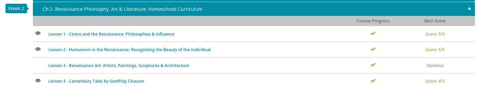
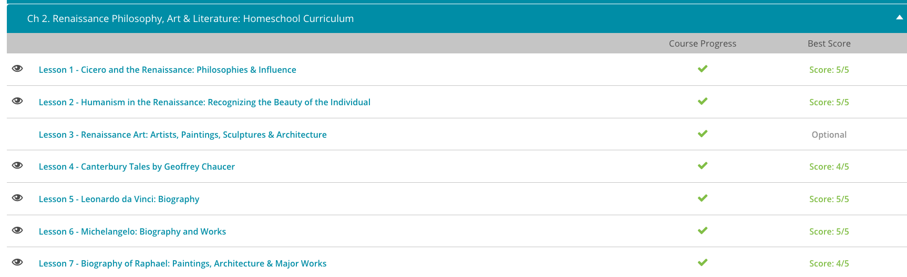

### Andrew Garber
### Feb 6 2023
### Renaissance Philosophy

#### Cicero
 - Marcus Tullius Cicero, fondly called Tully by his devotees, was a Roman scholar, orator, writer, lawyer, philosopher, and statesman who was born in 106 BC and died in 43 BC. Cicero wrote many books on rhetoric, philosophy, and politics as well as hundreds of letters and orations and even quite a bit of poetry.
 - Cicero was no ivory tower scholar. He was active in the politics of his day, which included some big names such as Julius Caesar, Pompey, and Marc Antony, and he often spoke in the Roman Senate. Cicero's career came to an abrupt end, however, after he got on the wrong side of Octavian (the future emperor Augustus Caesar) and ended up executed
 - Many of Cicero's works disappeared over the years following his death. By the Middle Ages, scholars had access to only a few of his philosophical writings, but that changed when the Renaissance dawned. Part of the Renaissance project was rediscovering the classics of Greece and Rome, and scholars prided themselves on finding, preserving, and studying these texts. They were especially interested in learning how the ancients developed their human faculties, powers, and culture and then applying their findings to their own times and places. These activities were at the heart of Renaissance humanism.
 - The 14th-century scholar Francesco Petrarca devoted much of his life to researching the classics and promoting humanism. As part of his work, he discovered and verified several works of Cicero, including a handbook on rhetoric, some letters, and a collection of orations. Cicero appealed to Petrarca, who appreciated the philosopher's elegant Latin style, wise philosophy, views on liberal education, and dedication to civic activity.
 - Renaissance thinkers embraced and applied Cicero's ideas as well as his language. In philosophy, for instance, Cicero argued for wisdom and eloquence in all matters. He was devoted to duty, ethical responsibility, and a strong moral code based on the natural law found in every human being. Cicero was also a skeptic who examined all possibilities and placed humanity at the center of the world. Renaissance humanists tended to agree with him on all points.
 - In education, Cicero advocated a liberal arts curriculum of ethics, poetry, literature, grammar, rhetoric, mathematics, history, and logic. These subjects, he maintained, would fully educate people to function actively and creatively in a civilized society and to reach their potential as well-rounded human beings.
 - In many ways, the works and ideas of Cicero became the gateway for the exploration of the classics and the Renaissance humanist project. Cicero's writings were the first to be studied in depth by Renaissance scholars, and his ideas and language became the standard for the humanists. 
 - Cicero's ideas formed the basis of the Renaissance's commitment to civic humanism, a philosophy that advocated civic virtues and an active political life. Education created good citizens who used reason to understand and analyze the issues of the day, expressed their opinions well, and worked to improve their communities.

#### Humanism
 - First, humanism radically changed the idea of individual independence. Prior to the 14th century, much of Europe, and especially Northern Europe, practiced the feudal system in which wealth was based on land ownership. Generally speaking, under this system, people were seen as part of a collective whole to keep feudal society and the manor system intact. Serfs, or the poor workers, were tools used by the wealthy to work their land holdings and keep their wealth intact. Adding to this imprisonment of sorts, the Church believed that to be concerned with yourself and your rights was nothing more than arrogance, rebellion, and sin! One should only be concerned with obeying the rules and following them without question.
 - This changed over time however, man and human nature were no longer seen as totally sinful and in need of punishment but instead as independent, beautiful, and individual creations of God. This is particularly seen in the writings of Petrarch, the Father of Humanism, in which he states, 'Sameness is the mother of disgust, variety the cure!,' or in other words, 'Go on and express yourself!' 
 - This brings us to how humanism changed not only the idea of individual freedom, but also how humanism changed the interests of the individual. Remember, up to this point, anything not centered around the Church was considered sinful. Man and earth were wicked, and only heaven and the afterlife were worthy to encompass human thought. Humanism turned this idea completely on its head as scholars, artists, and writers began centering their works on man and his experience while here on earth rather than in the afterlife. Instead of spending their time and efforts on penance and self-denial, humanists resurrected the ideals of the ancient Greeks, who placed the study and progress of human nature at the center of their interests.

#### Canterbury Tales by Geoffrey Chaucer
 - The Canterbury Tales. In this collection of stories written by Geoffrey Chaucer, we meet a colorful group of 29 travelers making a religious pilgrimage from London to the shrine of Saint Thomas Becket at Canterbury Cathedral. Along their journey, their host engages them in a storytelling contest with a free meal as the prize. However, we soon find the Canterbury Tales are more about the storytellers themselves than they are about the tales they weave.
 - The Canterbury Tales is an excellent example of cultural diffusion, or the spreading out of ideas from one central point (Italy) to another (England).The Knight is the first character asked by the host to tell his story. This placement makes perfect sense, since knighthood was highly esteemed in medieval culture. After the Knight tells his tale of a courtly love triangle, the host invites the Monk to go next. This also makes sense, since a monk was also a highly respected member of medieval society. However, before the Monk can even begin, the drunken Miller, a complete commoner, interrupts and tells the group he has a tale of love that will top that of the Knight. At first glance this may look like nothing more than a drunk guy cutting in line; however, this move reflects the author's criticism of medieval social rank. Not only does he let the Miller follow the Knight, he allows him to actually challenge the Knight to a storytelling duel. In medieval society, it was unacceptable for a commoner to even approach a knight, let alone challenge one. However, Chaucer throws these social norms out the window, allowing the Miller to continue his drunken tale.
 - Chaucer further chips away at this social rank through the introduction of the Squire, a young man training to be a knight. Like a knight, we would expect him to be masculine and heroic. Instead, he is described as one who loves singing, dancing, and poetry. In fact, Chaucer uses meadows and fresh flowers to describe the Squire.
 - The second area Chaucer takes to task is the position of women in medieval society. We see this in his racy depiction of the Wife of Bath. This worldly woman is a self-proclaimed expert on marriage. Having been married five times, she reminds her traveling companions that the great fathers of the faith - Abraham, Jacob, and Solomon - also had multiple marriage partners. To her, the fact that they were all men makes little difference. If they can do it, why can't she? She also challenges the idea that female virginity should be so chivalrously protected, making the outrageous statement that someone has to create all those virgins. This woman, way ahead of her times, openly admits to using her sexual powers to control five husbands, even saying her favorites were the ones who were rich, old, and submissive!
 - Although Chaucer's criticism of social rank and position were intense, his harshest words were aimed at the Church. This criticism is openly displayed in the Nun, the Friar, and the Pardoner. 
 - The author notes how, despite her grace, the Nun's garb is showy and ostentatious, much like the Church of her day. To make matters worse, the brooch she wears is engraved with the Latin phrase 'Love Conquers All.' This is highly inappropriate, as nuns strictly adhere to the code of celibacy. Again, the author pointed out the hypocrisy of the Church through this lovesick nun and continued this theme in the character of the Friar.
 - Chaucer described the Friar as a festive, merry man who drinks to excess and uses the money he collects for his own enjoyment. Although he tries to look the part of poverty, he is actually money-hungry and selfish. Adding to the irony, he despises the poor he is supposed to be collecting for. The Friar also has a real taste for wealthy women and uses his collected money to shower them with gifts. As Chaucer writes,
 - The final and most despicable character introduced is the Pardoner. Dressed to the hilt in elaborate clothes and sporting a huge cross around his neck, Chaucer describes him by writing, 'I judge he was a gelding or a mare!' In other words, he's either an emasculated man or a female.
 - These decapitations of the society of medieval times and the embracing of modernity are what make The Canterbury Tales so important. It is one of the first works of literature to openly criticize the Church and the social order of the time. It is also one of the first works of literature to openly embrace the individual and the pursuit of happiness. It is a work that is still relevant today, and one that will continue to be studied for years to come.

#### Leonardo Da Vinci
 - Leonardo da Vinci was born on April 15, 1452, in a small village on the Tuscan hillside. His father, a public official, and his mother, a peasant girl, were never married. There are very few accurate accounts of his early years, but history records that da Vinci began apprenticing for the well-known artist, Verrocchio, while still in his teens. Verrocchio was known as a true craftsman. Working by his side in the artistic hub of Florence, Leonardo learned the importance of quality and execution when representing the human body.
 - Upon completing his apprenticeship, da Vinci continued with Verrocchio. With Verrocchio at the helm, they collaborated to complete Verrocchio's Baptism of Christ. Although some may disagree, it is commonly held that Leonardo is responsible for the young angel holding the robe of Christ, as well as some of the landscape.
 - Somewhere around the year 1478, Leonardo branched out on his own. In 1481, he landed a major church commission, or the hiring and payment for the creation of a piece. The commission was for The Adoration of the Magi. In this unfinished work, Leonardo set himself apart by placing the Virgin and the Child in the center of the painting. Up to this point, paintings done of the sacred pair traditionally saw them at the side of the picture, not the center.
 - After moving to Milan near the end of the 15th century, he painted perhaps his two greatest works: The Mona Lisa and The Last Supper.
 - During this time, Leonardo also used his scientific knowledge as a military engineer for the infamous Cesare Borgia, the son of Pope Alexander VI. This is a great place to diverge from Leonardo the artist to Leonardo the scientist and inventor. Throughout his life, Leonardo had fantastic ideas that were way ahead of his time. He sketched precursors to the helicopter, the armored car and even something akin to a robot! All of these things are now reality in one form or another. Speaking of reality, he also proposed creating a bridge at the Golden Horn Inlet of Istanbul to modern-day Pera, Turkey. This proposal was quickly rejected as impossible. However, in 2001, a bridge very similar to that of da Vinci's design was completed in Norway.

#### Michelangelo
 - 'If you knew how much work went into it, you wouldn't call it genius.' These words are attributed to the famous Michelangelo, arguably one of the most famous, if not the most famous, artist of all time.
 - Michelangelo Buonarroti, known to many of us as simply Michelangelo, was born in March 1475 in a small Florentine village. His father was a government official with strong ties to the banking system of Florence. History doesn't tell us very much about his family, but we do know that he left his parents' home and moved to the home of a stonecutter. Some sources claim this was because Michelangelo's mother was too ill to care for him, while others claim it was Michelangelo's health that caused the move. Either way, the time spent with the stonecutter had a huge impact on young Michelangelo, the boy destined to become one of the most respected sculptors in history.
 - By the time he was 13, Michelangelo was studying under the artist Ghirlandaio. During this time, Michelangelo learned sculpture, painting and the art of fresco from the accomplished Ghirlandaio. Perhaps even more important, Ghirlandaio had ties to the wealthiest family in all of Florence, the Medici.
 - As soon as the wealthy Medici got a glimpse of Michelangelo's talent, their loose connection grew into a full-blown bond. In the early 1490s, Michelangelo left the apprenticeship of Ghirlandaio and actually moved into the estate of Lorenzo de Medici, a sculptor himself and the de facto ruler of Florence. While studying in the Medici gardens, Michelangelo met some of the world's most respected poets, scientists and philosophers. Their views rubbed off on the young Michelangelo's work, mixing religion with myth. Two of his most famous works of this time are the Madonna of the Stairs, also known as the 'Madonna of the Steps,' and the Battle of the Centaurs.
 - After the death of Lorenzo de Medici, Michelangelo moved to Rome. The cardinal himself wanted the young Michelangelo to sculpt a huge statue of Bacchus, the ancient god of wine. Although it seems the cardinal wasn't fond of the finished product, this didn't stop Michelangelo. Just a short time later, he sculpted the Pieta, which still stands in Saint Peter's Basilica of Rome
 - After the death of the radical monk Savonarola, Michelangelo returned to Florence. With Florence in political upheaval, Michelangelo was commissioned to turn a damaged piece of marble into the biblical hero David. This masterpiece of the human form shows the naked David poised like a Greek god with his eyes determined to protect his land. Many art historians believe this work, more than any other, portrays Michelangelo's devotion for the Republic of Florence and his desire to see it be set free.
 - In around 1508, Michelangelo was commissioned to paint the ceiling of the Sistine Chapel. Arguably, this would become Michelangelo's most famous work. Ironically, Michelangelo considered himself a sculptor, not a painter, making him none-too-thrilled to receive this job. In true, moody artistic style, Michelangelo finally agreed to the job but refused to adhere to the Pope's vision. Instead, he created his own. By the time this awe-inspiring work was complete, it depicted the story of the creation of Adam, the downfall of Adam and Eve and many other scenes, encompassing over 300 figures. The fact that this was all done in fresco, meaning a painting that is done rapidly in watercolor on wet plaster on a wall or ceiling so that the colors penetrate the plaster, makes this work even more impressive. Add to this that Michelangelo painted this high in the air while on his back, and the whole thing seems a bit supernatural.

#### Raphael
 - Raffaello Sanzio, better known as Raphael, was born in late March or early April of 1483 in Urbino, Italy. As the son of painter Giovanni Santi, Raphael learned artistic techniques and Renaissance humanism from the time he was a small boy. His knowledge would come in very handy when his father died in 1494. With the help of his stepmother, the 11-year-old Raphael plunged right into managing his father's workshop, learning more and more as he worked and excelling beyond anyone's expectations.
 - As a teenager, however, Raphael knew it was time to move on. He wanted more than a small workshop. He longed to be a great artist, and to do that, he needed to develop his talent. Around 1500, he moved to Perugia to become an assistant to the artist Perugino. Here, Raphael practiced the style and techniques of the High Renaissance: classical elements, religious themes, realistic figures, intricate landscapes, compositional order and stability and complexities of light and shadow.
 - In the nearly four years he worked with Perugino, Raphael produced several of his early famous paintings, including the Mond Crucifixion, The Three Graces, The Knight's Dream and the altarpiece Marriage of the Virgin.
 - By 1504, Raphael realized that once again it was time to move on. He needed to gain further experience, see new places, interact with other artists and finish growing up artistically. For the next four years, the artist lived on and off in Florence, painting his famous series of Madonnas, including La Belle Jardinère in 1507.
 - In 1508, Raphael received the chance of a lifetime and one of the highest honors an artist could achieve when Pope Julius II commissioned him to paint a room at the Vatican. Raphael moved to Rome and began work on the Stanza della Segnatura, which probably served as the Pope's library.
 - This room contains some of the artist's masterpieces: the School of Athens, the Parnassus and the Disputation of the Holy Sacrament.
 - In the School of Athens, Raphael depicted the greatest thinkers of the classical age. In Parnassus, he paid tribute to classical and medieval poets, and in the Disputation of the Holy Sacrament, he offered an artistic interpretation and confirmation of the real presence of Jesus Christ in the Eucharist. The room, which also includes Raphael's ceiling frescoes, Theology, Poetry, Philosophy and Justice, was finished in 1512.

