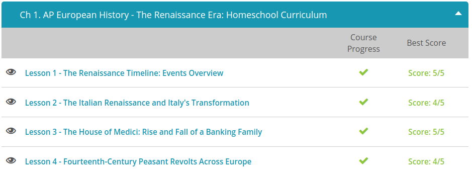
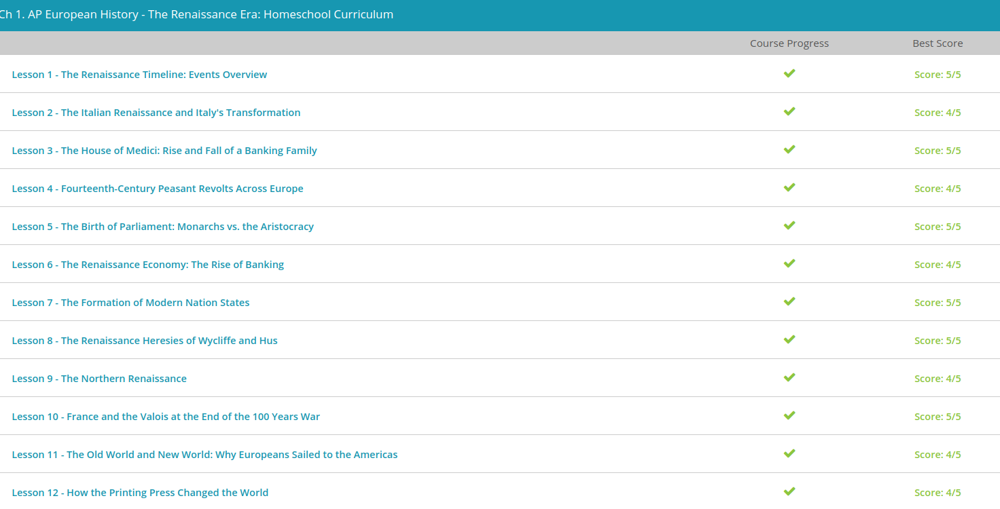

### Andrew Garber
### February 1 2023
### The Renaissance Era
 
#### The Renaissance Timeline
 - First, we have the Hundred Years' War, beginning in 1337 and lasting for about 116 years. It was a nasty skirmish that began when the King of England tried to claim the crown of France.
 - Next, we have another struggle for power, but this time in the papacy. It was known as the Great Schism of 1378, when two popes both claimed authority over the Catholic Church. Again, this caused a bit of a problem. Because of this, we need to include the Council of Constance, lasting through the years 1414-1418, which ends the aforementioned Great Schism.
 - On more of an up note, we can also include the invention of the printing press by Johann Gutenberg in 1448. This invention forever changed world communication. It was the first time that books could be mass produced, and it was a huge step forward for the world, allowing the spread of information to be much easier and cheaper than before. This allowed what information would have been kept to a select few to be spread to the masses.
 -  On a down note, while Gutenberg is printing, people are still fighting as Constantinople falls to the Turks in the year 1453, thus ending the Byzantine Empire and the Eastern Roman Empire. This is a huge blow to the Catholic Church, as the Byzantine Empire was a huge supporter of the Church. This also marks the beginning of the Ottoman Empire, which would last for hundreds of years.
 - Then, in 1492 Christopher Columbus discovers the New World, which is a huge step forward for the world. This is the beginning of the Age of Exploration, which would last for hundreds of years. This is also the beginning of the Columbian Exchange, which is the exchange of goods and ideas between the Old World and the New World. There is a downside here however, as the Columbian Exchange also brought diseases to the New World, which would kill millions of people.
 - As Michelangelo was painting the Sistine Chapel, others were writing. We have Martin Luther nailing his 95 Theses to the doors at Wittenberg in the year 1517. This work not only changed the religious landscape of much of Northern Europe but also caused some real trouble for its author, Martin Luther.
 - Speaking of trouble, we also have the Peasants' War of Germany beginning in 1524 and lasting about two years. Although its duration was very short, it was a large uprising of the peasant class, seeking influence and freedom for their everyday lives.
 - In 1545, we have the Council of Trent, a series of three meetings held by the Catholic Church in order to answer the charges of the Reformation and to dogmatically solidify its beliefs. To this day, it's considered one of the most important councils of Catholic history. 
 - In 1555, with the Holy Roman Empire continuing to weaken, the Peace of Augsburg was enacted, giving the princes of Germany the right to practice Catholicism or Lutheranism as they each saw fit. Sadly for other religious sects, only Lutheranism and Catholicism were recognized.
 - Just when things seemed like they couldn't get more upside down and sideways on the continent of Europe, along comes the Thirty Years' War of 1618 - one of the most damaging conflicts in European history, in which most of Central Europe became engulfed in a battle that began as Catholic versus Protestant but soon degraded into a race for European preeminence.
 - And this brings us to our last timeline entry, The Peace of Westphalia, a series of several treaties finally ratified in 1648, bringing an end to both the Eighty and Thirty Years' Wars of Europe. Although this treaty didn't really bring true peace to the continent, it was a large step toward national boundaries and state sovereignty.

#### The Italian Renaissance 
 - In today's lesson, we will be discussing Italy as the birthplace of the Renaissance, a historical period beginning in the late fourteenth century in which people started taking an interest in the learnings of earlier times, specifically in the cultures of Ancient Greece and Rome. As the French word 'Renaissance' implies, it was a rebirth in the appreciation and study of these classical times. It was also a rebirth in the interest of the individual and the human capacity to learn, otherwise known as humanism.
 - The most prominent area of the renaissance were the city states of Florence, Venice, Milan and the Papal States.
 - Italy was the birthplace of the Renaissance largely because of its location, as it was the center of trade between the East and the West. This allowed for the spread of ideas and goods, which in turn allowed for the spread of the Renaissance.
 - More than that, it held the ancient seat of the Roman Empire - Rome, which was the source of much of the ancient knowledge that was rediscovered during the Renaissance. This was also the home of the Vatican, which was the center of the Catholic Church, which was the dominant religion of the time. This allowed for the spread of the Renaissance to the rest of Europe.
 - Another reason was the wealthy merchants of Italy, who were able to fund the Renaissance - money was not to be made in the fields, but in the cities through trade and industry. A good example of this is the Medici family, wealthy bankers who funded the arts and sciences in Florence - including the most famous artist of the Renaissance, Michelangelo.
 - These city states were not peacefully coexisting, they were almost constantly at war with each other and other smaller powers. Interestingly, and quite in contrast with the rest of Europe, the Italian city states did not really have citizen soldiers so much as a professional mercenary class. Many of these were drawn from the lower classes of Northern Europe, but the most famous of these was Federico da Montefeltro, the Duke of Urbino, who was a mercenary commander who was famous for his sense of justice and honor in an otherwise dishonorable profession.

#### The House of Medici
 - To begin, the Medici family, also known as the House of Medici, emigrated to Florence from the Tuscan hillside sometime during the 12th century. Through banking and commerce, this family soon rose to become one of the wealthiest families in Italy. However, it wasn't until the 15th century that the Medici began turning their wealth into political capital, making themselves the unofficial, yet undisputed, rulers of Florence.
 - The first Medici we see using wealth to win power was Giovanni di Bicci de' Medici. In fact, we could say it was he who got the influential Medici ball rolling through the founding of the Medici Bank. Through shrewd, behind the scenes business transactions, Giovanni wormed his institution to the top of the ladder.
 - By the early 15th century, the Medici bank had become the official bank of the Papacy, earning themselves the title of God's Bankers. However, Giovanni never sought political office; instead, he used his wealth to strongly 'encourage' the official politicians of Florence for tax reform. This move made him extremely well liked by the people of Florence and added popular support to his growing political cache.
 - If Giovanni got the Medici ball rolling, his son, Cosimo de' Medici (or Cosimo the Elder), had it dipped in gold. During the 1430s, Cosimo used the family fortune to set up an elaborate network of behind the scenes alliances that benefited his bank and ruined his competitive enemies. In true mafia style, he loaned money for favors. Within years of taking over the family reigns, Cosimo controlled the strings to almost every business in Florence. This gave him the ability to call in favors at will. He also set up branches of the Medici Bank all over the known world, from Barcelona to Cairo to Bruges. Soon, almost every parish in Europe sent its money to the Medici. The Pope himself opened a huge credit line, giving the Medici the purse strings of the church. Again, money won power, making the House of Medici a ruling dynasty without birthright or title.
 - Of course, this made Cosimo very unpopular with the old, influential families of Florence. So much so that in 1433, he was arrested and exiled by a rival family. However, bribes - along with his well-crafted political network - saw his enemies quickly destroyed. Cosimo returned to reign unchallenged for over 30 years.
 - With his rule undisputed, Cosimo further cemented his popularity by throwing his money to the arts. He commissioned Brunelleschi to finish the dome of the Florence Cathedral, and then 'suggested' the Pope personally travel to Florence to consecrate the cathedral upon its completion in the mid-1430s. Now remember, Cosimo held His Excellency's money in his hand. This move made him extremely popular with the masses, as their city was turned into the cultural center of the day, and the Renaissance began to flourish. With this, Cosimo seized the opportunity to use art to his political advantage, holding at his charge men like Brunelleschi and Donatello.
 - If Cosimo seized the opportunity to use cultural works as propaganda, his grandson, Lorenzo de' Medici, made it an art form. Lorenzo, known as the Magnificent, threw the doors of art open to the public, again breathing life to the Renaissance. He funded a public art school, fostered the talent of Michelangelo, supported the brilliance of da Vinci and flaunted the racy works of Botticelli. This grasping of power through art is blatantly seen in Botticelli's work, the Adoration of the Magi. In this masterpiece, the artist actually painted members of the Medici family as the kneeling wise men! What could give the appearance of power more so than having a wise Medici kneeling and actually touching the feet of the Holy Child
 - However, never fear, the Medici had an ace up their sleeves, when Cardinal Giovanni de' Medici (remember Lorenzo's son who got a cardinalship for his birthday) became Pope Leo X in the year 1513. With this rise to such heights, Giovanni (or His Excellency) refilled his family coffers through the sale of indulgences - or in simpler terms, the freedom from punishment of sins. This practice, although it played a role in spurring on the Reformation, made Giovanni a very wealthy man, with a strong appetite for parties, Renaissance art and prestige.
 - At this point, the House of Medici turned its attention to the business of the church, rather than the business of banking. Following in his cousin Giovanni's footsteps, Giulio di Giuliano de' Medici became Pope Clement VII in the year 1523. Remembering the old family tricks, Giulio quickly used his family network to secure power through the marriage of his cousin, Catherine de' Medici, to the heir of the French throne. This not only made Catherine the future queen of France but also the mother of three future French Kings, whose blood was half Medici! Again, the household of Medici, who had never officially been royalty, saved its power, not by war or birthright but through wealth and connection.
 - Although these two popes were powerful, the award for the most outstanding 16th century-Medici would probably go to Cosimo de' Medici, the great-great-grandson of Lorenzo the Elder, who was Cosimo the Elder's brother. However, this Cosimo's claim to fame is not his well-known name. On the contrary, his infamy lies in being the first Medici to hold political office by being named the Grand Duke of Tuscany in the late 1560s. Also, unlike his fathers before him, Cosimo did not rule as a great patron of the arts, nor did he rely on a social network built through bribery. Instead, he ruled as almost a dictator, using his title to create a large government bureaucracy. However, Cosimo did show his true Medici colors by marrying a Spanish princess of his own. With this move, he not only ensured the support of the Spanish court but also gained access to the powerful Spanish army and navy. Now, Cosimo had might to back up his place of power.
 - As Grand Duke, Cosimo established absolute power over the region, and his descendants would rule as Grand Dukes well into the 1700s. Also, his children would keep up the Medici tradition of marrying well. His granddaughter Marie would become Queen of France, and her son would rule the French as Louis XIII, proving once again that the Medici were masters at gaining power through wealth and connection.

#### Fourteenth-Century Peasant Revolts Across Europe
 - Fourteenth-century Europe saw some very negative events. A famine occurred in both Northern and Southern Europe during the early to mid-fourteenth century after excessive rain and frosts devastated crop growth. The population declined even further due to the Black Death. The Black Death was an illness that spread quickly and killed at least a third of the people living in Europe in the fourteenth century.
 - Because the population declined so quickly, there was a labor shortage. The working class could now demand better wages, but the nobles still attempted to create restrictions on wages while the government imposed higher taxes to fund war efforts. The Hundred Years' War began in 1337. The war was a fight between England and France to gain control over England's territories within French borders. England was dominant during much of the war but ultimately lost control to France over all but one territory.
 - In addition to the socioeconomic state of Europe, the power of the pope began to decline as well. Disputes erupted over who had more secular power, the pope or the kings. The power of the church was challenged by reformers and a pessimistic working class. Additionally, between 1309 and 1377, the papal court moved from its home in Rome, Italy to Avignon, France.
 - Once the papacy returned to Rome, arguments over who should be pope led to a Great Schism between two popes. A third was appointed to end the dispute but none of the popes stepped down. Eventually, two popes were removed while the third stepped down, and a new pope was appointed. Although the situation was resolved, the call for reform and arguments among the highest officials of the church led to doubt and confusion regarding the church's authority.
 - One of the most well-known revolts occurred in June of 1381. In 1377, King Richard II forced a poll tax on peasants to help finance his military in foreign ventures. Another poll tax was issued two years later, in 1379. Yet another poll tax was issued within this timeframe that left peasants paying different amounts. Peasants felt the weight of the taxes and were increasingly angry at the unfairness of the taxes issued. After all, King Richard at the time was only a teenager.
 - Another revolt occurred in France in 1358, known as the Jacquerie. French peasants also felt the aftereffect of the Black Death. However, they were also dealing with the destruction of land by English and French soldiers as well as hired mercenaries. At the time, the French king, John II, had been captured at the Battle of Poitiers in the Hundred Years' War. Because power was divided among several people, the influence of the nobles greatly diminished. In order to ensure they kept some of the power, the nobles, along with the church clergy, forced heavy taxes on the peasants.
 - The peasants attacked aristocracy for several weeks throughout the summer. They lacked organization, and many of the uprisings were local attacks on tax collectors, governors, and other nobility. They were eventually suppressed by a group of nobles led by Charles the Bad of Navarre.

#### The Birth of Parliament 
 - Parliamentary systems were a direct consequence of monarchs challenging the church, one great example of this was the 14th century Babylonian Captivity of the Papacy, in which the church seat was moved to Avignon, France. With this move came the impression that the pope was simply a puppet in the hands of the French kings of the day, some of whom included Philip VI, Louis X, and Charles IV.
 - This rise of secular power was also being felt in Italy as Machiavelli, one of the best-known Florentine writers, stressed that government rule should be based on the secular and not the religious. This idea is bluntly stated in his early 16th century work, The Prince.
 - As the power of the church weakened, the monarchies pulled out the next weapon in their arsenal: the growing middle class. During the Renaissance, urban areas began to prosper as trade grew between cities and other countries. This newfound source of income freed the common class from the system of feudalism. Wealth was no longer to be held simply through land ownership but through commerce and trade.
 - As cities grew, jobs were rapidly created. With these jobs came a brand new group of income earners or, in the monarchs' eyes, a brand new source of tax income! King Henry III of England is one of the first European monarchs to begin regularly taxing his subjects. Oddly enough, although the common class now had to pay taxes, they began to embrace their rulers as symbols of national pride. 
 - To continue, this shift in finances and this new tax base gave the monarchies a treasury with which to fund their own standing armies. This was a huge change in political influence, since up to this point, kings and queens relied on wealthy landowners or the aristocracy for the raising of troops. Now, the monarchs could raise their own armies and use them to enforce their will - which frequently included diminishing the power of these wealthy landowners and the aristocracy.
 - The first way we see this happening is through the hiring of non-aristocratic subjects to the administration of the monarchs' bureaucracies. In simpler terms, the kings and queens of Europe began using common men to replace the aristocracy. This gained the royals even more public support while further limiting the nobility.
 - This new group of common bureaucrats soon became known as parliaments. They replaced the aristocracy in areas of counsel and even consent in the monarchies' decision-making process. These new parliaments, named from the Latin word parliamentum (or 'to discuss'), enabled the royals to raise money through taxes while also keeping a close eye on the nobility. In many ways, they acted as a go-between for common men and their kings.
 - In many European nations, these parliaments soon dwindled into mere puppets under the control of the ruling royals. However, this was not the case in England, where the king faced increasing pressure by his parliament to invite a greater range of people.
 - The monarchs cleverly answer this question with the introduction of court life to their realms. In this practice, the royal courts became the center of life for the nobility, in essence reducing the aristocracy to a royal entourage. Nobles were required to live at court, and as a result, were under the constant surveillance of the king. This allowed the monarchs to control the nobles and, more importantly, allowed them to prevent a coup or uprising of the wealthy.

#### The Renaissance Heresies of Wycliffe and Hus
 - The Wycliffe Bible Translators are a modern organization that has continued the works of John Wycliffe, a man living in very turbulent times who challenged the notion that the Bible should be left in the hands of the church. Through him, men like Jan Hus would pick up this mantle and bring the Bible to common man.
 - John Wycliffe was an Englishman born sometime around the year 1320. History hasn't recorded much about his early life, but we know he was educated by, and later taught at, Oxford University. Around 1374, Wycliffe branched out from the scholarly world to enter the realm of politics, becoming a representative for King Edward III at a papal conference. During this time, it is believed that he developed a close friendship with John of Gaunt, the son of King Edward III. This friendship would serve as a protection for Wycliffe as he began challenging some foundational church practices and beliefs. These radical opinions focused on three areas: church authority, church membership and church tradition.
 - the late 14th century, Wycliffe shocked the world by declaring the pope, like any man, was capable of sin. In his essays entitled 'On Divine Dominion' and 'On Civil Dominion,' he took it a step further by stating a worldly or sinful pope was to be proclaimed a heretic and should be removed from office. Making matters even more serious, he also taught that a monarch had the right to stop financially supporting any clergyman he deemed to be unworthy.
 - Never one to sit quietly on the sidelines, Wycliffe would not be silenced. His next target was church membership. Through his personal study of the Bible, Wycliffe believed that God, not any earthly official, has the right to allow or deny church membership. Through his study, he believed that the Church of God was not a visible organization here on earth, but was made up of God's elect, or in simpler terms, those God had chosen. He believed no man, no pope, had the right to declare someone else holy. This job is for God and God alone. Wycliffe took this teaching, known as predestination, or the belief that God has predetermined who will be part of the true church, directly from the Bible.
 - Up until this point, church tradition held that only church officials were worthy to read and expound upon the Bible. They taught that common man was not capable of such study, and therefore, the path to God must be through the church. Wycliffe boldly challenged this again by proclaiming the words of the New Testament, which state 'For there is one God and one mediator between God and men, the man Christ Jesus;' or in other words, Jesus, not the church, is the only way to God.
 - Wycliffe did not stop there. He decided the best way to get people to understand what the Bible said was to give them an English translation that they could understand. Up to this point, the Holy Book was only available in the ancient Hebrew, Latin and Greek, making it difficult if not impossible for the common man to read. Wycliffe began translating the scriptures into common English. By the 1390s, his translation was being distributed to the wealthy, the common and the very poor. Having the Bible readily available to the public meant disaster to the church. In losing control of the scriptures, the church's income and power were at stake.
 - Of course, the church was not willing to go down without a fight, and when Wycliffe dared challenge their doctrine of transubstantiation, or the belief that the bread and wine of communion actually become the body of Christ, they had had enough. Although his life was spared, Wycliffe was declared a heretic and expelled from Oxford.
 - However, in a small Bohemian village, someone else was stirring. Jan Hus, the son of poor parents, enrolled in the University of Prague in the 1390s. There he came under the influence of the writings of Wycliffe. Hus was especially impressed with Wycliffe's teachings against the power of the church. This was also the time of the Great Schism when two rival popes were fighting for church authority. This, along with Wycliffe's teaching, spurred on Hus' belief that the church was way too powerful. He took Wycliffe's beliefs to another level, arguing that the church should have no authority in secular matters and that government had the right to rise up against the church. Like Wycliffe, he also believed the Bible had supremacy over the church and that Christ, not the pope, is the head of the true church.

#### The Northern Renaissance
 - Countries north of the Alps lacked the resources of the Italian Renaissance. In Italy, the evidence of classical antiquity was everywhere, affording great inspiration to their artists, architects, and sculptors. However, this link between the present and the past was much weaker in the rest of Europe. For instance, an architect in Germany couldn't simply walk out his door to study the ancient architecture of the Colosseum, nor could a sculptor living in England gaze upon the statues of Trevi Fountain. Also, unlike Italy, the rest of Europe was rural, not urban, affording little opportunity for the spread of new ideas.
 - During this time period, the political structure of Northern Europe differed greatly from that of Italy. Unlike Italy, which was a collection of independent city states, the Northern areas of England, France, and Spain were being formed into nations under powerful kings and queens. Germany, like Italy, was divided into several large states, but it was unified by the Holy Roman Empire. Like the princes and rulers of the Italian city-states, the monarchs of Northern Europe supported the Northern Renaissance but they did it on their own terms.
 - One such monarch was France's King Francis I, who ruled during the mid-16th century. He was a great patron of the arts; however, he held the Italian artists in higher esteem than the work of his own subjects. Wanting to be like the cultured princes of Italy, he surrounded himself with some of the most famous artists of the Italian Renaissance, even inviting da Vinci to travel to France. 
 - Perhaps the greatest difference between the Italian Renaissance and the rest of the Renaissance throughout Europe was in the Northern Renaissance's close ties to the Christian church. This gave birth to Christian humanism, or a mixing of the knowledge of the antiquities with the moral teachings of Jesus Christ. Unlike the humanism of Italy, which focused solely on writers like Virgil and Cicero, Northern Renaissance scholars brought back the older works of the church, including the texts of the Bible, Saint Augustine, and Saint Jerome.
 - Neither of these approaches can be said to be superior to the other, just that circumstance were different and the goals of the political leaders were not comparable due to wildly different political structures.

#### France at the end of the 100 Years War
 - To begin, weaponry and military tactics changed drastically during the Hundred Years War. Prior to the war, knight-filled cavalries were the most powerful part of the French army. However, the Hundred Years War saw the introduction of the longbow and foot soldiers to the battlefield. Although these changes first took place on the English side, France was soon to follow.
 - By the end of the Hundred Years War, the need for the noble knighthood had declined, since any able-bodied man could be armed with longbows or even firearms. This also changed the makeup of armies, going from being dominated by noble lords to common men being paid to fight. This leads up to our second change in France, the freedom from feudalism. Feudalism, a system of government in which land owners held power over their serfs or workers, dominated France before the Hundred Years War. Because feudal lords held such power over their serfs, France was, in many ways, a divided kingdom. Common people depended on and gave their allegiance to their feudal lord rather than their king.
 - This all changed when military tactics gave the commoners the ability to fight and even get paid for doing so. Many chose to give up their lives on the manor for the life of a mercenary, or a soldier for hire. By the end of the war, these new forces developed into standing armies. Not only could these armies defend their lands from invaders, they could also protect their kings from the internal threat of powerful lords. However mercenaries had no inherent loyalty to a cause, and were often bribed to switch sides during a battle.

