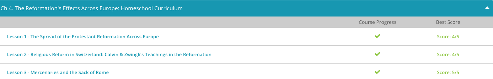

### Andrew Garber
### February 14 2023
### The Effects of the Reformation

#### The Sack of Rome
 - Francois and Bourbon wanted to expand French borders, but neither of them had enough money to fund the expedition. They began borrowing money, assuming they would be able to pay it back after conquering a rich Italian province called Lombardy.
 - Bourbon also used some of his money to hire mercenaries from Germany to fight against the Swiss mercenaries currently fighting for Lombardy. Mercenaries are soldiers that are hired to fight rather than being part of a national defense system. Mercenaries didn't fight for their nation of origin, but instead went where the money was. Mercenaries could fight against one country and then fight for them in the future, depending on who hired them. The French troops, along with the German mercenaries, led a successful campaign into the Italian province.
 - When the forces returned, Bourbon asked the King for funds to pay off his debtors. The King, however, didn't have enough money to pay off his own debts. Bourbon waited two years and asked for money again. Although the King was agreeable, he was in no hurry to comply with Bourbon's request. Bourbon finally obtained financial help through his cousin, also named Charles, who was the prince of Austria. 
 - Charles of Austria was elected Holy Roman Emperor in 1519. Francois was unhappy with this decision and wanted the title for himself. Francois wasn't sure he could trust Bourbon's loyalty, so he asked Bourbon to marry his mother. Bourbon refused, and Francois claimed ownership of all of Bourbon's property. Bourbon had to go to court to fight for his estate, but meanwhile, Francois continued to petition Bourbon with marriages to women in his family.
 - Bourbon became irritated with Francois' behavior and fled to Spain, where his cousin, Charles V, was preparing to invade France. Bourbon joined the fight with his German mercenaries. Francois was captured, and Bourbon demanded that Francois return his land and his money. Francois agreed, but when he was set free, he sold all of Bourbon's land to French aristocracy. Bourbon had to ask his cousin for more money, but Charles V was busy with rebellions against his empire. 
 - Charles V made Bourbon the Duke of Milan and provided him with an army of French and German troops. However, the mercenaries became angry when they didn't get paid for their service. Bourbon began selling his own possessions to pay them. He eventually allowed the troops to attack neighboring cities to loot the cities and churches to help pay their salaries.
 - Bourbon and his troops decided to attack the city of Rome. Rome was considered sacred by Catholics. Because of Rome's holy status, it had little in the area of defense. The city was thought to be safe, as few would dare attack a place held in such high regard. However, a movement had begun among Christians to rebel against the authority of the Church as the Reformation continued.
 - Bourbon attacked in May of 1527. During the attack, Bourbon was killed, but his troops defeated the city. The sack lasted a little over a week, but it is thought Rome was in chaos for months. The city was looted and many buildings and monuments destroyed. By the end of the summer, thousands of men, women, and children had either fled or were killed in the attack. Many soldiers, both Catholic and Protestant, as well as some locals, participated in the murder and looting.
 - The sack of Rome also had an impact on the Renaissance culture Rome was known for at the time. During the Renaissance period, many people began to rediscover classical literature from ancient Greece and Rome. Artists began to show more complexity in their work while including a strong emphasis on classical traditions. After Rome was attacked, many artists and architects fled the city, hoping to find safety elsewhere. This event is generally seen to have marked the end of the High Renaissance in Rome.

