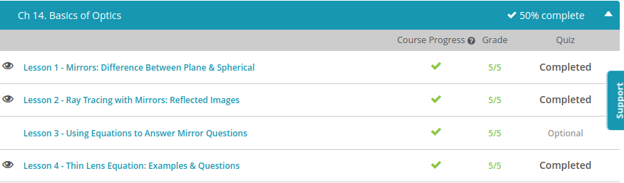
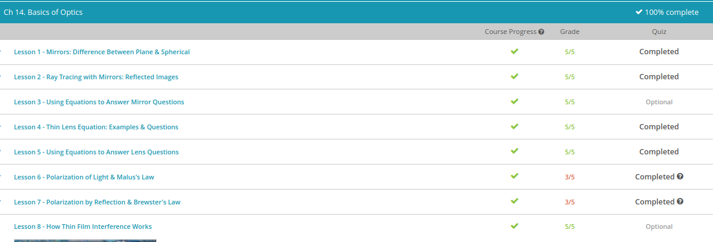

### Andrew Garber
### Nov 4
### Basics of Optics

#### Mirrors: Difference between Plane and Spherical
    - A mirror is a surface that is smooth enough that it produces specular reflection - clear reflections - so you can see an image. But mirrors can be made into different shapes for different purposes. Two of those shapes are planes and spheres.
    - A plane is a flat surface. So a plane mirror is just a smooth, mirrored surface that is completely flat. This stops the image you see from being distorted.
    - A sphere is the 3D version of a perfect circle - it's a shape with a consistent curve all the way around and a constant radius. So a spherical mirror is a mirror that has a consistent curve and a constant radius of curvature - a sphere-shaped mirror.
    - Spherical mirrors can be convex or concave, depending on which side you put the mirrored surface on. A convex mirror is a spherical mirror where the mirrored surface is on the outside of the spherical curve. And a concave mirror is a spherical mirror where the mirrored surface is on the inside of the spherical curve.
    - Plane mirrors produce virtual, upright images that are the same size as the object. Virtual, just means the image is formed behind the mirror instead of in front of it.
    - Concave mirrors produce different kinds of images, depending on whether the object is placed further away from the mirror than the focal point or inside the focal point. And convex mirrors always produce images that are upright, virtual and smaller than the object.
    - One problem with spherical mirrors is that they produce distortion effects called aberrations. Spherical aberration is the effect that causes spherical mirrors to not focus parallel rays to the same point, producing a blurry image. This is especially apparent in astronomy because all objects in the sky are far enough away for the light rays to be parallel.
    - This would make spherical mirrors useless, especially for astronomy. But thankfully, there's a solution! When spherical aberration becomes too much, we make the mirrors parabolic in shape - the shape of a parabola or x-squared curve. This causes parallel rays to focus at a particular point, sharpening the image. All modern mirror-based telescopes use parabolic mirrors.

#### Ray Tracing with Mirrrors
    - A ray is just a path of light drawn as a straight line, coming from a source. It's a good way to show how light moves. Instead of drawing every little photon of light and how it moves, we can just draw a few to illustrate the point.
    - The law of reflection says that the angle light hits a surface (called the incident angle) is equal to the angle that light bounces away from the surface (called the reflected angle).
    - 
    - The law of reflection works for every surface, whether a mirror or your dining room table. But the problem with your dining room table is that you never know whether a light ray will hit a peak or a valley and which direction that part of the surface will be pointing. So, the light ends up bouncing off in lots of seemingly random directions. This is called diffuse reflection.

#### Thin Lens
 - A lens is a transmissive optical device which affects the focusing of a light beam through refraction. To create or alter an image, light must be focused at a point where your eye can view it. Refraction is the bending of light when it moves from one medium to another and this is how lenses achieve their goals. They can bend light to make an object appear closer, farther away, upside down, sharper... whatever the goal is for the particular lens or (often) a combination of lenses.
 - There are two main types of lenses: concave and convex. Convex lenses are lenses that converge light, that bend light that would be otherwise spreading apart until the light rays come together to meet at a point. And concave lenses do the opposite - they're lenses that diverge light, that bend light that would otherwise be coming together to make the beams spread apart. But how can we predict what exactly a lens will actually do?
 - As with everything in physics, the way to make more exact predictions is through an equation. In this case, the thin lens equation. It looks something like this: $(1/do) + (1/di) = 1/f$. And it works, unsurprisingly, for lenses that are... thin. The thicker a lens gets, the less accurate the equation becomes.
 - In this equation, do is the object distance, or the distance of the object from the center of the lens. Di is the image distance, or the distance to the image that the lens produces, again from the center of the lens. And f is the focal length, which is just a number that represents how strongly a particular lens converges or diverges light; it's a property of the lens itself. With lenses, distances are always measured along a central axis from the very center of a lens.

#### Polarization of Light
    - Polarizers are used in many ways. Polarizing sunglasses reduce the brightness of the sun by only allowing part of the light through - the light that happens to oscillate in a particular direction.
    - You might also notice that polarizing sunglasses remove glare from television screens and reflections from lakes. Photographers use polarizing filters on their cameras to do this on purpose. This happens because light that bounces off a lake becomes polarized after bouncing off it. The light that bounces off the fish inside the lake is polarized differently. So if you orient the slits in your sunglasses just right, you can let through the light coming from the fish and block the light coming from the surface of the lake. This can be extremely useful if you're trying to take a photo of the inside of the lake, instead of the surface.
    - The one downside to polarizing is that you're losing some of the light. Even if your goal is just to take a photo, the image won't be as bright, just like how sunglasses make the world dimmer. Malus's Law is an equation that tells us just how much dimmer.
    - It tells us that the intensity of light that passes through a polarizer, I, usually measured in watts per meter squared, is equal to the original intensity of the light, I-zero, also measured in watts per meter squared, multiplied by cosine of the angle between the light's direction of oscillation and the direction of the polarizer's slits (theta squared). That last squared is important and easy to miss.

#### Polarization by Reflection & Brewster's Law
    - Polarization by reflection is where you bounce light off a reflective or mirrored surface, such that the light that moves away from that surface is polarized. When light hits a surface, some of it will be refracted, it will bend and go through the material, and some will be reflected, it will bounce away from the material. It turns out that light that is polarized in the direction that a reflection happens, in the same plane as the incident and reflected ray is more likely to be refracted, and light that is polarized at 90 degrees to this plane is more likely to be reflected.
    - Brewster's Law says that maximum polarization will happen when the angle between the reflected ray and refracted ray is 90 degrees.
    - Brewster's Law can be defined mathematically by this equation, where theta-B is Brewster's angle - the angle of incidence where maximum polarization occurs, n1 is the refractive index of the material the light is passing through before it reflects and n2 is the refractive index of the material the light bounces off. A refractive index is just a number that represents how dense the material is and therefore how fast or slow light travels inside it. It's the kind of thing you can look up in a data table, or figure out by doing an experiment. For example, the refractive index of ice is 1.31, and the refractive index of Plexiglas is 1.6.

