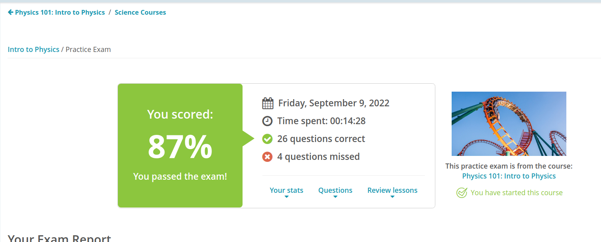

#### Andrew Garber
#### September 9 2022
#### - 
#### What is Physics? Review - Chapter 1

Physics is the main branch of science studying the motion and behavior of matter and energy throughout time.

There are several branches of physics, not limited to but largely encompassing: Mechanics, focusing on the behavior of objects and the forces that act upon them. Thermodynamics, the study of heat, temperature, and energy and their interactions with the world. Acoustics, the study of sound and waves. Optics, the study of light and its generalized properties. Electromagnetism, the study of electric and magnetic forces. Fluid dynamics, the unique study of fluids and their physical properties, specifically in regard to liquids and gases(and plasma, for that matter.) Relativity, the study of the theory of relativity.

#### Math Review for Physics

 - Zero Rule: any number raised to the power of zero is always equal to one. $x^0$=1

 - One Rule #1: $1^x$=1

 - One Rule #2: $x^1$=x

 - Negative Rule: We can reform a negative exponent as a positive one by writing the number it is being raised to as a reciprocal | $x^-1 = 1/x^a$

 - Product Rule: Two equal numbers with different exponents multiplied together is equal to that number raised to the addition of the two exponents | $x^a*x^b=x^(a+b)$

 - Quotient Rule: Two equal numbers with different exponents divided together is equal to that number raised to the subtraction of the two exponents | $x^a/x^b=x^(a-b)$

 - Power rule: When an exponent is raised to another exponent, this is the same as having the two exponents multiplied together | $(x^a)^b = x^(a*b)$

#### Metric System + Units Review

 - All units the in metric system are in the base 10 system, kilo=1000, centi=0.1, milli=0.001

 - Volume is how much space something takes up

 - Mass is how much of an object there is

 - Density is how packed the particles of an object are

 - Density = Mass/Volume

 - Kelvin is the scientific measure for temperature, however Celsius is much more commonly used. Kelvin and Celsius are proportional = 0C = 273K, 0K = -273C

#### Scientific notation

 - Planet A is $3 * 10^14$ light-years away from Planet B. Planet B is $2 * 10^12$ light-years away from planet C. What is the distance from Planet A to Planet C.
 - $(3 * 10^{14}) + (2*10^{12})$ = $(3 * 10^{14}) + (0.002 * 10^{14})$ = $3.02 * 10^{14}$

#### Quiz Result
