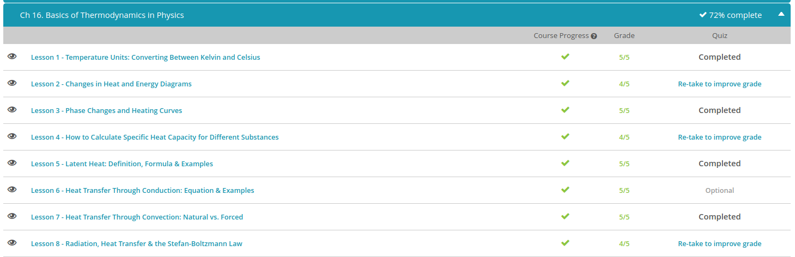

### Andrew Garber
### Nov 21
### Basics of Thermodynamics

#### Temperature Units 
 - Temperature is defined as the measurement of the average kinetic energy of the particles in a substance. The hotter something is, the faster its particles are moving. A normal bulb thermometer usually contains a red liquid in a reservoir at the bottom. When this bulb is touching something warm, the fast particles in the warm substance hit the particles in the glass (or whatever your thermometer is made out of), and that causes them to speed up - and then they hit the particles in the red liquid, causing them to speed up. When the particles in the red liquid speed up, they space themselves apart more, causing the liquid to expand. This liquid needs a place to go, and in a thermometer, there is no place to go but up!
 - You may measure your temperature using the Fahrenheit scale, but the rest of the world uses the Celsius scale. If you know a temperature in Fahrenheit, you can convert it to Celsius using this equation: $°C = (5/9)(F - 32)$ This equation is rarely used in chemistry because chemists use the Celsius scale for measuring temperature.
 - The Celsius scale was created using the freezing and boiling temperatures of water at sea level as a standard. 0 °Celsius (or 32 °Fahrenheit) is the freezing point of water, and 100 °Celsius (or 212 °Fahrenheit) is the boiling point of water at sea level. There are 100 divisions (or degrees) in between these two points, and each division represents a degree Celsius. Now, because you may not use the Celsius scale on a daily basis, you can use the following poem to remember the relative temperatures and their corresponding degrees: 30 is hot, 20 is nice, 10 is cold, and zero is ice.
 -Normally in science, the Celsius scale is used. But on Ideal Island, a different scale is used: the Kelvin scale. The Kelvin scale is an absolute scale, meaning that 0 is the lowest temperature possible. If the temperature is a measure of the average kinetic energy of the particles in a substance, then the temperature where there is no molecular movement would be 0 Kelvin (K), or absolute zero. Currently, this temperature only exists in theory; it has never been reached, but scientists have come extremely close.

#### Changes in heat
 - Water, as well as other matter, can exist in three states, or phases, and we call them solid, liquid, and gas. As ice is heated, its temperature increases, and it melts into liquid water. Likewise, as liquid water is heated, it evaporates into water vapor. These changes from one phase to another are referred to as phase changes.
 - Did you know that the temperature of water doesn't increase when it boils? The water's temperature increases up to boiling and then remains constant as it boils. We will use diagrams that illustrate the relationship between temperature and heat to explain how this works. Before we do that, however, we need to describe the relationship between temperature and heat.
 - Temperature can be defined as the average kinetic energy of a substance, where energy is the ability to do work. Kinetic energy is energy of motion and thus reflects how fast an object is moving. The faster the object moves, the more kinetic energy it contains. The faster the molecules move that make up a substance, the greater the temperature of that substance.
 - Now, let's talk about heat. As substances are heated on a stove, in a microwave, or by the sun, energy is added to the substance. Heat can be defined as the total amount of energy contained within the substance. Where temperature reflects the average amount of kinetic energy, heat reflects the total energy. For example, two liters of boiling water have the same temperature as one liter of boiling water. However, two liters contain more heat - that is, more total energy.
 - Now, let's diagram temperature changes in water as heat is applied to the water. This will help us to understand the relationship between heat and temperature. Looking at the diagram below, you will see temperature along the y-axis and heat energy along the x-axis. You can see that the temperature increases as heat is added to water within a phase. In other words, the water molecules within ice move faster.
 - However, temperature doesn't change as heat is added during a phase change; for example, when the ice melts. During the phase change, the added heat doesn't make the molecules move faster, but rather further apart. The heat energy added during the phase change is used to overcome some of the forces that hold the molecules together, allowing them to move further away from each other. During the phase change, the added heat energy is stored as potential energy, or energy of position, as the molecules are now further apart. This is kind of like setting a mouse trap. Potential energy is stored in the mouse trap when it is set; in other words, when the position is changed.
 - As heat is applied to liquid water, the molecules move faster and the temperature again increases. During the phase change from liquid to gas, the added heat is stored in the molecules as, once again, potential energy, and the temperature remains constant. The added heat is used to overcome the remaining forces that hold the molecules together within the liquid. This allows the molecules to move even further apart and form a gas. Once again, the heat energy during the phase change is stored as potential energy.
 - 
 - Let's apply what we just learned about the relationship between temperature and heat to nature. Road crews will add salt to the road to melt the ice. As we just learned, adding heat to a substance causes it to melt, so how does salt cause solid ice to melt into liquid water? The answer is salt lowers the melting point of the water. The melting point of pure water is 0 degrees Celsius. Salt water has a lower melting point, and the more salt that is added, the more the melting point will lower. Therefore, the temperature must be colder to freeze salt water. A common misconception is that salt actually warms up the ice and causes it to melt. Salt does not change the temperature of the ice; rather, the salt lowers the melting point of the water, causing the solid ice to melt.

#### Phase Changes and Heating Curves
 - In chemistry, phase refers to one of the four states that a substance can exist in; liquid, solid, gas, or plasma. A phase has uniform composition and properties. A phase change is when a substance changes from one phase to another. Every change has a different name. As you can see from the table, every state change has a process name.
 - State Change	Process	Example
         - solid --> liquid	melting	ice --> water
         - solid --> gas	sublimating	dry ice --> CO2 gas
         - liquid --> solid	freezing	water --> ice
         - liquid --> gas	vaporization	water --> water vapor
         - gas --> liquid	condensation	water vapor --> water
         - gas --> solid	deposition	water vapor --> ice
 - Freezing is when a liquid changes phase and becomes a solid, like when the water you put in the ice cube tray turns solid in the freezer. Freezing involves the loss of energy in the form of heat. At freezing, not only is there a loss of energy, but there is also an increase in the order of the particles in the substance.
 - Melting is the opposite, when a solid changes phase and becomes a liquid. Melting is when the ice in your drink turns to liquid Solid + energy --> liquid As a substance melts, it becomes less ordered.
 - At certain temperature and pressure conditions, some substances can't exist as liquids. In these conditions, a substance in solid phase will move directly to a gas without going through the liquid phase. When a substance changes phase directly from a solid to a gas, it is called sublimation. An example of sublimation is when dry ice turns directly into gas.
 - When the opposite happens, the change of state from a gas to a solid without going through the liquid phase, it is called deposition. An example of deposition is frost on a window.
 - The process of a substance in liquid phase going to a gas phase is called vaporization. During vaporization, molecules escape the surface tension at the surface of a liquid and enter a gas phase. Boiling is the changing of a liquid to a vapor or gas at boiling temperature. There is also evaporation, which is when particles escape the surface of a non-boiling liquid.

#### How to calculate specific heat capacity
 - Specific heat capacity, or simply specific heat, is the amount of heat required to change the temperature of a substance. As water requires more time to boil than does alcohol, you might conclude that water requires more heat than alcohol to raise its temperature. In other words, water has a higher specific heat capacity. That conclusion would be accurate. To better understand specific heat capacity, we need to distinguish between heat and temperature, as both of these terms are used in its definition.
 - You see, temperature is defined as the average amount of kinetic energy in the substance, where kinetic energy is the energy of motion. The molecules in each pot have the same average energy of motion or average amount of kinetic energy. In other words, the water molecules in each pot are moving at the same speed. Temperature is measured in degrees Celsius, degrees Fahrenheit, or even Kelvin.
 - However, two liters of boiling water contain more heat than one liter of boiling water, even though they have the same temperature. In the context of specific heat capacity, heat is the total amount of energy in a substance, and heat is sometimes referred to as heat energy, in which energy is the ability to do work. In the scientific community, energy is measured in joules but also can be expressed as calories.
 - The specific heat for water actually is quite high. The specific heat for alcohol is about half that of water - we calculated that in the example above. The specific heat of air is less than that of alcohol. Rocks and metals are even lower yet. Well, how does all this information help us?
 - Simply put, life on this planet would not be possible if not for water's high specific heat. Materials with high specific heat, such as water, can absorb and release a lot of heat without much of a temperature change. Let's consider the ocean. The ocean absorbs heat during the day and releases heat at night, and that helps us to maintain a relatively constant atmospheric temperature. That's why coastal regions have moderate climates compared with more inland regions. At a more personal level, our bodies contain a lot of water - in fact, they're mostly water. Our body water helps to maintain a relatively constant internal temperature, and we need that in order to maintain life.

#### Latent Heat
 - Latent heat is the heat energy per mass unit required for a phase change to occur. If we think about substances at a molecular level, gaseous molecules have more vibration than liquid molecules. So when you add heat to a liquid, you are actually causing the molecules to vibrate. The latent heat is the energy required to change the molecular movement. Each substance has a unique latent heat value.
 - The formula for latent heat is: Q = m * L
 - This equation relates the heat Q that must be added or removed for an object of mass m to change phases. The object's individual latent heat is noted by L. The unit of latent heat is J/kg.
 - The values of latent heat are variable depending on the nature of the phase change taking place:
         - The latent heat of fusion is the change from liquid to solid.
         - The latent heat of vaporization is from liquid to gas.
         - The latent heat of sublimation is the change from solid to gas.
 - In the previous example of boiling water, we know that we must continue to add heat energy to the water before all of the liquid water turns to steam. The latent heat of vaporization for water is 22.6 x 10^5 J/kg. This means that 22.6 x 10^5 J of heat energy must be added to turn one kilogram of water from liquid to gas at 100 degrees Celsius.
 - While latent heat is not readily visible, it is the cause of many common phenomena. Latent heat is why sweating works to cool your skin. When the ambient temperature is high, your body produces precipitation on the skin. This sweat removes some of the heat from your body as it evaporates. The heat it removes is the latent heat required to change the sweat from a liquid to gas.
 - Latent heat is also important to the creation of cumulus clouds preceding thunderstorms. As gaseous water rises in the atmosphere, it cools and condenses into a liquid. This change from gas to liquid water releases heat from the gas. Because hot air rises, this released heat warms the cloud causing it to rise further and thus causing more water to condense. This release of latent heat during water condensation of clouds causes the clouds to continue to grow, forming unstable thunderheads.

#### Conduction
 - Conduction is the passing of heat energy between two objects that are in direct, physical contact. It is one of the three types of heat transfer, the other two being convection and radiation. Whenever two objects of different temperatures are in contact with each other, heat energy will pass between them.
 - In physics, everything must have an equation! It's kind of an unwritten rule. Conduction is no exception. How fast conduction happens depends on several factors: what material the objects are made from (the conductivity), the surface area of the two objects in contact, the difference in temperature between the two objects, and the thicknesses of the two objects.
 - In equation form, it looks like this.
 - 
 - Q over t is the rate of heat transfer - the amount of heat transferred per second, measured in Joules per second, or Watts. k is the thermal conductivity of the material - for example, copper has a thermal conductivity of 390, but wool has a thermal conductivity of just 0.04. T1 is the temperature of one object, and T2 is the temperature of the other. Since it's a temperature difference, you can actually use Celsius or Kelvin, whichever is most convenient. And d is the thickness of the material we're interested in.
 - So the rate of heat transfer to an object is equal to the thermal conductivity of the material the object is made from, multiplied by the surface area in contact, multiplied by the difference in temperature between the two objects, divided by the thickness of the material.

Day 2: 

#### Natural vs Forced Heat Transfer Through Convection
 - The processes we've talked about so far are called natural convection. Natural convection is where processes just happen on their own whenever there's a temperature difference between two places. But there's another kind of convection called forced convection. Forced convection occurs when you try to speed up the process of convection, by pushing the fluid along a bit. For example, you might push the air around with a fan. This is how fan ovens work.
 - In the summertime, the air above land tends to be hotter than the air above the sea. The sea air is just harder to heat up. As the land air heats up, it rises like we've talked about, but this time it isn't the cooler air above that fills the gap. Instead, the cooler air out at sea gets sucked into the space the hot air left behind - sucked towards land.
 - One common calculation you might have to do involves figuring out the heat transferred by convection per second, otherwise known as the power, measured in watts. In algebra, the heat transferred per second is Q/t. So if we know how much time has passed, and we know how much energy was transferred in that time, we can divide one by the other to get the answer.
 - But finding the heat transferred, Q, might involve another step. When we add heat to a material, one of two things can happen: it can change the temperature, or it can change the state (otherwise known as phase) by melting or boiling. 
 - If the heat is being used to change the temperature, we can use the Q = mc(delta)T equation. Plug in the mass being heated, m, measured in kilograms, the heat capacity of the material being heated, c, which is just a number that you should be given in the question, and the change in temperature, (delta)T. Multiply them together, and you get your heat transferred, Q. But let's say the heat isn't being used to change the temperature of the material, but instead is being used to change the state, like melting or boiling. In that case, you can use the Q = mL equation to figure out the heat transferred. Here, all you need to know is the mass of the substance being heated and the latent heat. The latent heat is just a number that varies depending on the material, and what state change is happening. You should be given it in an exam question.
 - A house contains 500 kg of air at any one time. The heating system has been turned on, and needs to increase the temperature of the house by 5 degrees Celsius. If it takes 600 seconds to do this, how much energy is used per second in the process? (Note: The average specific heat capacity of air is 1000 J/kg C.)
 - But we need to figure out Q, the amount of energy transferred. This question involves a temperature change, so we should use Q = mc (delta)T. We have the mass, the specific heat capacity, and the change in temperature. Plug those numbers in: 500 times 1000 times 5, and we get 2,500,000 Joules. That's our value of Q. Now to figure out the energy per second we find Q/t, which is 2,500,000 divided by 600 seconds. That gives us 4167 Joules per second, or 4167 Watts.

#### Radiation, Heat Transfer & Stef-Boltzmann Law
 - So radiation is a type of heat transfer that travels through electromagnetic waves. Because of this, radiation doesn't need a medium (or material), and it can therefore go through a vacuum. This is how the heat of the Sun gets to us on Earth.
 - A vacuum flask, or thermos flask, uses our understanding of radiation (and heat transfer in general) to keep your soup warm. We all know that light bounces off mirrors, but all electromagnetic waves tend to bounce off reflective surfaces. So the mirrored surface of a vacuum flask does a great job of stopping heat loss by radiation. A vacuum flask also stops conduction by having a vacuum layer - conduction needs a material to travel through and convection by having an insulating lid.
 - The Stefan-Boltzmann Law gives us a way to put numbers to this concept of radiation. It helps us calculate the heat transferred by radiation per second, measured in joules per second, or watts. The Stefan-Boltzmann Law tells us that this is equal to the Stefan-Boltzmann constant sigma, which is always the same number, multiplied by the emissivity of the object (e), which is a number that represents how well an object radiates heat, multiplied by the surface area of the object (A) measured in meters squared, multiplied by the temperature of the object (T) to the power 4, where T is measured in Kelvin.
 - 
 - A few things to note about this equation. The Stefan-Boltzmann constant is always 5.67 * 10^-8. The emissivity of an object is a number between zero and one. A perfect radiator of energy has an emissivity of one, and a perfect reflector has an emissivity of zero. Stars like the Sun have an emissivity extremely close to one.
 - Okay, let's try an example. A light bulb emits heat by radiation and has an emissivity of 0.5. If the temperature of the filament of the light bulb is 2500 K, and the surface area of the filament is 0.0001 meters squared, how much heat is transferred by radiation from the filament of the light bulb per second? (Remember that the Stefan-Boltzmann constant is, as always, 5.67 * 10^-8.)
 - To solve this, all we have to do is plug numbers into the Stefan-Boltzmann Law. The heat transferred per second is equal to the Stefan-Boltzmann constant, 5.67 * 10^-8, multiplied by the emissivity of the bulb (0.5), multiplied by the surface area (0.0001), multiplied by the temperature (2500), to the power 4. Type all of that into a calculator, and you get 110.7 joules per second, or in other words, 110.7 watts.
 
