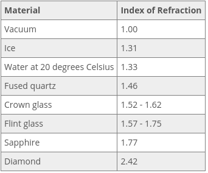

### Andrew Garber
### October 27
### Waves in Physics

#### Types of Waves
 - A wave is a transfer of energy, usually through a form of matter called a medium.
 - There are also waves that don't travel through any medium at all, called electromagnetic waves, which are waves like radio waves and microwaves.
 - Waves that need a medium, like water, air or the ground, to travel through are called mechanical waves. Sound waves travel, or propagate, through the medium of air.
 - seismic waves from earthquakes propagate through the ground.
 - Waves that move up and down like a parachute are transverse waves, which have a sort of sideways S shape. Each wave has a curved high point called a crest and a low point called a trough. The distance from the highest point of one crest to the highest point of the next crest is a single wavelength.
 - In addition to measuring the distance between crests, we also measure the amplitude of a wave. The amplitude is the height of a wave, which is measured in meters (or centimeters, millimeters, etc).
 - Waves are also measured by their frequency, or the number of waves per second, also known as hertz.
 - Sound, earthquakes and tsunamis travel in compression waves and look different from transverse waves. Instead of going up and down like a parachute, compression waves more closely resemble a Slinky being pulled apart. 
 - When the molecules of energy are close together, it is called compression, and when the molecules of energy are far apart, it is called rarefaction.
 - When a compression wave is twisted, it is called a torsional wave.
 - Unlike mechanical waves, electromagnetic waves do not need a medium to pass through. And, since they don't need air, they can even exist in space. As the name suggests, they are created when electric and magnetic forces act together. Like ocean waves, electromagnetic waves or EM waves move in a transverse, S-shaped pattern.
 - Radio waves and microwaves are examples of EM waves we use every day. When you change the radio station, you change the frequency you are listening to. That means that each station has a different frequency, or number of waves per second. Microwaves are actually a type of short radio waves. 

#### Vibrations
 - Vibrations are oscillating motions around a fixed position.
 - When an object vibrates, it exhibits a motion that repeats itself over the same path in a periodic fashion. That is, the time it takes to complete one cycle of the vibration is always the same.
 - All waves are caused by some type of vibration. Vibrations cause a disturbance in the medium that becomes the source of the wave.
 - If we look more closely at a typical wave, we can see the periodic nature in the shape of the wave itself. Let's plot the wave as a function of time. We'll put seconds along the horizontal axis, and the vertical axis will measure the wave's vertical displacement. 
 
 - A full wavelength is defined as that portion of the wave between two successive crests, or between two troughs. By looking at how the crests and troughs line up with our horizontal axis, we can see that a full wavelength always takes the same amount of time. That's why we say that waves have a periodic nature.
 - The distance between the midline of a wave and its crest or trough is called the amplitude. If this was a wave traveling through water, the amplitude would measure the maximum displacement of the particles from their resting point.
 - amplitude tells us something very important. It's a measure of how much energy the wave is carrying. As the particles in the medium move up and down with the wave, they transfer energy in the direction that the wave is moving. 

#### Traverse Waves
- There are various features we can label on a transverse wave
 - A crest (or peak) of a wave is one of the top-most parts, as high as the wave goes. A trough is the lowest part, as low as the wave goes. The amplitude of a wave is the vertical distance between the center line and a peak, or the center line and a trough. This should normally be exactly the same distance.
 - Last of all is a wavelength. A wavelength is the distance from two similar parts of a wave -- from a peak to the next peak, or from a trough to the next trough. It is the length of one full wave, one full oscillation. Wherever you measure it, the number should come out the same.

#### Day 1 Waves

#### Longitudinal Wave
 - A longitudinal wave is a wave in which the disturbance moves in the same direction as the propagation of the wave. Going back to the Slinky example, the medium is the slinky, and the disturbance is the back-and-forth movement of the slinky. Notice how this description differs from the description of the water wave: up-and-down vs. back-and-forth movement.
 - Another example of a longitudinal wave that you experience every day, but can't see, is a sound wave. Let's use the example of someone talking to you. When your friend says hello, her vocal cords vibrate. This provides the disturbance needed to create a longitudinal wave. The medium is the air, and the vibrations cause a disturbance in the particles that make up air. The longitudinal wave travels through the air to your ear.

#### Reflection
 - Wave reflection always works the same way, whether the wave is a light wave, a sound wave, or a water wave. It describes a change in the direction of a wave when it strikes a surface. In talking about reflection and some other wave properties, it's helpful to think of a wave as a ray, a straight line through space that indicates the path of a wave. For example, we know that a light wave from the sun travels in a straight line toward the Earth. Because it's an electromagnetic wave, we could think of it as having the typical wavelike up-and-down shape. But we can also think of it like a straight-line ray. A ray of sunlight is an appropriate concept for how we should think of waves in reflection. So from now on, in this lesson, we'll refer to all our waves as 'rays.'
 - Think about a single ray of sunlight. The ray that initially comes down from the sun is called the incident ray. This is really the term we use for any ray that approaches a reflective surface. The Earth isn't the best example for reflection, so let's say that we've got a mirror here instead. The incident ray comes in and strikes the mirror at a certain angle. Then, it bounces off the mirror and proceeds in another direction. The ray that travels away from the reflective surface is called the reflected ray. Incident and reflected rays are related to one another in that the angle of the reflected ray matches that of the incident ray.
 - The law of reflection tells us in very clear terms the relationship between the angles of our incident and reflected rays. To define these angles, we first identify the normal : the imaginary line that is perpendicular to the reflective surface. When the incident ray strikes the surface, it creates an angle with the normal, which we call the angle of incidence. The angle of incidence measures the position of the incident ray in relation to the normal. Notice that the angle of incidence is not the angle between the incident ray and the surface. It's the angle between the incident ray and the normal.

#### Incidence
 - We have even come up with unique names for the angles at which the light enters and travels through the material. The angle at which the light enters is called the angle of incidence. The angle of incidence can be defined as the angle between the oncoming ray of light and the normal vector of the surface of the material it is coming into contact with. The normal vector is a perpendicular vector from a plain or surface of an object.
 - There are three possibilities for what can happen to the light after it comes into contact with an object. The first is absorption. In absorption, the light ray travels no further; it is taken into the object and transformed into energy. This most often takes the form of heat. The second is reflection, where the light ray is bounced off the material instead of absorbed. The final possibility is refraction, in which the light penetrates the object, but instead of being turned into internal energy, it changes direction and continues to travel through the material as light.
 - It's important to note that light does not often do just one of those three possibilities; rather, it travels in a combination of them. For example, we see color because objects reflect the visible light spectrum of the corresponding colors we see back to our eyes, but they absorb the other wavelengths of the visible light spectrum. Another example would be translucent objects. A translucent material, as opposed to a transparent one, only lets some of the light travel through it and absorbs and reflects the rest of it.
 - 
 - Reflection Diagram
 - While the speed of light in a vacuum is constant, the speed of light in other mediums can vary, and consequently they have different indices of refraction. Some common examples can be seen in this table.
 - 

#### Day 2
 - 