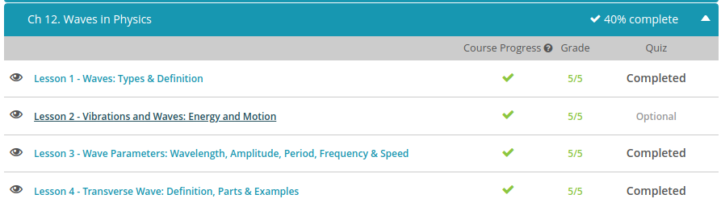

### Andrew Garber
### October 27
### Waves in Physics

#### Types of Waves
 - A wave is a transfer of energy, usually through a form of matter called a medium.
 - There are also waves that don't travel through any medium at all, called electromagnetic waves, which are waves like radio waves and microwaves.
 - Waves that need a medium, like water, air or the ground, to travel through are called mechanical waves. Sound waves travel, or propagate, through the medium of air.
 - seismic waves from earthquakes propagate through the ground.
 - Waves that move up and down like a parachute are transverse waves, which have a sort of sideways S shape. Each wave has a curved high point called a crest and a low point called a trough. The distance from the highest point of one crest to the highest point of the next crest is a single wavelength.
 - In addition to measuring the distance between crests, we also measure the amplitude of a wave. The amplitude is the height of a wave, which is measured in meters (or centimeters, millimeters, etc).
 - Waves are also measured by their frequency, or the number of waves per second, also known as hertz.
 - Sound, earthquakes and tsunamis travel in compression waves and look different from transverse waves. Instead of going up and down like a parachute, compression waves more closely resemble a Slinky being pulled apart. 
 - When the molecules of energy are close together, it is called compression, and when the molecules of energy are far apart, it is called rarefaction.
 - When a compression wave is twisted, it is called a torsional wave.
 - Unlike mechanical waves, electromagnetic waves do not need a medium to pass through. And, since they don't need air, they can even exist in space. As the name suggests, they are created when electric and magnetic forces act together. Like ocean waves, electromagnetic waves or EM waves move in a transverse, S-shaped pattern.
 - Radio waves and microwaves are examples of EM waves we use every day. When you change the radio station, you change the frequency you are listening to. That means that each station has a different frequency, or number of waves per second. Microwaves are actually a type of short radio waves. 

#### Vibrations
 - Vibrations are oscillating motions around a fixed position.
 - When an object vibrates, it exhibits a motion that repeats itself over the same path in a periodic fashion. That is, the time it takes to complete one cycle of the vibration is always the same.
 - All waves are caused by some type of vibration. Vibrations cause a disturbance in the medium that becomes the source of the wave.
 - If we look more closely at a typical wave, we can see the periodic nature in the shape of the wave itself. Let's plot the wave as a function of time. We'll put seconds along the horizontal axis, and the vertical axis will measure the wave's vertical displacement. 
 
 - A full wavelength is defined as that portion of the wave between two successive crests, or between two troughs. By looking at how the crests and troughs line up with our horizontal axis, we can see that a full wavelength always takes the same amount of time. That's why we say that waves have a periodic nature.
 - The distance between the midline of a wave and its crest or trough is called the amplitude. If this was a wave traveling through water, the amplitude would measure the maximum displacement of the particles from their resting point.
 - amplitude tells us something very important. It's a measure of how much energy the wave is carrying. As the particles in the medium move up and down with the wave, they transfer energy in the direction that the wave is moving. 

#### Traverse Waves
- There are various features we can label on a transverse wave
 - A crest (or peak) of a wave is one of the top-most parts, as high as the wave goes. A trough is the lowest part, as low as the wave goes. The amplitude of a wave is the vertical distance between the center line and a peak, or the center line and a trough. This should normally be exactly the same distance.
 - Last of all is a wavelength. A wavelength is the distance from two similar parts of a wave -- from a peak to the next peak, or from a trough to the next trough. It is the length of one full wave, one full oscillation. Wherever you measure it, the number should come out the same.

#### Day 1 Waves
