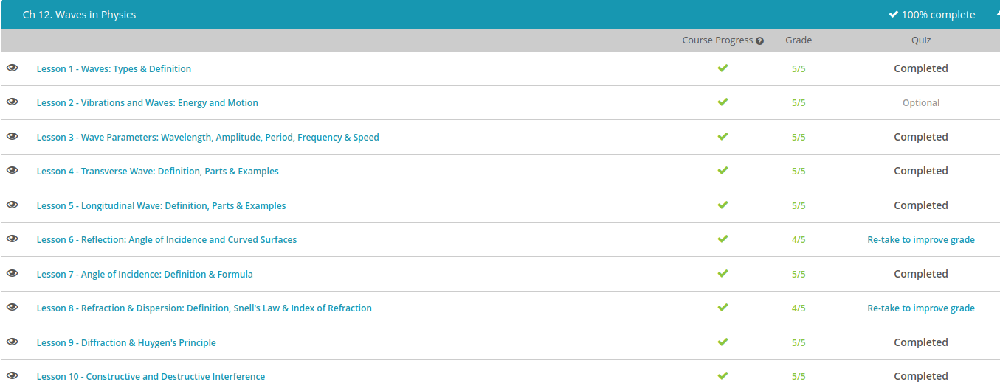

### Andrew Garber
### October 27
### Waves in Physics

#### Types of Waves
 - A wave is a transfer of energy, usually through a form of matter called a medium.
 - There are also waves that don't travel through any medium at all, called electromagnetic waves, which are waves like radio waves and microwaves.
 - Waves that need a medium, like water, air or the ground, to travel through are called mechanical waves. Sound waves travel, or propagate, through the medium of air.
 - seismic waves from earthquakes propagate through the ground.
 - Waves that move up and down like a parachute are transverse waves, which have a sort of sideways S shape. Each wave has a curved high point called a crest and a low point called a trough. The distance from the highest point of one crest to the highest point of the next crest is a single wavelength.
 - In addition to measuring the distance between crests, we also measure the amplitude of a wave. The amplitude is the height of a wave, which is measured in meters (or centimeters, millimeters, etc).
 - Waves are also measured by their frequency, or the number of waves per second, also known as hertz.
 - Sound, earthquakes and tsunamis travel in compression waves and look different from transverse waves. Instead of going up and down like a parachute, compression waves more closely resemble a Slinky being pulled apart. 
 - When the molecules of energy are close together, it is called compression, and when the molecules of energy are far apart, it is called rarefaction.
 - When a compression wave is twisted, it is called a torsional wave.
 - Unlike mechanical waves, electromagnetic waves do not need a medium to pass through. And, since they don't need air, they can even exist in space. As the name suggests, they are created when electric and magnetic forces act together. Like ocean waves, electromagnetic waves or EM waves move in a transverse, S-shaped pattern.
 - Radio waves and microwaves are examples of EM waves we use every day. When you change the radio station, you change the frequency you are listening to. That means that each station has a different frequency, or number of waves per second. Microwaves are actually a type of short radio waves. 

#### Vibrations
 - Vibrations are oscillating motions around a fixed position.
 - When an object vibrates, it exhibits a motion that repeats itself over the same path in a periodic fashion. That is, the time it takes to complete one cycle of the vibration is always the same.
 - All waves are caused by some type of vibration. Vibrations cause a disturbance in the medium that becomes the source of the wave.
 - If we look more closely at a typical wave, we can see the periodic nature in the shape of the wave itself. Let's plot the wave as a function of time. We'll put seconds along the horizontal axis, and the vertical axis will measure the wave's vertical displacement. 
 
 - A full wavelength is defined as that portion of the wave between two successive crests, or between two troughs. By looking at how the crests and troughs line up with our horizontal axis, we can see that a full wavelength always takes the same amount of time. That's why we say that waves have a periodic nature.
 - The distance between the midline of a wave and its crest or trough is called the amplitude. If this was a wave traveling through water, the amplitude would measure the maximum displacement of the particles from their resting point.
 - amplitude tells us something very important. It's a measure of how much energy the wave is carrying. As the particles in the medium move up and down with the wave, they transfer energy in the direction that the wave is moving. 

#### Traverse Waves
- There are various features we can label on a transverse wave
 - A crest (or peak) of a wave is one of the top-most parts, as high as the wave goes. A trough is the lowest part, as low as the wave goes. The amplitude of a wave is the vertical distance between the center line and a peak, or the center line and a trough. This should normally be exactly the same distance.
 - Last of all is a wavelength. A wavelength is the distance from two similar parts of a wave -- from a peak to the next peak, or from a trough to the next trough. It is the length of one full wave, one full oscillation. Wherever you measure it, the number should come out the same.
 - They move as a right angle to the direction the energy is going.
#### Day 1 Waves

#### Longitudinal Wave
 - A longitudinal wave is a wave in which the disturbance moves in the same direction as the propagation of the wave. Going back to the Slinky example, the medium is the slinky, and the disturbance is the back-and-forth movement of the slinky. Notice how this description differs from the description of the water wave: up-and-down vs. back-and-forth movement.
 - Another example of a longitudinal wave that you experience every day, but can't see, is a sound wave. Let's use the example of someone talking to you. When your friend says hello, her vocal cords vibrate. This provides the disturbance needed to create a longitudinal wave. The medium is the air, and the vibrations cause a disturbance in the particles that make up air. The longitudinal wave travels through the air to your ear.

#### Reflection
 - Wave reflection always works the same way, whether the wave is a light wave, a sound wave, or a water wave. It describes a change in the direction of a wave when it strikes a surface. In talking about reflection and some other wave properties, it's helpful to think of a wave as a ray, a straight line through space that indicates the path of a wave. For example, we know that a light wave from the sun travels in a straight line toward the Earth. Because it's an electromagnetic wave, we could think of it as having the typical wavelike up-and-down shape. But we can also think of it like a straight-line ray. A ray of sunlight is an appropriate concept for how we should think of waves in reflection. So from now on, in this lesson, we'll refer to all our waves as 'rays.'
 - Think about a single ray of sunlight. The ray that initially comes down from the sun is called the incident ray. This is really the term we use for any ray that approaches a reflective surface. The Earth isn't the best example for reflection, so let's say that we've got a mirror here instead. The incident ray comes in and strikes the mirror at a certain angle. Then, it bounces off the mirror and proceeds in another direction. The ray that travels away from the reflective surface is called the reflected ray. Incident and reflected rays are related to one another in that the angle of the reflected ray matches that of the incident ray.
 - The law of reflection tells us in very clear terms the relationship between the angles of our incident and reflected rays. To define these angles, we first identify the normal : the imaginary line that is perpendicular to the reflective surface. When the incident ray strikes the surface, it creates an angle with the normal, which we call the angle of incidence. The angle of incidence measures the position of the incident ray in relation to the normal. Notice that the angle of incidence is not the angle between the incident ray and the surface. It's the angle between the incident ray and the normal.

#### Incidence
 - We have even come up with unique names for the angles at which the light enters and travels through the material. The angle at which the light enters is called the angle of incidence. The angle of incidence can be defined as the angle between the oncoming ray of light and the normal vector of the surface of the material it is coming into contact with. The normal vector is a perpendicular vector from a plain or surface of an object.
 - There are three possibilities for what can happen to the light after it comes into contact with an object. The first is absorption. In absorption, the light ray travels no further; it is taken into the object and transformed into energy. This most often takes the form of heat. The second is reflection, where the light ray is bounced off the material instead of absorbed. The final possibility is refraction, in which the light penetrates the object, but instead of being turned into internal energy, it changes direction and continues to travel through the material as light.
 - It's important to note that light does not often do just one of those three possibilities; rather, it travels in a combination of them. For example, we see color because objects reflect the visible light spectrum of the corresponding colors we see back to our eyes, but they absorb the other wavelengths of the visible light spectrum. Another example would be translucent objects. A translucent material, as opposed to a transparent one, only lets some of the light travel through it and absorbs and reflects the rest of it.
 - 
 - Reflection Diagram
 - While the speed of light in a vacuum is constant, the speed of light in other mediums can vary, and consequently they have different indices of refraction. Some common examples can be seen in this table.
 - 

#### Day 2
 - 

#### Refraction & Dispersion
 - Refraction is the change in the direction of a wave when it passes from one medium to another. A light wave traveling through air travels at a certain speed. A light wave traveling through glass travels at a different speed. When a light wave travels from the medium of air to the medium of water, its speed changes and it actually bends. This bending is called refraction.
 - Reflection is a change in the direction of a wave when it strikes a surface. Refraction is a change in the direction of a wave when it passes from one medium to another. Reflection involves bouncing off a surface, while refraction involves passing into a second medium.
 - In both cases, the process begins with an incident ray that strikes the surface - or enters the new medium - at a certain angle. This angle is called the angle of incidence, the angle between the incident ray and the normal line.
 - 
 - For instance, the properties of glass are different from the properties of outer space. Therefore, light waves travel differently in outer space than they do in glass. Any time a light wave travels through a material, it travels a little bit slower than it would in outer space. The difference between the speed of light in a vacuum and the speed of light in a certain medium is called the index of refraction. It's a number that represents how a medium refracts a light wave.
 - Let's make a ratio of the two refractive indices - the two n values for the air and water. We'll call the index for air nA, and the index of refraction for water nW. The ratio will look like this: nW / nA. The slower medium is on top, while the faster medium is on the bottom. It turns out that these indices are also related to the sine of the angles for each ray of light. Just as nW is larger than nA, the sine of the angle of incidence is larger than the sine of the angle of refraction. This expression reads, 'nW over nA equals sine theta I over sine theta R.'
 - 
 - So, now we can see the relationship between all the angles and the indices of refraction. We call this expression Snell's Law. It shows how the ratio of the n-values is the inverse of the ratio of the angles. To be more precise, the ratio of the angles of incidence and refraction is equal to the inverse ratio of the indices of refraction.
 - Some types of media are called dispersive media, meaning that they refract every frequency of light in a different way. A prism is one kind of dispersive media, because it takes white light and separates it into all the colors of a rainbow. What's really happening is that each different frequency of colored light in the spectrum is being refracted at a different angle by the prism itself. Instead of having just one angle of refraction for the whole light beam, there are many separate angles for all the separate frequencies. The result of this phenomenon is dispersion: the separation of waves of various frequencies due to their differences in refractive angles. Dispersion is the reason we can see the color spectrum when passing white light through a prism, a crystal, or even a front door peephole. It also plays a role in creating the beautiful rainbows that we see outside.

#### Diffraction
 - Diffraction is what happens when a wave hits an obstacle or goes through a slit - it is the spreading out of the wave around an obstacle, or the spreading out of a wave as it goes through a slit. We can represent waves with a series of lines called wavefronts; these are the peaks of the waves. After diffraction, straight, parallel wavefronts will become curved. But, what does that mean for real life? How exactly does that affect us?
 - Sound waves have a relatively large wavelength - they're really big waves. In addition, because of that, even large objects and slits cause them to diffract. So, the objects in a forest - trees, shrubs, unsuspecting kids, cause the sound waves to spread out around the gaps and reach you behind the tree. If it wasn't for diffraction, you would hardly hear anything at all.
 - Light has a much smaller wavelength, and because of this, a much smaller slit is needed for diffraction to happen. But, if you have a door with a ray of light coming through the tiny gap, and you make that gap small enough, you may see the ray spread out. And, if you're behind a couch, you'll find that it's not as pitch-black as you would expect.
 - When you shine a light through a tiny slit, a spreading out of the light isn't the only thing you see. If you shine the resulting light onto a screen, you might notice a weird pattern. This is called an interference pattern. Dark and light areas, one after another in a series of lines. Or, if it's a circular aperture, you'll see some concentric circles. It happens due to diffraction.
 - But, how can a wave interfere with itself? It might be easy to imagine two separate beams of light interfering with each other - when the peaks of the two waves hit the screen together (or the troughs for that matter), you'd get a light patch, and when a peak of one wave hits the screen with the trough of the other, you'd get a dark patch. That would explain the pattern.
 - But, why would a single beam of light create an interference pattern? The answer to that comes from a guy called Christian Huygens, a French physicist who proposed a wave theory of light many years before Maxwell took all the credit with his discoveries and equations. (Though his equations were important)
 - Huygen's Principle states that every point on a wavefront acts as a source of lots of secondary spherical wavelets. The wavefront, a few seconds later, will be an envelope of these earlier wavelets. Or in other words, an otherwise parallel wave can be thought of as being made up of lots of tiny spherical waves.

#### Constructive and Destructive Interference
 - Inevitably, some waves are going to cross over or meet with each other. When they do, the reaction between the waves is known as interference. This is the meeting of two or more waves traveling in the same medium. Waves meeting in the same medium actually disrupt each other's displacement. They interfere with each other so that the resulting wave is a completely new and different wave from either one of the original two.
 - When the crests or troughs of two interfering waves meet, their amplitudes add together. This principle is known as constructive interference. So, what happens when the crest of one wave meets the trough of another wave? Well, the opposite happens, and it's called destructive interference. When the crest and trough of two interfering waves meet, one amplitude subtracts from the other.
 - Constructive interference describes a situation where two waves are added together, while in destructive interference, the two waves cancel each other out. But really, the two types of interference are a result of the same thing. When two waves interfere with each other, their displacements at any point are added together to produce the displacement of the medium. 
 - The principle of superposition is the basic rule that tells us how to find the resulting wave from the interference of two different waves.

 