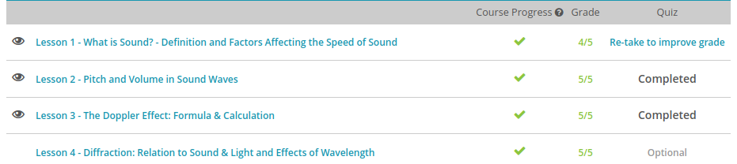
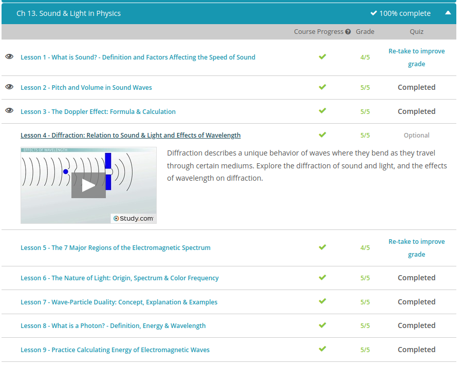

### Andrew Garber
### Nov 3
### Sound & Light

#### What is sound
 - For example, when you pluck a guitar, the air surrounding the guitar is called the medium, because it's the material that carries the sound. When talking about waves, a medium is the substance that transports a wave from one place to another. The medium for sound waves is often air. But sound can also travel through liquids and solids.
 - We know that a solid has its particles packed very tightly together. Liquid particles are more loosely packed, and particles in a gas are pretty far apart. The distance between the particles affects how strong the interactions are between them. This, in turn, affects how quickly they transfer the energy of the wave. The stronger the particle interactions are, the more quickly the wave is transferred. So in general, sound travels faster in solids than in liquids, and faster in liquids than in gas.
 - Temperature actually increases the speed of sound, because warmer particles generally move at a faster rate. Scientists have derived a special formula for finding the speed of sound in dry air. It works for most of the temperatures found on Earth. The formula is v = 331 + (0.61)T, where v is the speed of sound, and T is the temperature.
 - For this formula, speed must be measured in meters per second, and temperature in degrees Celsius. You can see by this formula that an increase in temperature, or T, would cause an increase in speed, or v. If the temperature was 20° C, then the speed of sound in dry air would be about 343 meters per second. If the temperature rose to 30° C, then the speed would increase to 349 meters per second.

#### Pitch and Volume
 - The energy in a sound wave has to travel over a certain area in a certain amount of time. We detect sounds as being louder when we're standing closer to the source and quieter when we're standing further away. The amount of energy we detect is known as the intensity. Intensity is measured in units of energy over the area and time. In other words, it's the amount of energy that is carried over a certain area in a certain amount of time. 
 - We describe different levels of intensity using the decibel scale, a logarithmic scale for measuring the intensity of sound waves. Normal conversation generally falls around 60 decibels. A whisper is more like 20 decibels, while a vacuum cleaner runs as loud as 80 decibels. You may be more familiar with decibels as a measure of volume. When talking about sound waves, the volume is the perception of loudness from the intensity of a sound wave. The higher the intensity of a sound, the louder it is perceived in our ears, and the higher volume it has. Since intensity is a function of energy, and energy is related to amplitude, then we can make the conclusion that the volume of a sound is proportional to the amplitude of the sound wave.
 - It was a little tough trying to visualize the amplitude of sound waves. Because sound is a longitudinal wave, we don't get the nice 'up and down' wave shape that makes it so easy to see the parameters. We figured out a way to see the amplitude of sound. 
 - In music, the pitch of a certain note is defined as the perception of frequency. Hearing musical pitch helps us to put different sounds in order from high to low frequency. High-pitched notes have a high frequency, while low-pitched notes have a low frequency. The difference in pitch between Middle C and Concert A is a difference of 178 Hz.
 - Humans can typically hear sounds as low as 20 Hz and as high as 20,000 Hz. This range is known as the acoustic range of sound. Sounds above 20,000 Hz are considered ultrasound. Dogs, dolphins, and bats can hear sounds in the ultrasonic range. At the other end of the spectrum is the range of infrasound. These are sounds that are too low for us to hear, like the communication calls between whales and elephants. Obviously, we humans only play our music within the acoustic range of sound, between 20 and 20,000 Hz. When you're able to discern a difference between musical pitches, just know that what you really perceive is a difference in the sound waves'

#### The Doppler Effect
 - When sound waves are emitted by a moving source or when the observer of the sound is moving, the apparent frequency of the sound can change. This shift in frequency due to the motion of the sound wave source or of the observer is called the Doppler effect.
 - When a source of sound waves, like the motorcycle, is moving towards you, the sound waves emitted become pushed closer and closer together. This means that when you hear the motorcycle coming towards you, you hear a higher-frequency noise than you would if the motorcycle was sitting still. After it passes you, the sound waves move farther apart, and you hear a lower-frequency sound.
 - 
 - Equation of the observed sound frequency
 #### Day 1
 

(I have previous knowledge as to the rest of the chapter due to learning it in Chemistry - Andrew Garber November 3)

#### Day 2 Quiz Results
