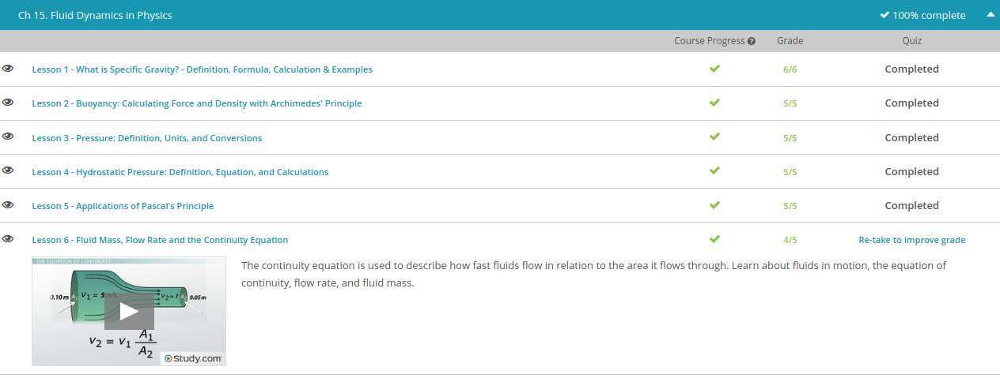

### Andrew Garber
### November 15 2022
### Fluid Dynamics in Physics

#### Specific Gravity
 - The specific gravity is the ratio between the density of an object, and a reference substance. The specific gravity can tell us, based on its value, if the object will sink or float in our reference substance. Usually our reference substance is water which always has a density of 1 gram per milliliter or 1 gram per cubic centimeter. So, what is density, anyway? An object's density is a measure of how compact or heavy it is, in a given volume. We measure density in mass per unit volume which is written using measures like grams per milliliter (g/mL), grams per cubic centimeter (g/cm^3), or kilograms per liter (kg/L).
 - The formula for specific gravity, given that the reference substance is water is the density of the object divided by the density of water. The specific gravity has no unit because the units of the numerator and the denominator are the same, so they just cancel each other out. Let's look at an example. Here, the density of the object is 19 g/mL and the density of water is 1 g/mL. We cancel the unit g/mL because this unit is present in both the numerator and the denominator. The density is directly related to the mass of the object (unit: usually in grams but can be measured in kilograms or pounds), so the specific gravity can also be determined by dividing the mass of the object by the mass of the water. The mass itself is directly related to the weight of an object, measured in units called Newtons. So, the specific gravity can also be solved by dividing the weights of the object and the water.

#### Buoyancy
 - Buoyancy is an easy concept to understand if you know a little about pressure in a fluid. In a fluid (either a gas or a liquid), pressure increases with depth. So when an object is submerged in water, meaning that it is completely in that fluid, the pressure on the bottom of the object is greater than on the top. This creates a net upward force on the object, so the object is buoyed upward against gravity.
 - Not only does the buoyant force create an upward lift on an object in a fluid, but it's also equal to the weight of the fluid displaced by that object. This was discovered by Archimedes back in the 3rd century B.C., so we call this Archimedes' Principle. Again, it's important to remember that we're talking about fluids, so both liquids and gases, like water and air.
 - Archimedes' principle describes the relationship between the buoyant force and the volume of the displaced fluid, but also the density of the displaced fluid. The equation of this principle is $FB = ρf Vf g$ where FB is the buoyant force, ρf is the density of the displaced fluid, Vf is the volume of the displaced fluid, and g is the acceleration due to gravity, 9.8 m/s^2. It's very important to remember that the density and volume in this equation refer to the displaced fluid, NOT the object submerged in it.

#### Pressure
- Let's go back to the unit that we use to represent pressure: psi. This is one of many different units that can be used to measure pressure, and it's probably the one that you use most on a daily basis in the United States. But, on Ideal Island, different units are used, so it's important to know what they are and how to convert among them. On the island, the most common units of pressure that are used are atmospheres (atm) and millimeters of mercury (mmHg). 1 atmosphere is often abbreviated as atm, and it's really just the weight of all of the air above you 'pressing down' on you while you stand at sea level. Now, if you were on a mountain, there would be less air 'pressing down' on you, so the pressure would be lower (less than 1 atmosphere). 
-The unit millimeters of mercury (mmHg) goes back to the device used to measure pressure, the barometer. In the barometer below, we have an inverted tube containing a column of mercury with the chemical symbol Hg, and it's sitting in a pool of mercury. As the atmosphere 'presses down' on the mercury pool, the liquid extends up into the inverted tube, and the height is measured in millimeters (or some other length measurement). So, if the weather is changing, resulting in an increase in the barometric pressure, the increase is measured by how far up the mercury extends in the column. At sea level, the mercury extends about 760 millimeters up the column.

#### Hydrostatic Pressure
- Gas particles are not very friendly. They spread out to fill the entire space of their container, enjoying their personal space and freedom. But as gas particles fly around, they sometimes collide with each other, as well as the walls of the container. These interactions create pressure in the container, and in a gas, this pressure is the same throughout the entire fluid. But you can clearly see that this is not the case for liquids because they do not fill their entire container like gases do. This is because of the bonds between the liquid's molecules, which are what hold them together. When you pour a liquid into a container, it fills the bottom because gravity pulls it down. This force due to gravity is the same as your scale reading - it's the liquid's weight and is what creates pressure in that liquid.
- When a liquid is at rest, meaning that it is not flowing, we can determine its pressure at a given depth known as hydrostatic pressure. The way we determine this is through an equation: P = rho * g * d, where P is the pressure, rho is the density of the liquid, g is gravity and d is the depth.
- You may also see the hydrostatic equation written as P = rho * g * h, where the h stands for height. This may be used because sometimes we want to calculate the pressure of a liquid as it fills a column (like when measuring barometric pressure), so we need to know the height of the fluid. It's like taking the depth and flipping it upside down. As long as you use the appropriate measurement, either letter is okay to use, but it might help to stick with the letter that best represents what you're measuring - either the depth or the height.

#### Pascal's Principle
 - Pascal's principle says that a change in pressure applied to an enclosed fluid is transmitted undiminished to all portions of the fluid and to the walls of its container. Thanks to Pascal's principle, we can lift huge trucks and cars with only human muscles, pump blood around the body, and stop a bike by just pressing a button. All through the power of fluids.
 - Mathematically, pressure is force, F, measured in Newtons, divided by area, A, measured in meters squared (F / A). So Pascal's principle says that the pressure, F divided by A, is the same when it's transmitted across a fluid. So F1 divided by A1 is equal to F2 divided by A2 (F1 / A1 = F2 / A2). What this means is that if you push with a small force across a small area that can lead to a large force being applied over a large area. This is amazingly useful; so next, let's talk about some of the ways we can use this principle in everyday life.
 - Hydraulics is defined as the branch of science and technology concerned with the conveyance of liquids through pipes and channels, especially as a source of mechanical force or control. And this is by far the most common application of Pascal's principle. There are many, many uses of the principle, but nearly all of them boil down to hydraulics.
 - Car brakes are the most commonly used hydraulic system. A liquid in a tube takes the pressure you apply on the brake pedal and transfers it all the way to wheels to apply a force there. What's more, by pushing that fluid against a larger area, A, your little push of the pedal can lead to a much larger braking force.

#### Fluid Mass, Flow Rate and the Continuity Equation
 - There's no doubt, fluids like to move! Just imagine a roaring river or a summer breeze blowing, and you can understand what I mean. Fluid dynamics is a tricky subject because there are different kinds of ways that fluids can move, and we don't even fully understand exactly how they do some of the amazing things they do. Because of this, we're going to talk about fluids in a very specific sense, making a few assumptions for this lesson First, we are going to assume that the fluid is incompressible, meaning that its density can't be changed. Try to condense 8 ounces of water into a 4 ounce container, and you'll see what this means! Second, we're going to assume that the flow of the fluid is laminar, meaning that it is a steady, constant flow that doesn't change with time. Think of water running through a straight, narrow creek instead of pooling and twisting in small nooks and crannies along the bank. Finally, we're going to assume that the fluid is non-viscous, meaning that there is no resistance to flow. Viscosity is the resistance to flow, so we would say that honey is more viscous than water because water flows much more easily than honey. But for this lesson, our fluid experiences no resistance.
 - But when we make the area in the tube or pipe smaller, like we did with the garden hose, the fluid speeds up because the same volume of water has to go through a smaller area than before. This relationship between the area inside the pipe (the pipe's internal diameter) and the velocity of the fluid is expressed in the equation of continuity, written as v1 A1 = v2 A2 . Here, v is the velocity of the fluid, and A is the area that fluid travels through.
 - Because this is an equation, it means that the product of either side has to equal the product of the other. So if the area on the either side decreases, it means that the velocity on the same side of the equation has to increase accordingly.
 - It sounds simple enough, but let's work through an example to see how the speed changes depending on the area the fluid is traveling through. Say that you have some fluid flowing through a pipe. At one end, the pipe has an internal diameter of 10.0 cm. But down the line at a second point, the internal diameter of the pipe is only 5.0 cm. The initial speed of the fluid moving through the pipe is 5.0 m/s, but we want to know what the speed is at the second point where the pipe is narrower. And here's where we can use the equation of continuity to help us figure it out. First, we need to rearrange our equation to get v2, the velocity of the fluid at the second location, alone on one side. Next, we need to do some quick conversions to make sure we're working with the correct units. Since our velocity is in meters per second, we need to change our pipe diameters to meters as well. This gives us 0.10 m for the first point and 0.05 m for the second. Finally, since we're working with the area of a circle, the pipe, our area values will use the radii of the openings instead of the diameters. This gives us π*(0.05 m)^2 for A1, and π*(0.025 m)^2 for A2. Now all that's left to do is plug in our known values and solve! When we do, we find that v2 equals 20 m/s. That's quite an increase! Can you see how the equation of continuity shows how the speed of the fluid is faster in narrower areas than wider ones? The same amount of fluid has to pass through, so it goes through faster to make up for the smaller area.
 - We can also understand fluid dynamics by calculating the flow rate of a fluid, which is the rate at which a volume of fluid flows through a tube. This is different from the speed - the flow rate is the time frame in which an amount of fluid flows, whereas the speed is simply how fast the fluid flows.

In equation form, flow rate is represented as: Q = ΔV / Δt where Q is the volume flow rate, V is the volume of fluid, and t is the time in seconds. The Greek symbol Δ means change in, so we read this as: the volume flow rate equals the change in volume over the change in time.

