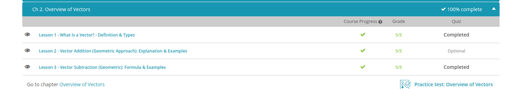

#### Andrew Garber
#### September 12 2022
#### Vectors Overview

#### What is a vector
 - A quantity that has both magnitude (numerical size) and direction
 - This is the opposite of a Scalar is a quantity that has magnitude but no direction.
 - Distance is a scalar quantity that measures how far you went, while displacement(similar to the displacement, of say water or any other mass) measures where you started and where you ended, and if they are the same points you have 0 displacement. 
 - Vectors are represented using arrows, a long(generally thicker) arrow means it is greater and a small(generally thinner) arrow represents a smaller value vector; direction of the arrow is the direction the vector is
 - Displacement, velocity, acceleration, force

#### Vector addition
 - There are two ways of adding vectors, mathematically and geometrically.
 - The geometric approach requires the diagram to be a scale drawing, where the lengths and angles are representative of those in reality. 
 - For the geometric approach, you draw the vectors tip to tail from the object being moved, and the total force of the vector would be the distance from the final tip to the original tail. 

#### Vector subtraction
 - Subtracting two scalars are easy, just basic arithmetic 
 - It is the same process for the geometric process as addition, line them up tip tail and find the distance between the final tip to the original tail and the angle at which it occurs.

Quiz Results:
 - 