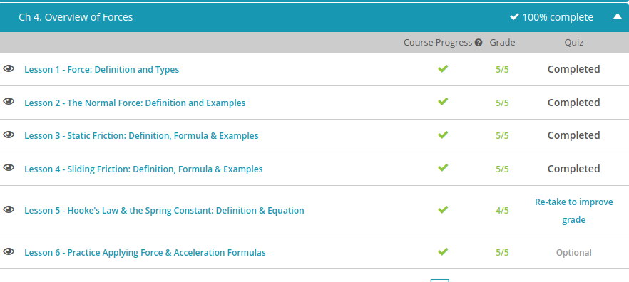

### Andrew Garber
### September 19 2022
### Overview of Forces

#### Definition and Types
 - A force is a push or pull on an object. This push or pull comes from the objects interacting with one another and only from such interactions. Once the interaction stops, there is no longer any force.
 - In fact, Isaac Newton describes this in his first law. This law of inertia states that an object continues in its state of rest or motion unless acted on by an outside unbalanced force.
 - force has both magnitude and direction, which makes it a vector quantity. The magnitude of the force is how much, and the direction is in which way. So, in order to fully describe the force, we would need to say the force is 5 N and in which direction
 - Contact forces are just what they sound like: forces that result from the interaction of two objects in contact with each other. Forces that belong in this category are friction, air resistance, normal force, applied force, tension force, and spring force.
 - normal force. This is the upward force that balances the weight of an object (another force that we'll talk about later) on a surface. If the object is at rest on a horizontal surface, the normal force is the same as the object's weight. Gravity pulls you down, but the normal force pushes back up on you from the floor.
 - An applied force is a force that is applied to an object by another object
 - Tension force is the tension through a string or other fully-stretched object
 - Spring force is the force exerted by a compressed or stretched spring.
 - If contact forces are forces from objects in contact with each other, it makes sense that non-contact forces are forces that result when the two interacting objects are not in contact with each other. Forces in this category include gravitational, magnetic, and electrical forces.

#### Normal Force
 - If a 500kg create is lifted to the top of the building at 1m/s^2 the normal force exerted by the platform on the mass while its accelerating is showing using a simple formula. $ΣF_v = ma_v$. We then use Newton's second land to get $N - mg = ma_v$ Solving for N results in: $N = (500kg)(1 m/s^2) + (500kg)(9.8 m/s^2)$ $N = 5,400 newtons$

#### Static Friction
 -  Static friction is the friction that exists between a stationary object and the surface on which it's resting.
 - Once the objects have already started moving, kinetic friction takes over. This is the friction that exists between two objects moving relative to each other. Kinetic friction isn't as strong as static friction, and so it's easier to keep the shopping cart moving.
 - But when an object is stationary, there's also something called adhesion between two surfaces. Adhesion is where two non-moving surfaces stick together slightly, due to some light chemical bonding between the materials. This is what makes static friction so strong.
 - Force is a push or pull, measured in Newtons (N). Friction is one such force. We can calculate how many Newtons of frictional force there are between two surfaces using this inequality: 
 - The coefficient of friction is just a number that represents how much two surfaces grip each other. The normal force is the force a surface applies to an object to keep it sitting on a surface. Without a normal force, objects would fall through the ground, because there would be nothing to hold them up. On a flat surface, this normal force is equal to the force of gravity acting down on the object, and this can be calculated by taking the mass of the object (in kilograms) and multiplying it by the acceleration due to gravity:
 - So for example, if a block is resting on a slope with a coefficient of friction of 0.1, and the normal force acting on the block is 2 Newtons, we can use the equation for static friction to calculate the force of static friction between the slope and the surface:

#### Sliding Friction
 - Sliding friction is also known as kinetic friction, or moving friction, and is defined as the force that is required to keep a surface sliding along another surface. Hans learns a couple of things about sliding friction that may help him with his robot battles
 - Sliding friction depends only on two variables: the materials in question and the weight of the object. Changing the surface area in contact does not change the sliding friction.
 - Sliding friction for most materials is less than the static friction. Exceptions include metals, which have static and sliding friction coefficients that are essentially the same, and very small surfaces, where molecular attraction forces take over.
 - The equation for sliding friction on a flat surface is pretty simple - it's the coefficient of sliding friction times the normal force.
 - 

#### Hooke's Law & the Spring Constant 
 - Elasticity is a property of a material which allows it to return to its original shape or length after being distorted. Some materials are not at all elastic -- they are brittle and will snap before they bend or stretch. Others, like rubber, for example, will stretch a long way without significant warping or cracking. This is because the materials contain long chain molecules that are wrapped up in a bundle and can straighten out when stretched.
 - But in physics we like numbers. One important number that relates to elasticity is the spring constant. The spring constant is a number that represents how much force it takes to stretch a material -- materials with larger spring constants are stiffer.
 - Hooke's Law states that the force needed to compress or extend a spring is directly proportional to the distance you stretch it. Or, in other words, the more you stretch something, the harder it becomes to keep stretching it. It's a linear relationship
 - As an equation, Hooke's Law says that the force applied in newtons (or the restoring force -- it amounts to the same thing) is equal to the negative of the spring constant, k, of the material, multiplied by the extension, x, of the material, measured in meters.
 - But if F is the force we apply, then the negative sign goes away, and it's just F = kx.
 