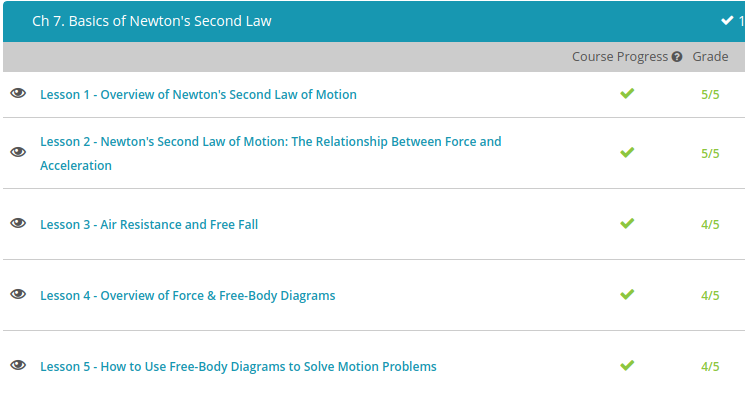

### Andrew Garber
### October 4 2022
### Newton's Second Law

#### Overview of Second Law
 - Force = Mass * Acceleration 
#### The Relationship between Force & Acceleration
 - Consider two balls, one with a mass of 1 kg and the other with a mass of 10 kg. Which ball would experience a greater change in motion if kicked with the same force? Clearly, the smaller ball would experience a greater change in motion. An object's state of motion can be described as its velocity, where velocity is the speed of an object with respect to its direction. Objects at rest - for example, the balls you see on the screen - have zero velocity. Once kicked, the ball's state of motion changes. In other words, its velocity changes. When an object changes its velocity, it has what we call acceleration.
 - Newton's second law states that the amount of acceleration is directly proportional to the net force acting on the object. What is the net force and how do we calculate it? Net force is the sum of all forces acting on an object in a particular direction. Since forces have direction, they are vector quantities. Vector quantities are fully described with both magnitude and direction and are represented with arrows.
 - Acceleration is a change in velocity. As long as we know the mass of the object and the net force acting on the object, we can determine acceleration. Let's look at the formula:
 - a = f (net) / m, where a = acceleration, f (net) = the net force acting on the object, m = the mass of the object.
 - Newton's second law implies that acceleration occurs only in the presence of an unbalanced force. If the forces acting on an object are balanced, the object is in a constant state of motion. That is, it is not accelerating. This is true for objects at rest as well as objects moving with a constant velocity.

#### Air Resistance
 - As Galileo Galilei studied acceleration he rolled weighted balls down angled ramps, As he angled the ramps more vertically, the acceleration of the balls increased. If he set the ramp so that it was directly vertical, the ball accelerated toward the ground at free fall acceleration. This is the falling of an object that is only under the influence of gravity, or, quite simply, the object's weight. During free fall, other forces like air resistance, which is the friction due to air, do not affect the object's motion.
 - As the diver falls she picks up speed, but air resistance works against that speed so her acceleration decreases. Eventually, the air resistance may equal her weight, meaning that there is zero net force. When this happens, the diver experiences zero acceleration - which is not the same as zero velocity! She reaches a point where her velocity doesn't change but you better believe she's still falling through the air. Since acceleration is a change in velocity, we can in fact have velocity without acceleration. When a falling object no longer accelerates we say it has reached terminal velocity. It's still falling, just at constant velocity.
