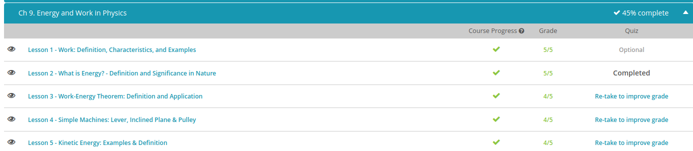

### Andrew Garber
### October 11
### Energy & Work

#### Work
 - But in physics, work is more specific. This is the displacement of an object due to force. How much work is done depends on the distance the object is moved. This makes it easy to put work into a solvable equation: work = force * distance. While this equation is fairly straightforward, there are three important things to note. First, the object must move over some distance in order for work to be done. Second, the force and the distance of movement must be in the same direction. And finally, the force must be constant.
 - The units we use for work are joules (J), named for James Prescott Joule. Though he is now known for his work in science, he actually preferred brewing beer… until he realized how science could help him be a better brewer!
 - The joule is a combination of both of the components on the right side of our work equation: force and distance. Quite simply, a joule is a Newton-meter (N*m), and one joule of work is done when a force of 1 N is exerted over a distance of 1 m. This amount of work is on par with lifting an apple over your head. I bet you didn't realize that counted as work, but in the world of physics, it does! You can probably see that 1 J isn't really practical to use for larger amounts of work, so instead we use kilojoule (kJ), which is 1000 J, or megajoule (MJ), which is 1,000,000 J. Regardless of the amount of work done, it involves three key components: the amount of force, the distance displaced, and the cause of the displacement, which is the force itself.
 - Work is an interesting concept because the same amount of work can be done in different situations. For example, if you lift a 5 N load 10 m in the air, the amount of work done is: 5 N * 10 m, or 50 J. But say you lift twice the weight over half the distance. In this case, the amount of work done is: 10 N * 5 m…also 50 J! The work done is the same because even though the displacement distance is less, the weight of the object is more, so it takes more force to displace it. But if you were to lift the 10 N object the original distance of 10 m, the amount of work done in this case is twice as much because now 10 N * 10 m = 100 J.

#### Energy
 - Now that we know what energy is, let's consider where it comes from. The answer to this question is really pretty simple. Energy comes from matter. Now you know why we've been talking about these two properties of energy and matter. This makes sense when we examine the definition of work. Work can be defined as the transfer of energy to or from matter. In fact, the total amount of energy contained within matter is directly proportional to the mass. Additionally, energy can be transferred from one system to another.
 - A system is a collection of objects organized into a whole - or, to put it another way: whatever you are considering as the whole for the purpose of a study. Let's talk about a few examples of systems. For example, you can consider the entire universe as a system. You may consider the universe as a system for the purpose of studying the relationship between different galaxies within the universe. Another example of a system could be your body. You may consider the human body as a system for the purpose of studying the interaction between the various organs that make up your body.
 - In the physics world, energy is measured in units that we call joules. This is important because you'll see this unit attached to numbers as a measurement of how much energy there is in a system. In other fields, such as industry and nutrition, energy may be measured in different units. For example, in industry kilowatt-hours are used as a measure of energy. In nutrition, calories are used as a measure of energy.

#### Work Energy Theorem
 - work means something very specific: 'a change in energy.' This change in energy comes from a force that causes an object to move a certain distance.
 - So in order for work to be done on an object, a force must move that object. You can push on a wall all day, but you're not doing any work on the wall unless you get it moving. In other words, you don't do any work on an object unless you change its energy.
 - When we move an object (that is to say, when we do work on it), we increase its kinetic energy, which is known as 'energy of motion.' When we bring a moving object to rest, we also do work on the object, but in this case we are decreasing its kinetic energy. Regardless of whether we are increasing or decreasing an object's kinetic energy, the amount of work done is equal to the change in energy. This is an important relationship known as the work-energy theorem.
 - We can write this statement as an equation that makes it very easy to see the relationship: Work = Δ E, where E is energy, and the Greek letter Delta means 'change in.' So we read this as: work = change in energy.
 - The work-energy theorem can also be applied to an object's potential energy, which is known as 'stored energy.' When a skier waits at the top of the hill before taking off, they have potential energy because they have the potential to do work. Once they take off down the hill this gets converted to kinetic energy because the skier is now in motion. If you raise a dumbbell over your head, you are doing work on the dumbbell as you raise it because you are moving it and therefore changing its kinetic energy. But you're also changing its potential energy because just like the skier, it is changing from a state of rest to a state of motion. However, once that dumbbell is above your head, if you simply hold it there you are no longer doing work on it because you aren't changing its energy - either potential or kinetic.

#### Simple Machines
 - A simple machine is defined as a basic device that alters the magnitude and/or direction of a force. Some examples of simple machines are levers, inclined planes and pulleys. These three simple machines all alter force in such a way that it makes it easier to move an object. You might not have noticed, but we use these simple machines all the time. Every time you sweep the floor with a broom you're using a type of lever. If you've ever had to load anything heavy into a truck, the loading ramp is an inclined plane. An elevator uses a pulley system to move up and down between floors. These are just a few examples of the simple machines that appear all over the place.
 - When we want to know exactly how effective a simple machine is we look at something called mechanical advantage. Mechanical advantage tells us the advantage gained by using the machine to transmit force. We can find mechanical advantage by looking at the ratio of the load force resisting movement to the effort force the operator puts into the simple machine.

#### Kinetic Energy
 - Here it is: motion is kinetic energy. Kinetic energy is the energy something has because it is moving. With energy, things can do work. The bowling ball only knocks over the pins because of its movement, or kinetic energy.

