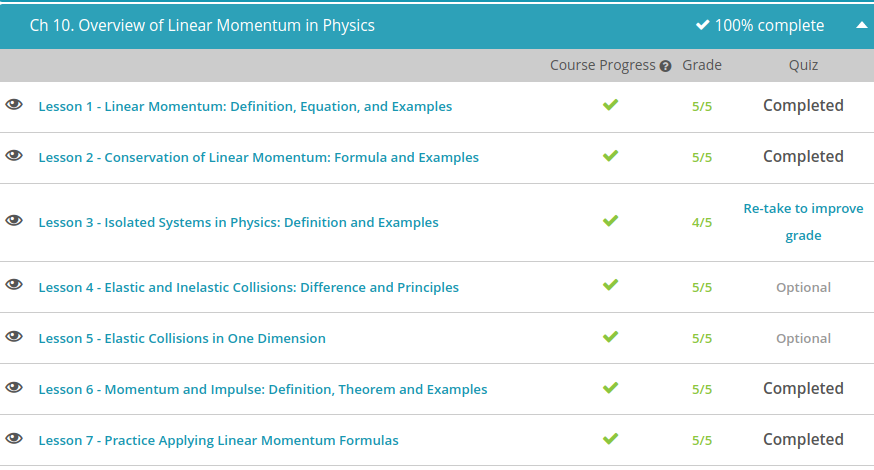

### Andrew Garber
### October 20
### Linear Momentum

#### Linear Momentum
 - Momentum simply means mass in motion.
 - This relationship can be described in an equation: momentum = mass x velocity. You may remember that velocity is speed with direction, so if an object has a large speed, it also has a large velocity. Our momentum equation can be simplified even more by substituting the words for symbols: p = mv, where p is momentum, m is mass (in kg) and v is velocity (in m/s).
 - An important thing to note about momentum is that it is a vector quantity. This means that it has both magnitude and direction. Velocity is also a vector quantity because it has both of these components, and fortunately for us, the direction of the momentum is the same as the direction of the velocity vector. But in order to fully describe the momentum of an object, you must include its direction - otherwise, it's not a vector.
 - Because the momentum increases or decreases by the same amount as either the mass or velocity, we say that they are proportional. All this means is that as one variable changes, the variable on the other side of the equation changes by the same amount.

#### Conservation of Linear Momentum
 - Momentum is mass in motion, and we can apply our understanding of outside forces here as well. Momentum can only occur when there is an outside force or impulse, not from within the system itself. This important concept is called the law of conservation of momentum. It describes how when there are no external forces, the momentum of a system doesn't change and more importantly, until external forces are applied it will not change.
 - In equation form, momentum = mass * velocity. To increase the momentum of an object, you need to increase its mass, its velocity, or both. This also means that different objects can have the same momentum. 
 - This is described in the law of conservation of momentum. This law states that when there are no external forces, the momentum of a system doesn't change. 

#### Isolated Systems in Physics
 - Simply put, a system is two or more objects. But this is a bit vague, isn't it?
 - To make it even trickier, what we are really interested in understanding is an isolated system. Now, instead of just any old set of objects, we have the added stipulation that the total amount of energy in the system doesn't change. Another way of looking at it is to say that there is no external net force on the objects in the system, or that the objects in the system are isolated from external forces.
 - In order for the force to be external, the force has to be unbalanced, meaning that there is no other force that opposes it with the same magnitude.
 - For example, a head-on collision between two cars could either be an isolated system or not, depending on the forces involved. If the head-on collision is between two vehicles traveling on a road that provides a large amount of friction, the cars are not part of an isolated system because there is an external force of friction at work there.
 - However, take friction out of the equation and the crashing cars become an isolated system. This is because the forces they exert on each other cancel out as they collide, and there are no external forces involved.
 - Like many things in physics, we describe ideal situations such as cars driving on frictionless roads. But here on Earth, the absence of such forces is unrealistic, so there really aren't any perfectly isolated systems. Entropy, friction adn other such forces are prime examples of this.

 #### Elastic and Inelastic Collisions
  - Elastic Collision are when objects collide without permanent deformation and without generating heat. Think of a band of elastic - you can stretch it and pull it all you want, but once you let go, it returns to its original shape and size. The same is true for elastic collisions - the objects come out of the collision unharmed, like they never collided at all.
 - An inelastic collision is when the objects are deformed or stick together. Momentum is still conserved in these situations, but this time the objects do not escape the collision unharmed. And unlike elastic collisions, inelastic collisions do give off quite a bit of heat when the two objects come together.
 - When we say momentum is conserved in an elastic collision, conservation of momentum in other words, what we really mean is that the total momentum of the two objects colliding is the same before and after the collision. Mathematically, we write this out as follows:
 
 - Here p stands for momentum, m for mass, and v for velocity. The subscripts tell us whether we're talking about the total (or tot) amount of the momentum, the initial (i) or final (f) momentum or velocity, and the momentum, mass, or velocity of object one (1) or object two (2). In this way pitot is the initial total momentum, vf2 is the final velocity of the second object, and so forth.
 - When a collision is perfectly elastic, the law of conservation of kinetic energy tells us that the total kinetic energy of the colliding objects is the same before and after the collision. We write this out mathematically much like we did with the conservation of momentum:
 
 - In these equations KE stands for kinetic energy, and the rest of the variables and subscripts are the same as they were in the conservation of momentum equations.

#### Impulse
 - Impulse is directly related to the change in momentum of an object. 
 - Momentum is proportional to both mass and velocity, meaning that a change in one will cause the same amount of change in the other. So if you increase an object's mass, you also increase its momentum. The same is true for velocity: increase or decrease the object's speed, and you increase or decrease its momentum by the same amount.
 - Ft = Δmv or force*time = mass*velocity

 