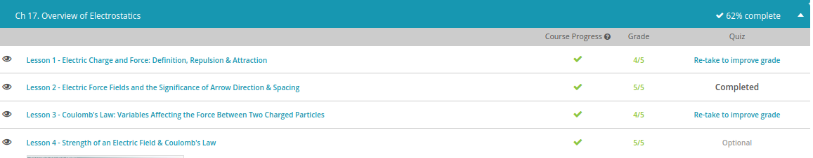
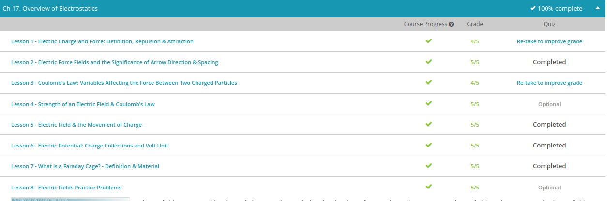

### Andrew Garber
### November 30
### Overview of Electrostatics

#### Electric Charge and Force
 -Everything in the universe is made of atoms, and every atom contains three types of particles called protons, neutrons, and electrons. The protons and neutrons are packed together in the nucleus at the center of the atom, while the electrons zip around the outside in a constant motion. For our discussion on electricity, we only need to concern ourselves with protons and electrons because they have a property called electric charge.
 -The electric charge that electrons and protons possess is responsible for the form of energy that we commonly call electricity. Protons have a positive charge, which is easy to remember because the word 'proton' and 'positive' both start with the letter 'p.' Electrons on the other hand have a negative charge, which is equal but opposite to the charge on a proton. If you bring one electron and one proton together, their charges cancel each other out, and we say that together they have no net charge.
 - In most atoms, there are equal numbers of protons and electrons, so the atom itself has no net charge. However, there are many atoms that either give away electrons or accept more electrons with relative ease. When this happens, we call the atom an ion. If an electron goes away, then the atom is left with more protons than electrons, and the atom becomes a positive ion. Likewise, if an electron comes along and joins the atom, then there will be more electrons than there are protons, and the atom will become a negative ion.
 - A very important phenomenon of charged particles is that opposite charges exert a force on each other that tends to pull them together. Because your hair was positively charged and the balloon was negatively charged, they did in fact become attracted to each other. Now, if you take the balloon away completely, you might observe that some of your hairs won't lay back down on your head but instead stick straight up in the air. This observation demonstrates the other phenomenon that similar charges exert a force on each other that tends to push them away. All of your hairs are positively charged, so they're trying their best to stay away from each other!
 - When electric charge accumulates on an object, such as on the balloon, we call this static electricity. The term 'static' simply refers to the fact that the electric charge doesn't move around but instead stays on the balloon.
 - Now, let's say we bring the balloon close to an object with a positive charge. The electrons on the balloon will simultaneously be attracted to the positively charged object and repelled from each other. If the attractive and repulsive forces are strong enough, the electrons will jump straight through the air to get to the positively charged object. This rapid transfer of electrons is what you see, hear, and feel as an electric spark.
#### Electric Force Fields
 - An electric force field is just the space surrounding a charged particle where a force will be experienced by other charged particles.
 - Scientists often use diagrams to help us visualize concepts that we can't actually see. To make the diagram for an electric force field, we start with a circle that represents our charged particle. Next, we need a way to represent the force that our particle exerts on other particles. The problem we run into is that our particle can either repel or attract other particles depending on whether they have similar or opposite charges. To show these two scenarios, we actually use two separate diagrams, one with arrows pointing out from the circle and the other with the arrows pointing in. The arrows are called field lines and simply indicate whether the particle is repelling or attracting.
 - Now, what if we wanted one of these diagrams to represent a proton? At this point, we don't have enough information to decide because a proton can exert a repelling or an attracting force depending on the type of charge on the other particle. Scientists recognized this problem, so they came up with a rule that everyone would follow when drawing electric field diagrams. That rule stated that the field lines always point in the direction of the force experienced by a positively charged particle placed in the field. It sounds confusing at first, but it's actually quite simple when we draw it out. Let's go back to our two diagrams of repelling and attracting forces. Which one of these would represent a proton? We know that protons repel other positively charged objects, so the field lines would point out and away. On the other hand, an electron would attract a positively charged object, so the field lines would point in. Although it's good to know the rule, you can skip straight to the conclusion that if you see a diagram with the field lines pointing out, it always represents a positively charged particle. Likewise, field lines pointing in always represents a negatively charged particle.
 - With all this talk about field line direction, I'll bet you didn't even notice that our diagram also tells us something about the strength of the force. Take a look at the spacing of the field lines. Near the particle, the lines start out very closely spaced, which indicates the force is very strong. As we move outward, the lines spread farther apart, indicating that the force is weaker.
 - 

#### Coulomb's Law
 - Back in the 18th century, it was well known that an electrically-charged particle would exert a force on any other charged particle. The problem was no one knew how strong the force was or what factors affected its strength. That is, until a very bright scientist by the name of Charles Coulomb conducted several experiments that led him to propose what is now known as Coulomb's law.
 - 
 - The force between charged particles is directly related to the amount of charge carried by each particle. Aside from electrons and protons, most charged particles carry a variable amount of charge. Think of rubbing a balloon on your hair. The balloon will pick up negative charges from your hair and begin to act like one big charged particle. The amount of charge on the balloon will depend on how long you rub it on your hair. Now, if you repeat this experiment with a second balloon, the two will try to repel each other, and the strength of that repelling force will depend on how much charge each balloon picked up from your hair.
 - Going back to Coulomb's equation, we can see that the amounts of charge carried by each balloon are represented by the terms q1 and q2. To allow us to focus on the relationship between the force and the charges, let's strip away the other parts of the equation. What this part of the equation tells us is that the force is directly related to the product of the two charges. In other words, if the product of the charges increases, then the force will also increase. To really understand what this means, let's try some examples.
 - We'll start out with equal amounts of charge on each balloon, which results in a repelling force between them. If we double the amount of charge on one of the balloons, then the product of the charges will also double, and in turn, the force will double. Next, let's double the amount of charge on the other balloon and see what happens. The product is now four times larger than it was to begin with, which means the force will also be four times larger.
 - To demonstrate why it's the product of the charges that's important, as opposed to the individual charges, let's go back to the beginning. This time, we'll double the charge on one balloon but cut the charge in half on the other balloon. When we do the math, we can see that the product remains the same, which means that the force will be unchanged. This is why it's never safe to assume that just because the charge on one particle changes, that the force will change as well.
 - The force between charged particles is very dependent on the distance between them, even more so than on the particle charges we just discussed. In Coulomb's equation, the distance between particles is represented by the term d. To allow us to focus on the relationship between the force and the distance, let's strip away the other parts of our equation. We can see that the distance term is on the bottom of the fraction, which tells us that the force and the distance are inversely related. In other words, if the distance increases, then the force will decrease. Or if the distance decreases, then the force will increase. Force and distance always change opposite of one another.
 - The next thing to notice is that the distance term is squared, which is really just another way to say 'distance multiplied by distance.' Written like this, it becomes clear that the distance is actually represented twice in the equation. This tells us that a change in the distance will have more effect on the force than the same amount of change in the particle charges. To help clarify, let's look at some more examples.
 - Throughout our discussion, we've treated the particle charges and distance separately. However, it's important to realize that they always work together to affect the force. For example, if we doubled the charge on each particle, the top of our fraction would become four times greater. At the same time, if we double the distance, the bottom of our fraction also becomes four times greater. The simultaneous changes have the effect of canceling each other out, and the force between the particles remains exactly the same.
 - Before we conclude our lesson, it's worth mentioning that Charles Coulomb's contributions to the understanding of electrostatic force were so important that the unit for electric charge was named after him. A coulomb of charge is actually a really, really big number that we rarely ever encounter in day to day life. Just to give you an idea, we would have to transfer over 6 billion electrons to one of our balloons to give it a charge of just one coulomb. It's not important to remember such a mind-boggling fact, but now you know that if you ever see a number expressed in coulombs, then that number is referring to a quantity of electric charge.

 
#### Electric Field
 - An electric field is the electric force per unit charge. Or in other words, it's the force that a positive 1 coulomb test charge would feel. A test charge is just a charge you use to do a test, an experiment. So in other words, to figure out the electric field strength at a location, all you have to do is take a charge of +1 coulomb, put it at that position and measure the force it feels. Electric field is measured in newtons per coulomb (N/C).
 -Electric fields can be represented diagrammatically using either electric field lines or electric field vectors. For example, the electric field around a positive point charge looks like this. Vectors tell you the strength of the field at the point where the arrow begins. The longer the arrow, the stronger the field. With electric field lines, the closer the lines are together, the stronger the field. Notice that the lines and arrows point away from the positive charge -- this is because a positive test charge would be repelled, would be pushed away from this positive charge.
 - 
 -One important thing to be careful about is that you don't confuse electric fields with the motion of charges. If I release a positive test charge from rest at a position, the charge will indeed follow the electric field lines. But what the field lines really tell you is the force that the charge is feeling. With an initial velocity of zero, any object will move in the direction of a force. But that need not always be the case.
 - For example, if your positive test charge is moving north, and you enter a field pointing west, the charge will curve in a circle vaguely northeast. Eventually it will follow the field lines and move west, but at first it could go in any direction depending on its initial velocity. A net force applied to an object creates an acceleration. So the field lines only really tell you which direction the force (and therefore acceleration vector) are pointed.
 - There are two main equations for electric field. One is the general definition, which says that it is the force per unit charge. Here, E is the electric field strength in newtons per coulomb, F is the force on the charge q measured in newtons, and q is the charge you're putting in the field, measured in coulombs. So if you place a +2 coulomb charge in a field instead of the +1 coulomb charge, it will feel twice the force.
 - 

#### Electric Potential Charge and Volt
 - When a charged particle sits around all by itself, it doesn't have any motivation to do work. You see, the potential to do work is not an inherent property of charged particles but rather the result of the forces exerted by other nearby charged particles. When we gather a group of charged particles together, it's called a charge collection. The most common example of a charge collection is a battery, which is simply a bunch of electrons packed into a tight space. Because the electrons all have the same negative charge, they are all very motivated to get out of the battery, and this is what gives rise to a thing called voltage. Voltage is a measure of the amount of work that a group of charged particles will do if allowed to flow in an electric circuit.
 - A convenient analogy to help us understand voltage is water pressure in a pipe. A battery always has voltage, whether it's powering a toy or sitting in the drawer doing absolutely nothing. This is just like the pipes in your bathroom, which have pressure regardless of whether you're taking a shower or not using the water at all. Another similarity is that voltage indicates how much work the charged particles will do when they flow out of the battery. Higher voltage means more work. This is similar to the way a high-pressure power washer will clean more bugs off your windshield than a low-pressure garden hose
 - The voltage of a battery, or of any other charge collection, is dependent only on how tightly the charged particles are packed together. This is called charge density. The closer the particles are to each other, the more they repel each other, which gives them more motivation to go out and do work. Interestingly, voltage is independent of the total number of charged particles in the collection. We can see this with different sizes of batteries. Triple-A batteries have the same voltage as D-size batteries because they have the same charge density. This means that an electron from the triple-A battery will do the same amount of work as an electron from the D-size battery. The only difference is that the larger D-size battery will last longer because it contains more electrons.
 - a volt is actually equal to one joule per coulomb, which comes from our definition of voltage. Work is measured in joules, and electric charge is measured in coulombs. So if voltage is a measure of how much work is done per group of charge, then we end up with the unit of joules per coulomb. As a commonly used unit, this is a little too cumbersome to say, so we take a shortcut and use 'volts' instead.

#### Faraday Cage
 - A Faraday cage is a conductive cage that protects the inside from external electric fields and external electromagnetic radiation. Faraday cages are also called Faraday shields, RF cages, or EMF cages. The Faraday cage is actually very popular and is in use in our everyday lives. The Faraday cage is named after Michael Faraday, who built one in 1836 and observed that when electrical charges strike the outside of the cage, it does not affect the inside. He wrapped a room in metal foil, placed an electroscope inside the room that would measure the presence of any electric charges, and then applied electrical charges to the outside of the room. He observed that the electroscope inside the room always read 0, no matter what happened outside the room.
 - A conductive material is one that lets electricity pass through. Metals are the most common conductive material in use today. Other examples are water and the human body. The opposite of a conductor is an insulator, materials such as rubber, wood, glass, or plastic. These materials do not allow electricity to pass through. But how does building a cage out of conductive material protect what's inside from electricity?
 - When a Faraday cage is exposed to an external electrical force, the electrons of the conductive material of the cage respond and move in such a way so as to cancel out the external electrical force. The Faraday cage ends up producing its own electrical force that's exactly opposite the electrical force it's being exposed to. This equal and opposite force cancels the external force. What you get inside the cage is a completely neutral electrical environment.
 - There are limitations to the Faraday cage, however. They don't block magnetic fields, so the earth's magnetic field will make its way through. Also, the type of conductive material used and how it's constructed also determines the response of the electrical force. Meshes, for example, don't protect as well as a solid sheet of metal. Different types of metal also have different conductivities. Copper, for example, has higher conductivity and makes for a better Faraday cage as it responds to more electrical forces.
 

- 