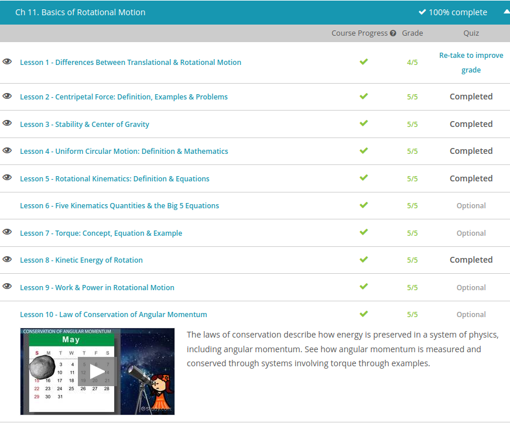

### Andrew Garber
### October 25
### Basics of Rotational Motion

#### Differences between rotational and transitional motion 
 - Translational motion is motion that involves the sliding of an object in one or more of the three dimensions: x, y or z. But an object can still be moving even when it's just sitting at a particular x-, y- and z-coordinate; it can still spin.
 - Rotational motion is where an object spins around an internal axis in a continuous way. An ice-skater can do this by spinning on the spot. She will give herself rotational energy. And because energy is always conserved and a smaller object must spin faster to have the same energy, when she moves her arms in towards her body, her rotation speed will increase - the spinning will get faster and faster.
 - For example, Newton's First Law says that a body in motion stays in motion, and a body at rest stays at rest unless acted upon by an unbalanced force. That law is true for rotation, too! But instead of a linear force, we have a rotational torque. Newton's First Law thus becomes: a spinning body will stay spinning, and a non-spinning body won't start spinning unless acted upon by an unbalanced torque. A torque is just a force that acts off-center and causes an object to spin.
 - Practically every quantity in translational motion has a rotational equivalent. Instead of linear acceleration, we have rotational (or angular) acceleration. Instead of forces, we have torques. 

#### Centripetal Force:
 - A centripetal force is a force directed towards the center of a circle that keeps an object moving in a circle.

#### Center of Gravity:
 -  center of gravity of an object is the point at which we can consider the weight of an object to be concentrated. This is the center point from which the weight is evenly dispersed on all sides. We can use the center of gravity to determine exactly when an object will reach its tipping point and fall over.
 - These three states of stability can be more specifically defined by again looking at their centers of gravity. When an object is in stable equilibrium, tilting it will raise the height of its center of gravity. An object in unstable equilibrium will have its center of gravity lower in height when tilted. Finally, the center of gravity will remain at the same height when pushed for objects in neutral equilibrium.

#### Day 1 Rotational Motion
 - 

#### Rotational Kinematics
 - kinematics is the study of the motion of objects, without any reference to the forces that cause that the motion. Forces and their impacts are more abstract than numbers of motion, like position, velocity and acceleration. The opposite of kinematics is dynamics, which is studying the motion of objects using forces. Both kinematics and dynamics can be studied for translational motion or for rotation.
 - In normal translational motion, there are five key variables: position, initial velocity, final velocity, acceleration and time. Each linear variable has a corresponding rotational one.
 - Position, x, is replaced with angle, theta, which is the position of an object around an axis of rotation, measured in radians.
 - Initial and final velocity are replaced with initial and final angular velocity, which is just how fast the object rotates, measured in radians per second.
 - Acceleration is replaced with angular acceleration, which describes the rate at which the angular velocity is changing, measured in radians per second per second, or radians per second squared.
 - And time is just time.
 - Since velocity is change in position divided by time, angular velocity is change in angle divided by time. And since acceleration is change in velocity divided by time, angular acceleration is change in angular velocity divided by time, which is final angular velocity minus initial angular velocity, divided by time.
 - And just like the average velocity is the final velocity, plus the initial velocity divided by two, the average angular velocity is the initial angular velocity, plus the final angular velocity divided by two.

#### Torque
 - A torque is just a force that is applied out of line with the center of mass of an object, a force applied a distance 'r' away from the center of mass, that causes the object to rotate. A bigger force means a bigger torque, and a larger distance from the pivot point means a bigger torque. And just like with linear forces, unbalanced torques can cause an acceleration - in this case, an angular acceleration. They cause the rate of rotation to change.
 - Mathematically, torque is the force, measured in newtons, multiplied by the distance to the pivot point from where the force is being applied, measured in meters. So torque as a number is measured in newton-meters.

#### Kinetic Energy of Rotation
- It turns out that there are two types of kinetic energy: translational and rotational. Kinetic energy of rotation is the movement energy an object has due to its spin.
 - So, the rotational kinetic energy equation is just one half, multiplied by the moment of 
 inertia, 'I', measured in kilogram meters squared, multiplied by the angular velocity, omega, squared.

#### Work and Power in rotational motion
 - Power is often a more useful measure in the real world. Telling us that a light bulb did 1000 Joules of work isn't very helpful, because if it did those 1000 Joules of work over say, a million years, the light bulb would have been very dim. And if it did that work over two seconds, it would be super bright.
 - Power is the work done per second, or in other words, the energy used per second, measured in watts. So if work is torque multiplied by the change in angle, the power will be the same thing divided by the time it took to do the work.
- Let's say that the wind applies a 300 Newton to the outside edge of a wind turbine over a period of 10 seconds, causing the turbine to turn by pi radians; that's 180 degrees. If the wind turbine has a radius of 5 meters, how much work did the wind do on the wind turbine?
 - The torque of 1500, multiplied by the change in angle pi, which gives us 4712 Joules of work.

