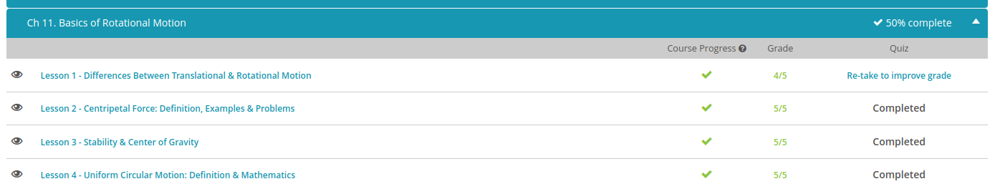

### Andrew Garber
### October 25
### Basics of Rotational Motion

#### Differences between rotational and transitional motion 
 - Translational motion is motion that involves the sliding of an object in one or more of the three dimensions: x, y or z. But an object can still be moving even when it's just sitting at a particular x-, y- and z-coordinate; it can still spin.
 - Rotational motion is where an object spins around an internal axis in a continuous way. An ice-skater can do this by spinning on the spot. She will give herself rotational energy. And because energy is always conserved and a smaller object must spin faster to have the same energy, when she moves her arms in towards her body, her rotation speed will increase - the spinning will get faster and faster.
 - For example, Newton's First Law says that a body in motion stays in motion, and a body at rest stays at rest unless acted upon by an unbalanced force. That law is true for rotation, too! But instead of a linear force, we have a rotational torque. Newton's First Law thus becomes: a spinning body will stay spinning, and a non-spinning body won't start spinning unless acted upon by an unbalanced torque. A torque is just a force that acts off-center and causes an object to spin.
 - Practically every quantity in translational motion has a rotational equivalent. Instead of linear acceleration, we have rotational (or angular) acceleration. Instead of forces, we have torques. 

#### Centripetal Force:
 - A centripetal force is a force directed towards the center of a circle that keeps an object moving in a circle.

#### Center of Gravity:
 -  center of gravity of an object is the point at which we can consider the weight of an object to be concentrated. This is the center point from which the weight is evenly dispersed on all sides. We can use the center of gravity to determine exactly when an object will reach its tipping point and fall over.
 - These three states of stability can be more specifically defined by again looking at their centers of gravity. When an object is in stable equilibrium, tilting it will raise the height of its center of gravity. An object in unstable equilibrium will have its center of gravity lower in height when tilted. Finally, the center of gravity will remain at the same height when pushed for objects in neutral equilibrium.

#### Day 1 Rotational Motion
 - 