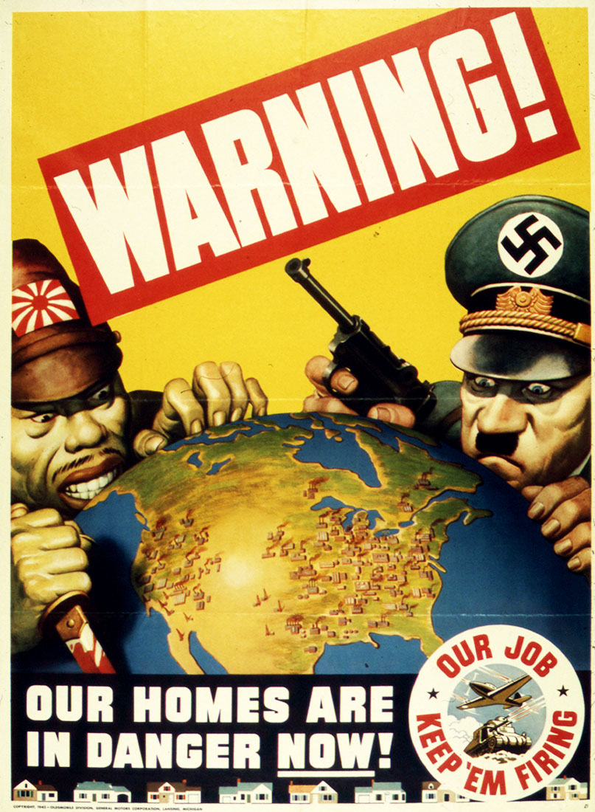

### Andrew Garber
### December 2 
### American Propaganda in World War Two

#### Prompt
American Propaganda, both for workers and soldiers
Propaganda was a big part of the early 20th century war efforts.  Why was it necessary .. and why/how was it targeted to both groups above. Evaluate its effectiveness. 

PLEASE USE IN-TEXT SOURCING. PLEASE USE AT LEAST THREE DIFFERENT TYPES OF SOURCES - AS MANY TOTAL SOURCES AS ARE USEFUL BUT PULL FROM DIFFERENT TYPES OF SOURCES
#### Response

Propaganda is an essential part of warfare both for maintaining stability and productivity on the home front, an essential requirement for the successful prosecution of a war, and the motivation of troops in the conditions of war. This was no less true for the United States during World War 2 following their entry in 1941, as motivating the American people that fighting was worth it when defeating the unstoppable war machines of Nazi Germany and Imperial Japan looked impossible. Propaganda efforts were necessary for the motivation of the whole American populous, but the most notable examples of notable targeted campaigns were done to direct driven fighting aged men towards the most innovative branches and towards women and African Americans: groups which historically had been denied a fair chance to serve their country. 

The American populous, following the Japanese attack on Pearl Harbor, was more willing to become embroiled in the conflicts that had fully spanned the globe than at any point since their entry into the First World War but there were still large portions of the population that believed that they should not be involved in the war in Europe in any respect. Despite Germany's declaration of war on the United States per the Tripartite pact signed by Japan, Germany, and Italy, the United States had no requirement to be fully involved in a European war and it was only with a concerted campaign to change the mind of Americans that a case could be made for a full-scale conflict with the most powerful military in the world. Thus, the widespread circulation of propaganda vulcanizing the German and Japanese leadership and their people as bloodthirsty creatures helped to inspire a genuine hatred of their enemies in the minds of the American people. This is well shown in the cartoon of Adolf Hitler and Hideki Tojo holding weapons and peering at the United States in the propaganda poster publicized by General Motors to inspire greater production in light of fears of an impending invasion of the United States. 

Propaganda directly focused on the motivation of fighting men, both to encourage voluntary enlistment and to inspire those already enlisted has been a part of wartime strategy for millennia. However, with the United States espousing a new kind of warfare in the Second World War, the need for propaganda to inspire those fighting men with an acceptance towards new means of warfare - specifically in rapidly advancing areas like mobile and air warfare - adaptable, intelligent, enthusiastic fighting men were needed. These were areas in their infancy with tactics and ways of thinking about their role constantly being developed and without a fresh set of both fighting men and leaders, they could never be utilized to their full potential. This is well seen on recruiting posters for the Army Air Forces-the precursor to the Air Force- showing how a special message, more focused on the individuals they were recruiting instead of the numbers was used for this purpose. The design of the recruiting poster is also a good example of the different requirements of serving in mobile or airborne forces, both of which are small teams operating highly specialized equipment - the title, "The Greatest Team In The World!" speaks to that. This poster has the dual effect of selecting those interested in being a part of a new way of fighting wars and enshrining a sense of superiority in their method of fighting in the hearts of the American people.

While propaganda for the direct motivation of the traditional military groups was undoubtedly important for the prosecution of the war, equally as important was the motivation of groups not previously given a chance to serve their county - notably, African Americans and women. However, breaking the long-help cultural dogmas both in these groups and the wider population would be difficult, thus the need for widespread propaganda campaigns to foster a mindset of cooperation between groups that had been dramatically opposed on important issues. With industrial needs soaring and millions of men being drafted for front-line service, it was essential that new sources of labor to power the American way of war were found. This campaign, which invited women to come away from their traditional roles of homemakers and into factories is responsible for arguably the most famous piece of propaganda in history, becoming a symbol of equality: Rosie The Riveter. In the poster made by Westinghouse Electric, a woman is shown rolling up her sleeves and wearing decidedly utilitarian clothing with the tagline, 'We Can Do It!' printed large across the top. In his paper **An Analysis of American Propaganda in World War II and the Vietnam War**, Connor Foley describes the tremendous impact of the Rosie the Riveter propaganda campaign, saying "Once again, the patriotic red, white, and blue colors are prevalent throughout the image. The poster portrayed Rosie as an attractive woman who willingly rolled up her sleeves and worked for the good of the country... Many women would likely have been hesitant about taking on a manual-labor position, but Rosie the Riveter helped to instill confidence with her flexed muscles, stern look, and simple statement"(Foley 17). Foley's description accurately describes the tremendous impact of the Rosie the Riveter campaign, eventually, becoming the starting point for several other posters which in the same vein encouraged women to contribute to the war effort however possible.

The efforts to motivate African-Americans, a group that had been directly oppressed by the United States government for decades were equally important to the war effort. The tremendous scale of the conflict necessitated the mobilization of all resources, including labor, and not allowing a huge number of available workers and soldiers to serve their nation was not in the interest of any American no matter their feelings on the issue of civil rights. This is powerfully seen in a poster made by the War Manpower Commission, set largely in grayscale with just the colored American flag in the background with a White man and a Black man both using rivet guns to assemble the same piece of work, with the title 'United We Win'. This poster is dramatic in several ways, the least of which is that in many parts of the nation it was common for African-Americans and Whites to not be allowed to work in the same building, let alone collaboratively. As well as that, the grayscale nature of the picture of them working together is a direct show of how the color of their skin was disregarded in the scope of a war for the very survival of freedom across the world.  
#### Sources
[An Analysis of American Propaganda in World War II and the Vietnam War | Connor Foley | Pg 28](https://vc.bridgew.edu/cgi/viewcontent.cgi?article=1092&context=honors_proj)
[The National Archives | Power of Persuasion](https://www.archives.gov/exhibits/powers-of-persuasion)
[PBS American Experience](https://www.pbs.org/wgbh/americanexperience/features/goebbels-propaganda/)
[Rosie the Riveter | Smithsonian](https://americanhistory.si.edu/collections/search/object/nmah_538122)
[Library of Congress | In the face of obstacles: courage](https://www.loc.gov/item/93500150/)
[Department of Defense](https://www.defense.gov/News/Feature-Stories/story/Article/1990131/wwii-posters-aimed-to-inspire-encourage-service/)
[Department of Defense Poster: 2](https://www.defense.gov/News/Feature-Stories/story/Article/1990131/wwii-posters-aimed-to-inspire-encourage-service/#pop3740515)
[War Manpower Commission](https://cnx.org/resources/a7969e128468900ca7e7455cb739ce7065b22b9b)
[Homes in Danger](Media/homes-danger.jpg)
[Greatest Team in the World](https://media.defense.gov/2019/Oct/16/2002195531/825/780/0/430309-O-ZZ999-002.JPG)