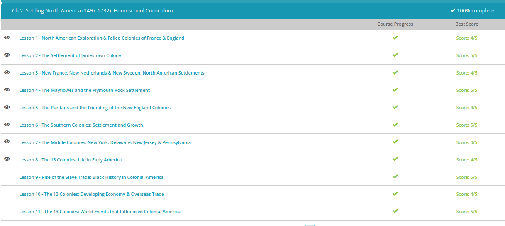

#### Andrew Garber
#### September 12 2022

#### Settling North America

#### The first failed colonies
 - Sailing for France, Giovanni da Verrazzano made three trips, exploring most of the North American coastline, as well as South America and many Caribbean islands. He didn't find the Northwest Passage or any cities of gold, but his knowledge, combined with that of a Portuguese explorer a few years earlier, was instrumental in creating a widely distributed outline map of the east coast of the continent
 - Jacques Cartier was also sent by the king of France to find a northwest passage and to discover certain islands and lands where it is said that a great quantity of gold and other precious things are to be found. Upon Cartier's return from his second exploration of Canada, he brought a leader from the indigenous people back home with him to tell the king about a city full of gold and gemstones, where the natives were blonde-haired.
 - While France and other European nations were working hard to supplant Spain as the world's colonial superpower, the English had been mostly content to simply steal gold from Spanish ships. And in the end, these English pirates, nicknamed 'Sea Dogs,' finally turned the tide of world history in favor of England.
 - The roanoke settlement, one of the most famous failures in colonial history set the stage for further English escalation of colonial activities in the new world.

#### Jamestown Colony
 - Jamestown had trouble from the start. The settlers had chosen their location with defense in mind. They were far enough up river to avoid the Spanish navy along the coast, on a peninsula with a deep water port and there were no Native Americans. But what was good for their defense was bad for their health. The tide carried in seawater they couldn't drink. The swampy peninsula was filled with mosquitoes carrying malaria. Also, many colonists suffered from dysentery and typhoid because the rivers were contaminated by their own body waste.
 - One of the Bermuda survivors, a man named John Rolfe, brought with him seeds for a type of sweet Spanish tobacco. How he got them is unclear, because those seeds were guarded to the death by the Spanish empire. However, Virginia's climate was perfect for growing tobacco. A year later when Rolfe exported his first crop to England, he became a wealthy man. Sweet Spanish tobacco was in great demand on the London market, and within a few years, Jamestown was booming from this so-called brown gold.
 -In 1619, representatives met to set a minimum price for tobacco exports. This assembly grew into the Virginia House of Burgesses, which was the first elected government in America.

#### New France, New Netherlands, New Sweden 

 - There were conflicts between French settlers and the Iroquois Indians, but these were mostly a result of an alliance between French settlers and the Algonquin Indians, one of the Iroquois rivals. French settlers, generally, befriended the Native Americans they encountered, and they worked with them as colleagues, especially in the fur trade.
 - Leaders in New France deliberately sent young men to live with native tribes to learn their language and survival tips. Since there were barely more than 3,000 colonists in all of New France by 1665, single Frenchmen were encouraged to marry Native American women in order to increase the population of the empire. In time, New France would use this friendship with Native Americans to fight off English expansion.
 - In 1609, the Dutch West India Company sent an Englishman named Henry Hudson looking for a Northwest Passage. On one of several voyages, he searched the area around the bay and the river that bear his name today.
 - 15 years later, in 1624, the company sent a party of settlers to the New World to establish a new fur trade to compete with the French. Peter Minuit, an early governor of New Netherland, didn't like the original site where they had intended to build the capital city and port. So, on May 24, 1626, Minuit bought the island of Manhattan for $24 worth of glass beads from the Lenape Indians - a transaction that some people jokingly call 'the last real estate bargain in New York'. Though at the time, it wasn't called New York; it was New Amsterdam.
 - To encourage Dutch immigration, the Dutch West India Company recruited patroons. These were stockholders who could transport 50 families and were granted large tracts of land in return. A patroon ruled his land like a medieval lord. Conflicts between these patroons and incursions by local Indians led to unrest in the colony, and soon land and business ownership were deregulated. The colony boasted a cosmopolitan population where multiple languages were spoken, religious freedom was protected by law and even the few urban slaves were granted civil rights. The colony prospered. But still, the company just couldn't attract very many settlers, and they were increasingly unable to keep English settlers from moving in. In defense, they built a 12-foot high wall around the city.
 - Peter Minuit, the former governor of New Netherland, led two shiploads of Swedish settlers and supplies to New Sweden, which lies in the southern part of New Netherland, in 1638. As former governor, Peter Minuit was fully aware that he was, technically, on Dutch land, and he also knew that the Dutch West India Company couldn't do anything about it.
 - The Swedish built Fort Christina in honor of the Swedish queen in present-day Wilmington, Delaware. For 17 years, the colony survived and grew modestly, but it never became the colonial powerhouse the Swedish crown had hoped for.

#### The pilgrims
 - In September 1620, the Mayflower set sail from England bound for the northern edge of Virginia. Contrary to what you may have heard, it wasn't full of pilgrims. Actually, a little less than half of its 102 passengers could, truly, be called pilgrims. They were part of a separatist congregation who had left the government-sanctioned Church of England and fled for their lives to Holland. But Holland didn't work out for them either, so they decided to go to America. These separatists got the nickname Pilgrims because they were fleeing religious persecution, and because they believed they were led by God to start a religious government.
 - The ship first dropped anchor at Cape Cod, which was outside the chartered land of the London Company, to whom some of the passengers were indentured. But success didn't come easy, and nearly half the passengers and crew died of hunger, disease and exposure before the winter was out. Still, the survivors were determined to make it in the New World, and they remained in America when the ship returned to England in April.

#### Puritans

 - In 1630, the first wave of Puritans met up with survivors from an abandoned colony and renamed the little settlement Salem. Governor John Winthrop encouraged them to work hard and continually remind themselves and each other of God's commands so that He would bless them. In a famous speech, Governor Winthrop said 'He shall make us a praise and glory that men shall say of succeeding plantations, 'may the Lord make it like that of New England.' For we must consider that we shall be as a city upon a hill. The eyes of all people are upon us.'
 - The colony was not a democracy, it was a theocracy - for the purpose of serving God and increasing His kingdom, not to let people live however they saw fit. Any challenge to the Church's authority undermined the colony's mission and all that they had worked so hard to accomplish. Any person who challenged the strict practices of their faith was literally thrown out of the colony
 - A few years later, Roger Williams successfully combined Portsmouth, Providence and some other small communities into the colony of Rhode Island. 

#### The southern economy
 - Virginia was started by a group of men in 1607 who wanted to get rich quick. Even through the 1620s, ¾ of Virginia's population was still male, and the goal of the colony was still money. This was achieved through large farms called plantations that planted cash crops - namely, tobacco. But tobacco requires a lot of manpower, and Jamestown had a population problem. The birth rate was low, and the death rate was high. England has the opposite problem, leading to large numbers of indentured servants coming over from England.
 - Many former indentured servants - both black and white - headed out onto the western frontier where they fought constantly with the natives. In Jamestown, the leaders ignored their pleas for help. So they took matters into their own hands. A frontier planter named Nathaniel Bacon organized a militia to take revenge on the Indians.
 - Cecil Calvert (whose title was Lord Baltimore) to start a new American colony for Catholics. He called the colony Maryland, and it resembled Virginia in many ways, including tobacco plantations, indentured servants and slave labor and high mortality. A settler in Maryland lived ten years less than someone in New England. Despite Calvert's plan, Maryland had a Protestant majority. To protect the Catholics, he approved the Act of Religious Toleration in 1649, guaranteeing political rights to anyone practicing any form of Christianity
 - Like most of the American colonies, Carolina was already inhabited, but not just by Native Americans. Some former indentured servants from Virginia had migrated into the northern part of the land at least ten years before the charter was granted. The southern part was inhabited by poor farmers who had been run off of the island colony of Barbados by wealthy planters. Their crops wouldn't grow in America, but they figured out that hogs thrived with almost no overhead cost.
 - In 1670, a shipload of rich men also arrived from Barbados. They came for the same reason that rich, young men had gone to Virginia: there was just no land left for them on the island. They founded the Port of Charlestown, and sold pork to Barbados in exchange for slaves.

#### Middle Colonies:
- Unlike colonists in early settlements, English immigrants to New York didn't arrive in a barren wilderness full of hardships. They arrived in a developed, cultured, thriving community, and they fully expected to continue the lifestyles they had left behind in England. Colonists paid top dollar to import many items from Europe, including things like tea, fabrics and books. Life in New York quickly developed a class structure with merchants at the top and sailors at the bottom.
- In 1663, just before the King gave New York to his brother, he had granted eight of his friends a colony in the south, which they named Carolina. The Duke of York also wanted to please some of these same men, so he decided to pass along a portion of his land, New York, to two of them. The new proprietors named the northern colony New Jersey
 - Back in England, a young man from an important family converted to the Quaker faith. His name was William Penn. Quakers weren't popular in England or America, and Penn was imprisoned several times. But his father was a rich and powerful man, and the king owed him a lot of money. When Penn's father died, William suggested that the king could give him land in America as repayment of the debt. The king agreed. Penn wanted to create a safe haven for Quakers, and in 1681 he began planning his new colony, which he named Pennsylvania.
 - Quakers, by creed, are pacifists, and it was important to Penn that his colony be on good terms with all of its neighbors. So, even though his charter made him sole proprietor and owner of all the land, Penn made an agreement with the Lenape Indians to buy the territory from them. He also purchased, or maybe leased, the land where he built Philadelphia from the Swedes.
 - In order to avoid the kinds of problems that plagued the old cities of Europe, Philadelphia was carefully surveyed and mapped out ahead of time, ensuring that the streets were wide, the docks were well-situated and homes, business and government buildings were spread apart. To attract settlers, Penn organized the territory into counties and building lots, and sold them for a very low price. And though he was a very conservative, religious man, his political beliefs were radical. Penn advertised throughout Europe that his colony would guarantee full religious freedom and a representative government
 
 Quiz Results