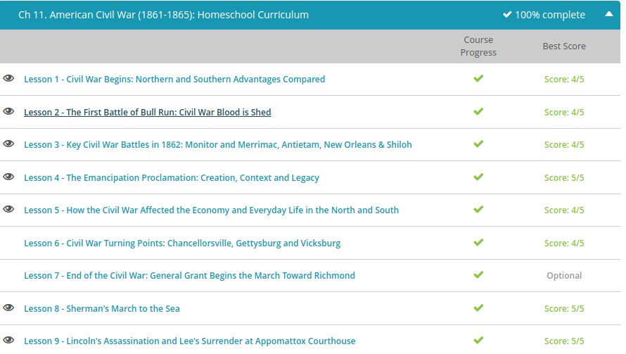

### Andrew Garber
### Nov 2
### US Civil War 

#### North vs South
 - The North had the numbers - period. When it came down to men of fighting age, the Union had the edge by about two to one. But, like I just said, a lot more Southern men were willing (or even excited) to fight. The North also had greater industrial capacity. In war, this meant more and better weapons, like cannons. In fact, in 1860, Northern factories made 97% of the nation's firearms. The combined factors of manpower and weaponry might seem to imply that the Union's infantry would dominate the battlefield. But the Confederacy immediately ramped up manufacturing and established foundries that used repurposed bronze from things like church and plantation bells. And, like the American Revolutionaries a century before, they discovered their own strengths. Before the war, many Southerners knew how to hunt and ride a horse. So the Confederacy developed a skilled cavalry with good aim that could run circles around the Union's big, slow infantry, and they could evade and sabotage the North's powerful artillery.
 - All of the U.S. navy remained in federal hands, and they instituted a blockade of the South shortly after the war started. The blockade certainly cut off their income stream from cotton exports, but the Confederacy didn't need to import much for survival. Their agricultural economy kept the army fed, at least for a little while.
 - Not only was the South able to compensate for all of these seeming disadvantages, they had many strategic advantages that actually gave them the upper hand early on. For example, a majority of the nation's experienced military leaders were Southerners, and seven of the nation's eight military colleges were in Southern territory. While the Union ran through several generals before finding a few effective leaders, the Confederacy had Robert E. Lee and many of his brigadiers almost from the start. They also controlled the Mississippi River Delta, and the Union devoted enormous resources to capturing it. This was critical not only for an effective blockade but also to thwart the Confederacy's plan to push west through New Mexico to the Pacific Ocean.
 - The fact that almost all of the war had been fought on Southern soil might seem like a disadvantage since a lot of farms and factories were destroyed, but they had the home-team advantage. A defensive war is easier both in terms of strategy and popular support.

#### The first battle of bull run
 - With Congress out of session, Lincoln asked for 75,000 troops from all remaining states to defend or retake all Southern garrisons. Rather than send soldiers to assist Lincoln against their own territory, four more Southern states decided to secede (including Virginia), and several of the 'border' slave states refused to send troops. Afraid that Maryland would secede, swallowing Washington, D.C. into the Confederacy, Lincoln dispatched troops to protect the capital. When a mob of 20,000 secessionists in Baltimore attempted to derail a train full of these soldiers on April 19, Lincoln arrested the men and suspended the writ of habeas corpus (meaning they lost their Constitutional right to face a judge before being imprisoned). On the same day, he set up a naval blockade of Southern ports which soon extended from Virginia to Texas.
 - Meanwhile, the Confederacy set up their new capital at Richmond, Virginia, and Southern troops moved in to protect it. Union General Irvin McDowell hesitated to attack, believing his troops were not adequately trained. But by July, Northern leaders - including President Lincoln - were growing impatient. The troops only had a 90-day enlistment period. Everyone wanted a decisive battle to invade the Confederate capital and end this nonsense once and for all. So on July 21, 1861, the Union Army finally advanced, trailed by naive and excited picnickers from Washington D.C. who expected to see their soldiers call the Confederacy's bluff and go home triumphant. 
 - General McDowell had a three-part plan of attack, which was way too complicated for an inexperienced army, and his movements were too slow to prevent the South from consolidating its forces. Following some initial success, Union troops followed the retreating Southerners over a hill, where they encountered the brigade of Confederate General Thomas Jackson stationed there, as one of his colleagues declared, 'like a stone wall.' The North was unable to penetrate Stonewall Jackson's line. Later that afternoon, Jackson ordered his troops to 'yell like furies' and advance. The charge, complete with the first so-called 'rebel yell,' successfully captured the Union artillery and turned them, inciting a panicked retreat by both soldiers and civilians back to Washington.

#### The Emancipation Proclamation  
 - For most of his political career on record, Abraham Lincoln had deep misgivings about emancipation. He later told one of his generals that he had struggled to avoid the issue of slavery throughout the Civil War. But as the war approached its third devastating year with no end in sight, he began to consider all of his options. At least twice in 1862, he had broached the subject with his political and military advisors and with Congress. Chief Justice of the Supreme Court, Roger Taney, advised the president that he had no such Constitutional authority. Lincoln disagreed; he believed the Constitution clearly empowered the nation's leaders to defend and preserve the Union, and he felt that setting the South's slaves free would help accomplish that goal. On July 22, 1862, he read a preliminary draft of the Emancipation Proclamation to his cabinet. According to one historian, he even told them he had made a covenant with God to release it. They suggested he wait until after an important military victory to go public.
 - Congress had recently passed a law allowing troops to confiscate property, including slaves. So, the president knew there was public and political support for the measure. Then, the Battle of Antietam gave him the opportunity he needed. On September 22, President Lincoln issued an ultimatum to the states in rebellion: lay down your arms, or I will free all of your slaves on New Year's Day. As you might have expected, no one took him up on the offer. So, the Emancipation Proclamation was published, declaring, 'All persons held as slaves within any State or designated part of a State, the people whereof shall then be in rebellion against the United States, shall be then, thenceforward, and forever free.' The Emancipation Proclamation went into effect on January 1, 1863, freeing three million African American slaves in the Confederacy.

#### Economy of North and South during the war
 - Thousands of injured soldiers were moved into every available space, including churches, businesses, homes, barns, tents and porches. Fields and livestock and homes were looted and destroyed. Without animals, without money, seed, slaves or men, millions of acres of Southern farmland went unplanted. Cities, like Charleston, Atlanta and Richmond, were reduced to rubble.
 - While the South was hardest hit, civilians everywhere in the nation felt the hardships of the Civil War. The interdependence of the regions became painfully apparent. While sugarcane rotted in Southern fields due to lack of manpower, some Northerners couldn't buy sugar regardless of how much they were willing to pay. Meat was scarce everywhere, while cattle multiplied and wandered the ranges of the Southwest without brands; there was simply no one to tend, transport or slaughter them.
 - Before the war, most Southern wealth was in land and slaves - which couldn't really be used to finance a war, and the blockade hindered their ability to raise cash. Coinage disappeared throughout the country, and Southern attempts to spur commerce by issuing paper money created hyperinflation. In 1861, a dollar's worth of gold would cost a Virginian $1.10 in Confederate notes. In 1864, that dollar of gold cost $20 in Confederate notes and at the end of the war, $70. Additionally, the Union blockade caused scarcity, and the army was provisioned first, driving prices even higher. The weekly cost to feed a family ballooned from $6.55 in 1860 to $68.25 in 1863, putting many items out of reach for most people. 
 - On April 2, 1863, a mob of a thousand hungry Virginia women stormed the governor's office. When he didn't help, they started looting stores. It took Confederate President Jefferson Davis himself and a line of infantry to finally disperse the Richmond Bread Riot. Davis threw money in frustration. 'You say you are hungry and have no money - here is all I have.' While they snatched up the cash, Davis held up his gold watch. Would he throw it, too? No. 'Five minutes,' he said. If they were not gone in five minutes, the infantry would fire into the crowd. The bread riot ended quietly.
 - The war enjoyed widespread support in the South, but opposition persisted throughout the North, especially from antiwar Democrats, called Copperheads for their tendency to strike without warning. Many of them accused Republicans of intentionally provoking the South for their own benefit. But even people who supported the war sometimes opposed conscription.
 - The Confederacy instituted a draft in 1862, which was eventually extended to include all able-bodied men ages 17-50. A year later, the Union passed a similar law. Citizens in the North and South objected to loopholes allowing wealthy men to hire substitutes. Southerners protested that federal conscription was a violation of states' rights. After New York published the first draft notices, recent immigrants, who were disproportionately conscripted, led a mob of more than 50,000 rioters, who looted stores, killed as many as 100 black citizens (whom they blamed for the war), burned homes and even a church and orphanage. Lincoln had to pull troops from combat to quell the New York City draft riots. A quarter of a million men were drafted, but in the end, only about 6% of them actually joined the army.

#### Sherman's march to the sea
 - In 1864, General Ulysses S. Grant planned a two-part offensive to capture Richmond, the capital of the Confederacy and win the war. One part of that plan was for Grant to wear down Confederate General Robert E. Lee's army in a war of attrition, reducing his ability to keep fighting in the east. The second part was for General William Tecumseh Sherman to leave Chattanooga, Tennessee, and capture Atlanta. The two arms of the Union army began their campaigns almost simultaneously in early May 1864.
 - Soon after Sherman's Atlanta campaign began, Confederate General Joseph Johnston entrenched himself in Sherman's path. But Sherman, having learned the lessons of the eastern army, avoided deadly frontal confrontations. Instead, he moved around the Southern lines, forcing Johnston to continually retreat into another prepared line. This advance lasted for three months, incorporating seventeen engagements with two different Southern commanders. But by late July, he was within sight of Atlanta and dug in for a month-long siege, warning the residents of the city to evacuate. They sent him a letter, begging him to change his mind.
 - Sherman had rested in Atlanta until after the election, but once Lincoln had won, Sherman torched the city and headed for the coast. He mapped his path based on the 1860 census data, living off the most productive land. In a strategy known as 'total war', the army leveled a path 60 miles wide and 300 miles long through Georgia. Homes, farms, bridges, railroads, telegraph lines, public buildings, cotton gins, mills and factories were left in ruins. As a calling card, troops heated broken rails over fire and wrapped them around tree trunks; so-called 'Sherman's neckties' became a hated sight in the South. The army used about 20% of the supplies and livestock they encountered and destroyed the other 80%. By his own estimates, he inflicted $100 million in damages, breaking the South's ability and will to fight.

#### Lincoln's Death and Lee's surrender
 - Petersburg, which protected and supplied the capital, had been under siege by Union General Ulysses S. Grant since June of 1864. Meanwhile, General William T. Sherman was heading north following his successful March to the Sea, putting even more pressure on Lee. By March 1865, it was becoming clear that Petersburg was lost and Richmond was at risk. Confederate General Robert E. Lee abandoned Petersburg and advised an evacuation of Richmond on Sunday, April 2, 1865.
 - People rushed about in frenzied anticipation of the arriving northern troops, but because of the damage inflicted to the region's railroads, there was only one open rail line. Wealthy residents clamored for space on outbound trains that struggled under their burdens. While some sources say the family of Confederate President Jefferson Davis had left the city much earlier, other sources report that the South's first lady was caught up in the bedlam and that the steam engine carrying her actually broke down and spent the night being repaired. Legend says she could only find milk and crackers to feed her family at a cost of $100. Meanwhile, President Davis and his cabinet burned documents and prepared to move the capitol to Danville, VA.
 - On April 9th, General Grant and General Lee met at a home in the town of Appomattox Courthouse to determine the terms of surrender. Lee requested that all the men be allowed to take their horses, which they owned, and Grant conceded, recognizing that they wouldn't be able to plant their fields without the animals. In his memoirs, Grant recalled how he had admired a ceremonial sword Lee was wearing. Traditionally, a surrendering commander would give his sword to the other general - implying that Lee brought it with him for this purpose. But Lee left the house with the beautiful sword, and his officers were, likewise, allowed to keep their own side arms, as a matter of honor. The Confederate army was given food from the supply trains. Lee left the house in tears, commenting to soldiers on the lawn, 'Men, we have fought through the war together. I have done the best that I could for you.' When Grant's men began to cheer, he reprimanded them and reminded them that the Confederates were their countrymen.
 - Two days later, President Lincoln was enjoying some well-deserved R&R. He took his wife to see a play at Ford's Theater in Washington, D.C. on the night of April 14, 1865. John Wilkes Booth, a famous actor and Confederate sympathizer, burst into the president's box, shot him in the back of the head and escaped - part of a conspiracy to assassinate the president, vice president and secretary of state simultaneously. President Lincoln died the following morning, April 15, 1865, but the secretary of state recovered and the vice president's assassin lost his nerve and never even attacked. An 11-day manhunt finally trapped Booth in a barn in Virginia. He was shot onsite and four of his conspirators were hanged.

