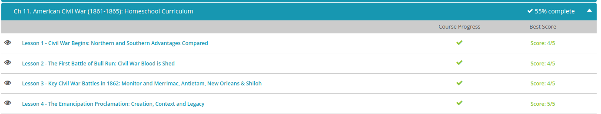

### Andrew Garber
### Nov 2
### US Civil War 

#### North vs South
 - The North had the numbers - period. When it came down to men of fighting age, the Union had the edge by about two to one. But, like I just said, a lot more Southern men were willing (or even excited) to fight. The North also had greater industrial capacity. In war, this meant more and better weapons, like cannons. In fact, in 1860, Northern factories made 97% of the nation's firearms. The combined factors of manpower and weaponry might seem to imply that the Union's infantry would dominate the battlefield. But the Confederacy immediately ramped up manufacturing and established foundries that used repurposed bronze from things like church and plantation bells. And, like the American Revolutionaries a century before, they discovered their own strengths. Before the war, many Southerners knew how to hunt and ride a horse. So the Confederacy developed a skilled cavalry with good aim that could run circles around the Union's big, slow infantry, and they could evade and sabotage the North's powerful artillery.
 - All of the U.S. navy remained in federal hands, and they instituted a blockade of the South shortly after the war started. The blockade certainly cut off their income stream from cotton exports, but the Confederacy didn't need to import much for survival. Their agricultural economy kept the army fed, at least for a little while.
 - Not only was the South able to compensate for all of these seeming disadvantages, they had many strategic advantages that actually gave them the upper hand early on. For example, a majority of the nation's experienced military leaders were Southerners, and seven of the nation's eight military colleges were in Southern territory. While the Union ran through several generals before finding a few effective leaders, the Confederacy had Robert E. Lee and many of his brigadiers almost from the start. They also controlled the Mississippi River Delta, and the Union devoted enormous resources to capturing it. This was critical not only for an effective blockade but also to thwart the Confederacy's plan to push west through New Mexico to the Pacific Ocean.
 - The fact that almost all of the war had been fought on Southern soil might seem like a disadvantage since a lot of farms and factories were destroyed, but they had the home-team advantage. A defensive war is easier both in terms of strategy and popular support.

#### The first battle of bull run
 - With Congress out of session, Lincoln asked for 75,000 troops from all remaining states to defend or retake all Southern garrisons. Rather than send soldiers to assist Lincoln against their own territory, four more Southern states decided to secede (including Virginia), and several of the 'border' slave states refused to send troops. Afraid that Maryland would secede, swallowing Washington, D.C. into the Confederacy, Lincoln dispatched troops to protect the capital. When a mob of 20,000 secessionists in Baltimore attempted to derail a train full of these soldiers on April 19, Lincoln arrested the men and suspended the writ of habeas corpus (meaning they lost their Constitutional right to face a judge before being imprisoned). On the same day, he set up a naval blockade of Southern ports which soon extended from Virginia to Texas.
 - Meanwhile, the Confederacy set up their new capital at Richmond, Virginia, and Southern troops moved in to protect it. Union General Irvin McDowell hesitated to attack, believing his troops were not adequately trained. But by July, Northern leaders - including President Lincoln - were growing impatient. The troops only had a 90-day enlistment period. Everyone wanted a decisive battle to invade the Confederate capital and end this nonsense once and for all. So on July 21, 1861, the Union Army finally advanced, trailed by naive and excited picnickers from Washington D.C. who expected to see their soldiers call the Confederacy's bluff and go home triumphant. 
 - General McDowell had a three-part plan of attack, which was way too complicated for an inexperienced army, and his movements were too slow to prevent the South from consolidating its forces. Following some initial success, Union troops followed the retreating Southerners over a hill, where they encountered the brigade of Confederate General Thomas Jackson stationed there, as one of his colleagues declared, 'like a stone wall.' The North was unable to penetrate Stonewall Jackson's line. Later that afternoon, Jackson ordered his troops to 'yell like furies' and advance. The charge, complete with the first so-called 'rebel yell,' successfully captured the Union artillery and turned them, inciting a panicked retreat by both soldiers and civilians back to Washington.

#### The Emancipation Proclamation  
 - For most of his political career on record, Abraham Lincoln had deep misgivings about emancipation. He later told one of his generals that he had struggled to avoid the issue of slavery throughout the Civil War. But as the war approached its third devastating year with no end in sight, he began to consider all of his options. At least twice in 1862, he had broached the subject with his political and military advisors and with Congress. Chief Justice of the Supreme Court, Roger Taney, advised the president that he had no such Constitutional authority. Lincoln disagreed; he believed the Constitution clearly empowered the nation's leaders to defend and preserve the Union, and he felt that setting the South's slaves free would help accomplish that goal. On July 22, 1862, he read a preliminary draft of the Emancipation Proclamation to his cabinet. According to one historian, he even told them he had made a covenant with God to release it. They suggested he wait until after an important military victory to go public.
 - Congress had recently passed a law allowing troops to confiscate property, including slaves. So, the president knew there was public and political support for the measure. Then, the Battle of Antietam gave him the opportunity he needed. On September 22, President Lincoln issued an ultimatum to the states in rebellion: lay down your arms, or I will free all of your slaves on New Year's Day. As you might have expected, no one took him up on the offer. So, the Emancipation Proclamation was published, declaring, 'All persons held as slaves within any State or designated part of a State, the people whereof shall then be in rebellion against the United States, shall be then, thenceforward, and forever free.' The Emancipation Proclamation went into effect on January 1, 1863, freeing three million African American slaves in the Confederacy.

