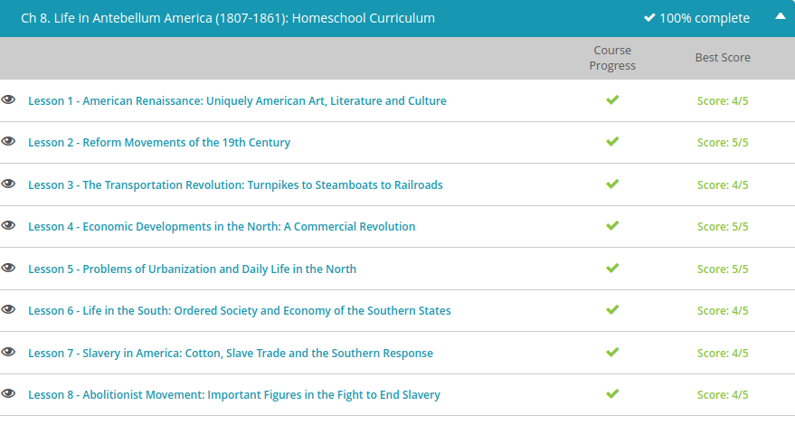

### Andrew Garber
### October 21
### Life in Antebellum America

#### American Renaissance
 - Romanticism, for example, was a reaction to the hyper-rational, scientific approach of the European Enlightenment that said all experience had to be observable and measurable to be valid. Of course, the American Revolution did owe its origins to Enlightenment ideals. But Romanticism didn't exactly throw out the Enlightenment; it just validated emotional experience, too. As a whole, Romanticism affected visual art, music, and literature. Unfortunately, history was also influenced by Romanticism, as stories of the past were sometimes colored incorrectly through the Romantic lens.
 - Its style fit so well with the American ideals of individualism, freedom, the goodness of nature, and morality over religion. Another important theme was nationalism. Romanticism was especially influential in American painting and literature.
 - Artists had been painting the American people for 200 years. But no one had been painting the American landscape. When a man named Thomas Cole took a boat ride up the Hudson River in 1825, he was inspired to paint the scenery, and thus was born the Hudson River School: a movement of artists who created romantic landscapes of the Hudson River Valley. A second generation of artists painted beyond the geographic borders of the Hudson, depicting the grandeur of the American frontier and nationalistic themes of discovery, exploration, and settlement. 
 - Romanticism also influenced American writers. In this period, we see novels, short stories, and poems instead of the sermons and essays of the colonial period. Just like the visual art, Romantic literature emphasizes emotion, freedom, personal experience, and morality. Unlike the painters, many American authors and their works are household names: The Legend of Sleepy Hollow, The Scarlet Letter, Moby-Dick, many poems by Walt Whitman, and countless stories by Edgar Allan Poe.
 - Romanticism gave birth to a very American philosophical movement called transcendentalism. At its core, transcendentalism emphasized the belief that by communing directly with nature, humans could transcend the sensory world and reach the supernatural. Intuition was much more important than fact, imagination better than the senses. People were born good but were corrupted by the institutions of society. As such, the transcendentalists inspired a number of very progressive reform movements aimed at improving society such as abolition, feminism, and education. Transcendentalism's legacy can still be seen in Americans' tendency toward self-reliance.
 - The most important transcendentalists were Ralph Waldo Emerson and Henry David Thoreau. Emerson told Americans to stop imitating other people and just be themselves. He encouraged Americans to ''Hitch your wagon to a star!'' and set high personal goals and standards. Two of his best-known works are an essay titled, simply, ''Nature,'' and another called ''Self-Reliance.'' Henry David Thoreau didn't just write about theory, he put it into practice. For two years, he lived in the wilderness near Walden Pond, built his own cabin and tried to be completely self-reliant. He wrote about this experience in a famous book called Walden.
 - The mid-1800s also saw the dawning of several utopian communes. Though they had varying goals, by definition, utopians are trying to create a perfect world. Brook Farm, the earliest such community, was founded on transcendental ideals and agricultural communism. While Brook Farm was a financial failure lasting only a few years, the Oneida Community (a religious commune) thrived. Its members became infamous for their very progressive beliefs about open sexual relationships. And though the commune fell apart after its founder fled the country ahead of statutory rape charges, their silverware business continued to grow. Oneida flatware has earned a place in many traditional American households to this day.
 - The Church of Jesus Christ of Latter Day Saints, known more commonly as Mormonism, was also introduced in America in this period. Although founded in New York's so-called 'burned over' district and largely adherents of common beliefs at the time, the Mormons gained the ire of their neighbors for their practice of polygamy.

#### Reforms Movements
 - In the 19th Century's Antebellum Era, Americans began several social reform movements influenced by transcendentalism and the Second Great Awakening. Learn about temperance and abolition and explore the reforms they inspired and reform leaders like Horace Mann, Dorothea Dix, Lucretia Mott, and Elizabeth Cady Stanton.
 - The temperance movement sought to limit or even ban the consumption of alcohol. Strongly supported by American Protestants, there were thousands of individual temperance societies at the local level by the 1830s. Temperance group members could be affiliated with any political party - the movement was not structured around partisanship.
 - Although it took nearly a century, the temperance movement was finally successful with the ratification of the 18th Amendment to the U.S. Constitution in 1919. Commonly called 'Prohibition,' the measure caused a set of unforeseen problems and was repealed during the Great Depression.
 - By the 1830s, a growing number of concerned Americans began to advocate at all levels for free public education, at least for white boys. In 1837, Horace Mann took control of the new Massachusetts Board of Education and pursued free, equal, non-religious schooling for all social classes, provided by trained, well-paid, professional teachers. His reforms set the standard for public education in the United States, and by 1870, all states had at least some free elementary schools.
 - College opportunities were also expanding beyond the few, exclusive, religious-based universities of the colonial era. By 1840, there were more than 70 institutions of higher education, offering both theological and more practical training. Oberlin College in Ohio was the first coeducational college in America, opening its doors to women in 1833.
 - Reformers, influenced by the ideals of transcendentalism, believed there had to be a better way to rehabilitate criminals. Many early experiments in prison reforms failed, but some lasting reforms began in the 1830s, including literacy programs, prison libraries, and less physical punishment such as whipping.
 - Americans with all kinds of disabilities had also been kept in prison-like warehouses, and it was during this era of reform that asylums were first established. In 1843, Dorothea Dix (later known for her work establishing the nursing corps in the Civil War), told the Massachusetts legislature that the mentally ill were kept ''in cages, closets, cellars, stalls, pens! Chained, naked, beaten with rods, and lashed into obedience!''
 - The best-known of the social reform movements of the antebellum era may be abolition - the effort to end slavery in the United States. There had been abolitionists since colonial days, notably the Quakers, and a vocal minority had tried to abolish slavery with the founding of the nation. But slavery itself had changed with the invention of the cotton gin and the fabulous wealth earned from 'King Cotton.' While Southerners became more committed to maintaining and even expanding the peculiar institution, many Northerners began to see slavery as a moral evil.
 - American Colonization Society advocated purchasing all existing slaves and then relocating them back to Africa; they even established the colony of Liberia in 1822. On the other hand, abolitionists like William Lloyd Garrison suggested that slaves should immediately be set free without compensation to owners and the freedmen granted full rights and citizenship within America. A number of former slaves helped generate momentum for the abolition movement mid-century, and another push came from Harriet Beecher Stowe's novel Uncle Tom's Cabin in 1852.
 - In early America (as in most parts of the western world), women had virtually no political rights, being unable to own property when married, make contracts, vote, or bring a lawsuit. Yet they were outspoken leaders in many of the 19th century social reforms, especially abolition.
 - Two of the ladies who were excluded from the Anti-Slavery Convention in London - Lucretia Mott and Elizabeth Cady Stanton - became friends and, eight years later, organized their own convention in Seneca Falls, New York, to bring attention to women's rights. About 300 women turned out for the Seneca Falls Convention in 1848, where they heard Stanton read her Declaration of Sentiments, echoing the words of Thomas Jefferson, ''We hold these truths to be self-evident: that all men and women are created equal...''
 -The convention's organizers, including Stanton, Mott, and Susan B. Anthony, called for improved legal status, economic opportunity, and the right to vote. The Seneca Falls Convention is widely considered the start of the modern feminist movement. And though it was eventually successful in many ways (including suffrage with the 19th amendment), the movement for women's rights was overshadowed by the issue of slavery until after the Civil War.

#### The transportation revolution
 - In 1811, the federal government opened the 'National Road,' connecting the Potomac and Ohio Rivers (and expanding every year) to open up the West for settlers. But, this type of internal improvement was hotly contested in the early nation, since states that didn't benefit resented paying for it. As a result, transportation was mostly left to individual states or to private investors. A number of entrepreneurs and inventors did step up in the mid-19th century, and the transportation revolution provided a number of new, reliable, safe and cost-effective ways to travel to different parts of the nation, including new land in the West.
 - Roads were the most logical place for early improvement in transportation. By 1821, about 4,000 miles of turnpikes, or private roads, crisscrossed the East, connecting to each other and to the National Road (also called the Cumberland Road). They were constructed and maintained by local and state governments or by private investors who made a profit by collecting a toll from people who used the road. 
 - Back in 1807, Robert Fulton had adapted a steam engine for use in a boat called the Clermont. This kind of power allowed the boat to travel up the Hudson River as easily as it could travel down, but skeptics nicknamed the ship 'Fulton's Folly,' doubting it could be commercially successful. They were wrong; within four years, passengers and goods could travel by steamboat all the way from Pittsburgh to the Ohio River and from there to the Mississippi. Travel time and shipping rates dropped dramatically compared to overland transportation. By 1830, more than 200 steamboats ran up and down the rivers, putting cities like Cincinnati and St. Louis on the map. It seemed now the only limit was in the location of the waterways. But soon, even that obstacle was surmounted.
 - Finally, the state of New York decided to act and broke ground on the Erie Canal in 1817. It took eight years and $7 million, but it was a political and financial success.
 - The cost of shipping freight from Buffalo to New York City dropped from $0.19 per ton per mile down to $0.02 during the 1830s. By connecting the interior of the continent to the Atlantic Ocean, the Erie Canal allowed for the settlement of northern Ohio, Indiana and Illinois. It helped open up agriculture and industry since products could now be transported easily, quickly and inexpensively back to the population centers in the East.
 - In 1827, the city of Baltimore did not have a canal, despite being the third largest city in the U.S. A group of merchants and bankers began investigating their options for competing with the Erie Canal and hit upon a completely different idea for transporting people and goods - a railroad. Financed by selling common stock, the Baltimore and Ohio Railroad Company was chartered to open up traffic from the port of Baltimore to the Ohio River, ideally to provide an even faster route to the Midwest than the Erie Canal. With much fanfare, the last surviving signer of the Declaration of Independence, Charles Carroll, was on hand to break ground on the 4th of July, 1828. In 1830, the B&O built Tom Thumb, the first American steam locomotive, proving that steam engines were better than horse-drawn railway cars. 
 - The B&O Railroad was not only the first railroad chartered in the U.S., it was one of the first commercial lines in the world and was enormously successful. By mid-century, tens of millions of dollars' worth of goods passed through the city of Baltimore, generating $2.7 million in profit every year. Baltimore surpassed Charleston and other cities to become the most important economic center in the South.
 - The transportation revolution had dramatic social, economic and political effects. Indirectly, convenient transportation encouraged settlement and transformed agriculture. Much more land could now be developed since farmers had access to national markets. Reduced shipping costs encouraged regional specialization; however, overall, it helped forge a continental economy.

#### Northern Industrial Revolution
 - The Industrial Revolution in America was a century-long process that moved the production of goods from skilled artisans in home business to machines in factories. When Samuel Slater built America's first textile factory in Rhode Island in 1790, he steered New England on a clear economic path. Then Eli Whitney demonstrated interchangeable parts in 1801, setting off half a century of innovations and inventions in American business and manufacturing. By 1850, the value of industrial output surpassed the value of agriculture, signaling a secondary commercial revolution - and almost all of it was in the North.
 - the North came to depend on a commercial economy for their livelihood. The output of goods and services in America increased twelvefold between the turn of the century and the start of the Civil War; two-thirds of these goods and 70% of the workers who made them hailed from factories in the Northeast. Growing transportation networks created a web across the Northeastern and Middle states and connected the North to the West beginning with the Erie Canal and, by mid-century, by railroad tracks. These improvements encouraged even more commerce and population growth, leaving the South increasingly more isolated from the rest of the nation.
 - Invention of the sewing machine midcentury meant all that fabric produced in Northern factories could now be sewn into clothing in Northern factories. Steam engines were adapted for all kinds of machinery, including ships and mills and printing presses. Skilled blacksmiths and small forges gave way to the massive furnaces and rolling mills of Pennsylvania. Even farmers benefitted from machinery such as Cyrus McCormick's(International Harvester) mechanical reaper and John Deere's(John Deere) steel plow.
 - One of the most important patents of the mid-19th century was the process for vulcanizing rubber. This keeps it strong even when heated, and Charles Goodyear's rubber was eventually applied in more than 500 different uses and allowed for the development of the automobile industry.
 - An artist named Samuel Morse needed a supplemental income, and after failing to reach his dying wife's bedside due to a lack of efficient communication, he invented the electric telegraph and Morse code in 1844. His little side job revolutionized communication, allowing for messages to be passed almost instantly over long distances. Within 16 years, telegraph wires crisscrossed the East Coast and reached as far west as the Mississippi River.
 - Factories and industrialization led to more than just economic differences among the regions; they had profound social, political and demographic effects on the young nation. The government stepped in to protect fledgling American industries by passing a series of protective tariffs throughout the first half of the century. These taxes raised the cost of imported goods, making domestic goods more competitive. Praised by industrial regions of the nation, tariffs were a disaster for Southern cotton-growers since the tariffs not only raised prices, they also lowered Britain's ability to buy American cotton.
 - Industrialization also changed business practices for both owners and workers. All this new technology was very expensive. Initially, factories were often paid for through business partnerships, but in the Antebellum Era, corporations became more common. After being chartered by a state, a corporation raises capital from many different investors. Each of them earns a share of the profits while only risking the amount of their original investment.

#### Urbanization
 - Although a majority of Americans still lived in rural or semirural areas, there was tremendous growth in urban areas, called urbanization, partly as a result of movement from farms into towns, like the mill girls, but also due to immigration. In the mid-1800s, more than half of Ireland's population came to the United States, due largely to the Potato Famine, a massive crop failure that left the Irish people starving. Nearly all of them arrived penniless, unable to move out of the cities where their boats landed. More than a million Germans also immigrated for various political and economic reasons, but by contrast, they could often afford to move inland to Midwestern cities like Cincinnati, St. Louis and Milwaukee. By 1860, there were 45 cities with a population of 20,000 people or more, compared to just two when the nation was born.
 - Compared to the immigrants, Lowell Girls had it pretty good. They slept in decent, safe dorm rooms and had plenty to eat. Life in the port cities was much more difficult because the infrastructure couldn't handle the explosive growth. Desperately overcrowded, wooden apartment buildings frequently led to deadly fires, like the Great Fire of New York in 1835, which destroyed 17 blocks of lower Manhattan. Diseases like cholera, typhoid and yellow fever also spread rapidly due to the overcrowding and sanitation problems. There were no sewers, animal waste covered the streets and in New York and Philadelphia, the aquifers and wells were polluted with sewage. An outbreak of cholera in 1832 killed tens of thousands of people in cities worldwide, including 1.5% of the population of New York City.
 - When a rent hike was imposed on the Lowell Girls in 1836, the employees banded together in a 'turn-out' - what we'd call today a strike - protesting that an increase in their room and board was a violation of their contract. After weeks of lost productivity, the factory owners agreed to absorb the increasing cost of living. This, too, signaled a rising era in Northern cities: the labor movement. In an era with very little business or labor regulations, workers had few rights or protections from their employers. And thanks to plentiful immigration from Ireland and Germany, corporations could simply fire workers who got too demanding and hire a new batch of poor, hungry immigrants who didn't complain about having a job.
 - Nativist clubs sprang up throughout the Northeast in the 1840s with strict admission requirements: typically white, American-born, male and Protestant. Members of New York City's secretive Order of the Star Spangled Banner were also called the 'Know-Nothings' because they refused to admit any knowledge of the organization. Eventually, they organized into a political entity called the American Party, which ran former president Millard Fillmore as its candidate in 1856. These groups gave speeches, published magazines and even resorted to violence.

#### Life in the South
 - During the Antebellum period, the North evolved into an industrialized economy, whereas the South relied on agriculture and slave labor. Learn about the Southern economy, the significance of class structure in society, and how an agricultural economy dependent on slave labor impacted Southern views on slavery.
 - The cotton gin and fertile new land available along the Gulf Coast helped the South transition from tobacco to cotton as the main cash crop and shifted the productivity and population from Virginia and the Carolinas down to Louisiana, Mississippi and Alabama. Tobacco was still grown in lower quantities, along with rice, sugar and grains, but cotton was king. With a booming textile industry, both in the North and across the Atlantic, demand and prices for cotton soared. In the mid-19th century, more than three million bales of cotton were produced annually, accounting for 2/3 of all U.S. exports by 1860. Though the practice of importing new slaves had been abolished in 1808, the demand for labor was met both with natural increase and when planters in the upper South sold their slaves to the lower South, sometimes called the 'Old Southwest'. 
 - Though the South was truly a cotton kingdom, there was some industry and development throughout the region. But they had only 19% of the nation's factories, and most of the goods that were manufactured in the South stayed in the South for consumption. For example, there were several textile and flour mills, as well as forges in Tennessee, but they made things that were used by Southern plantations and homes. So, they barely register as exports in terms of value to the economy. What's more, Southern banks were often required by their state charters to engage in other business pursuits, such as operating hotels or digging canals. Therefore, the network of agriculture, industry, banking, commerce and services in the South was economically intertwined.
 - Most white Southerners were yeoman farmers, growing food for themselves and their animals, with just a little extra to sell. They might own a slave or two and as likely as not, worked alongside them in the fields every day. A lower class of whites lived on unproductive land in horrid poverty equal to that of slaves (although they were free). Referred to disparagingly as clay-eaters and other unkind pejoratives, such as 'crackers,' some historians attribute this slur to the fact that most slave drivers - who 'cracked the whip' - came from this underclass of whites.

