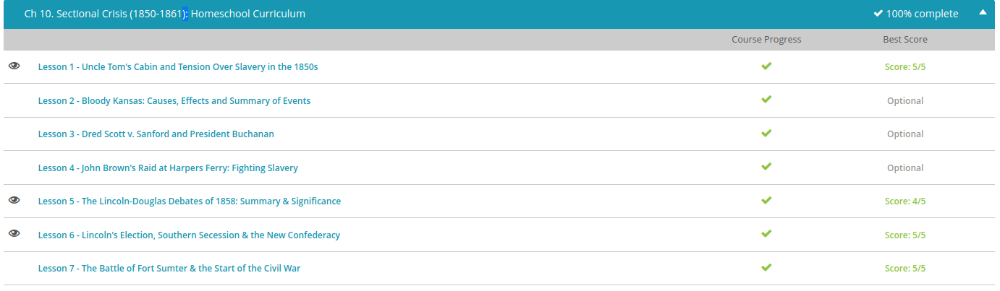

### Andrew Garber
### Nov 1
### Sectional Crisis

#### Uncle Tom's Cabin 
 - In the South, slave owners were the political elite. They had the land, they had the money, and they had the resources. And they filled the state governments. They were also the ones elected to Congress. While in power, their primary purpose was to keep slavery a viable and legal institution. They also had to work to keep the balance of free and slave states or tip it in favor of the South. In the event they failed to do those things, the South was already preparing its next step - secession.
 - In the North, moderate abolitionists like Harriet Beecher Stowe, author of Uncle Tom's Cabin, used the power of the pen to enlighten millions across the English-speaking world to the plight of enslaved people and the horrors of slavery. Other, more militant abolitionists, like John Brown, were more than willing to take the fight to the South through political maneuvering and overt violence, if necessary. Abolitionists felt their cause was just, moral, and right. If the South needed war to teach them that slavery was inhuman, then so be it. They were prepared for the ultimate sacrifice.
 - But more moderate politicians on both sides wanted to avert war at all costs and did what they could to appease southern slave owners. In 1820, one such moderate politician, Henry Clay, gave in to the South in what was to be known as the Missouri Compromise, which maintained the balance of free and slave states but did so by putting off the inevitable. Now, thirty years later, the matter surfaced again within the walls of Congress, and this time, the stakes were higher: nothing less than keeping the Union together.
 - Among the firebrand abolitionists preaching an end to slavery were others that captured the hearts and minds of millions without ever raising their voice or turning to violence. One such voice was Harriet Elizabeth Beecher, who was born on June 14, 1811 in Litchfield, Connecticut. Her weapon of choice against the tyranny of slavery was the pen, but early in her life and career as a writer, she was an unlikely choice to become a champion of the abolitionists.
 - She published her first work at the age of 23, married at 25, and spent much of her young adult life raising an increasingly large family and publishing her works of fiction. By 1850, at the age of 39, Harriet, now with the added Beecher Stowe, became increasingly aware of the plight of people enslaved and those who had run away who were living free in the North.
 -The passage of the Fugitive Slave Act, requiring average citizens to turn in the enslaved people who had run away, was a major catalyst for many like Harriet to become more involved and more active. Her involvement was to put pen to paper and write the seminal work of abolitionist literature and an American Classic, Uncle Tom's Cabin.
 - But what made the story so appealing? Although she had no firsthand knowledge of slavery, Beecher Stowe relied heavily on the writings of other abolitionists and filled her book with memorable characters, such as the pious and ever-patient enslaved person, Uncle Tom, the evil slave driver Simon Legree and the saintly white child, Eva. She wrote with passion and conviction and breathed life into the characters in a way that most Americans had never experienced. These characters were as close as many in the North would ever get to knowing a real enslaved person, slaver or even a southerner, and it had real impact.

#### Lincoln v Douglas 1858
 - Douglas had worked with Henry Clay to win passage of the controversial Compromise of 1850, infamous for its fugitive slave law. But more importantly, Douglas had persuaded Americans to accept the idea of popular sovereignty, meaning new states would decide for themselves whether to accept or ban slavery. It all sounded so democratic, until it came time to put that theory into practice in Kansas.
 -  Douglas's presidential aspirations were dashed, in both 1852 and 1856. Then came a terrible blow to the doctrine of popular sovereignty: the Dred Scott decision. Douglas threw himself into his campaign for re-election to the Senate. Thankfully for him (or so he thought), he was being opposed by the virtually unknown Republican, Abraham Lincoln.
 - So, with the help of a friend who ran the railroad, Douglas traveled the state giving speeches. But wherever he went, the annoying Republican candidate would show up two days later, give voters reasons not to trust Douglas and get the last word in. Finally, Douglas agreed to meet Abraham Lincoln face to face in a series of debates in the remaining Congressional districts in the state.
 - There were seven Lincoln-Douglas debates, in which the two candidates for Senate squared off against each other, challenging the other's ideas about many topics - but most importantly, slavery and its future in the United States. Even though these speeches were intended to help elect their respective parties' state legislators, the events attracted tens of thousands of people. The audience turned the debates into a sporting event, shouting out questions, cheering, booing and laughing. Reporters in Chicago transcribed the speeches, and thanks to the telegraph, the Lincoln-Douglas debates were reported by newspapers across the entire nation and followed closely by the American people. 
 - An even bigger crowd came out to watch the second debate. Lincoln spoke first, mostly answering some direct questions that Douglas had asked him at the previous debate. Then, he posed four of his own questions, largely ridiculing Douglas for his continued support for the doctrine of popular sovereignty. In response, Douglas articulated what has become known as the Freeport Doctrine. Basically, Douglas argued that if the citizens of a state or territory didn't want slavery, it didn't really matter what the Supreme Court said. All they had to do was elect a legislature that wouldn't pass any laws that would enforce or protect it. The Freeport Doctrine was supposed to be a simple means around the Dred Scott decision. But, this idea came back to bite Douglas in the presidential election two years later because Southern Democrats felt he had betrayed them.
 - On election day, neither Lincoln nor Douglas was technically elected to the Senate. But, the voters did choose a Democratic majority for the state of Illinois, which sent Stephen Douglas back to the Senate for another term. However, Republicans actually garnered more total votes in the state; they just didn't win the most voting districts. And the debates themselves had important consequences for the candidates. While Abraham Lincoln was thrust into the national spotlight and helped generate momentum for the Republican party, Stephen Douglas actually angered many of his fellow Democrats and helped divide the party, dooming his chances in the 1860 presidential election.

#### Lincoln's Election
 - The Republican Party painted a romanticized image of 'Honest Abe, the Rail Splitter,' making him the poster child for free labor - proving that even a poor American could climb his way to the top with intelligence and hard work. Republicans campaigned almost exclusively in the North, with limited efforts in border states.
 - Tuesday, November 6, 1860, was Election Day and had the second-highest voter turnout on record at 81.2%. The results were oddly scattered. All four candidates won some states, but only Douglas won states in both the North and South. In fact, Lincoln came in dead last in the Border States and didn't even appear on the ballot in most parts of the South. Breckinridge, for his part, actually won more counties than any other candidate.
 - In the end, Lincoln garnered only about 40% of the popular vote, but because of the population of the North and West, he won the Electoral College easily. Though his opponents declared that Lincoln only won because the Democrats were split, the numbers tell a different story. Even if all anti-Lincoln voters had united behind one candidate, Lincoln would still have carried the Electoral College and become president in 1860. Still, considering 60% of American voters chose anyone but Lincoln, a new question faced the nation: would they accept the results of the election?

