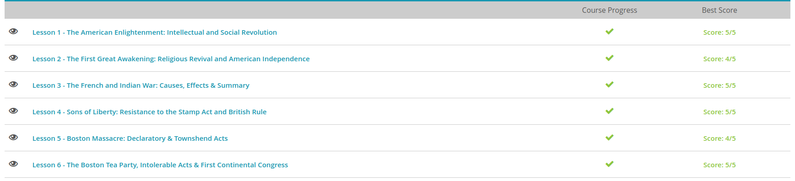

#### Andrew Garber
#### September 13th

#### The American Enlightenment:
 - The Enlightenment reached the colonies through the port cities. At first, such philosophy circulated only among the educated elite. Then, Benjamin Franklin, arguably the single most important figure of the Enlightenment in America, printed inexpensive pamphlets and newspapers to spread the ideas quickly.
 -  A theology, known as rational Christianity, emerged. It taught that God gave humans the ability to reason, allowing them to understand and follow moral teachings, regardless of which religious group they belonged to. Religious tolerance became even more widespread.
 - Deists believed that God created the world and set natural laws into motion and then his work was done. It is up to humans to keep the world running. Deists do not believe that God supernaturally intervenes in the world or human events.
 - Combining these concepts of reason, enlightened government, religious tolerance and natural rights resulted in the American version of republicanism. Don't confuse the Enlightenment philosophy of republicanism with the modern political party. At the time, it was a complete reversal of the idea of divine right.
 - But the Enlightenment was more than just the philosophical background for the American Revolution - it was a blueprint for a modern democratic society. Here, 'democratic' is not a reference to a modern political party, but the concept of a society in which all citizens participate equally. Our earliest documents, including the Declaration of Independence, as well as the constitutions of the United States and all of the original states, cannot be separated from Enlightenment ideals, especially those of John Locke.

#### The Great Awakening
 - One effect of the Enlightenment had been reduced church membership and attendance. An evangelist, named George Whitefield, believed that people weren't going to church because 'dead men preach to them.' Whitefield and others like him began to preach in a much more energetic way. They tried to get their listeners to have a personal, emotional response to their preaching. The goal was for hearers to look at their own souls, to be convicted about their moral failures and then turn their hearts toward God.
 - Like Edwards, Whitefield taught that people needed to have changed, repentant hearts. His admonition that listeners think about how a sermon applies only to themselves was a jab at the Puritan tendency to watch each other for signs of evil. However, many of his sermons also underscored the futility of boring ritual as seen in the Anglican Church he came from. Whitefield is credited with starting the practice of preaching in public, since the Church of England wouldn't give him a pulpit.
 - One of the most famous (or infamous) traveling preachers in the First Great Awakening was James Davenport. Just as the Puritans had done, Davenport taught that people needed to avoid the influence of the Devil in everyday life. He held public bonfires so his followers could burn the things that distracted or tempted them to pride. Non-religious books and luxury items commonly ended up in ashes. 
 - In the North, it challenged the authority of the Puritan church because anyone could step up to the pulpit and share his own testimony. Differences in doctrine came to be seen more as a matter of opinion, not a matter of salvation. The Awakening challenged the social order of the South because slaves were as welcome as anyone else. The idea of salvation being available to anyone directly from God, regardless of race, gender or economic class, made church a thoroughly democratic experience

#### French and Indian War
 - No sooner had New World colonization began than the world's imperial powers were at war over territory, resources and trade routes. The most significant of these conflicts involving America started in present-day Pennsylvania in 1753. But what began as a squabble between colonial governors turned into world war.
 - By the mid-18th century, both the British and French wanted to extend their North American colonies into the land west of the Appalachian Mountains, known then as the Ohio Territory. Each side already had fur traders doing business with Native Americans there and pioneers living on the frontier. A group of wealthy English colonists had even formed an investment company to sell farmland in Ohio. The French believed they had exclusive rights to the land since their explorers had been there first. They tried to force the English out by capturing several of their trading posts and destroying an Indian village that supported English traders in 1752.
 - For years, the American colonists had been asking for permission to raise an army and end the French threat once and for all. The king had been suspicious of their motives and denied their requests, but when the French built Fort Duquesne near present-day Pittsburg, he relented. The Virginia militia, under the command of Major George Washington, was mobilized to ask the French to vacate the Ohio territory peaceably.
 - England didn't gain the upper hand until 1758. A new battle plan organized by the British Prime Minister called for a significant troop surge, new strategy that better suited the frontier, a naval blockade and an alliance with some Native American tribes. This plan coincided with an outbreak of smallpox among France's Indian allies that year. Finally, British forces captured a series of forts - including Ticonderoga, which became an important target for colonial forces a few years later in the American Revolution. Quebec finally fell, and by 1760, England controlled all of New France. The battle for America was over, and France had lost.
 - Though France was clearly the loser in the Seven Years' War, the financial cost of the fighting had saddled England with enormous debt. After making such a huge and expensive and deadly effort to keep America safe from France and its Indian allies, King George III and Parliament felt it was only fair that the colonists help pay for the war through a series of new taxes. The colonists felt differently. When all was said and done, it seemed to the Americans like they were worse off than before.
 - And though many colonists gained valuable military experience, they chaffed at their treatment by English officers and the difference in their pay from 'British Regular' soldiers. They resented the new taxes, which the colonial assemblies hadn't authorized. Then, British Regulars returned to the colonies to enforce the new taxes and the Proclamation line, making the colonists feel even more like second-class citizens. In the end, the most significant effect of the French and Indian War may have been the changed relationship between the colonies and England.

#### Early Resistance 
- Back in 1688, the English prime minister had stated that if no unnecessary restrictions were put on the American colonies, they would continue to grow in wealth and in numbers. So, Britain put few restrictions on America and offered very little military help. This policy has come to be known as salutary neglect. For 80 years, the colonists became accustomed to this arrangement, but it came to an abrupt end in 1763 with a new prime minister, George Grenville. In the aftermath of the French and Indian War, the colonies and the empire struggled to figure out their new relationship
- The Sugar Act, in 1764, increased existing taxes on sugar products and some other imported goods, such as wine, coffee, textiles and indigo. But even more important to the colonists was the punishment for dodging the tax. Violators would be tried at a new court in Canada, depriving colonists of their right to a trial by a jury of their peers. 
- Grenville also passed the Currency Act in 1764, forbidding the colonies from issuing any paper currency. This destabilized the economy of several colonies. 
- When the Stamp Act passed in 1765, word had barely reached the colonies before a fiery young member of the Virginia House of Burgesses, named Patrick Henry, wrote a statement calling for unified opposition to the Stamp Act. He claimed it violated the English Bill of Rights. Only the Virginia assembly could tax Virginians since they were not represented in Parliament. 
- The House of Burgesses passed the Virginia Resolutions in May, newspapers printed them widely and people in other colonies took notice.
- New York merchants started calling for a boycott, asking colonists to voluntarily stop buying the taxed items once the law went into effect. James Otis published a pamphlet convincing colonists that 'Taxation without representation is tyranny.
 - By October, James Otis had called for a Stamp Act Congress to be held in New York City. Representatives of nine colonies attended, and together they wrote a petition to the king requesting the repeal of the Stamp Act before it went into effect. They asserted that it was a violation of their rights as British citizens for a new tax to be placed on them without having direct representation in Parliament

#### Boston Massacre
 - Wars cost money and the French and Indian War, the larger conflict of the Seven Years' War, was no different. This conflict between Great Britain and France left Great Britain in debt and they decided that the best way of filling their coffers would be to look to the colonists. After all, they were protecting the colonists during the conflict and, therefore, the colonists should pay their due share. Of course, this was done without consulting the colonists first.
 - To mollify the angry colonists, the British then passed the Declaratory Act of 1766, which repealed the Stamp Act. However, the Declaratory Act also made it clear to the colonists that they did not have a right to representation in parliament
 - The Townshend Acts levied import taxes on items such as tea, glass, and paper, and the money from these taxes, instead of replacing the financial losses of the French and Indian War, went towards paying the salaries of the colonial governors.
 - Samuel Adams, a leading member of the radical patriot group the Sons of Liberty, took the opportunity to write the Massachusetts Circular Letter and laid out the colonists' grievances against the British and the actions that could be taken. Colonial resistance and an increase in British soldiers was a disaster waiting to happen.
 - A group of rioters gathered to intimidate a single British soldier, Hugh White, who was guarding the Customs House that housed the Massachusetts colony's treasury. In the evening, Hugh White faced a crowd throwing snowballs, rocks, and other projectiles. At some point, Hugh White struck out with the butt of his rifle and someone was injured. Rage took over the crowd and White was in a precarious situation. Hugh White somehow managed to get the message out that he needed help and additional British soldiers arrived. They formed a defensive wall in front of the Customs House. It is unknown whether the first shot from the British was intentional or not, but after the first shot, allegedly by soldier Hugh Montgomery, a fusillade ripped through the crowd. By the time the firing stopped, the colonists had to contend with many wounded survivors and, in the end, five of the colonists died.
 - The aftermath of the Boston Massacre was a boon for revolutionary propagandists, like Paul Revere. Instead of quelling the colonists, it invigorated them. The British were depicted as murderers and their character impugned, while colonists were portrayed as the exact opposite. The fact that both sides were probably equally guilty in the event did not seem to have any impact. The British soldiers were put on trial for their actions and defended by none other than John Adams, the future second president of the United States and the cousin of Samuel Adams. Most were found not guilty and a couple received brandings as a punishment for manslaughter.

#### The Boston Tea Party
 -  1773, the Prime Minister believed he could solve everyone's problem. He wrote a new Tea Act allowing the Company to bring shiploads of tea directly to America. They didn't have to go through English merchants, and they didn't have to pay export duties on the shipments. So, even though the colonists would have to pay an import tax, the tea was still less expensive.
 - American merchants stirred up opposition to the Tea Act, saying that they were still being taxed without representation. In October 1773, a group of colonists in Philadelphia managed to force the resignation of British tea agents after being threatened with tar and feathering
 - On December 16, 1773, as many as one hundred and fifty men (a few of whom were dressed as Indians) dumped the ships' cargo - valued at nearly one million dollars today - overboard into the sea.
 - In response to the Boston Tea Party, Parliament passed a series of resolutions in 1774 called the Coercive Acts. Massachusetts was placed under martial law, and the Quartering Act was reinstated. All forms of local legislation were forbidden, and the commander of the British army in America was appointed governor of Massachusetts. Perhaps most importantly, Boston Harbor was closed until the people responsible for the destruction of the tea stepped forward and paid its full value.
 - Each of the colonies had organized secret governments, called the committees of safety, to direct their militias. Delegates from twelve colonies were chosen from among them to meet in Philadelphia because it was the most centrally located city. Only Georgia wasn't present, though historians debate the reason. During the months of September and October 1774, the First Continental Congress met to assert their rights within the British government, not to rebel against it.
 - Many in England were incensed by the Congress and its work, but William Pitt (for whom Pittsburgh is named) defended the colonies. Parliament passed the Conciliatory Resolution, relieving taxes for colonies that supported the government. But before news of the law could reach the colonies, war had broken out.

Quiz Results:
 - 