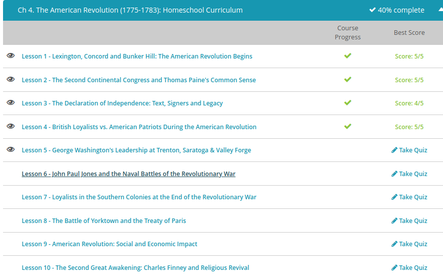
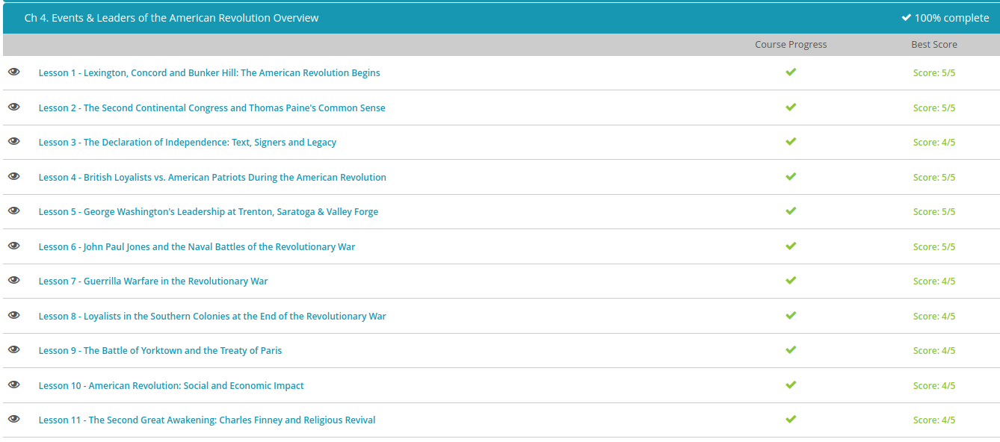

#### Andrew Garber
#### September 14th
#### The American Revolution

#### Lexington, Concord, Bunker Hill
 - Following the Boston Tea Party and the passing of the Coercive Acts, General Thomas Gage a man familiar with warfare in the colonies was sent back to Massachusets as Military Governor. 
 - he got wind of a planned revolt in the countryside around Boston, he was ordered to carry out a top-secret plan to destroy the weapons that the Massachusetts militia was stockpiling in a little town called Concord and then arrest the men who seemed to be the biggest troublemakers: Sam Adams and John Hancock
 - The militia in Concord had moved the weapons to safety long before the date of the raid. So on April 19, 1775, the colonists couldn't be absolutely sure that the British would go to Concord, and if they did, how they would get there and how many troops there would be. They planned a secret method of communicating the information once it was available. If the army was leaving Boston over land, the Patriots would light one lamp in the bell tower of the Old North Church.
 - Thousands of men headed to Concord. In the village of Lexington, about 70 local men and teenagers assembled in the village commons to slow the advance of a thousand deadly British regulars while a few hundred onlookers watched from the outskirts. Their captain told them 'Stand your ground; don't fire unless fired upon, but if they mean to have a war, let it begin here.'
 - The British regulars tried to intimidate the militia and hold a strategic bridge to prevent them from unifying. But American knowledge of the land and a significant manpower advantage allowed the militia to inflict hundreds of casualties on the British troops. Their hasty and disorganized retreat to Boston was even worse. They took heavy fire from militia hidden in trees, behind fences and along the roads, suffering many more casualties, including all but one of their officers, before they were rescued by a reinforcement of another thousand British soldiers from Boston. 
 - The British regulars tried to intimidate the militia and hold a strategic bridge to prevent them from unifying. But American knowledge of the land and a significant manpower advantage allowed the militia to inflict hundreds of casualties on the British troops. Their hasty and disorganized retreat to Boston was even worse. They took heavy fire from militia hidden in trees, behind fences and along the roads, suffering many more casualties, including all but one of their officers, before they were rescued by a reinforcement of another thousand British soldiers from Boston. 
 - Before dawn on May 10, 1775, the fort and its armory were taken without firing a shot. Arnold was encouraged to push the American army farther into Canada, but an attempted invasion of Quebec was a humiliating defeat
 - Technically, the Congress had no authority to pass binding resolutions, but in the spirit of republicanism, the colonists gave them their legitimacy, and as time passed and the conflict intensified, the Congress asserted more and more authority. One of their most important early actions was to name George Washington, a trained, experienced British officer, as the commander of the Continental Army,
 - The Americans had the high ground but had fewer men and little ammunition. Under now-famous orders, 'Don't fire until you see the whites of their eyes,' the first British lines up the hill suffered heavy losses. But there were more British soldiers than American bullets.
 - Technically, the British won the battle when the militia ran out of ammunition, but not before nearly a thousand British soldiers were dead or wounded, including 92 officers - more British casualties than any other single battle of the war. They secured both Bunker and Breed's Hills, but the costly win did not help them break the siege, which lasted 11 months.
 

#### The Second Continental Congress, Common Sense
 - Though Washington volunteered to lead the Continental Army without pay, the army would still need to be supplied with food and ammunition. So, Congress agreed to print Continental Currency - a violation of the 1774 Currency Act - and borrowed money from wealthy colonists and foreign banks. They authorized the Committee of Secret Correspondence to initiate diplomatic relations with foreign governments, like France (who aided the rebels secretly for a while), and to conduct covert intelligence operations in the colonies and abroad.
 - Despite these obvious war preparations, the Second Continental Congress went to great lengths to pledge their loyalty to Great Britain as long as they were granted full rights. They sent the Olive Branch Petition on July 8, 1775. This letter insisted that the colonies wanted to negotiate trade and tax regulations with Great Britain, not gain independence.
 - He brought in Hessian mercenaries to squash the escalating revolt. This was a slap in the face to the colonists. Why would the King send freelance German soldiers to control British citizens? This action helped strengthen the position of the radicals who were calling for independence. Finally, in May of 1776, Congress passed a resolution that really was treasonous; they overthrew royal governments where they existed in the colonies and set up new Patriot governments.
 - In January 1776, Thomas Paine released a pamphlet titled Common Sense. Using the emotional, Biblical arguments and progressive style of logic employed by preachers of the Great Awakening, Paine made the case that America needed to rebel against British rule. Considering how many people lived in the colonies at the time, Common Sense was more widely distributed than any book in American history
 - On July 2, 1776, the Continental Congress voted in favor of independence, though not unanimously. Benjamin Franklin famously encouraged all of the delegates to vote in favor of independence by saying 'We must all hang together, or assuredly we shall all hang separately.'
 - During the American Revolution, colonists like Benjamin Franklin who supported republicanism and eventually, independence, came to be known as Patriots. Historians estimate that about 40-45% of white men were patriots. Those men who chose to continue supporting the king, like William Franklin, were called Loyalists, or Tories. They made up about 15-20% of the white male population. The last 35-45% never publicly chose sides.
 - Just like political affiliations today, loyalists, patriots, and neutrals came from all social and economic classes, and many people took sides based not on principle but on who they thought was going to win or which side would profit them the most personally. But then, as now, there were demographic trends.
 - There was another large segment of the population that had definite opinions, but no political voice, notably women, African-Americans, and Native Americans. Married women generally chose the same side as their husbands. But a divided household (when a patriot woman's husband was a loyalist) was legal grounds for divorce. Native Americans who chose a side tended to be Loyalists, since the Proclamation Line had demonstrated Britain's willingness to respect their interests.

#### Quiz Results Day 1

#### George Washington's Leadership
 - 1776 started well for the Americans, but it was the year the Revolution almost died. In March, the Continental Army forced the British out of Boston. But shortly after the signing of the Declaration of Independence in August, the imperial army returned, landing this time in New York. The well-trained, well-equipped British fighting machine overwhelmed Washington's ragtag band of militia in the biggest battle of the war. 
  - On September 11, 1776, the British commander offered peace and an end to the war. All the Americans had to do was retract the Declaration of Independence. Everything else would be forgiven. The Americans, led by John Adams, refused these terms.
  -  The Continental Army had dwindled from an impressive 20,000 troops in March to just 5,000 by winter. Unlike the British regulars, Americans weren't professional soldiers, and their interests were divided
  - Washington needed to act decisively, knowing that his next move could mean life or death for the Revolution. In a surprise move, he led a stealthy attack on Christmas 1776. He crossed the Delaware River in the middle of a stormy night, taking the British army - comprised mostly of Hessian troops - completely off guard
  - The Battle of Saratoga proved to be the turning point of the Revolutionary War. Of course, it was an important military success, minimizing the threat from Canada. More importantly, it was a political victory. Early in the war, Benjamin Franklin had petitioned France for help. They sent secret financial aid but refused to send soldiers. (Although, despite this ban, many Frenchmen did travel to America and enlist on their own. Perhaps the most valuable of these volunteers was the Marquis de Lafayette, who paid to outfit his own ship, arrived in America as a major general and proved himself to be a valuable military leader.) However, following the victory at Saratoga, France formed an alliance with the United States of America.
  - Washington wisely decided to use the winter to his advantage and found help from the Marquis de Lafayette as well as a Prussian officer named Baron von Steuben. He figured that keeping the men busy would not only improve morale, it would make his men better on the battlefield and more efficient behind the lines. Though history has revealed that von Steuben was not truly a baron and that he had inflated his credentials, he was effective in systematically training the American soldiers based on the Prussian military system.

#### John Paul Jones and the fledgling naval war
 - Rather than give in to the owner of a merchant fleet who refused to sell his supplies unless the town gave him wood to build soldiers' barracks in Boston, the townsmen of Machias, Maine, had plotted to arrest the owner and seize the ships' cargo; however, the crew had spotted the militia, fled to the safety of the British military escort, and set sail. After commandeering one of the merchant ships, the militia armed themselves as best they could and overtook the British Navy schooner. After ramming her side, 40 patriots boarded the enemy vessel, killed her commander, and took control of the ship.
 - When the Declaration of Independence was signed the following summer, the United States had just 31 ships. Some states had ships, which were added to the service, and Congress authorized the construction of many more throughout the war. The world's first military submarine was even built.
 - To boost their maritime power, the Continental Congress and some states issued Letters of Marque to private ship owners, authorizing them to attack foreign ships during war. They were paid a percentage of the value they seized, so incentive was high. These commissioned private vessels were called privateers, and though their actions aren't well known, they played an important role in gaining independence.
 - But even with 2,000 Letters of Marque issued, America's Navy was still tiny, and with no ships of the line, it couldn't face off against the British fleet. What they could do was impede British troop and supply movement in the freshwater of the American continent, raid English colonies, and capture British merchant ships throughout the Atlantic, the Caribbean, and even English waters.
 - Born John Paul, the young Scotsman was apprenticed to a sailor at the age of 13, served on board many slaving missions, and earned his first command at the age of 21. He might have spent his entire life on board British merchant ships if not for a fateful trip to the Caribbean in which his crew mutinied. After killing one of the rebels, John Paul escaped to America in 1773 and added the surname Jones to avoid detection. He volunteered for naval service immediately when the war erupted in 1775. The following year, he defeated 16 British ships on a single mission.
 - Early in 1778, John Paul Jones commanded the first American ship to be formally recognized by the French, receiving a nine-gun salute. Jones then took the war to England's shores, attacking a seaside village in hopes of taking a hostage that could be exchanged for American prisoners of war. The voyage was unsuccessful, but the aggressive move caught the British off-guard and led him to His Majesty's Ship Drake, anchored nearby, which he successfully captured after barely an hour.
  - But Jones is perhaps most famous for his 1779 victory over His Majesty's Ship Serapis. When his ship's rigging became entangled, all but two of her guns were out of action, and with water pouring through several holes in the ship's hull, the British captain asked Jones if he was ready to surrender. He famously replied 'I have not yet begun to fight!' After hours of bloody hand-to-hand combat, the Serapis surrendered when a grenade exploded her ammunition. Though both the Serapis and the American ship were lost, Jones had still earned the surrender of a British warship and took Scarborough (an accompanying British ship) as a prize. This victory at sea was rivaled only by Washington's defeat of General Burgoyne in terms of garnering international attention to the conflict between Britain and her rebellious colonies.

#### Guerilla Warfare in the Revolutionary War
- For centuries, small armies have relied on guerrilla warfare to help even the odds. This includes non-traditional wartime tactics like ambushing, sabotage, and raids rather than direct engagements. Guerrilla warfare is not meant to really defeat an opponent; instead, the idea is to make the war drag on and become so expensive that your adversary gives up.
 - Added to this, if you command a significant force, as Washington did in the Revolutionary War, even if it is still smaller than your enemy you can commit acts of mass sabotage and attrition on the enemies supply lines due to faster movement and easier dispersion to avoid capture, winning a slow war of attrition.
 - The battles of Lexington and Concord resulted in the first shots of the Revolution, as well as the first uses of guerrilla tactics. This would occur throughout the Revolution, but it wasn't quite as widespread as many people think, especially in the northern states. Most of these battles were fought by the Continental army, which behaved more like a traditional military and less like the local militias. Still, Washington was certainly not above guerrilla tactics, and he used them to his advantage.

#### Loyalists in the South at the end of the war
 - Colonists in the South were much more likely to be pro-British, and the Southern Strategy counted on these Loyalist, or Tory, forces to help them hold territory while the regular army moved on. Tories and Patriots had already clashed in Virginia and North Carolina earlier in the war; the crown now hoped to intensify that conflict.
 - Back in 1775, the royal governor of Virginia had offered freedom to slaves who fought for the British. That move backfired. When the so-called 'Ethiopian Regiment' was crippled by a smallpox outbreak, the slaveholding elites banded together and expelled both the governor and his freedmen from Virginia. But by 1779, the new commander-in-chief of the British forces in North America decided that the idea deserved to be revisited.
 - General Henry Clinton issued the carefully drafted Philipsburg Proclamation, effectively freeing any slaves owned by Patriots. In this way, he could bolster his troop numbers without angering slaveholding Loyalists and disrupt the Patriot economy. The proclamation had mixed results. Estimates vary widely, but by war's end, the British evacuated 3,000-4,000 freedmen out of as many as 100,000 slaves who attempted to leave their owners. Not all of them were successful in escaping. Not all of them were Loyalists
 - After reforming the Patriot army in North Carolina, Gates ignored good advice and marched his untested troops south. He planned to attack a major crossroads at Camden, South Carolina and secure the back country of the state. In all respects, the Battle of Camden was one of the worst defeats in American military history. Before they even fired a single volley, the inexperienced militia on the American left flank literally ran from the battlefield in the face of British bayonets, and General Gates went with them. The battle-tested right flank held its ground for a time but couldn't withstand the onslaught of the full British army. Their commander was killed, and the state was lost.
 - war. He was counting on Loyalists to hold onto the Deep South. Meanwhile, with his back to the Chesapeake Bay, Cornwallis believed that his position in Yorktown was a good launching point for raids on the American supply line while providing an easy means of retreat to New York by sea if that became necessary. He was dead wrong.

#### The Battle of Yorktown
 - The French fleet was leaving the West Indies and heading to Yorktown. They would arrive within a month. The French army moved down from Rhode Island to join the American forces right under the nose of the redcoats. Moving thousands of men and animals secretly for several hundred miles would be a challenge today, but without the modern conveniences of roads or bridges, it seems impossible.
 - To try and slip away without being noticed, Washington established a decoy force, suggesting to the British that he was planning to attack their base in New York City. About two weeks later, the British commander-in-chief learned from a scout that the Americans were past Philadelphia. He desperately tried to get word to General Cornwallis. But by September 5, Cornwallis didn't need anyone to tell him he was in trouble. The French navy had arrived.
 - A British fleet from New York was dispatched and the two rivals clashed at sea in the Battle of the Chesapeake. On September 16, the British attack fleet retreated to New York with their tails between their legs, leaving General Cornwallis pinned against the bay with France at his back and the combined army approaching from the front. At least 7,000 land forces arrived on September 28, joined by more than 3,000 French marines. The British army was surrounded.
 - Back in England, King George insisted he could send more troops and win the war, but he didn't have any support in Parliament or among the English people. The surrender at Yorktown marked the end of the American Revolution. However, it would be two more years before the various navies resolved their fights overseas, British troops evacuated the United States and a peace treaty was signed.
 - In the peace talks that followed, the Americans' top priority, of course, was independence. Spain wanted Gibraltar, and France wanted some of the sugar islands in the Caribbean. Great Britain took advantage of the different interests among its enemies and proposed a secret meeting with America. Wanting the most favorable terms, the American delegation accepted, despite having been directed by Congress to work with France. By offering independence to the Americans but refusing the other nations' demands, Britain was able to keep her enemies from banding together.

#### Quiz Day 4

