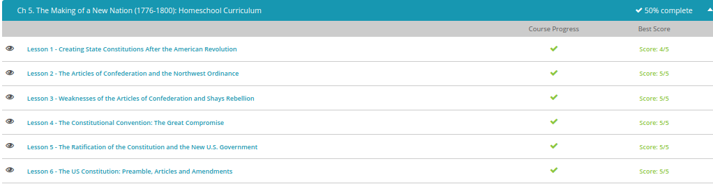

### Andrew Garber
### September 21
### Chapter 5 Making of a new nation

#### Creating State Constitutions
 - Pennsylvania wrote the most radical of the first state constitutions. Taking the idea of popular rule to its logical conclusion, Pennsylvania created a very unique state government. The Pennsylvania constitution got rid of property requirements for voting and for holding office. All adult males who paid taxes were allowed to vote and to run for office. This was a drastic change in who could be looked at as a political person, but this was not the most radical thing about Pennsylvania's new government. Pennsylvania got rid of their governor and had a unicameral government, meaning the legislature had only one body.
 - This Pennsylvania plan did not sit well with many of the more conservative patriots. Many saw the Pennsylvania constitution could lead to little more than disorganization and mob rule. As John Adams put it: 'so democratical that it must produce confusion and every evil work.' It is important to remember that many of the U.S. founders feared democracy as mob rule and felt a need to defend against too direct of a democracy.
 - In 1778, South Carolina created its new constitution at the opposite end of the political view from Pennsylvania. In South Carolina, only white men who possessed a good deal of property could vote, and they had to own even more to be allowed to run for office. Actually, these property requirements were so high that 90 percent of all white adults were prevented from running for political office!
 - In 1780, the writing of the Massachusetts constitution gave another example to answer questions about the role of 'the people' in creating a republican government. The state legislature presented the voters with a proposed constitution in 1778. It was rejected because the people thought if the government could make its own rules, then it could change them whenever it wanted and easily infringe on peoples' freedoms. Following through on this, Massachusetts held a special convention in 1780 where representatives elected just for this process met to decide on the best framework for the new state government.

#### The Articles of Confederation and the Northwest Ordinance
 - Under the Articles of Confederation, the congress was tasked with creating and maintaining an army, and they could request states to send soldiers, but they couldn't demand or enforce the request. Also, under the Articles of Confederation, the central government could print money, but they could not tax. The federal government could request that all of the states pay their fair share, not mandate it.
 - The printing of money to pay for the war, but having no way to back the money led to horrible inflation. By the end of the war, everyone had fistfuls of worthless money! When the states were asked to raise taxes to back the currency, most just refused and just began printing their own money, which then also succumbed to the same inflation.
 - Congress had one success under the articles. In 1787, it passed the Northwest Ordinance to establish a process for admitting territories to the Union as states. Each territory was to be governed by Congress until it had 5,000 free, white males. Then settlers could vote whether to become a permanent state with all the rights of the other states in the Union.

#### Weakness of the Articles of Confederation
 - During the Revolution, men were off fighting for the new nation. Many of them had to take out loans to keep their farms going in their absence. After the war, the creditors wanted their money. Sometimes the states backed the debtors and ordered the creditors to forgive the debts. But, sometimes they backed the creditors and the peoples' farms - their homes - were foreclosed. Many men were put in debtor prison until family members could come up with the money to get them out.
 - As this was happening, people turned to the leaders they had in the war. One of these leaders was Daniel Shays of Massachusetts. Daniel Shays and the other farmers pick up their guns and go to the state courthouse to stop them from foreclosing on their homes, and it worked. You see, with no standing American military, it was the job of the state militia to put down this rebellion. Shays and the farmers were the state militia. Under the Articles of Confederation, the new government couldn't raise revenue, couldn't enforce laws to help the people and did not have the power to forcibly put down a rebellion.

#### Constitutional Convention and the Great Compromise
 - It's 1787. The Articles of Confederation have proven to be too weak to create a workable government. At the Philadelphia State House, now called Independence Hall, the same place where the Declaration of Independence had been signed 11 years before, for four months 55 delegates from 12 of the 13 states met to frame a Constitution for a federal republic that would last to today and beyond.
 - The states decided who they would send to the Constitutional Convention as delegates. Several prominent figures did not attend. John Adams, Thomas Jefferson, and Patrick Henry were among those who were not in attendance. Henry, who once said, 'Give me liberty or give me death,' now said, 'I smell a rat.' Of those who did attend, George Washington, who was noted for his patience and fairness, was selected as the presiding officer. 55 delegates attended. Today, they are usually regarded as great sages, but the delegates were mostly lawyers, merchants, and planters who were there to represent their personal and/or regional interests. It is amazing how the group on several occasions was able to look past those personal interests and make amazing compromises.
 - The New Jersey Plan is the plan for the little states. New Jersey isn't the smallest state, but it certainly isn't big. They came up with a plan that the little guys thought was fair: all states get an equal number of representatives in the new government regardless of state size. The Virginia Plan is the plan for the big states. Virginia is a big state with lots of people. The Virginia Plan said that each state should gain representation based on population. This would of course mean that Virginia would get far more representation than New Jersey.
 - Since both plans had a bicameral legislature, the answer was really quite simple. Two separate houses would be established - one by population, as wanted for big states in the Virginia Plan, and one where all states get equal representation, as wanted by the little states in the New Jersey Plan. This compromise is why today we have the Senate with two senators for each state (we could call it the New Jersey Plan Senator House) and the House of Representatives, which has each state's representatives decided by population (we could call this the Virginia Plan House). Of course, today Virginia has 11 representatives - it doesn't seem that big next to California's 53.

#### Federalists vs Anti Federalists
 - The Antifederalists opposed the Constitution. Many of them kept arguing that the delegates had exceeded their authority by replacing the Articles of Confederation with what they saw as an illegal document. Many said the delegates were a well-born aristocracy and had written a document that only served their own interests and only reserved rights for the property owning upper class. A common big objection was that the Constitution gave too much power to the national government. There was fear that a representative government could not manage a republic this large.
 - Three men, Alexander Hamilton, James Madison and John Jay, responded to Clinton's writings. They wrote 85 essays for New York newspapers. Later these papers were collected into two volumes with the title The Federalist. These essays analyzed the Constitution, laid out the details and the thoughts of the framers and responded to the Antifederalists' concerns. To the issue of a Bill of Rights, the Federalists argued that a set list might not be complete and that the new national government was so controlled by the Constitution that it could not threaten the rights of individual citizens. During debate in Virginia, James Madison ceded the point that a Bill of Rights was needed, and the Federalists guaranteed that first on the agenda for the new government would be the adoption of a Bill of Rights.

#### Quiz Results:
