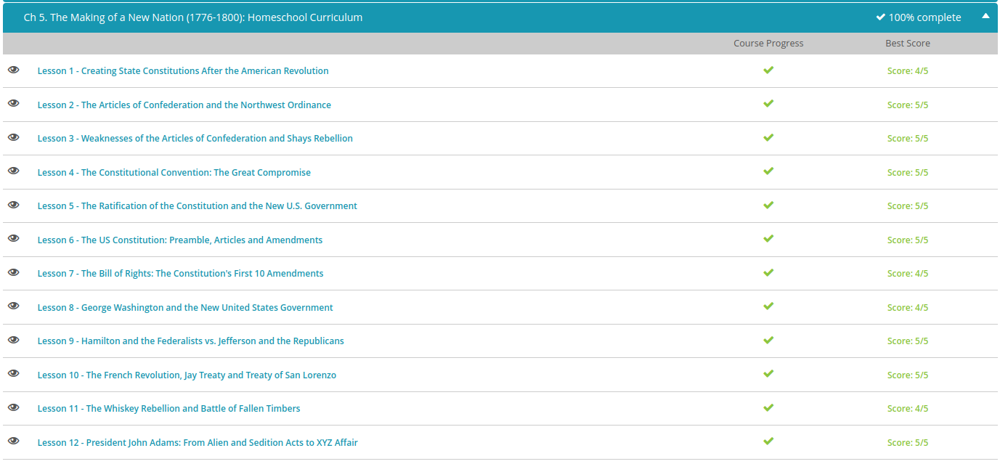

### Andrew Garber
### September 21
### Chapter 5 Making of a new nation

#### Creating State Constitutions
 - Pennsylvania wrote the most radical of the first state constitutions. Taking the idea of popular rule to its logical conclusion, Pennsylvania created a very unique state government. The Pennsylvania constitution got rid of property requirements for voting and for holding office. All adult males who paid taxes were allowed to vote and to run for office. This was a drastic change in who could be looked at as a political person, but this was not the most radical thing about Pennsylvania's new government. Pennsylvania got rid of their governor and had a unicameral government, meaning the legislature had only one body.
 - This Pennsylvania plan did not sit well with many of the more conservative patriots. Many saw the Pennsylvania constitution could lead to little more than disorganization and mob rule. As John Adams put it: 'so democratical that it must produce confusion and every evil work.' It is important to remember that many of the U.S. founders feared democracy as mob rule and felt a need to defend against too direct of a democracy.
 - In 1778, South Carolina created its new constitution at the opposite end of the political view from Pennsylvania. In South Carolina, only white men who possessed a good deal of property could vote, and they had to own even more to be allowed to run for office. Actually, these property requirements were so high that 90 percent of all white adults were prevented from running for political office!
 - In 1780, the writing of the Massachusetts constitution gave another example to answer questions about the role of 'the people' in creating a republican government. The state legislature presented the voters with a proposed constitution in 1778. It was rejected because the people thought if the government could make its own rules, then it could change them whenever it wanted and easily infringe on peoples' freedoms. Following through on this, Massachusetts held a special convention in 1780 where representatives elected just for this process met to decide on the best framework for the new state government.

#### The Articles of Confederation and the Northwest Ordinance
 - Under the Articles of Confederation, the congress was tasked with creating and maintaining an army, and they could request states to send soldiers, but they couldn't demand or enforce the request. Also, under the Articles of Confederation, the central government could print money, but they could not tax. The federal government could request that all of the states pay their fair share, not mandate it.
 - The printing of money to pay for the war, but having no way to back the money led to horrible inflation. By the end of the war, everyone had fistfuls of worthless money! When the states were asked to raise taxes to back the currency, most just refused and just began printing their own money, which then also succumbed to the same inflation.
 - Congress had one success under the articles. In 1787, it passed the Northwest Ordinance to establish a process for admitting territories to the Union as states. Each territory was to be governed by Congress until it had 5,000 free, white males. Then settlers could vote whether to become a permanent state with all the rights of the other states in the Union.

#### Weakness of the Articles of Confederation
 - During the Revolution, men were off fighting for the new nation. Many of them had to take out loans to keep their farms going in their absence. After the war, the creditors wanted their money. Sometimes the states backed the debtors and ordered the creditors to forgive the debts. But, sometimes they backed the creditors and the peoples' farms - their homes - were foreclosed. Many men were put in debtor prison until family members could come up with the money to get them out.
 - As this was happening, people turned to the leaders they had in the war. One of these leaders was Daniel Shays of Massachusetts. Daniel Shays and the other farmers pick up their guns and go to the state courthouse to stop them from foreclosing on their homes, and it worked. You see, with no standing American military, it was the job of the state militia to put down this rebellion. Shays and the farmers were the state militia. Under the Articles of Confederation, the new government couldn't raise revenue, couldn't enforce laws to help the people and did not have the power to forcibly put down a rebellion.

#### Constitutional Convention and the Great Compromise
 - It's 1787. The Articles of Confederation have proven to be too weak to create a workable government. At the Philadelphia State House, now called Independence Hall, the same place where the Declaration of Independence had been signed 11 years before, for four months 55 delegates from 12 of the 13 states met to frame a Constitution for a federal republic that would last to today and beyond.
 - The states decided who they would send to the Constitutional Convention as delegates. Several prominent figures did not attend. John Adams, Thomas Jefferson, and Patrick Henry were among those who were not in attendance. Henry, who once said, 'Give me liberty or give me death,' now said, 'I smell a rat.' Of those who did attend, George Washington, who was noted for his patience and fairness, was selected as the presiding officer. 55 delegates attended. Today, they are usually regarded as great sages, but the delegates were mostly lawyers, merchants, and planters who were there to represent their personal and/or regional interests. It is amazing how the group on several occasions was able to look past those personal interests and make amazing compromises.
 - The New Jersey Plan is the plan for the little states. New Jersey isn't the smallest state, but it certainly isn't big. They came up with a plan that the little guys thought was fair: all states get an equal number of representatives in the new government regardless of state size. The Virginia Plan is the plan for the big states. Virginia is a big state with lots of people. The Virginia Plan said that each state should gain representation based on population. This would of course mean that Virginia would get far more representation than New Jersey.
 - Since both plans had a bicameral legislature, the answer was really quite simple. Two separate houses would be established - one by population, as wanted for big states in the Virginia Plan, and one where all states get equal representation, as wanted by the little states in the New Jersey Plan. This compromise is why today we have the Senate with two senators for each state (we could call it the New Jersey Plan Senator House) and the House of Representatives, which has each state's representatives decided by population (we could call this the Virginia Plan House). Of course, today Virginia has 11 representatives - it doesn't seem that big next to California's 53.

#### Federalists vs Anti Federalists
 - The Antifederalists opposed the Constitution. Many of them kept arguing that the delegates had exceeded their authority by replacing the Articles of Confederation with what they saw as an illegal document. Many said the delegates were a well-born aristocracy and had written a document that only served their own interests and only reserved rights for the property owning upper class. A common big objection was that the Constitution gave too much power to the national government. There was fear that a representative government could not manage a republic this large.
 - Three men, Alexander Hamilton, James Madison and John Jay, responded to Clinton's writings. They wrote 85 essays for New York newspapers. Later these papers were collected into two volumes with the title The Federalist. These essays analyzed the Constitution, laid out the details and the thoughts of the framers and responded to the Antifederalists' concerns. To the issue of a Bill of Rights, the Federalists argued that a set list might not be complete and that the new national government was so controlled by the Constitution that it could not threaten the rights of individual citizens. During debate in Virginia, James Madison ceded the point that a Bill of Rights was needed, and the Federalists guaranteed that first on the agenda for the new government would be the adoption of a Bill of Rights.

#### Quiz Results Day 1:

#### The Bill of Rights:
 - First Amendment: Freedom of religion, speech, press and assembly 
 - Second Amendment: The right to bear arms, arguably the most debated issue in America, interpretations are very individual but the text of the bill says, "A well regulated Militia, being necessary to the security of a free State, the right of the people to keep and bear Arms, shall not be infringed" - whether the *well regulated Militia* part of this is a goal, a modifier or a precedent is hotly debated and differs considerably by political party.
 - Third Amendment: No quartering of soldiers without home owners consent - not as applicable in modern times, but it regulates against forced billeting of soldiers that was common at the time
 - Forth Amendment: Freedom rom unreasonable searches and seizures, if a police or government agency wants to search your home or possessions they must have a warrant.
 - Fifth Amendment: The right of due process, freedom from self-incrimination and double jeopardy(you can't be tried twice for the same crime, or be given a double sentence for it.) When someone pleads the fifth, it allows them to not answer a question as it could incriminate them.
 - Sixth Amendment: The right to a speedy and public trial, and the right to have an attorney.
 - Seventh Amendment: The right to trial by jury in civil cases, though in criminal cases this does not uniformly apply
 - Eight Amendment: Freedom from excessive bail or cruel and unusual punishment - freedom from excessive bail is simple, you can't be asked to put up a 50 trillion dollar bail for crossing the street illegally. Cruel and unusual punishment means you can't be tortured, though this is hotly contested as some believe that the death penalty falls under this and others believe it actually more merciful.
 - Ninth Amendment: Rights not listed may exist - this means that as more amendments are added, you can both still violate them and still be protected by them
 - Tenth Amendment: The powers not given to the federal government by the Constitution are held by the states and those not held by any form of government are held by the people.
 
#### George Washington
 - In 1789, George Washington takes office. Washington was the top vote-getter. (John Adams received the second-highest number of votes to become vice president.) In April, he headed north to New York City, the new nation's capital. The capital would later move back to Philadelphia from 1790 - 1800 while Wash.D.C. was being constructed.
 - The Federal Judiciary Act of 1789 gave the court six justices - that's five associates and one chief justice. Today, the court has been increased to nine justices. The act also established other lower federal courts. Much political debate remains today over "court-packing", if a political party were to take a super majority across all branches of government(a majority in the House, 60 seats in the senate and the presidency) they could increase the number of justices technically to any number and fill it with their own appointees.
 - Congress established three departments: the War Department(later the department of Defense, and also sub-departments: navy department etc), the State Department and the Treasury Department.
 - In his new post as Secretary of the Treasury, Alexander Hamilton inherited the old problem of the huge war debt. By 1789, it was $52 million($1.7 billion today, not accounting for interest). Hamilton and the other leaders knew that the debt had to be paid to gain the respect of foreign nations.
 - Hamilton believed in a strong central government, he was perhaps the main man of the Federalist cause; that is reflected in his plan. He knew the nation's economy would depend on rich merchants and manufacturers. He knew they needed to pay them back. He proposed a plan to congress, to pay of all the war debts both domestically and abroad, raise government revenues, and create a national bank to ensure domestic economic stability and promote trade.
 - To gain support, Hamilton got help from his political rival Thomas Jefferson. They reached a compromise. The South would support the plan to repay the debt, but the North agreed to move the capital to the South on the Potomac River between Maryland and Virginia. What was a swamp at the time is now one of the world's greatest cities, Washington D.C (District of Columbia)
 - For raising revenue, Hamilton liked tariffs. A tariff is a tax on imported stuff. It brings in money and encourages people to buy American products. These are less good in the modern era as the world has entered a greater stage of globalization where certain areas of the world are better at certain things, but some politicians still like them as it makes them seem more supportive of American business, even when it is anti-competitive.

#### The French Revolution
 - We have to understand that the French people were inspired by the American Revolution. Perhaps the French were only involved in the American Revolution to undermine their British enemies, but they were there just the same. This made for many Americans being very sympathetic toward the cause of the French Revolution. Washington knew the U.S. did not have the strength to get involved at this point as a young nation. It would stretch our resources too thin and antagonize our enemies. President Washington had also been advised that the French cause did not have the kind of cause to show the restraint and have the outcome of the American Revolution. This proved true through the execution of Louis XVI and the whole reign of terror.
 - To be fair, the U.S. also kept passing navigation laws that were damaging to the British. So obviously these parties needed some communication. In 1794, the U.S. sent John Jay to Britain as a special envoy to negotiate the two nations' differences. In November, 1794, Jay's Treaty was signed, and it probably averted war with Britain! The treaty got the British out of the Northwest territory within two years, established America's claim for damages from British ship seizures, and provided America a right to trade in the West Indies. So everyone in the states celebrated, right? No. President Washington did push for support, and it passed the Senate in 1795. That being said, John Jay was actually burned in effigy by mobs in America. So why were they not happy? People believed the treaty was unfair. It did not deal with the issue of impressment of American sailors and didn't handle the British interference in American trade to people's satisfaction.
 - The Treaty of San Lorenzo was negotiated by Thomas Pinckney, America's special envoy to Spain. The agreement allowed American settlers the right to deposit their exports in New Orleans and to engage in commerce in the city. This was really important to the more than 100,000 Westerners who lived in Kentucky and Tennessee and to the thousands of settlers who lived in the area that is now Ohio. In the treaty, Spain recognized the southern and western boundaries of the U.S. The treaty allowed the U.S. access to the area now known as the states of Mississippi and Alabama.
 - The Treaty of San Lorenzo was arguably more important than Jay Treaty as it allowed massive economic growth along the Mississippi river.

#### The Whiskey Rebellion
 - After the Revolutionary War, the federal government agreed to take on the war debt of the states. To help pay these debts, the Secretary of the Treasury, Alexander Hamilton, put a 25% excise tax on all of the liquor sold in the United States. An excise tax is a tax on the sale or use of a product. This tax was strongly opposed by the farmers in the western areas of all states south of New York because they relied on producing whiskey to make a living. 
 - That June, local officers ordered the leaders of the whiskey tax resistance arrested, but all this did was incite the farmers to more violence. A month later, the commander of the local militia was shot and killed by federal troops. The troops were defending a tax official. This really fired up the local anti-tax folks, who went on to burn down the buildings owned by the tax official. 
  - Washington reacted by calling up a militia from several states. He put on his old uniform from the Revolution and led the army of over 12,000 troops himself. This ended the rebellion swiftly, with no blood shed. Rebels saw this overwhelming force commanded by General Washington himself and they instantly dispersed. The government had the authority and the means now to deal with something like this!

#### President John Adams
 - Adams' fiery and quite blunt passion as a patriot was of unquestionable importance. He was a mentor to Thomas Jefferson, although they became major political rivals. He knew, or at least was advised by his wife Abigail, to temper his direct and abrasive style by utilizing the skills of others, such as Jefferson, for tasks which required an eloquence he did not possess.
 - The signing of the Jay Treaty that averted war with England and settled issues with the Treaty of Paris, which had ended the Revolutionary War, actually angered a lot of Americans and Europeans. Many Americans saw the treaty as a humiliating surrender to the British. French leaders saw it as a step toward the U.S. allying with the British, which was a breach of the 1778 treaty between France and the U.S. John Adams took office in 1797, and he walked into dealing with several issues left by President Washington, including difficult dealings with France - our most important ally! Because of the Jay Treaty with England, French forces began attacking American ships. In an attempt to set things right with France and make the seas safe again for American ships, President Adams sent three commissioners to France: Charles Pinckney, who was the United States minister to France; John Marshall, a lawyer from Virginia and future Supreme Court Justice; and Elbridge Gerry, future Vice President under James Madison.
 - Instead of giving their names in their official report, the commissioners labeled these men X, Y, and Z - hence the scandal's name. The agents demanded a $250,000 bribe to meet with Talleyrand and a $12,000,000 loan! At the time, bribes in politics were normal, but this was ridiculous. Pinckney's response to the men was, 'No, no, not a sixpence!'
 - Many people wanted war, especially Adams' fellow Federalists, but President Adams refused to declare war. Instead, he emphasized the importance of building up the military.
- For every finest hour, there has to be a darkest - the Alien and Sedition Acts. Following the French Revolution and the States' 'quasi-war' with France, partisan tensions were high. The Federalists were in control of Congress, and Adams was president. Democratic-Republicans in some states were refusing to enforce federal laws. There were even some calls for secession. Some began to fear something like the French Revolution spreading to the States. Some Federalists feared anarchy. Others feared losing power, but it led to the Federalist-controlled Congress passing the Alien and Sedition Acts, which were signed into law by President Adams.
 - The Naturalization Act, which extended the amount of time a person had to reside in the States before they could become a citizen from 5 to 14 years.
 - The Alien Act, which authorized the president to deport any resident alien considered 'dangerous to the peace and safety of the United States.' This act had a two year expiration date.
 - The Alien Enemies Act, which authorized the president to apprehend and deport resident aliens if their home countries were at war with the United States of America. At the time, war was considered likely between the U.S. and France. The act is actually still technically intact today as U.S. Code 50, sections 21-24.
 - Lastly, the Sedition Act, which made it a crime to publish 'false, scandalous, and malicious writing' against the government or certain officials. It had an expiration date of March 3, 1801, which happened to coincide with the day before President Adams' term was to end.

#### Day 2 Quiz Results:
