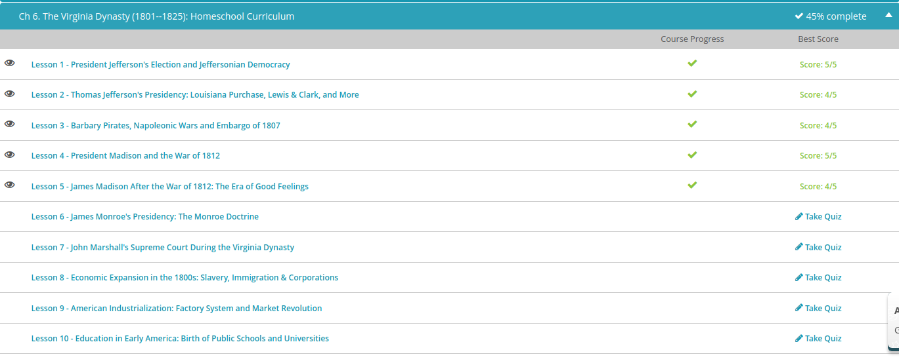
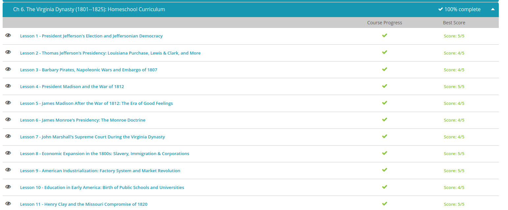

### Andrew Garber
### October 11
### The Virginia Dynasty

#### President Jefferson
 - The election of 1800 was a circus that put the future of the young nation in peril, the electors cast ballots for the President and whomever came in second place automatically became his vice-president. This created an obvious conflict between them, and this was only exacerbated by the fact that the new Democrat-Republican party wanted Aaron Burr to be VP, so they split their votes. However, it ended up being a tie between Jefferson and Burr and it was sent to the House of Representatives. The House had a Federalist majority however, and they were prepared to make Aaron Burr President instead of Jefferson just to stop him policies but Alexander Hamilton's personal hatred of Burr made him swing the party that he led to the candidate he disliked least: Jefferson. When Hamilton again tried to destroy Burr's political career as governor of New York, Burr challenged him to a duel and killed him.
 - Jeffersonian Democracy was highly focused on the idea of the independent family farm, personally believing them to be the most fundamental and honorable form of humanity.
 - Of course, Jeffersonian Democracy - like all political movements - had its share of failures, empty promises, and hypocrisy. Of course, the Democratic-Republican presidents had their critics, perhaps most famously in the Supreme Court. And it might be one of history's worst-kept secrets that Jefferson didn't exactly live by the ideals he claimed to treasure. But Thomas Jefferson, for all his flaws, was one of America's most intelligent, inquisitive, and innovative Founding Fathers. And though he didn't know exactly how to apply it in his time, he eloquently expressed what has become perhaps America's most cherished value: that all men are created equal.
 - Thomas Jefferson took office in 1801. During the campaign, his party had created visions of an agrarian paradise protected by a small government with no standing military and no debt. And he was a strict constructionist. Meaning, if it isn't in the Constitution, he believed the government doesn't have a right to do it. But many of Jefferson's most important domestic achievements seemed to be in stark contrast to his platform.
 - Jefferson was the first president to be inaugurated in the new permanent capital, Washington, D.C., and live in the completed White House - though you may not recognize either building today. When he moved into the president's country mansion, he complained that it was 'big enough for two emperors, one pope and the Grand Lama in the bargain.' Jefferson claimed that he opposed grandeur and elitism, yet he immediately began designing additions to the White House (including the photogenic West Wing colonnade).
 - Around the time of Jefferson's election, Napoleon Bonaparte was in secret negotiations with Spain to reclaim North American territory that France had lost after the French and Indian War. They reached an agreement, but soon after, events unfolded which left France nearly bankrupt in the middle of another war. Napoleon realized that he couldn't afford to defend the Louisiana Territory. So, when the United States approached him about buying New Orleans in order to control access to the Mississippi River, Napoleon offered to sell them all of his land on the continent for 15 million. While that may seem cheap (it works out to about $.04 an acre), and the land proved to be very valuable to America, the Constitution didn't give Jefferson power to make such a purchase. What's worse, he didn't consult with Congress over the deal, exactly the kind of expansion of presidential power that Jefferson said he opposed.
 - Outrage over the Louisiana Purchase nearly split the country apart. Of course, some people approved, especially many Southerners. It doubled the size of the U.S. overnight, opening up huge amounts of inexpensive farmland. It guaranteed access to the Mississippi River. But many others vigorously opposed the purchase. Federalists thought it would lead to war with Spain. Congress, with its Democratic-Republican majority, opposed expanding the national debt, rather than eliminating it as Jefferson had promised. Members of both parties believed the purchase was unconstitutional. Some Northerners foresaw this as an expansion of slavery. Jefferson's opponents in the Northeast recognized that this would further reduce their political clout. 
 - No political controversy today compares to the division in the country in 1803. The president's political enemies were ready to take action. The Essex Junto was a group of wealthy, powerful Federalists up in New England who thought Jefferson had overreached the power of the presidency with the Louisiana Purchase. They hatched a plot to secede from the United States. The key to their success would depend on getting New York to agree.
 - Thankfully, one of President Jefferson's staunchest political opponents - Alexander Hamilton - foiled the plot. The conspiracy had approached Vice President Aaron Burr and promised to help him win the governorship of New York if he'd make sure the state immediately seceded from the Union. Burr actually agreed, but his old nemesis, Hamilton, worked to secure his loss in that gubernatorial election. Without Burr and New York, the secession movement died. Burr was so angry he challenged Hamilton to a duel and killed him. Though murder charges against him were actually dropped, Burr's political career in the U.S. was, of course, over.
 - In the same year that Burr was arrested (1806), Thomas Jefferson accomplished what may be his most enduring legacy as president: the successful completion of the Lewis and Clark Expedition. Even before the purchase was made, Jefferson had created the Corps of Discovery to send explorers through the new land (and beyond) to the Pacific Ocean. The president hired his secretary, Meriwether Lewis, and Lewis' friend, William Clark, to lead the expedition. The 33 members of the so-called 'permanent party' departed from St. Louis on May 14, 1804. Along the way, they were joined by various people, including a French trapper and his Shoshone wife, Sacajawea, who served as cooks, translators and diplomats. Their infant son, nicknamed Pomp, helped indicate the Corps' peaceful intentions to the people they encountered.
 - One of President Jefferson's last great acts was signing a bill that outlawed the Atlantic slave trade, effective January 1, 1808. The Constitution itself had set that as the earliest date allowed for such a law, not wanting the issue of slavery to interfere with the development of the young nation. Although slavery itself was still legal - and growing - the act prohibiting importation of slaves made it a crime to bring new slaves into America from overseas. There was smuggling of course, but the law was enforced, having the effect of raising prices for slaves, and encouraging the practice of selling slave children for profit.

#### The first Barbary War
 -  15 years (between 1792 and 1807), American exports increased by 585%! Jefferson also took advantage of Napoleon's financial problems to purchase the Louisiana Territory.
 - But it wasn't long before American merchant ships were being harassed by pirates from the North African Barbary coast. For centuries, Barbary pirates had terrorized the Mediterranean Sea, seizing goods and ships, kidnapping sailors to be sold into slavery if a ransom wasn't paid. But before the Revolution, American ships had been protected by the British Navy and, for a short time afterward, by the French. Now, they were on their own. George Washington initiated negotiations with the pirates, and in 1797 President Adams agreed to pay an annual tribute to secure safe passage for American ships.
 - When Jefferson took office in 1801, the Pasha (sort of like a British lord) of Tripoli demanded $225,000. Although it was significantly less than previous administrations had paid in tribute, Jefferson refused. So, the Pasha declared war on the United States. Congress never officially declared war in return, but it did authorize Jefferson to protect American interests. Jefferson sent Navy ships and Marines to the shores of Tripoli in the First Barbary War. They defeated Tripoli at sea, defending the merchant vessels and securing a more advantageous treaty in 1805.
 - Is it Constitutional for the president to use the military if Congress hasn't declared war - even if Congress has given him or her the power to do so? Is it right to use the military to defend a nation's financial interests? Should the nation use federal resources to bail out civilians who have knowingly put themselves in harm's way for the sake of financial gain?
 - Jefferson and Congress (and most of the population) decided that defending America's right to international commerce was a federal concern because there was more at stake than just the fortunes of the ships' owners and the lives of the crew. They argued that if they didn't stand up to the bully when they had the chance, things would only get worse. The First Barbary War set the precedent that military force could be used, even without a formal declaration of war. Once again, Jefferson had expanded the scope of the presidency.
 - Despite the successful engagement with the Barbary pirates (or maybe because of it), both England and France tried to provoke the United States into taking a side in the Napoleonic Wars. They began harassing American ships, stealing cargo, and the British often took the further step of pressing American sailors into service in the Royal Navy. Jefferson was still determined to stay neutral, but in 1807, the Chesapeake-Leopard Affair nearly drove America to war. The British Navy had been blockading some French ships in the Chesapeake Bay. According to the British, some of their own crew had deserted and taken sanctuary on American ships. The British warship Leopard attacked the American Navy ship Chesapeake and carried off four men. All of them had, in fact, served on British ships, but only one of them was an Englishman. The other three were Americans who had been pressed into service.
 - Instead, he tried to wage an economic battle against Britain and France. First, Congress implemented a boycott of British goods and then passed the Embargo Act of 1807, prohibiting American ships from sailing for foreign harbors. The goal was to create enough financial hardship for warring nations that they would accept U.S. neutrality and leave Americans ships - and sailors - alone. The move was a military, diplomatic and economic failure (although the three Americans were returned; the Englishman was hanged). Europeans continued to get the goods they wanted through smugglers that passed through Canada and continued to attack American ships. The only nation that was truly hurt by the trade restrictions was the U.S. when exports dropped by 80% in one year. An economic depression hit until the embargo was eased in 1809.
 
#### James Madison
 - When Thomas Jefferson announced his retirement, his secretary of state and the 'Father of the Constitution,' James Madison, was easily elected the fourth president of the United States, continuing the Virginia dynasty. He inherited a mess. The economy was struggling, he essentially had a war on two fronts and the political system was in shambles.
 - A Shawnee leader named Tecumseh and his brother (who was commonly called 'The Prophet') organized a social network to revive native religion, resist all white ways and oppose the U.S. government. They believed they would gain a northwest state for themselves. After building Prophetstown at the junction of the Tippecanoe and Wabash Rivers, they began attacking settlements. The governor of the newly created Indiana Territory was General (and future president) William Henry Harrison. After learning that the British were supplying money and weapons to Tecumseh, Harrison attacked and destroyed Prophetstown at the Battle of Tippecanoe. However, the resistance and attacks on settlements continued on as part of the broader War of 1812 until Tecumseh himself was killed.
 - The War of 1812 is kind of a black hole in American history. Most people know that it happened, but not many people seem to know anything about it. So let's start with some big things: Two future presidents were heroes of the War of 1812. The White House was burned down. America's national anthem, the 'Star-Spangled Banner', was written during one of its battles. And, it's why the Native Americans ended up west of the Mississippi River. Events that are essential for a fuller understanding of American history.
 - Britain seemed determined to drag its former colonies into war. Congress lifted the Embargo Act of 1807, but then Britain interfered to keep America from trading with France. More importantly, the British navy had a desertion problem. Many sailors who had been pressed into service jumped ship as soon as they had the chance, so for years the British fleet had been stopping American ships to search for their deserters, sometimes pressing American citizens into service to boot.The trade restrictions and impressment controversy were frustrating, but each of them alone wasn't really enough for President Madison to want to declare war on Britain. But then you add in the fact that Britain had been helping the Indians fight on the  frontier, and together all of these factors were just a little too much for some people. The so-called 'War Hawks' in Congress convinced President Madison to declare war in June 1812.
 - President Madison hadn't really been prepared for a prolonged war. He was under the delusion that with Britain at war with France, the state militias could easily capture Canada, and a treaty would quickly follow. But Britain had its own army and navy, plus the coalition under Tecumseh and Canadian troops. The invasion of Canada was a total failure. But three battles in 1813 did help the U.S. get control of the western frontier. First, William Henry Harrison secured Detroit and finally defeated Tecumseh in the same fight. Then Commodore Oliver Perry captured an entire British naval squadron in the Battle of Lake Erie. Farther south, General (and another future president) Andrew Jackson defeated the Creek nation in 1814, subduing the Indian resistance. It wasn't a moment too soon for the Americans, since the war in the East was about to get a lot more difficult.
 - Britain's Royal Navy had finally run Napoleon out of town and put France in its place. Now they turned all of their attention to fighting America. The British navy waged fierce war at sea, and troops poured into the East Coast, fighting costly battles against weak American militia forces. They set fire to Washington, D.C., including the Capitol building and the White House. Thankfully, most of the city was saved by a freak rainstorm, and the president's wife, Dolly Madison, had the foresight to rescue some treasured items from their home, including George Washington's portrait and possibly an original copy of the Constitution.
 - Next, the British navy tried to capture the strategic city of Baltimore, blasting Ft. McHenry all day and most of the night. An American lawyer named Francis Scott Key had crossed enemy lines to negotiate a prisoner exchange and was being held on a British ship throughout the battle. He watched intently, but when the barrage stopped, it was too dark for him to see whose flag was flying over the fort. Had the British barrage stopped because the walls had been breached, or had they given up? He wouldn't be able to tell until dawn. When he saw an American flag in the morning, he was inspired to write a poem, which was later set to music, and the first verse became America's national anthem in 1916.
 - Three events began to unfold simultaneously. Leaders on both sides could see that neither side had much to gain by continuing the war, so diplomats in Ghent (called Belgium today) started talking peace. But few people in America knew about that. Federalists in New England, who had opposed the war from the beginning, met to discuss seceding from the Union. They planned to form a new nation and negotiate a favorable peace treaty with Britain on their own. Also, at the same time, a British fleet was heading toward New Orleans.
 - The first of these parties to conclude their business were the diplomats in Ghent. They reached an agreement on Christmas Eve 1814, and the Treaty of Ghent essentially returned everything to the way it had been before the war started. Britain abandoned their Indian allies once again but did pay the U.S. government for a number of slaves who had escaped to Canada. But news traveled slowly from Europe to America back then, and the British threw everything they had at New Orleans, intending to seize control of the Mississippi River. Andrew Jackson mounted a seemingly miraculous defense with a force made up of state militia, pirates, free blacks and a few regular army soldiers. He killed the British general in charge and won the Battle of New Orleans. 

#### The Era of Good Feelings
 - Despite enduring a total naval blockade and heavy losses, many Americans felt that the nation had won the War of 1812. General Andrew Jackson's ragtag force of free blacks, pirates and militia defeated the British at the Battle of New Orleans after the Treaty of Ghent was signed, but Americans didn't know that at the time. It certainly appeared that Jackson's heroic victory, on the heels of Britain's failed invasion of Baltimore, had forced the British to surrender. Federalists who had intended to secede New England in protest over the war were thoroughly discredited and their party gone for good from federal politics.
 - Of course, things aren't always as good as they seem. The Democratic-Republicans might have been the only viable political party on a national level, but the nation was actually deeply divided over several issues, especially its finances. At first, President Madison wanted to keep going down the road Jefferson had taken, undoing some of Hamilton's economic policies. For example, the Democratic-Republicans had totally opposed the Bank of the United States. Madison allowed the Bank's 20-year charter to expire during his first term, and he refused to sign a bill that reauthorized it. The party had believed that a national bank was unconstitutional and that it threatened to concentrate financial power with the elite at the expense of yeoman farmers. But then came the War of 1812, and Madison realized just how difficult it was to finance a war without a national bank, so he finally signed a bill chartering the Second Bank of the United States, which helped stabilize the economy.
 - Madison announced his support for Speaker of the House Henry Clay's American System, which included a protective tariff and several internal improvements. The tariff was designed to encourage the purchase of domestic goods and was only approved for three years. The internal improvements were roads and canals that Madison said would 'bind more closely together the various parts of our extended confederacy.' We take for granted that the federal government pays for this kind of internal improvement, but many, many Americans back then thought this was a massive overreach of power, and internal improvements became one of the most divisive political issues of the 19th century, which is ironic in the modern day as infrastructure is one of the most bipartisan issues(despite the fact that the party not in power opposes it so they can eventually take credit for it).
 - 

#### Monroe
 - By the 1816 election, the Democratic-Republicans dominated Congress and the presidency. Virginia also dominated the executive office, with all but one of the first five presidents having come from that state! James Monroe, a Democratic-Republican from Virginia and the last Revolutionary War veteran elected president, won by a landslide, inheriting the Era of Good Feelings.
 - What happened to the Federalist Party? Clearly, part of their problem was that they had been on the wrong side of things for a few years. But in others ways, they just weren't needed anymore. Think about it in today's terms, and put aside any cynicism. Suppose a Democrat president, for example, instituted several major policies that had always been part of the Republican platform and then his or her two successors continued to do the same thing. Would Republican or independent voters be seriously opposed to that? 
 - In Monroe's first term, he also increased the nation's borders. Having served as an ambassador, governor, Secretary of State and Secretary of War, Monroe was an expert negotiator. Soon after taking office, his administration approved the Rush-Bagot Treaty. This agreement between Britain and the United States disarmed the Great Lakes and later gave both nations joint control over the Oregon Territory. This meant that for the first time American territory reached from sea to shining sea.
 - The nation enjoyed widespread contentment under James Monroe until 1819, when a financial panic hit. Although historians debate the specific causes, it's generally agreed that this was the first recession that originated within the United States and was likely a result of policies established under previous administrations. Still, Monroe was elected without opposition, receiving every electoral vote but one (legend has it the lone dissenter only voted for someone else so that Washington would have the honor of being the only unanimously elected president). Monroe's second term, however, was more controversial.
 - First of all, there was nationwide outcry when Missouri wanted to enter the Union as a slave state. Their request was denied in 1819, and it took Congress two years to craft the 1820 Missouri Compromise, welcoming the slave state of Missouri only on the condition that a free state - Maine - was also admitted at the same time. Monroe again raised some eyebrows when he refused to sign the Cumberland Road Bill that promised federal maintenance and expansion of an existing interstate highway, believing it was a local matter.
 - President Monroe will probably be best remembered for the Monroe Doctrine, which became the cornerstone of American foreign policy until World War I. In his seventh State of the Union address, the President spoke up about events that were happening throughout the Western Hemisphere. Most importantly, the Spanish empire was collapsing, and one by one its former colonies were gaining independence. Many American politicians, including Monroe, worried that European nations might be inclined to try and take over.
 - So, on December 2, 1823, Monroe declared, 'the American continents, by the free and independent condition which they have assumed and maintain, are henceforth not to be considered as subjects for future colonization by any European powers' and America 'should consider any attempt on their part to extend their system to any portion of this hemisphere as dangerous to our peace and safety.'

#### John Marshall
 - Right before President John Adams left office, he expanded the judicial system and appointed many Federalist judges to fill those positions. This would have made up for the party's waning influence in elected politics, but many of these so-called 'midnight appointments' were contested and their positions were eliminated. But Adams hit the bull's-eye when he nominated his Secretary of State John Marshall as Chief Justice of the Supreme Court.
 - Marshall had actually declined an earlier nomination to the Court, but he accepted in 1801 and held the position until he died in 1835 - longer than anyone else in history. He was a devoted Federalist, so even though the Democratic-Republicans ruled the White House and Congress for 24 years, the Marshall Court kept one-party rule in check. He defied President Jefferson by refusing to convict former Vice President Aaron Burr of treason, upholding the independent power of the judicial branch of government.
 - But John Marshall's most important legacy is that his decision-making process in landmark rulings fundamentally and permanently changed the Court's role in government. In the days of the early republic, the Supreme Court didn't really have very much authority, but Marshall expanded the Court's jurisdiction to make it an integral part of the federal system of checks and balances. First, he elevated the federal government's laws and power over those of the states, giving the Supreme Court authority over every legislature and court in the nation. He also asserted the Supreme Court's authority to exercise judicial review and throw out laws that contradict the Constitution. Together, these roles made the Judicial Branch equal to the Legislative and Executive Branches.

#### Economic expansion 
 - If there is one word that could characterize America in the first half of the 19th century, it would be ''growth.'' The population grew; territory grew; the economy grew; even slavery, unfortunately, grew.
 - Mid-century saw a second rush of immigrants from Ireland and Germany, mostly due to crop failures in those countries. But then, there was also the addition of land and people in the southwest from war with Mexico at that time.
 - By 1860, the U.S. had 33 states and more than 31 million people, making it the fourth most populated nation in the developed world, and half of them were under the age of 30! Although most Americans still lived in rural or semi-rural areas, there was a tremendous increase in urban areas. There were 45 cities with a population of 20,000 or more people (compare that to just two when the nation was born), and all those people had to be fed.
 - National roads and private toll roads (called turnpikes) crept slowly across the map, but moving any quantity of goods across the country over land was nearly impossible. Steamboats allowed 2-way river traffic, especially along the Mississippi and Ohio Rivers. When the state of New York granted a monopoly on ferry service to New Jersey for the steamboat's inventor, the Supreme Court, under Chief Justice John Marshall, overturned it in 1824. This opened the door for competition along America's waterways and kept prices low.
 - The rivers became the most important form of transportation for farmers in the interior of the continent moving their goods to markets in the east. Canals linked the waterways to one another and were largely constructed with public funds. This kind of internal improvement became a hotly contested political issue in the first half of the 19th century as residents in some areas became resentful of the money spent in other regions of the nation. Railroads began connecting eastern locations in 1827, and foot trails opened up as far west as the Pacific Ocean and as far south as Mexico. 
 - Supreme Court protection for corporations began another shift in the American economy. This business model limited the liability of investors, making it easier to raise huge amounts of private capital. Chartered by individual states, corporations (with the help of some manufacturing inventions) helped pay for factories, which slowly transferred population into the cities, and along with the farming revolution in the west, helped push America towards a market economy.

#### Industrialization
 -  A market economy is an economic system where the price of goods and services is based on unrestrained competition between businesses. The first half of the 19th century saw a number of developments that helped push America towards a market economy based on cash, wages and prices.
 - Several key factors were already in place by the end of the War of 1812. Beginning with Jefferson's Embargo Act of 1807, American investors who had been involved in lucrative trans-Atlantic commerce began placing their money into safer, domestic manufacturing ventures. Since issues with shipping persisted until the Second Barbary War in 1815, capital continued to be transferred from commerce to manufacturing - creating a strong, if small, industrial base.
 - The technology that probably affected the American economy most dramatically was the cotton gin. 
 - in 1793, a Connecticut man named Eli Whitney invented a device called the cotton gin. Prior to this, planters knew that cotton grew well in poor soil but its seeds were too difficult to remove, making it an impractical cash crop. Thanks to Eli Whitney's cotton gin, separating the seeds from the fiber became as easy as turning a handle. Two people could process 50 pounds of cotton a day!
 - Immediately, this simple device transformed the American landscape, population and economy. Cotton was already in high demand in England's textile mills, and American farmers were all too happy to meet the need. Land was abundant and cheap, and the demand for slaves to work in the fields skyrocketed. Cotton fields stretched across the old southwest from Georgia to Texas, and by 1820, the cotton kingdom accounted for 39% of all American exports.
 - Another of Eli Whitney's concepts helped build the factory system in the Northeast, as well. At the turn of the century, the U.S. was concerned about the Napoleonic Wars and looked to produce thousands of new weapons quickly and inexpensively. Eli Whitney convinced Congress that he was the man for the job by demonstrating the concept of interchangeable parts. Rather than each gun being hand built from start to finish with custom parts, Whitney built 10 guns, all containing identical parts and mechanisms. Then, he stood before a transfixed Congress who watched him disassemble the weapons, pile all the parts together in a heap and then rebuild them with the interchangeable parts. Eli Whitney didn't invent the idea, but he was the first to prove its benefits in the U.S. The concept revolutionized manufacturing.
 - It wasn't long before an American businessman named Francis Lowell returned from London having memorized the workings of the English power loom. He recreated the technology, made some improvements and convinced some other investors to go into business with him. Powered by water mills, the Boston Manufacturing Company was America's first manufacturing plant - converting raw cotton into cloth under one roof. Southern cotton had a new market in New England textile mills. Together with the concept of interchangeable parts, the factory system
 - The West also profited from new inventions at this time, making farms a little more like factories and farmers a lot more like businessmen. The 1834 introduction of Cyrus McCormick's mechanical reaper helped one farmer working the machine to harvest as much wheat as five men in the same amount of time. A few years later, John Deere's steel plow allowed farmers to easily break through the thickly matted virgin soil of the American Midwest. More and more land was cleared for farming, and the cities along the eastern seaboard provided a dependable market for staple crops. 

#### Education
 - Public schools, as we know them today, were few and far between in the early American republic. The Puritans believed literacy was a religious duty (so that everyone could read the Bible), and most children learned basic math and reading at home.
 - Concerned about children whose parents weren't 'good' church members, a 1642 Massachusetts law required that towns of 50 or more people have a public school in which men taught basic literacy to boys, including Bible instruction. The most education girls typically received was at a Dame School, in which an older lady from the community taught very young children the fundamentals of reading as well as the female graces, usually from her own home - and these were not free.
 - In the 1700s, elite, private, grammar schools opened in New England to prepare boys to enter the Ivy League colleges, many of which are among America's most prestigious college prep schools today. Throughout the Middle Colonies, individual communities sometimes opened schools to instruct boys in their language, religion and traditions.  
 - During the Revolution, many Americans (like Thomas Jefferson) believed strongly that education was a necessary component of democracy, but despite their arguments, not many of the Founding Fathers thought it was a good idea for the federal government to be involved in such matters. The Constitution places schools squarely in the hands of the states.
 - In 1837, Horace Mann, the Secretary of Education in Massachusetts, began reforming the state's school system, creating grade levels, common standards and mandatory attendance to ensure that all citizens could become virtuous, educated voters. Others states copied his system, and by 1870, all states had tax-supported, locally controlled elementary schools, though attendance was usually not required. 
 - But American schools needed American textbooks. The two most successful - McGuffey Readers and Noah Webster's 'blue-backed' spellers - both took a uniquely American approach to education, mimicking the factory system: break the subject down into its most basic parts and build it from the bottom up. And both of these textbooks systematically taught cultural and religious virtues. Noah Webster is also credited with standardizing American spelling through his 1828 American Dictionary of the English Language. It was also during this era that America finally produced authors that received attention in Europe. 

#### Henry Clay & Missouri Compromise
 - In 1819, the nation contained 11 free and 11 slave states, creating an even balance in the U.S. Senate. Imagine being a U.S. senator at that time. How would you feel when Missouri - which seemed to be a little more northern than southern on the map - applied to become a slave state? Your feelings, of course, might depend on your opinion of slavery. They all knew that a new slave state would tip the balance of power in favor of the South. But the state had chosen slavery for itself, and that kind of autonomy was extremely important. Did Congress even have the authority to control this kind of decision?
 - So why was slavery suddenly an issue when plenty of other Southern states had been added in recent years? It's never easy to pinpoint historical cause and effect, but there were a number of contributing factors. For one thing, during the two-party system of the Federalists and Democratic-Republicans, there had been politicians from both North and South in both political parties, and the nation had pressing foreign issues until 1815, so you might say they just had other things to worry about earlier. Then, in 1817, New York passed a law that gradually emancipated all of its slaves, giving momentum to the abolition movement in the North and creating some worry in the South.
 - Enter Henry Clay, a congressman from Kentucky. He proposed admitting Missouri as a slave state and Maine (which had always been part of Massachusetts) as a free state. Besides resolving the immediate issue of maintaining balance in the Senate, he further proposed drawing a line across the map to determine the slave issue for states that were carved out of this territory. Anything above 36°30' would automatically be free; anything below 36°30' could choose slavery. The Missouri Compromise was accepted in 1820, and two years after applying, Missouri finally became a state in 1821.

