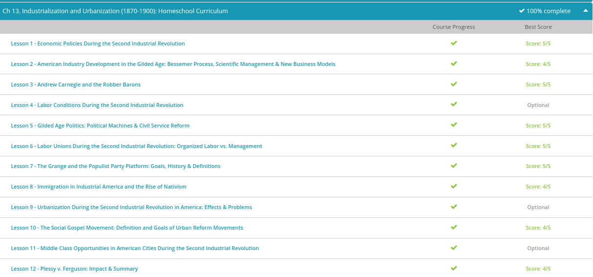

### Andrew Garber
### Nov 9
### Urbanization & Industrialization 

The central tenets of this unit were entirely covered last year:
	- [American Dream & Technological Power](../../Q3-Q4_10TH/History/Completed%20Work/A_New_Century/How_American_Dream_Led_Technological_Economic_Power.md)
	-[Leading Economic Reasons for the civil war](../../Q3-Q4_10TH/History/Completed%20Work/Summary%20Sessions%20Pre%20Civil%20War/Leading%20Economic%20Reasons%20For%20Civil%20War.md)
	- [Robber Barrons](../../Q3-Q4_10TH/History/Completed%20Work/Summary%20Sessions%20Post%20Civil%20War/robber_barrons.md)
	-[Westward expansion](../../Q3-Q4_10TH/History/Completed%20Work/Summary%20Sessions%20Post%20Civil%20War/technologies_for_westward_expansion.md)

Quiz Results(Based on learning from last years):
