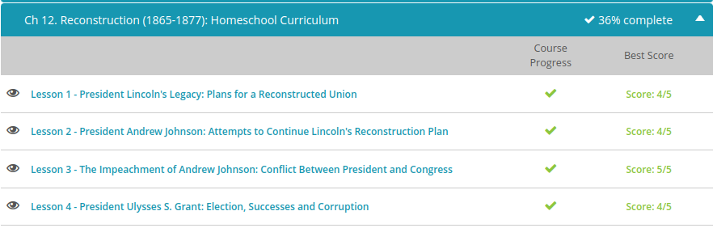
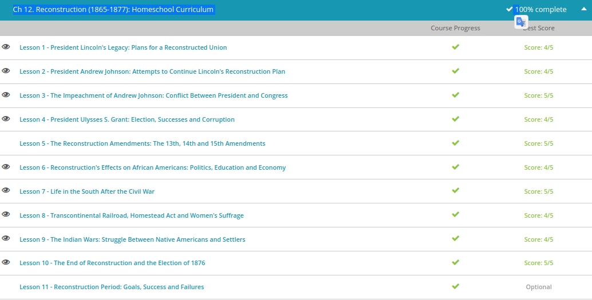

### Andrew Garber
### Nov 4
### Reconstruction

#### Lincoln's Plans for a new nation
    - Even before the surrender of Confederate forces under General Robert E. Lee on April 9, 1865 ending the American Civil War, President Lincoln had begun making plans for the physical, economic, social and political rehabilitation of a region that had been devastated by four years of war. There were a number of deep wounds that needed to be treated.
    - First of all, there was property damage on a massive scale as Southern rail lines, factories and bridges and farmland lay in ruins. Many towns and cities had to be rebuilt. Thousands of veterans and civilians were wounded and in need of medical care. Many more were homeless. How could all of this damage be fixed? And how could it all be paid for? The destruction had crushed the Southern economy, as well as the workforce - about 20% of the Southern adult male population was dead, many more were disabled and slavery had been abolished. Many plantation owners lost their farms, and even those people who kept their land now lacked the only source of labor they'd ever known.
    - The process of trying to rebuild the South's economy, society and infrastructure was called Reconstruction, and it dominated political debate for more than a decade. President Lincoln hoped to reunify the nation as quickly and painlessly as possible. He realized that it wasn't just the South that needed to be rebuilt; many Northerners were angry and viewed Southerners as their bitter enemy, a defeated rival that should be punished. For their part, Southerners blamed the North for starting the war and resented the suggestion that their society needed to be reconstructed at all.   
    - In March of 1865 - just a month before the end of the war - the president urged Congress to pass a bill creating the Bureau of Refugees, Freedmen and Abandoned Lands, commonly called the Freedmen's Bureau. Radicals in Congress were happy to comply. Created as part of the War Department, the goal of the Freedmen's Bureau was to help ease the transition from slave to free man successfully. Immediately after the war, they helped former slaves survive in the short term, so they could build free lives in the long term. This often meant clothing, food, shelter or medical care. The Freedmen's Bureau also helped former slaves find work and provided assistance in negotiating labor contracts. Since Southern states had made it illegal to educate a slave, most freedmen were illiterate. The Bureau built schools throughout the South to provide an education to thousands of African Americans of every age. Many of the schools were run by Christian missionary organizations and former abolitionists.

#### Andrew Johnson
    - Johnson alienated himself from a lot of different groups pretty quickly. He was a Southern slave owner and unabashedly racist. But as a self-made man, he also disliked the planter class of Southern elites (who considered him tactless). His manner was abrasive, and though he indicated that he wanted to follow Lincoln's course, he seemed less eloquent and charitable than his predecessor, and many lawmakers found him difficult to work with. Many Southerners thought he was a traitor for remaining loyal to the Union during secession. Northern Radicals were angry that he followed Lincoln's moderate course of Reconstruction. Still other Northerners who had supported Lincoln now wanted to see the South punished for his murder and thought Johnson was too sympathetic to the South.
    - But Johnson did not intend to punish the South. And while he did oversee the ratification of the 13th Amendment to the Constitution outlawing slavery (a process Lincoln had started), Johnson also believed on principle that each state had the right to decide the best course of Reconstruction for itself. He appointed governors to help the states take the steps outlined by Lincoln for readmission to the Union, but many of them proved to be too lenient, and as a result, Black Codes quickly spread throughout the South attempting to restrict the rights of African Americans at the state and local levels.
    - When some former Confederate leaders were elected back to their old positions in Congress, the Radical Republican majority refused to seat them. Many Americans must have shared their views, since Republicans won heavy majorities in both houses of Congress in the 1866 midterm elections - enough votes to override a presidential veto. And with this mandate, they aggressively pursued their own version of Reconstruction in defiance of the president. Presidential Reconstruction was over.
    - When the Mexican government announced that it would not be able to pay its debts to foreign nations, a coalition of forces landed an army in direct violation of the Monroe Doctrine, which insists that European nations could no longer establish colonies in the Americas. Britain and Spain negotiated a settlement with Mexico, but France saw an opportunity for one last shot at establishing a North American colony and invaded in 1861.
    - The French president appointed an emperor, Archduke Maximilian I, to take control. On May 5, 1862, Mexican forces won an unlikely victory over the French, spawning the famous celebration of Cinco de Mayo. The war dragged on, and as soon as the American Civil War ended in 1865, Johnson's very capable Secretary of State, William Seward (who survived an assassination attempt the same night Lincoln was shot), demanded that France withdraw its forces. He sent 50,000 U.S. army veterans to the border to show he meant business. France agreed to leave and evacuated all forces by 1867. Maximilian was executed by a firing squad, and the United States proved that it would defend the Monroe Doctrine by force if necessary.
    - The Johnson administration also resolved an issue to the north in 1867 when Russia offered to sell its American holdings to the United States. The fur trade in Alaska had dried up; Russia needed the money and was afraid that Great Britain might go to war with them to seize the land anyway. Russia figured they might as well sell it while they still had the chance. Secretary of State Seward offered $.02 an acre for the territory. Many Americans were dumbfounded that the government - heavily in debt from the Civil War - would spend millions of dollars for a frozen wasteland with no foreseeable strategic or economic value. They ridiculed the purchase, calling it 'Seward's Folly.' But the Senate loved the idea and enthusiastically approved the treaty. In the long run, of course, Alaska has proven to be full of valuable natural resources, including gold, oil and natural gas, and minerals.

#### The impeachment of Andrew Johnson
    - Unfortunately for them, President Johnson's position was even more Southern-friendly than Lincoln's had been, and many of the governors he appointed to help the process of reunification passed Black Codes to restrict the legal rights of African Americans and allow white planters to retake control of government and society. When some states refused to cancel Confederate debt and others delayed ratification of the 13th Amendment (banning slavery in the U.S.), Republicans won heavy majorities in the 1866 mid-term elections. They now had the required 2/3 majority needed to override a veto, effectively ending the era of presidential Reconstruction. And then by impeding the arrival of newly-elected Southern congressmen, they had almost no legislative opposition. Radical Republicans got to work right away on their most pressing agenda: extending the life of the Freedmen's Bureau and passing a Civil Rights bill.
    - Johnson vetoed both, of course. Moderate Republicans joined their Radical colleagues in Congress to override the presidential veto and pass both bills. Foreseeing that the laws could be rejected by the Supreme Court, or that future Congresses might overturn them, Republicans drafted the 14th Amendment, guaranteeing full citizenship to anyone born in the United States. Johnson, predictably, opposed it.
    - All Southern states except Tennessee refused to ratify the amendment, so Congress passed the Military Reconstruction Act - the first of four such measures to be passed by Congress, vetoed by the President, and then passed again with a 2/3 vote. As a result, the South was divided into five occupied military districts, each ruled by a military governor to supervise Reconstruction. Under the Military Reconstruction Act, states had to ratify the 14th Amendment and allow African Americans to vote, or else they would lose their representation in Congress. The 14th Amendment was ratified within a year.
    - After Johnson attempted to replace Stanton with a number of appointees who turned down the job (including Generals Ulysses S. Grant and William T. Sherman), Secretary of War Stanton literally locked himself in his office and refused to leave. Meanwhile, in the halls of the Capitol, Congress impeached President Andrew Johnson.
    - According to the Constitution, the House of Representatives can bring articles of impeachment against federal officials for 'treason, bribery or other high crimes and misdemeanors.' The politician then stands trial in the Senate. If convicted, the official can be removed from office.
    - Andrew Johnson was the first president ever to be impeached. Congress brought 11 articles of impeachment against him, nine of which addressed his violation of the Tenure of Office Act. Why would they do this when they had enough votes to override his veto anyway? The answer to that question is unclear. Perhaps they were simply frustrated and wanted revenge. Maybe they were trying to reduce the power of the presidency. Or it's possible they were looking for a more cooperative leader to pass more sweeping reforms while they still had the chance. Regardless of reasons, the president's impeachment began on March 13, 1868.
    - At the final vote, 35 Senators voted to convict the president, just one vote short of the required 2/3 majority. According to one newspaper from the time, 'Andrew Johnson is innocent because Ben Wade is guilty of being his successor.' Later Congressional hearings also turned up evidence of corruption and possible bribery both for votes of conviction and acquittal. However, posterity has upheld the president's defense. The Tenure of Office Act was overturned nine years later; and though it was never tested in the Supreme Court, a decision in 1926 noted that the Act was invalid.

#### Grant
    - "I wish some of you would tell me the branch of whiskey that Grant drinks. I woud like to send a barrel of it to my other generals." - Abraham Lincoln(though this is a disputed quote, it makes the point that Grant was an odd president.)
    - In the 1868 election, President Andrew Johnson - crippled by unpopularity and an impeachment - failed to win his Party's nomination. After dismissing several candidates and taking several votes, the Democrats finally decided on Horatio Seymore. The Republicans chose General Ulysses S. Grant, the Union hero of the Civil War. Despite the fact that three southern states still couldn't vote and that African Americans (who were overwhelmingly Republican) could vote, Seymore put up a good fight against the well-known Grant. The popular vote was close, but Grant won an electoral landslide in 1868.
    -They expected him to run the country just like he'd run the war: show the enemy no mercy. But the Radicals seemed to forget that even when Grant had walked away from General Robert E. Lee's surrender at the end of the war, he hadn't allowed his men to cheer. Grant, like his presidential predecessors, didn't view the Southern people as the enemy. He, too, wanted to amicably restore the country while enforcing civil rights. The problem was that most white Southerners didn't want to be Reconstructed, and many Northerners wanted the South punished - not restored. People on both sides were unsure about what kind of rights should be given to African Americans.
    - Grant was popular, but it was a bad time to be an inexperienced leader. So-called 'political machines' came to dominate several Northern cities, leading to widespread corruption and economic chaos. Southern cities suffered from the same problems since local and state governments had been overrun with carpetbaggers (those were Northerners who came south to take part in Reconstruction) and Southern Unionists (who were derisively called scalawags by other Southerners). In response, violent groups like the Ku Klux Klan (also known as the KKK), were formed out of resentment, frustration over the corruption and a lot of racism. Their goal was to intimidate Republican voters, especially African Americans, and keep them away from the polls so that local Democrats could once again take charge. 
    - Despite his bad judgment in choosing advisors, Grant himself remained popular at the time and easily won the reelection in 1872. Historians, too, generally consider President Grant to have been a man of personal integrity; at worst, he seems to be guilty of having been blissfully ignorant of what kind of corrupt individuals he had placed around himself. When Grant's own secretary was implicated in a wide-spread tax fraud and bribery scheme, called the Whiskey Ring, Grant attempted to shield him from prosecution and even testified in his defense.
    - During President Grant's second term, the United States was pulled into a world-wide economic depression known as the Panic of 1873. Economists then, as now, debated the causes and cures for such a problem. Grant's most direct action was his opposition of a so-called 'Inflation Bill' that would have increased the monetary supply and national debt in an attempt to stimulate the economy. Grant was convinced that such a move would ruin America's credit, and he unexpectedly vetoed it. And then, as now, people argued about who was benefitting from federal economic policy. His response to the financial crisis turned American voter loyalty away from the Republican Party, which lost heavily in the 1874 midterm Congressional elections. Grant was interested in running for a third term as president in 1880, but the Party refused to nominate him.
#### Day 1

#### African American Reconstruction Efforts:
    - Alonzo Herndon was born an enslaved person on a Georgia plantation. After the Civil War, his family became sharecroppers, like most freedmen who remained in the South. Their contracts, however, were unfair and kept them legally obligated to circumstances very similar to slavery. Few freedmen felt they had many choices, but Alonzo Herndon was different. Herndon had maybe one year of education, but he was determined to make a better life for himself. He peddled peanuts and other items to earn a little extra money and left the plantation with $11 in his pocket. The simple act of leaving town to go wherever he wished represented a new freedom. Eventually, Herndon founded the Atlanta Life Insurance Company, which is still going strong today.
    - Just like Alonzo Herndon, Booker T. Washington was born an enslaved person on a southern plantation in the mid-1850s. After emancipation, he worked in the salt mines of West Virginia and his mother got him a book so he could learn to read. He left home when he was 16 to work his way through the countryside to Hampton Roads, Virginia. Washington's philosophy that young African American people should seek equality slowly by pursuing skills and trades (rather than a classical education) drew criticism from other Black leaders. But his model of ''industry, thrift, intelligence and property'' was successful, and Booker T. Washington became one of the most prominent leaders in the Black community of his day. Many of Washington's students took his advice and returned to their hometowns to open schools and training centers, helping to educate and lift their neighbors out of desperate poverty. Today, Tuskegee University is just one of more than 100 historically Black colleges and universities established in this time frame.

