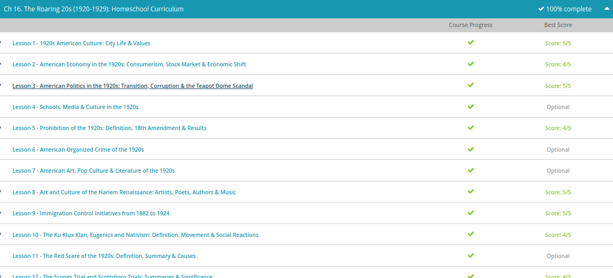

### Andrew Garber
### The Roaring 20s
### November 17

#### Culture
 - The 1920s was a time of profound change. So significant was this change that the decade is commonly called the 'Roaring Twenties.' World War I ended in 1918, and Americans were eager for a return to normalcy. Following the Great War (another name for World War I), the United States emerged as the new world superpower. Within a few years, the U.S. economy was booming.
 - The 1920s was a dynamic decade, characterized by prosperity, leisure, technological advances, consumerism and major shifts toward modern values. Modern values were particularly pronounced in urban locations. As more people relocated to large cities, like New York and Chicago, a way of life developed that was dramatically different from the rest of rural society. This urban culture became the hallmark of the entire decade.
 - In the years leading up to the 1920s, and throughout the decade, urbanization took place at an extraordinary pace. What is urbanization? Urbanization is simply the process by which people move into urban areas and contribute to their growth. For just a moment, let's backtrack to the year 1800. This will help us put things in perspective. In the year 1800, an estimated 5% of the American population lived in urban areas. By the year 1920, that figure jumped to 50%. It is commonly suggested that more people lived in urban areas than in rural areas throughout the 1920s.
 - Alcohol consumption was an integral part of 1920s urban culture. Although Prohibition had gone into effect in 1920, alcoholic beverages were readily available at illegal bars called speakeasies and through other means, such as bootlegging. Prohibition was inconsistently enforced. In many cases, law enforcement officers were bribed to turn a blind eye to the production and consumption of alcohol. Prohibition is widely cited as a leading cause of organized crime during the 1920s.
 - Arguably, one of the most prolific symbols of the entire decade is the flapper. Flappers were young women who challenged traditional, Victorian standards of womanhood. They often smoked, drank and danced in public. Typically, they wore shorter hairstyles, gaudy jewelry and slinky, form-fitting clothing. Flappers typically embodied feminist ideals.
 - The technological advances and the economic prosperity of the 1920s allowed for unprecedented leisure opportunities. Moving pictures were relatively new and attending the cinema became a popular activity. Film stars, like Clara Bow, Joan Crawford, Charlie Chaplin and Rudolph Valentino, rose to become national (and sometimes international) celebrities. Baseball emerged as a national pastime during the 1920s, as athletes, like Babe Ruth, captivated sports fans. Advertising was an important component of the decade, as consumerism played an increasingly visible role in society.
 - The 1920s has also been called 'The Jazz Age.' Jazz music flourished during this time. With its emphasis on improvisation and rhythm, this bold new genre was decidedly modern. To traditionalists, it was downright threatening. Popular performers, like Armstrong and Duke Ellington, delighted crowds as they played in venues like New York's Cotton Club. Across the nation, dance fads like the Charleston became all the rage, much to the chagrin of social conservatives. Jazz music represented all that was modern, carefree and even reckless.
 - Centered in Harlem, New York, an African-American cultural movement, called the Harlem Renaissance, took place throughout the 1920s. This movement was primarily artistic and intellectual. Artists often used bold, abstract imagery to express the uniqueness of African-American culture. Langston Hughes, an African-American writer who pioneered experimental forms of poetry, emerged as a leading figure of the Harlem Renaissance.

#### Economic
 - The 1920s have been called the Roaring '20s and for good reason. Not only was American culture 'roaring' in terms of style and social trends, but the economy was 'roaring' as well. The decade was a time of tremendous prosperity. Following the end of World War I, the industrial might of the United States was unleashed for domestic, peaceful purposes. Within a few short years, an economic shift took place as the economy transitioned from wartime production to peacetime production. New technologies like the automobile, household appliances, and other mass-produced products led to a vibrant consumer culture, stimulating economic growth. Furthermore, under the administration of three consecutive Republican presidents, the government adopted fiscally conservative policies that fueled private business.
 - Consumerism can be thought of as the culture surrounding the buying and selling of products. Consumerism came into its own throughout the 1920s as a result of mass production, new products on the market, and improved advertising techniques. With more leisure time available and money to spend, Americans were eager to own the latest items. Advertisers used this to their advantage, often stressing luxury and convenience. Through mediums like radio and print advertisements, consumer culture was more visible than ever before.
 - Sears, Roebuck & Co., a company founded in 1893, regularly issued a mail-order catalog. By the 1920s, the catalog, nicknamed the consumer's bible, had become enormously popular. It completely revolutionized how people purchased items. The catalog contained literally hundreds of pages featuring products like sewing machines, bicycles, clothing, radios, and just about everything else imaginable. Installment buying, or buying on credit, was also popular, allowing families to purchase large items like automobiles or refrigerators and pay them off gradually over a period of time. Large department stores also became popular during this time.
 - The prosperity of the 1920s came to crashing halt in the last year of the decade. In September of that year, the stock market began to show signs of stagnation. Then, in October, the bottom fell out as people panicked and began selling out their stock. On October 29, 1929, a day known as Black Tuesday, some 16 million shares were traded on the New York Stock Exchange, leading to billions of dollars instantly lost. Almost overnight, some people went from being millionaires to having virtually nothing. There were even reports of bankers committing suicide by leaping from their high-rise offices. Sadly, the stock market crash of 1929 was only the beginning. For the next ten years Americans suffered through the Great Depression, one of the darkest times in American history.

#### politics in the 1920s
 - The year 1920 not only marked the start of a new and promising decade for America, it was a year Americans would choose a new president. President Woodrow Wilson had been elected four years earlier largely with the help of reform-minded progressives who promised just that - progress. By the time of the 1920 election, most of the progressive reform initiatives had been realized. The 18th Amendment had been passed, outlawing alcohol, and the 19th Amendment, passed early that year, gave the vote to all citizens. World War I and the anxiety created in its aftermath by flu epidemics and leftist radical violence left Americans focused on everything but further progressive reforms. The Republican candidate for president in 1920, Warren Harding, would put the feelings of America into one simple slogan. He promised a 'return to normalcy.' Harding really caught the mood of the times with this mantra as Americans, desperate to feel normal again after the turmoil of the previous years, turned away from activism. Harding was not an enthusiastic man, but he had no real political enemies. He was the perfect candidate for the party. His running mate would be Calvin Coolidge, who had won popular attention as Governor of Massachusetts for his opposition to the Boston Police Strike a year earlier. Wilson had already served two terms, and while no laws prevented him from running again, he had neither the will nor good health to challenge the two-term tradition. The Democrats chose Ohio Governor James Cox and a young New Yorker named Franklin Delano Roosevelt as the vice presidential candidate. Harding easily won the election, taking 404 electoral votes to just 127 for Cox.
 - Many presidential historians compare Harding's presidency to that of Ulysses S. Grant. Harding's cabinet, like Grant's, had some of the best minds and some of the worst. Harding quickly established a pro-business tone and called for a 'new era of prosperity for America.' Tax cuts were made to bring the nation out of the brief, but impacting, post-war slump and a more lenient attitude towards government oversight of corporations was adopted. Regulatory agencies created during the Progressive Era remained but were rendered ineffective.
 - Like Grant, Harding is remembered for scandal more than any of his policies. Three years after being elected, Harding learned that an official in the Veterans Bureau was stealing medical and hospital supplies and selling them for profit. The official fled to Europe and resigned. Harding's General Counsel committed suicide, and a close friend of the Attorney General shot himself. The Attorney General himself was accused of mishandling German assets that were seized during World War I.
 - The most notable scandal of Harding's administration was the Teapot Dome scandal. Like other presidential scandals, such as Watergate during the 1970s, Teapot Dome became a catchword of the day, synonymous with wide-reaching corruption. Teapot Dome was an oil deposit in Wyoming put aside as a natural reserve and administered by the Department of the Interior, controlled by Secretary of the Interior Albert Fall. Rather than look after it, Fall allowed oil companies to drill at Teapot Dome. Fall would later comment that he did what was in the best interest of the government, but he had done all of this in secret. Fall was suspected of wrongdoing when his standard of living began to rise. It was later learned Fall was desperate for money after losing his mining interests in Mexico during the revolution there.

#### Prohibition
 - During World War I, the movement to outlaw alcohol in the U.S., or prohibition movement, finally achieved success with the adoption of the 18th Amendment and the Volstead Act. The roots of the prohibition movement can be traced back as far as the Colonial period in American history, but in a country notorious for its consumption of alcohol, little ground was gained passing any national law banning drink.
 - However, around the start of the 20th century, leading temperance organizations, such as the Women's Christian Temperance Union and the Anti-Saloon League, converted their efforts from changing individuals to campaigning for the legal prohibition of alcohol. Supporters of this measure drew on the moral theme of the day; that was, alcohol was destroying the moral compass of America, making citizens less productive and destroying American families.
 - In addition, those in favor of a national prohibition highlighted current medical and scientific findings showing that alcohol did more harm than good. In fact, by the 1910s, the Anti-Saloon League had become one of the most effective pressure groups in American history, staging protests and mobilizing Protestant churches behind a single-minded effort to elect 'dry' political candidates.
 - In fact, the National Prohibition Act (known as the Volstead Act) was put forward by the Anti-Saloon League. The leader of the league, Wayne Wheeler, drafted the bill and named it for Andrew Volstead, Chairman of the House Judiciary Committee who helped oversee the legislation.
 - Those in favor of the law drew on small-town citizens and women reformers, as well as prominent business leaders, like J.D. Rockefeller. President Howard Taft had vetoed an earlier law to make the shipping of alcohol across state lines illegal, but after the election of Woodrow Wilson in 1912, the concept of national prohibition became invigorated.
 - On December 18, 1917, Congress passed and sent to the states the 18th Amendment. One year after the ratification, in January 1919, the manufacture, sale and transportation of intoxicants in the U.S. was banned. The federal government now had the authority to pass enforcement laws. President Wilson vetoed the Volstead Act (which further defined 'intoxicants'), but Congress overturned his veto. The law stood.
 - In a way, the passage of the 18th Amendment was a victory for the rural and small towns of America over the big cities, where immoral behavior seemed rampant. To many nativist groups, such as the Ku Klux Klan, the amendment was a victory of Evangelical Protestantism over Roman Catholicism. The issue divided Americans sharply along religious, ethnic and geographic lines. Supporters of prohibition usually lived south of the Mason-Dixon Line and west of the Mississippi. Those opposed to prohibition were usually single, from a specific ethnic group and living in a metropolitan area.
 - For supporters of the act, the passage was their millennium. It was the dawning of a new age when morality in America would be elevated with productivity. Most did not anticipate the strong resistance to the law and amendment. Not long after the 18th Amendment had been in place, authorities found a still with a daily capacity of 130 gallons near Austin, TX on a farm belonging to Morris Sheppard, the 'Father of the National Prohibition Movement.'

#### Harlem Renaissance
 - The Harlem Renaissance was an African-American artistic and intellectual movement that flourished throughout the 1920s. The movement was based in Harlem, New York, but its influence extended throughout the nation and even the world. Following the Civil War, large numbers of African-Americans migrated to northern urban areas, like New York and Chicago. Harlem was one of the prime destinations for many black Americans, and there, a distinct way of life developed. 'The New Negro Movement,' as it was called during its time, the Harlem Renaissance was essentially the flowering of a unique African-American culture. African-American writers, poets, artists, musicians and intellectuals found new ways to express pride in their race and culture. Central to the Harlem Renaissance was the concept that the time had come for African-Americans to take their rightful place in society and contribute to culture in meaningful ways
 - Archibald J. Motley was another popular Harlem Renaissance artist. His 1929 painting Blues shows African-Americans enjoying dance and music. These depictions of African-Americans enjoying culture was partly an attempt to break down stereotypes of African-Americans as less than refined.
 - Another common theme within Harlem Renaissance art was a renewed emphasis on continental Africa as the root of African-American culture. Jungle and tribal scenes were often presented in idealized imagery as a way of glorifying African-American heritage. Aaron Douglas employed this type of imagery with great success. Tribal African imagery was also synthesized with modern art, resulting in an innovative genre that connected African heritage with social progress.
 - One of the most influential figures of the Harlem Renaissance was Langston Hughes. Hughes was a prolific writer whose poems, articles and books had a tremendous impact on the movement. He also helped pioneer jazz poetry, a genre of poetry that emphasized syncopated rhythms that were in many ways reminiscent of jazz music. Written in 1920, 'The Negro Speaks of Rivers' is probably Hughes' most famous poem.
 - Intellectual and activist W. E. B. Du Bois also played a major role in the Harlem Renaissance. A brilliant civil rights advocate, Du Bois helped found the National Association for the Advancement of Colored People (NAACP). Two of Du Bois' most famous works are The Souls of Black Folk and his magnum opus Black Reconstruction in America. As the editor of the NAACP's extremely influential journal The Crisis, Du Bois had the opportunity to publish many important pieces of literature from Harlem Renaissance writers.
 - With its syncopated rhythms and improvisation, jazz music was central to the 'New Negro Movement.' During this time, the 'Harlem Stride' (a new, lively way of playing the piano) emerged, adding to the excitement of jazz music. Duke Ellington and Louis Armstrong were two extremely popular musicians associated with the Harlem Renaissance. Armstrong was a talented trumpeter known for his highly improvised solo performances and his raspy voice. He continued to play music for many decades and is still enormously popular. Other well-known musicians include Bessie Smith, Billie Holiday and Jelly Roll Morton.

#### Immigration 1882-1924
 - Now most of us in the U.S. can trace our heritage to other countries. For instance, my family is from England and my husband's family is from Germany. Putting it plainly, America is really a nation of immigrants, people who leave their home country and settle in another. Despite this, U.S. history books are full of instances when America treated immigrants rather poorly. A great example of this is the 19th century treatment of Chinese immigrants.
 - When the complaints of these people reached Washington, it responded with the Chinese Exclusion Act of 1882. As the first noteworthy law limiting immigration into the United States, it limited Chinese immigration into the U.S. for 10 years. It also declared that Chinese immigrants could not become citizens. Although the Chinese living in America tried to challenge the law, things just got worse. In 1902, Chinese immigration became permanently illegal. This prejudiced act remained in force until 1943!
 - Hitting the Eastern Hemisphere hard, the 1917 Immigration Act also made immigration from certain latitudes and longitudes bordering Asia illegal. With this, the act also went by the name, the Asiatic Barred Zone Act. Regardless of what it's called, it centered on keeping so-called 'undesirables' out of the country. It also set the stage for the Immigration Act of 1924.
 - The Immigration Act of 1924 set a quota on immigrants from individual countries. It used the 1890 national census to determine how many immigrants were in the country as well as their individual countries of origin. It then limited immigration to 2% of that number. To make it simple, if the 1890 census counted 100 Russian immigrants, then the 1924 Act limited immigration to 2% of 100, which is 2. Again, picking on the Eastern Hemisphere, it completely excluded all immigration from Asia.

#### The Ku Klux Klan
 - The fact that many of the post-war radicals, who were striking and even sending bombs in the mail to prominent Americans, were from lands outside the U.S., only worked to deepen resentment many Americans had towards the foreign born. The most celebrated court case of the time highlighted this hostility perfectly. It involved two anarchists of Italian descent, Nicola Sacco and Bartolomeo Vanzetti. In May 1920, they were arrested for robbery and murder in a town just outside Boston. Issues surrounding the guilt of the two men are still the subject of debate today, and many still argue that they were found guilty and sentenced for their political ideas more than for the evidence of their alleged crimes. Many intellectuals and liberals of the day took up the cause of Sacco and Vanzetti, demonstrating on their behalf. The two were sentenced to death, and despite appeals and demonstrations, in August of 1923, they were executed. The story was inspiring and important to intellectuals and artists of the 1920s. American Artist Ben Shahn painted a famous series of paintings based on the trial and the death of the two immigrants.
 - The trial highlighted an upsurge in nativism, or a fear of foreign peoples and foreign ideas. This fear was legitimized by the scientifically racist ideas of men like Madison Grant, an anthropologist who wrote in his famous book, The Passing of the Great Race, published in 1916, that Anglo-Saxon and Nordic peoples were superior to that which they considered the 'lower races,' which he argued were Jews and other ethnic groups. Grant based these assertions on a new science, and it was labeled eugenics.
 - The eugenics movement argued that attributes of intellect and ability are directly related to the genetics of the various races. Grant went so far as to argue that non-white races actually threatened the Anglo-Saxon-based countries of the world, including the U.S. The rebirth of such nativism led directly to immigration restrictions during the 1920s. In 1921, Congress passed the Emergency Immigration Act. It restricted new arrivals each year to three percent of the foreign born of any nationality as shown in the census carried out decades earlier. A new quota law in 1924 would lower that number to two percent and completely restrict immigrants from Asia.
 - The surge of nativist hostility during the 1920s saw many people turn to the Ku Klux Klan. William Simmons had reorganized the Klan in 1915 in Georgia, but the Klan of the 1920s would not be the small, unorganized, fraternal organization that Simmons had imagined. It was also quite different than the original Klan organized during the Reconstruction period after the Civil War. The original Klan served as a political terrorist organization, bent on intimidating Southern Republicans, Black people and Northern Republicans, or 'carpetbaggers' who came to the South following the Civil War.
 - The Klan of the 1920s emerged not to defend the South and her political institutions but to protect America from itself. It claimed to protect the nation from the changing morals of the modern Jazz Age. Many Protestants who were white felt under attack. They felt as though they were held up in smaller communities battling alien forces that ranged from political radicals, Italian mob members and even car-crazy young people. Such fears allowed the Klan to flourish during the 1920s. The Klan of the 1920s also embraced the business and advertising culture of the time in order to grow its ranks. The Klan advertised itself, encouraging Americans who wanted to hold on to traditional values to join the group. The Klan became a traditional nativist crusade, assailing Jews, as well as Black people, but during the decade most of the Klan's venom was saved for those of the Catholic faith.

