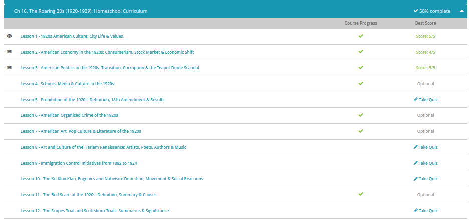

### Andrew Garber
### The Roaring 20s
### November 17

#### Culture
 - The 1920s was a time of profound change. So significant was this change that the decade is commonly called the 'Roaring Twenties.' World War I ended in 1918, and Americans were eager for a return to normalcy. Following the Great War (another name for World War I), the United States emerged as the new world superpower. Within a few years, the U.S. economy was booming.
 - The 1920s was a dynamic decade, characterized by prosperity, leisure, technological advances, consumerism and major shifts toward modern values. Modern values were particularly pronounced in urban locations. As more people relocated to large cities, like New York and Chicago, a way of life developed that was dramatically different from the rest of rural society. This urban culture became the hallmark of the entire decade.
 - In the years leading up to the 1920s, and throughout the decade, urbanization took place at an extraordinary pace. What is urbanization? Urbanization is simply the process by which people move into urban areas and contribute to their growth. For just a moment, let's backtrack to the year 1800. This will help us put things in perspective. In the year 1800, an estimated 5% of the American population lived in urban areas. By the year 1920, that figure jumped to 50%. It is commonly suggested that more people lived in urban areas than in rural areas throughout the 1920s.
 - Alcohol consumption was an integral part of 1920s urban culture. Although Prohibition had gone into effect in 1920, alcoholic beverages were readily available at illegal bars called speakeasies and through other means, such as bootlegging. Prohibition was inconsistently enforced. In many cases, law enforcement officers were bribed to turn a blind eye to the production and consumption of alcohol. Prohibition is widely cited as a leading cause of organized crime during the 1920s.
 - Arguably, one of the most prolific symbols of the entire decade is the flapper. Flappers were young women who challenged traditional, Victorian standards of womanhood. They often smoked, drank and danced in public. Typically, they wore shorter hairstyles, gaudy jewelry and slinky, form-fitting clothing. Flappers typically embodied feminist ideals.
 - The technological advances and the economic prosperity of the 1920s allowed for unprecedented leisure opportunities. Moving pictures were relatively new and attending the cinema became a popular activity. Film stars, like Clara Bow, Joan Crawford, Charlie Chaplin and Rudolph Valentino, rose to become national (and sometimes international) celebrities. Baseball emerged as a national pastime during the 1920s, as athletes, like Babe Ruth, captivated sports fans. Advertising was an important component of the decade, as consumerism played an increasingly visible role in society.
 - The 1920s has also been called 'The Jazz Age.' Jazz music flourished during this time. With its emphasis on improvisation and rhythm, this bold new genre was decidedly modern. To traditionalists, it was downright threatening. Popular performers, like Armstrong and Duke Ellington, delighted crowds as they played in venues like New York's Cotton Club. Across the nation, dance fads like the Charleston became all the rage, much to the chagrin of social conservatives. Jazz music represented all that was modern, carefree and even reckless.
 - Centered in Harlem, New York, an African-American cultural movement, called the Harlem Renaissance, took place throughout the 1920s. This movement was primarily artistic and intellectual. Artists often used bold, abstract imagery to express the uniqueness of African-American culture. Langston Hughes, an African-American writer who pioneered experimental forms of poetry, emerged as a leading figure of the Harlem Renaissance.

#### Economic
 - The 1920s have been called the Roaring '20s and for good reason. Not only was American culture 'roaring' in terms of style and social trends, but the economy was 'roaring' as well. The decade was a time of tremendous prosperity. Following the end of World War I, the industrial might of the United States was unleashed for domestic, peaceful purposes. Within a few short years, an economic shift took place as the economy transitioned from wartime production to peacetime production. New technologies like the automobile, household appliances, and other mass-produced products led to a vibrant consumer culture, stimulating economic growth. Furthermore, under the administration of three consecutive Republican presidents, the government adopted fiscally conservative policies that fueled private business.
 - Consumerism can be thought of as the culture surrounding the buying and selling of products. Consumerism came into its own throughout the 1920s as a result of mass production, new products on the market, and improved advertising techniques. With more leisure time available and money to spend, Americans were eager to own the latest items. Advertisers used this to their advantage, often stressing luxury and convenience. Through mediums like radio and print advertisements, consumer culture was more visible than ever before.
 - Sears, Roebuck & Co., a company founded in 1893, regularly issued a mail-order catalog. By the 1920s, the catalog, nicknamed the consumer's bible, had become enormously popular. It completely revolutionized how people purchased items. The catalog contained literally hundreds of pages featuring products like sewing machines, bicycles, clothing, radios, and just about everything else imaginable. Installment buying, or buying on credit, was also popular, allowing families to purchase large items like automobiles or refrigerators and pay them off gradually over a period of time. Large department stores also became popular during this time.
 - The prosperity of the 1920s came to crashing halt in the last year of the decade. In September of that year, the stock market began to show signs of stagnation. Then, in October, the bottom fell out as people panicked and began selling out their stock. On October 29, 1929, a day known as Black Tuesday, some 16 million shares were traded on the New York Stock Exchange, leading to billions of dollars instantly lost. Almost overnight, some people went from being millionaires to having virtually nothing. There were even reports of bankers committing suicide by leaping from their high-rise offices. Sadly, the stock market crash of 1929 was only the beginning. For the next ten years Americans suffered through the Great Depression, one of the darkest times in American history.

#### politics in the 1920s
 - The year 1920 not only marked the start of a new and promising decade for America, it was a year Americans would choose a new president. President Woodrow Wilson had been elected four years earlier largely with the help of reform-minded progressives who promised just that - progress. By the time of the 1920 election, most of the progressive reform initiatives had been realized. The 18th Amendment had been passed, outlawing alcohol, and the 19th Amendment, passed early that year, gave the vote to all citizens. World War I and the anxiety created in its aftermath by flu epidemics and leftist radical violence left Americans focused on everything but further progressive reforms. The Republican candidate for president in 1920, Warren Harding, would put the feelings of America into one simple slogan. He promised a 'return to normalcy.' Harding really caught the mood of the times with this mantra as Americans, desperate to feel normal again after the turmoil of the previous years, turned away from activism. Harding was not an enthusiastic man, but he had no real political enemies. He was the perfect candidate for the party. His running mate would be Calvin Coolidge, who had won popular attention as Governor of Massachusetts for his opposition to the Boston Police Strike a year earlier. Wilson had already served two terms, and while no laws prevented him from running again, he had neither the will nor good health to challenge the two-term tradition. The Democrats chose Ohio Governor James Cox and a young New Yorker named Franklin Delano Roosevelt as the vice presidential candidate. Harding easily won the election, taking 404 electoral votes to just 127 for Cox.
 - Many presidential historians compare Harding's presidency to that of Ulysses S. Grant. Harding's cabinet, like Grant's, had some of the best minds and some of the worst. Harding quickly established a pro-business tone and called for a 'new era of prosperity for America.' Tax cuts were made to bring the nation out of the brief, but impacting, post-war slump and a more lenient attitude towards government oversight of corporations was adopted. Regulatory agencies created during the Progressive Era remained but were rendered ineffective.
 - Like Grant, Harding is remembered for scandal more than any of his policies. Three years after being elected, Harding learned that an official in the Veterans Bureau was stealing medical and hospital supplies and selling them for profit. The official fled to Europe and resigned. Harding's General Counsel committed suicide, and a close friend of the Attorney General shot himself. The Attorney General himself was accused of mishandling German assets that were seized during World War I.
 - The most notable scandal of Harding's administration was the Teapot Dome scandal. Like other presidential scandals, such as Watergate during the 1970s, Teapot Dome became a catchword of the day, synonymous with wide-reaching corruption. Teapot Dome was an oil deposit in Wyoming put aside as a natural reserve and administered by the Department of the Interior, controlled by Secretary of the Interior Albert Fall. Rather than look after it, Fall allowed oil companies to drill at Teapot Dome. Fall would later comment that he did what was in the best interest of the government, but he had done all of this in secret. Fall was suspected of wrongdoing when his standard of living began to rise. It was later learned Fall was desperate for money after losing his mining interests in Mexico during the revolution there.

