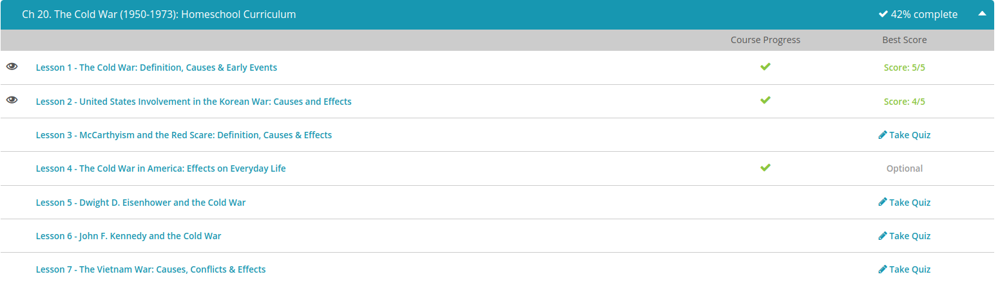

### Andrew Garber
### December 13
### The Cold War

#### The Cold War:
 - The beginning of the Cold War is linked to the Potsdam Conference in the summer of 1945. The intention of the meeting was to discuss the realignment of post-war Europe. However, discussions broke down into threats. The United States and Soviet Union agreed upon the division of Berlin, but the Soviets, under the leadership of Joseph Stalin, wanted to acquire Poland as a buffer against future attacks. President Harry Truman rejected Stalin's demands, citing the right of self-determination in the case of Poland. Truman then revealed his master card: the atomic bomb. Upon learning of the specifics of this destructive weapon, Stalin ordered a crash program to commence in order to speed arms development and counter the atomic bomb.
 - President Truman may have had the most profound effect on heightening the tension between the Soviet Union and the United States. In September 1945, as a means of limiting Soviet economic reconstruction, Truman suspended the Lend-Lease Act, which was an infusion of monetary and military aid from the United States to beleaguered nations during the Second World War. This aid helped nations such as Britain, France and the Soviet Union economically survive the war years. Unfortunately, the plan backfired as the Soviets decided to acquire satellite states, (known as members of the Warsaw Pact) in order to make up for the lost funding.
 -  In 1947, the Truman Doctrine was issued in an attempt to combat the Soviet menace. The policy called for money to be transferred to third world nations, such as Greece and Turkey, in an attempt to prevent communist expansion and gain allies in the battle against communism. The Marshall Plan encouraged funding to reconstruct European nations devastated by the Second World War. The hope was to prevent Soviet subversion into the weakened governments. Truman also passed the National Security Act of 1947. The legislation led to the creation of the Air Force, National Security Council, Central Intelligence Agency and Department of Defense. All of this was done in an effort to combat the Soviet Union and communism.
 - Containment was the foremost tool of the United States in combating the Soviet Union. This policy, drafted by Kennan and approved by Truman in 1947, called for action to be taken against international communist expansion. As a visual, imagine a fictional fence being erected around the Soviet Union by the United States. This was the general idea of containment and keeping communism from spreading into different countries. Containment was eventually enlarged as the United States suspected communism in places such as Laos, Germany, Vietnam, Korea and Cuba.
 - During the Truman presidency, several other notable Cold War events transpired. The creation of the North Atlantic Treaty Organization, or NATO, in 1949 symbolized the unity against communist expansion by Britain, Canada and the United States. The same year also witnessed the development of the hydrogen bomb by the United States, as well as the severing of diplomatic ties with Mao Zedong's communist China.

#### Korean War 
 - President Harry Truman viewed the situation as more than just a war between two nations. He feared the North Korean strike was the first step in an international communist takeover led by the Soviet Union. In response, Truman cited a 1950 National Security Council report known as NSC-68, which called for military force to contain communism. The President and other top officials saw the conflict as an opportunity to declare war against communism. Therefore, with support from the United Nations, the United States moved to establish peace, and remove the communist invaders from South Korea.
 - The early engagements were negligible. The United States, and its affiliated forces, lacked an efficient strategy during the onset of the Korean War, not to mention the American soldiers found the terrain and weather extremely difficult to conduct operations in. Additional pains were caused by the inefficiently trained and poorly led South Korean army. By the beginning of September, North Korean forces had advanced all the way to the Tsushima Strait on the border of South Korea. The North Korean march also successfully captured Seoul, the capital of South Korea.
 - The early victories of the North Koreans were short lived. By mid-September, the United States had turned the North Korean advance by utilizing its arsenal of sophisticated weaponry. Simultaneously, Truman authorized General Douglas MacArthur, Supreme Commander of the United Nations forces, to take whatever measures necessary to push the North Koreans back across the 38th parallel.
 - MacArthur recommended an amphibious landing at Inchon in South Korea. On September 15, MacArthur landed over 10,000 Marines at Inchon. By the end of the month, American forces had recaptured Seoul and began the process of driving the enemy out of South Korea. With American success came MacArthur's desire to pursue war into North Korea, and eliminate the enemy completely.
 - MacArthur successfully crossed into North Korea in November and pushed his forces to the Yalu River, which is the border of North Korea and China. This was a fatal mistake on the part of MacArthur because China viewed the advance as overly aggressive. As a result, China entered the war on the side of North Korea. The Chinese successfully drove MacArthur's forces back across the 38th parallel. Eventually, MacArthur was able to regain the initiative and drove the Chinese back across the divide.
 - Truman wanted to negotiate a settlement in Korea. However, the North Koreans were adamantly opposed to his requests. Over the course of two years, 1951-1953, overland campaigns were halted in favor of massive air campaigns over North Korea. In the final two years of the war, the United States dropped over 600,000 tons of bombs on North Korea. The saturation bombing eventually yielded the results the United States desired: a negotiated settlement.
 - On July 27, 1953, an armistice was signed between the United Nations (supported by the United States), North Korea and China. The agreement called for a ceasefire as well as the establishment of a Demilitarized Zone at the 38th parallel. The armistice also called for a permanent solution to be drafted. Unfortunately, that solution was never realized as North and South Korea are still engaged in conflict to this day. A lasting peace has yet to occur.
