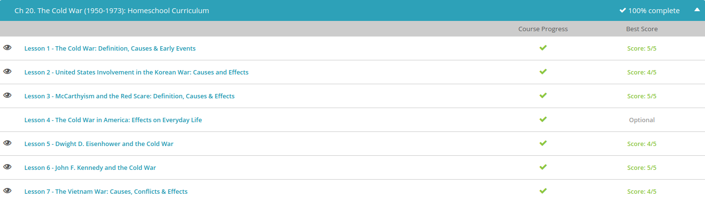

### Andrew Garber
### December 13
### The Cold War

#### The Cold War:
 - The beginning of the Cold War is linked to the Potsdam Conference in the summer of 1945. The intention of the meeting was to discuss the realignment of post-war Europe. However, discussions broke down into threats. The United States and Soviet Union agreed upon the division of Berlin, but the Soviets, under the leadership of Joseph Stalin, wanted to acquire Poland as a buffer against future attacks. President Harry Truman rejected Stalin's demands, citing the right of self-determination in the case of Poland. Truman then revealed his master card: the atomic bomb. Upon learning of the specifics of this destructive weapon, Stalin ordered a crash program to commence in order to speed arms development and counter the atomic bomb.
 - President Truman may have had the most profound effect on heightening the tension between the Soviet Union and the United States. In September 1945, as a means of limiting Soviet economic reconstruction, Truman suspended the Lend-Lease Act, which was an infusion of monetary and military aid from the United States to beleaguered nations during the Second World War. This aid helped nations such as Britain, France and the Soviet Union economically survive the war years. Unfortunately, the plan backfired as the Soviets decided to acquire satellite states, (known as members of the Warsaw Pact) in order to make up for the lost funding.
 -  In 1947, the Truman Doctrine was issued in an attempt to combat the Soviet menace. The policy called for money to be transferred to third world nations, such as Greece and Turkey, in an attempt to prevent communist expansion and gain allies in the battle against communism. The Marshall Plan encouraged funding to reconstruct European nations devastated by the Second World War. The hope was to prevent Soviet subversion into the weakened governments. Truman also passed the National Security Act of 1947. The legislation led to the creation of the Air Force, National Security Council, Central Intelligence Agency and Department of Defense. All of this was done in an effort to combat the Soviet Union and communism.
 - Containment was the foremost tool of the United States in combating the Soviet Union. This policy, drafted by Kennan and approved by Truman in 1947, called for action to be taken against international communist expansion. As a visual, imagine a fictional fence being erected around the Soviet Union by the United States. This was the general idea of containment and keeping communism from spreading into different countries. Containment was eventually enlarged as the United States suspected communism in places such as Laos, Germany, Vietnam, Korea and Cuba.
 - During the Truman presidency, several other notable Cold War events transpired. The creation of the North Atlantic Treaty Organization, or NATO, in 1949 symbolized the unity against communist expansion by Britain, Canada and the United States. The same year also witnessed the development of the hydrogen bomb by the United States, as well as the severing of diplomatic ties with Mao Zedong's communist China.

#### Korean War 
 - President Harry Truman viewed the situation as more than just a war between two nations. He feared the North Korean strike was the first step in an international communist takeover led by the Soviet Union. In response, Truman cited a 1950 National Security Council report known as NSC-68, which called for military force to contain communism. The President and other top officials saw the conflict as an opportunity to declare war against communism. Therefore, with support from the United Nations, the United States moved to establish peace, and remove the communist invaders from South Korea.
 - The early engagements were negligible. The United States, and its affiliated forces, lacked an efficient strategy during the onset of the Korean War, not to mention the American soldiers found the terrain and weather extremely difficult to conduct operations in. Additional pains were caused by the inefficiently trained and poorly led South Korean army. By the beginning of September, North Korean forces had advanced all the way to the Tsushima Strait on the border of South Korea. The North Korean march also successfully captured Seoul, the capital of South Korea.
 - The early victories of the North Koreans were short lived. By mid-September, the United States had turned the North Korean advance by utilizing its arsenal of sophisticated weaponry. Simultaneously, Truman authorized General Douglas MacArthur, Supreme Commander of the United Nations forces, to take whatever measures necessary to push the North Koreans back across the 38th parallel.
 - MacArthur recommended an amphibious landing at Inchon in South Korea. On September 15, MacArthur landed over 10,000 Marines at Inchon. By the end of the month, American forces had recaptured Seoul and began the process of driving the enemy out of South Korea. With American success came MacArthur's desire to pursue war into North Korea, and eliminate the enemy completely.
 - MacArthur successfully crossed into North Korea in November and pushed his forces to the Yalu River, which is the border of North Korea and China. This was a fatal mistake on the part of MacArthur because China viewed the advance as overly aggressive. As a result, China entered the war on the side of North Korea. The Chinese successfully drove MacArthur's forces back across the 38th parallel. Eventually, MacArthur was able to regain the initiative and drove the Chinese back across the divide.
 - Truman wanted to negotiate a settlement in Korea. However, the North Koreans were adamantly opposed to his requests. Over the course of two years, 1951-1953, overland campaigns were halted in favor of massive air campaigns over North Korea. In the final two years of the war, the United States dropped over 600,000 tons of bombs on North Korea. The saturation bombing eventually yielded the results the United States desired: a negotiated settlement.
 - On July 27, 1953, an armistice was signed between the United Nations (supported by the United States), North Korea and China. The agreement called for a ceasefire as well as the establishment of a Demilitarized Zone at the 38th parallel. The armistice also called for a permanent solution to be drafted. Unfortunately, that solution was never realized as North and South Korea are still engaged in conflict to this day. A lasting peace has yet to occur.

#### McCarthyism
 - The Red Scare, which gained notoriety during the First World War, represented the widespread concern that Americans had developed over the fear of communist (or anarchist, during the First World War era) subversion within society. Americans believed, especially during the Cold War, which was a period of tension between the United States and Soviet Union, that communism was attempting to infiltrate every aspect of their lives. While this is not necessarily the best analogy, you can relate the widespread fear of communism during the Cold War as being similar to the heightened alert Americans had toward terrorism and suspected terrorists during the beginning of the modern century.
 - Instigating this fear was Joseph McCarthy. McCarthy was a Republican senator from Wisconsin and was the leader behind the ethos of McCarthyism. The term was created in 1950 by Washington Post writer Herbert Block. Simply put, McCarthyism was the practice of attempting to minimize the threat of communism by accusing and detaining suspects deemed to be a security threat or disloyal to the United States. Investigations ranged from the federal government (especially the State Department), to Hollywood, to the general American public.
 - As reckless as McCarthy's anti-communism campaign was, he enjoyed support from a select group of powerful individuals. Most conservative members of Congress backed McCarthy's tireless search. Why? The simple answer is because a good portion of McCarthy's campaign attacked liberals and members of the Democratic Party. Supporting McCarthy helped conservatives gain notoriety and votes during national elections.
 - A notable opponent of McCarthy was President Eisenhower, who was a Republican. Eisenhower was a moderate and believed that McCarthy's tactics were both counterproductive and alienating. 
 - In June 1954, a small committee, known as the 'Watkins Committee,' led by Senator Arthur Watkins, issued a proclamation for the censure of Senator McCarthy. Congressional hearings subsequently began in August. Over a period of several weeks, members of the Watkins Committee deliberated on McCarthy's fate. By October, the committee had moved to charge McCarthy with congressional contempt and defamation of members of the Senate. In December, the United States Senate voted in favor of McCarthy's censure 67 to 22. Senator McCarthy was ostracized from the Senate, and McCarthyism became taboo.

#### Dwight D. Eisenhower
 - With his resounding victory in the election of 1952, President Dwight D. Eisenhower was thrust to the forefront of the Cold War. He was successful in bringing about an armistice to end the Korean War, but the international and domestic fear of communism continuously expanded. During his presidency, many believed Eisenhower took a seemingly nonchalant attitude toward the Cold War. However, Eisenhower was more than active in containing communism and attempting to protect international freedom from communist subversion. The Eisenhower Doctrine, which called for aid to be appropriated to help assist nations facing outside aggression, addressed the growing crisis of the Cold War throughout the 1950s. (He supported the Marshall plan, and even expanded it in some areas - Marshall was a mentor to Eisenhower)
 - The substance behind Eisenhower's strategy, also known as the New Look policy, was a potent mixture of pragmatism and toughness. Eisenhower wanted to reduce the rivalry between the United States and the Soviet Union by limiting the rhetoric and threats of each nation. He hoped that this rapprochement, or establishment of cordial relations, would cool tensions. Additionally, Eisenhower wanted to ensure that the American economy remained stable during a period of arms development. Therefore, he reduced ground forces and relied more on nuclear weaponry and air power. This would protect the economy, while giving the United States the power to retaliate with quick and devastating power against communist aggression.
 - In 1953, the climate of the Cold War took a drastic, yet somewhat favorable, turn with the death of Soviet leader Joseph Stalin. In his place came a more moderate leader named Nikita Khrushchev.(Only comparatively, Khrushchev was the political commissar during the Battle Of Stalingrad) Khrushchev promoted the notion of peace between the United States and the Soviet Union and also came to the United States to promote this diplomatic accord.
 - Another prominent example can be linked to Latin American nations, more specifically Cuba and Guatemala. In Guatemala in 1954, Eisenhower eliminated President Jacobo Arbenz Guzman's suspected communist government. Eisenhower also helped begin an embargo on Cuba after Fidel Castro assumed power in 1959. Eisenhower and the CIA also had a hand in the removal of Mohammad Mossadegh in Iran, the rise of democracy-supporting Ramon Magsaysay in the Philippines and an infusion of financial aid to the Ngo Dinh Diem regime in South Vietnam
 - The most significant piece of domestic Cold War legislation passed by Eisenhower was the National Defense Education Act of 1958. Eisenhower believed that students in the United States were drastically falling behind their communist counterparts due to the fact that the wrong skills were being taught. He encouraged a readjustment to the national curriculum, which called for a focus on academics such as math and science.

#### John F. Kennedy
 - The year 1960 marked a pivotal time in the history of the Cold War. With President Dwight D. Eisenhower leaving office, the United States was in need of a leader who could continue the battle against international communist aggression. In fact, many historians argue that it had been the most important election since that of Franklin Roosevelt in 1932. The Election of 1960 yielded that individual. John F. Kennedy was elected to office by the narrowest of margins against the Republican candidate, Richard Nixon. He promoted the New Frontier, which called for action in four areas: economics, civil rights, social welfare and a strengthened foreign policy. President Kennedy's New Frontier foreign policy rested on the notion of flexible response, that is, the ability to tactically combat communist expansion quickly and efficiently. Kennedy successfully intertwined a contagious optimism with the need for a stronger long-term strategy to compete with growing threats from international communism. This can be most clearly observed in his inauguration speech. Largely remembered for its powerful phrase, 'Ask not what your country can do for you, ask what you can do for your country,' it was an overarching call for the American people to take action.
 - President Kennedy believed that President Eisenhower had maintained a limited approach to dealing with the Soviet Union. As a result, Kennedy contended that the United States had fallen behind its communist foe in innovating defense products. This included submarines armed with missile firing capabilities, improvements in surface-to-air missiles and more advanced long-range missile systems. Additionally, Kennedy called for a crash program that would minimize the missile gap between the two nations. The huge federal appropriations dedicated toward defense would translate into a stronger flexible response program, which meant responding faster and more efficiently to communist subversion.
 - Notwithstanding increases in defense spending, Kennedy introduced several programs that attempted to undercut communism in various developing nations, especially in Africa, Asia, and Latin America. For example, Kennedy developed the Peace Corps, which promoted democracy and shunned communism. This groundbreaking program emerged from a speech he gave at the University of Michigan in October 1960. Kennedy called for America to send 'a peace corps of talented young men and women, willing and able to serve their country…for three years as an alternative or as a supplement to peacetime selective service.' This would include a diverse mix of educators, medical professionals, and agricultural experts among others. The agency continues to this day as an important contributor to America's soft power. At the same time, it reflected the thinking at the time that poverty was the core driver behind the appeal of communism in less developed nations. 
 - Kennedy also seized the initiative in regard to the space race. The Soviets, in 1957, had triggered the competition between the Soviet Union and the United States when they launched Sputnik 1 into orbit. Several years later, in 1961, the Soviets launched Yuri Gagarin into space; he became the first man to orbit the Earth. The advances in Soviet space technology resulted in Kennedy calling for increased funding of the United States' space program, and hence Project Apollo, the race to the moon, commenced. This was also part of Kennedy's long term vision and included an increased emphasis on science education in the United States. It's often cited today as evidence of why the United States needs to increase its emphasis on STEM fields, that is pursuits in science, technology, engineering, and math. While NASA and the United States had achieved incredible progress through several early Gemini and Apollo missions, the hallmark of the space program came in July 1969 when American men walked on the moon. This was the Apollo 11 mission.
 - Complications arose again in Cuba in 1962 during what became known as the Cuban Missile Crisis. The United States received intelligence that the Soviet Union had been delivering nuclear missiles to Cuba. With a nuclear threat only 90 miles from the United States, Kennedy responded by demanding the Soviets return the weapons to their own territory. Additionally, Kennedy ordered the United States Navy to envelop the island to prevent any additional missiles from entering. The standoff between the United States and Soviet Union over Cuba was as close as both nations came to nuclear war. Fortunately, Khrushchev complied and returned the missiles to the Soviet Union.

#### War in Vietnam
 - The Vietnam War was a proxy war, which occurs when one or more opposing powers instigates a war and then uses third parties to fight on their behalf (in this case, the Soviet Union and China supported North Vietnam). 58,000 American soldiers perished in the fields of Vietnam in addition to the over 1.5 million Vietnamese killed. The Vietnam War was a complete disaster for the United States.
 - Though President Franklin Roosevelt had called for a trusteeship, or group occupation, by several countries in Indochina, when President Harry Truman took over after Roosevelt's death, he enacted the policy of containment, which is preventing the expansion of communism. The French returned to monitor the democratic process, but actually spurred a revolt, sparking the First Indochina War (1946-1954). In this struggle, the nationalist forces of the Viet Minh clashed with the French colonials, who could not handle the war so soon after the ravages of the world war. The United States entered the conflict by sending a Military Assistance Advisory Group (MAAG), which was to advise, not fight alongside, the French with their operations against the Indochinese.
 - By 1960, the National Liberation Front, or Viet Cong, which was the revolutionary political arm of North Vietnam, began to infiltrate into the south along the Ho Chi Minh Trail, which was a series of elaborate trails running from North Vietnam to South Vietnam through Laos and Cambodia created in 1959. The goal of the Viet Cong was to recruit support for the war in South Vietnam. It is important to understand that the Viet Cong fought in the southern reaches of South Vietnam, while the North Vietnamese battled closer to the 17th parallel.
 - Yet, by 1963, disaster struck the United States in three ways. First, at the Battle of Ap Bac. This was the first major confrontation between the South Vietnamese Army and the Viet Cong. Needless to say, the South Vietnamese suffered a defeat. Fortunately, American firepower prevented a total loss. The second event was the assassination of Ngo Dinh Diem. After Diem decided to suppress the Buddhists in South Vietnam, a major movement against Diem began. Diem, the strongest leader America had in South Vietnam, was assassinated on November 3, 1963. The third and final event was the untimely assassination of Kennedy on November 22, 1963. The war in Vietnam bordered on total tragedy.
 -  On August 2, 1964, North Vietnamese attack boats fired on the United States destroyer, Maddox, which was stationed in the Gulf of Tonkin. Several days later, on August 4, the Maddox and destroyer Turner Joy allegedly reported being fired on again (there was never conclusive evidence). As a result of the incident, Johnson decried unnecessary aggression and was awarded a blank check from Congress known as the Gulf of Tonkin Resolution to take whatever action was deemed necessary to combat the North Vietnamese.
 - Johnson initially refused to send ground troops into the war, but he needed a way to respond to the Gulf of Tonkin incidents and force the North Vietnamese to the negotiating table. Johnson's administration then derived the idea of a massive air campaign over North Vietnam that would destroy the North Vietnamese war-making ability, infiltrate the supply route of the Ho Chi Minh trail and force negotiations. The campaign was known as Operation Rolling Thunder.
 - Derived on February 12, 1965, Operation Rolling Thunder was the largest air campaign in United States history. Beginning on March 2, it lasted three years (1965-1968) and dropped hundreds of thousands of tons of bombs on North Vietnam. But the massive bombing campaign was ineffective, and Johnson moved to send troops into the region.
- The first troops, a Marine division, landed at Danang on March 8, 1965. Johnson would eventually send several thousand troops over the next few months, but the major escalation came in July. Advised to send additional troops to expedite the end of the war, Johnson approved the transfer of 125,000 American soldiers to Vietnam. The goal for the remainder of 1965 and 1966 was to carry out Phase I and Phase II of MAC-V Commander General William Westmoreland's three-phase plan to defeat the North Vietnamese. This included pacification, or eliminating the Viet Cong presence in South Vietnam hamlets and villages, and search-and-destroy, which was a war of attrition that aimed to eliminate North Vietnamese armed forces in South Vietnam. Phase III, the ultimate objective, was to gain additional troop support and conduct a major offensive against the North Vietnamese in 1967. This was never realized.
- The temporary ceasefire, however, was a hoax implemented by North Vietnam. On January 21, 1968, the North Vietnamese launched a major offensive against American Marines stationed at Khe Sanh. The siege lasted roughly 80 days. Yet, the attack at Khe Sanh was minor compared to the massive offensive the North Vietnamese launched on January 31. The Tet Offensive, as it was labeled, witnessed over 80,000 North Vietnamese soldiers invade South Vietnam from different points along the Ho Chi Minh Trail. Cities such as Saigon, Pleiku and Hue became major battle sites. This was a definitive turning point in the war, as Americans at home watched the horrors of the invasion unfold on television. The public had been made to believe that the war was being won, yet the offensive proved otherwise. While American servicemen were able to stem the tide of the Tet Offensive and repel the enemy, the hope for victory in Vietnam was shattered due to the public outcry against the conflict.
 - Eventually, after 23 years of American involvement in the war, the United States and North Vietnam signed the Paris Peace Accords on January 27, 1973. This officially ended United States 'military' involvement in Vietnam (although American advisers remained in-country). Simultaneously, Congress implemented initiatives of its own in order to keep the United States from remaining and/or re-entering in the war. This included the passage of the Cooper-Church Amendment in 1971, the Case-Church Amendment in 1973 and the War Powers Act, also in 1973. With the United States officially out of the Vietnam War, the North Vietnamese prepared for a massive invasion of South Vietnam. By 1975, the North Vietnamese moved into South Vietnam, and the depleted South Vietnamese Army (and its American advisers) was no match for its enemy counterpart. The North Vietnamese and the Viet Cong captured Saigon on April 30, 1975. This marked the end of the conflict in Vietnam.

