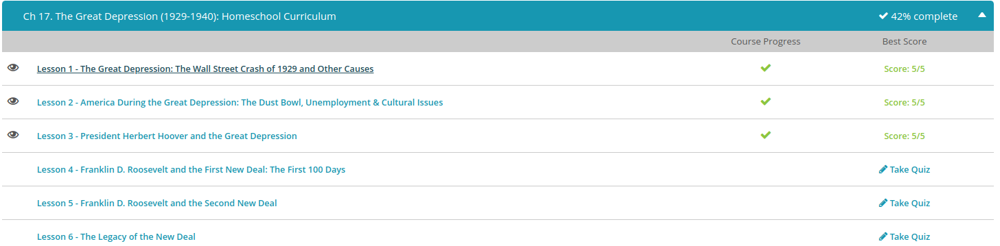

### Andrew Garber
### November 22 2022
### The Great Depression

#### The Wall Street Crash
 - From the turn of the century through the late 1920s, the United States enjoyed a period of economic prosperity. From 1922 to 1929, the gross national product, or the value of goods produced during the fiscal year, grew at an annual rate of 5%; the gross domestic product measured in at over $200 billion, and wages (for some) skyrocketed by 15%. Additionally, unemployment during the period never surpassed 5%.
 - However, on 'Black Tuesday' (October 29, 1929), the Wall Street stock market crashed and entrenched the United States in the Great Depression, the nation's lengthiest economic downturn, from 1929 to 1941. Within a few short months after the initial crash, stock prices collapsed by 50%. They would eventually fall an additional 30% at the peak of the Depression. Industrial output significantly contracted. Over 10,000 American banks, unable to sustain business, closed and left thousands of Americans without money. Between one-third to one-half of all American financial institutions collapsed. Those who had invested in the market frequently lost everything. To make matters worse, unemployment surged to 25% during the Depression years. Americans did what they could to survive, such as waiting in line at soup kitchens, scouring garbage cans and even theft. How could such a prosperous nation fall into economic despair? Let's take a look at the factors that contributed to the Great Depression.
 - The market also was not regulated as it is today. Unscrupulous agents frequently sold securities to investors which were essentially worthless. Some states had limited regulations known as Blue Sky Laws, which at least required providing a prospectus about the investment opportunity being offered. However, there was no nationwide framework to prevent these types of misdeeds. Combined with the problems caused by banks engaging in market speculation, it's no surprise the above led to the creation of the Securities & Exchange Commission shortly after the start of Franklin Roosevelt's presidency. The 1920s are the reason it was given a mandate to regulate the securities market.
 - Although the stock market crash has received the brunt of the blame for the Great Depression, unhinged market speculation by both banks and the general public were the core cause, especially for the severity. Farm incomes and wages were flat or declining in the 1920s. This created an environment where the average American could make more money from speculating on the stock market. Unlike today, banks were also playing the market. In the 1920s, banks increasingly used their customers' deposit to engage in market speculation themselves. This was a major factor in banks being unable to payout the value of the funds owed to their depositors. Banks did not keep sufficient reserves and many hadn't joined the Federal Reserve system. Even those banks in the Federal Reserve system only received warning letters in response to their high risk behavior. This also meant the banking system in America lacked a way to mount a coordinated response once the collapse started. In contrast, nations with more consolidated banking systems at that time, such as Canada, France, and the Netherlands experienced a milder, shorter depression.
 - As factory inventories built up, farm incomes failed to materialize, and corporate profits dwindled, the stock market plunged. Simultaneously, creditors who had supplied loans to investors began demanding the repayment of the loans after witnessing market earnings begin to spiral downward. Many of these creditors were the large number of banks who had wagered the funds of their depositors on the stock market. The financial system of the United States crumbled. When the Federal Reserve finally took meaningful action by raising interest rates from 5% to 6%, it was too late. The effect from this measure was that banks stopped lending, which dried up access to capital for businesses and it killed consumer spending. Both of which will make depressions worse.
 - While all of the aforementioned financial problems contributed to the collapse of the economic market, the failure of leadership by American presidents during the 1920s may have been the foremost catalyst to the Great Depression. During the period, the White House was occupied by the New Era Republicans - President Warren Harding, President Calvin Coolidge and President Herbert Hoover. These individuals projected pro-business politics and, in Harding's words, a 'return to normalcy.' These Republican presidents believed in supporting big business because it would provide prosperity for the nation.
 - While Harding's term was short and unimpressive, his successor, Coolidge, personified the ideas of the New Era Republicans. Coolidge repealed the progressive legislation of Presidents Theodore Roosevelt and Woodrow Wilson and replaced it with a pro-business ideology that consisted of tax reduction for the wealthy, high wall tariffs, deregulation of business by the federal government and the placement of the economy into the hands of business leaders. As a result, the wealthiest Americans paid less in taxes and received more money; all other Americans received less in earnings and faced tax hikes. Simultaneously, the overproduction of goods led to a flooded market because average Americans could not afford to purchase products unless they pursued credit plans. Needless to say, Coolidge's pro-business political mentality only made the Great Depression more imminent.
 - Hoover added to the wanton disregard of the American economy and the American people. Continuing with the tradition of the New Era Republicans, Hoover called for cooperation between business and society over individualism. Unfortunately, businesses of the period marginalized the common American. Individuals, farmers and factory laborers, for instance, faced tax burdens, heightened prices, lower wages and a general devaluation of land and real estate, not to mention longer work days and more dangerous working conditions. These unchecked businesses also absorbed a significant amount of resources.

#### America During The Great Depression
 - When the Great Depression, the nation's worst economic downturn, began in October 1929, very few Americans understood the precarious nature of the situation. Between 1929 and 1932, the United States economy contracted severely. Production was cut in half and investments fell by $15 billion. By 1933, roughly half of the financial institutions in the United States were closed. Additionally, unemployment reached an unprecedented 25%, which translated to an estimated 13-15 million unemployed Americans.
 - The unemployment caused by the Great Depression was unprecedented to most working Americans. There had always been the opportunity to work for some type of wage or allotment. Yet, the number of unemployed skyrocketed from 3 million in 1930 to roughly 13-15 million by 1933. You must remember the unemployment compensation that we have today was unheard of during the Depression years. While President Franklin Roosevelt's New Deal, the legislative program aimed at ending the Great Depression, offered some unemployment benefits, most Americans were left to struggle to survive.
 - Many of the jobless resorted to desperate business practices. Within the larger cities, men would generally wait in lines for hours at job sites hoping to be chosen to earn a single day's wage to help support their families. Other family members attempted to sell household items and various fruits, such as apples, on street corners to compensate for the lack of income. Unfortunately, most unemployed Americans were unable to find a sustainable income during the Depression.
 - Many had their utilities canceled and, even worse, were evicted from their apartments and homes. Families were forced to wait in bread and soup lines for a token meal. Many even turned to leaders of organized crime for sustenance. Food riots occurred throughout the nation, which witnessed families breaking into grocery stores and stealing any food that was available. Owners began securing their food markets to the level of the banks!
 - Meanwhile, 'Hoovervilles' sprung up throughout the urban areas. These were makeshift cardboard and scrap metal homes that families were forced to inhabit due to foreclosure and eviction. The name was derived from the general contempt of President Herbert Hoover and his failure to end the suffering.
 - The American experience in the rural setting may have been worse than those living in the major United States cities. Farmers in the Midwest and central United States generally suffered for a number of reasons. Hoover's protective tariffs curbed farm production and lessened the profitability of selling farmed goods overseas. Farmers also faced an overabundance of production due to the creation of the tractor. Most of their products wasted away because consumer spending was drastically reduced with the onset of the Depression.
 - To make matters worse, overproduction of the land in the region, coupled with a massive drought, led to an ecological disaster for farmers. This disaster was known as the 'Dust Bowl,' which witnessed massive clouds of dust and debris travel for miles and buried homes, equipment and livestock. The dust even traveled as far as Boston and New York City!
 - The nation witnessed a number of labor upheavals as a result of economic conditions created by the Great Depression. In 1932, unemployed laborers from the Ford Motor Company launched a massive protest at the Ford plant in Dearborn, Michigan. The event turned violent as Ford unleashed a number of its guards, coupled with the Dearborn police, onto the disgruntled laborers. In 1934, Minneapolis Teamsters clashed with police over union-related issues.
 - While white Americans certainly suffered during the Depression years, African Americans, Hispanics and Asians faced worse economic conditions and heightened discrimination. Many minorities were the primary targets of termination by businesses in major cities. Minorities who were employed on farms were known as sharecroppers, or tenants who worked on a farmer's property and repaid the farmer in crops. Unfortunately, when the farmers were told to reduce their production, sharecropper's leases were immediately terminated due to the unavailable land. This generated a massive amount of unemployment in the black and Hispanic communities.
 - Hispanics and Asians were also targeted in the Pacific states. Many white Americans believed that these individuals had stolen jobs from the whites. A general disdain against Hispanics and Asians grew until the Hoover Administration approved the deportation of Hispanics from the United States. The forced migrations continued under the Roosevelt Administration until upward of two million Mexicans were removed from the United States.

#### President Herbert Hoover
 -  With the onset of the Great Depression in 1929, President Herbert Hoover pursued various remedies aimed at reversing the course of the economic malady within the United States. While Hoover was partially responsible for contributing to the Depression, his attempts at curtailing the downturn were notable. Hoover's solution to the Great Depression included the policy of associationalism, an international resolution, and expanding the federal government. Unfortunately, it was not enough, as Hoover failed to end the largest economic collapse in United States history.
 - Hoover's first attempt to reversing the economic tide in the nation was through the issuance of his policy of associationalism. This idea encouraged all individuals within the United States to begin working together to solve their common economic issues in the hope that smaller collaboration could provide a larger and permanent remedy to the Depression. Farmers, laborers, financiers and businessmen were expected to work in unison to aid the nation's recovery; not to mention, Hoover hoped that this banding of various personalities would lead to a renewed sense of national pride.
 - Hoover owned a powerful reputation as an internationalist, especially after his major successes during the First World War. He thought a possible solution to the Depression was through the international community because he believed that the major aspects of the downturn were outside of American borders. Hoover first issued a temporary halt on loan payments owed by various European nations following the war. He also helped pass the Glass-Steagall Act of 1932, which expedited the ability of American banks to convert European investor's money into gold.
 - At first, Hoover was against the expansion of the federal government. Yet, since many of his other ideas at rejuvenating the American economy had failed, he decided to approve limited-expansion measures. For instance, he approved the creation of the Reconstruction Finance Corporation to provide loans to various institutions that were willing to construct low-cost public facilities. Hoover took additional measures in financing home construction as well.
 - Many took exception to Hoover's failed attempts at ending the Depression and his denigration of those Americans who were suffering. Many liberals rejected the Hoover Administration outright and began looking toward Russia for advice and assistance. Many adopted proletarian literature and joined the Communist Party in the hope of bettering their situation. Homeless Americans began building cardboard cities, aptly naming them 'Hoovervilles.' Poor Americans who could not afford gasoline tied horses to their cars and called them 'Hoover wagons.' Those who were homeless and unemployed often walked around with their pockets inside-out; this was known as a 'Hoover flag.'Others simply took to the streets. The Bonus Army, consisting of veterans from the First World War, ascended on Washington, D.C. in 1932 and demanded that the federal government pay a bonus of $1000 that was authorized to them in 1924. Membership in the Bonus Army swelled to upward of 20,000 veterans and many camped southeast of the Capitol and refused to move until they received payment. The House of Representatives approved the funding, but the Senate rejected the proposal.

