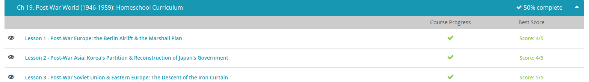

### Andrew Garber
### Dec 9 
### The Post-War World

#### Post-War Europe
 -  To assist in the recovery of war-torn Europe, the Marshall Plan was implemented. Between 1948-1951, the Marshall Plan provided economic aid to 16 European countries struggling to rebound from the destruction of World War II. The Marshall Plan was officially called the European Recovery Program, or ERP. The program has come to be called the 'Marshall Plan' because U.S. Secretary of State George C. Marshall was instrumental in developing it. Diplomat George F. Kennan also played a key role in its development. When it was all said and done, nearly $13 billion dollars in assistance was given away under the Marshall Plan. Assistance took the form of food shipments, fuel, machinery, and other staples. Distribution of aid was coordinated through the Economic Cooperation Administration, a U.S. government agency created specifically for the Marshall Plan. When the Marshall Plan first rolled out, the United States invited the Soviet Union to participate. The Soviets, however, refused, along with their Eastern Bloc states.
 - The Berlin airlift was an attempt to avert Soviet control of the entirety of Berlin, which had been split just like the rest of Germany. In an attempt to gain control of the entire city, the Soviets began ordering American military forces out of East Berlin in the spring of 1948. In June they began restricting traffic between the eastern and western sectors. They also cut off electricity and food shipments to West Berlin. Basically West Berlin was being completely isolated. This was called the Berlin blockade. Without access to the outside world, the people in the Allied sectors found themselves in a grave situation. President Harry Truman and American officials determined they could not afford to be bullied out of the city.
 - When diplomacy failed, the U.S. was forced to draw up a host of plans. There was even a contingency plan for an invasion to break the Soviet's blockade. Just three years after the end of World War II, many people feared they stood on the brink of World War III. Initially there was doubt over whether the Western Powers could muster the necessary aircraft needed to carry out such a massive operation. Adding to the logistical problem was the fact that the Allies only controlled two viable airfields. Flying through neutral air corridors into West Berlin, Operation Vittles, the codename for the Berlin Airlift, began on June 26, 1948. Its implementation was led by men like General Lucius D. Clay, Lt. Gen. William H. Tunner, and others.
 - Over the course of a year, the operation became highly efficient as more and more cargo planes were drawn in to supply the people of West Berlin. Eventually, planes were landing and taking off around the clock in a highly mechanized fashion. When it was all said and done more than two point three million tons of cargo was delivered to the people of West Berlin. The Soviet Union was humiliated by the success of the airlifts, and on May 12, 1949 they lifted the blockade.

#### Post War Asia
 - It was determined that Korea should be a free and independent country. When Japan surrendered on August 14, 1945, popularly known as... that's right, 'Victory over Japan Day', a provisional government was set up in Korea with the Soviet Union exercising control over the northern half and the United States exercising control over the southern half. Remember, during World War II the Soviet Union and the United States were allies! The boundary between the two zones of occupation was drawn at the 38th parallel.
 - In August 1948, the Republic of Korea was declared, and formally took over control of the southern half of the peninsula. This is what we know as South Korea. A month later, the Democratic People's Republic of Korea was declared in the Soviet zone of occupation. This is, of course, North Korea. Don't let the name 'Democratic People's Republic' fool you - it was anything but democratic, and it was not a republic. To this day, Korea remains divided along the 38th parallel, or the DMZ, which stands for demilitarized zone. Throughout the Cold War, and even to this day, tensions between the two Koreas occasionally erupt into minor displays of force.
 - General Douglas MacArthur was appointed Supreme Commander for the Allied Powers by President Harry Truman, and charged with supervising the occupation of Japan. Although MacArthur was supposed to collaborate with other officials, in reality, he became the viceroy of the defeated nation. MacArthur tended to be aloof in his supervision of Japan, preferring to delegate power rather than micromanage. For the average American soldier, the occupation of Japan was a cushy job.
 - In May 1947 the Constitution of Japan was enacted, making the Emperor of Japan a purely symbolic figure having no real political power. Instead, power was given to the people of Japan via a parliamentary system. 'Article 9' of the new constitution was especially important because it essentially prohibited the Japanese from engaging in war to settle international disputes. Under the new constitution, Japan was economically restructured under a system that was similar to America's New Deal program. Generally, the Japanese people were responsive to Allied attempts to foster reconstruction along liberal lines. The people realized the benefits of democracy, industrialization, and a more capitalistic economy, and generally welcomed these changes.

#### Post War Eastern Europe
 - Now that we can define the 'Iron Curtain,' let's look briefly at how it came into existence. If you remember from World War II, the Soviet Union attacked through Eastern Europe in order to invade Germany. When the war ended in 1945, Soviet troops occupied countries like Poland, Romania, Czechoslovakia, etc. The Soviets also occupied the eastern half of Germany, while the Americans, British, and French occupied the other half. Seeking a buffer zone of friendly states, the Soviets moved quickly to establish communist puppet governments in occupied countries.
 - The Western Allies certainly tried, but failed to curb Soviet expansion. At the Yalta Conference in February of 1945 and at the Potsdam Conference in July of 1945, the Allied powers met to discuss the composition of post-war Europe. Under pressure from Western democracies, Soviet leader Joseph Stalin pledged to refrain from Sovietization and insisted he would allow free elections in occupied countries. Stalin failed to keep his promise, and through falsified elections and other secretive means, the Soviet Union helped install communist governments. Unwilling to risk outright war, there was little the Western democracies could do except stand by and watch as Eastern Europe fell to communism.
 - The most visible, physical manifestation of the 'Iron Curtain' was the Berlin Wall. The Berlin Wall was built by communist East Germany in order to prevent its citizens from fleeing to democratic West Germany. Construction began on the Berlin Wall in August of 1961. The East German government claimed that the wall was built to keep its citizens safe from fascism. In fact, it was officially called the Anti-Fascist Protection Rampart, although it was obvious its real purpose was to keep East German citizens from defecting to West Germany. Over the years, thousands of Germans attempted to scale the wall, usually at the risk of their own life. Some were successful, some were not. The Berlin Wall was very much a physical 'iron curtain.'

