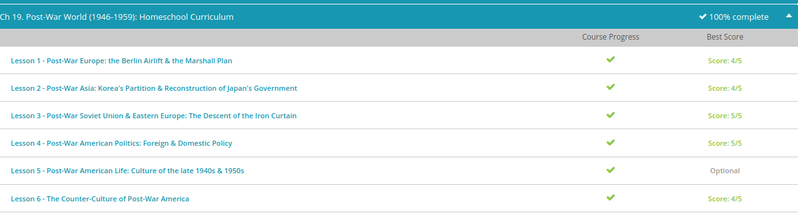

### Andrew Garber
### Dec 9 
### The Post-War World

#### Post-War Europe
 -  To assist in the recovery of war-torn Europe, the Marshall Plan was implemented. Between 1948-1951, the Marshall Plan provided economic aid to 16 European countries struggling to rebound from the destruction of World War II. The Marshall Plan was officially called the European Recovery Program, or ERP. The program has come to be called the 'Marshall Plan' because U.S. Secretary of State George C. Marshall was instrumental in developing it. Diplomat George F. Kennan also played a key role in its development. When it was all said and done, nearly $13 billion dollars in assistance was given away under the Marshall Plan. Assistance took the form of food shipments, fuel, machinery, and other staples. Distribution of aid was coordinated through the Economic Cooperation Administration, a U.S. government agency created specifically for the Marshall Plan. When the Marshall Plan first rolled out, the United States invited the Soviet Union to participate. The Soviets, however, refused, along with their Eastern Bloc states.
 - The Berlin airlift was an attempt to avert Soviet control of the entirety of Berlin, which had been split just like the rest of Germany. In an attempt to gain control of the entire city, the Soviets began ordering American military forces out of East Berlin in the spring of 1948. In June they began restricting traffic between the eastern and western sectors. They also cut off electricity and food shipments to West Berlin. Basically West Berlin was being completely isolated. This was called the Berlin blockade. Without access to the outside world, the people in the Allied sectors found themselves in a grave situation. President Harry Truman and American officials determined they could not afford to be bullied out of the city.
 - When diplomacy failed, the U.S. was forced to draw up a host of plans. There was even a contingency plan for an invasion to break the Soviet's blockade. Just three years after the end of World War II, many people feared they stood on the brink of World War III. Initially there was doubt over whether the Western Powers could muster the necessary aircraft needed to carry out such a massive operation. Adding to the logistical problem was the fact that the Allies only controlled two viable airfields. Flying through neutral air corridors into West Berlin, Operation Vittles, the codename for the Berlin Airlift, began on June 26, 1948. Its implementation was led by men like General Lucius D. Clay, Lt. Gen. William H. Tunner, and others.
 - Over the course of a year, the operation became highly efficient as more and more cargo planes were drawn in to supply the people of West Berlin. Eventually, planes were landing and taking off around the clock in a highly mechanized fashion. When it was all said and done more than two point three million tons of cargo was delivered to the people of West Berlin. The Soviet Union was humiliated by the success of the airlifts, and on May 12, 1949 they lifted the blockade.

#### Post War Asia
 - It was determined that Korea should be a free and independent country. When Japan surrendered on August 14, 1945, popularly known as... that's right, 'Victory over Japan Day', a provisional government was set up in Korea with the Soviet Union exercising control over the northern half and the United States exercising control over the southern half. Remember, during World War II the Soviet Union and the United States were allies! The boundary between the two zones of occupation was drawn at the 38th parallel.
 - In August 1948, the Republic of Korea was declared, and formally took over control of the southern half of the peninsula. This is what we know as South Korea. A month later, the Democratic People's Republic of Korea was declared in the Soviet zone of occupation. This is, of course, North Korea. Don't let the name 'Democratic People's Republic' fool you - it was anything but democratic, and it was not a republic. To this day, Korea remains divided along the 38th parallel, or the DMZ, which stands for demilitarized zone. Throughout the Cold War, and even to this day, tensions between the two Koreas occasionally erupt into minor displays of force.
 - General Douglas MacArthur was appointed Supreme Commander for the Allied Powers by President Harry Truman, and charged with supervising the occupation of Japan. Although MacArthur was supposed to collaborate with other officials, in reality, he became the viceroy of the defeated nation. MacArthur tended to be aloof in his supervision of Japan, preferring to delegate power rather than micromanage. For the average American soldier, the occupation of Japan was a cushy job.
 - In May 1947 the Constitution of Japan was enacted, making the Emperor of Japan a purely symbolic figure having no real political power. Instead, power was given to the people of Japan via a parliamentary system. 'Article 9' of the new constitution was especially important because it essentially prohibited the Japanese from engaging in war to settle international disputes. Under the new constitution, Japan was economically restructured under a system that was similar to America's New Deal program. Generally, the Japanese people were responsive to Allied attempts to foster reconstruction along liberal lines. The people realized the benefits of democracy, industrialization, and a more capitalistic economy, and generally welcomed these changes.

#### Post War Eastern Europe
 - Now that we can define the 'Iron Curtain,' let's look briefly at how it came into existence. If you remember from World War II, the Soviet Union attacked through Eastern Europe in order to invade Germany. When the war ended in 1945, Soviet troops occupied countries like Poland, Romania, Czechoslovakia, etc. The Soviets also occupied the eastern half of Germany, while the Americans, British, and French occupied the other half. Seeking a buffer zone of friendly states, the Soviets moved quickly to establish communist puppet governments in occupied countries.
 - The Western Allies certainly tried, but failed to curb Soviet expansion. At the Yalta Conference in February of 1945 and at the Potsdam Conference in July of 1945, the Allied powers met to discuss the composition of post-war Europe. Under pressure from Western democracies, Soviet leader Joseph Stalin pledged to refrain from Sovietization and insisted he would allow free elections in occupied countries. Stalin failed to keep his promise, and through falsified elections and other secretive means, the Soviet Union helped install communist governments. Unwilling to risk outright war, there was little the Western democracies could do except stand by and watch as Eastern Europe fell to communism.
 - The most visible, physical manifestation of the 'Iron Curtain' was the Berlin Wall. The Berlin Wall was built by communist East Germany in order to prevent its citizens from fleeing to democratic West Germany. Construction began on the Berlin Wall in August of 1961. The East German government claimed that the wall was built to keep its citizens safe from fascism. In fact, it was officially called the Anti-Fascist Protection Rampart, although it was obvious its real purpose was to keep East German citizens from defecting to West Germany. Over the years, thousands of Germans attempted to scale the wall, usually at the risk of their own life. Some were successful, some were not. The Berlin Wall was very much a physical 'iron curtain.'

#### Post War American Politics
 - In the immediate post-war era, the United States adopted a broad foreign policy strategy that has come to be known as containment. Put simply, containment policy was designed to contain the spread of communism, but not necessarily combat it where it already existed. Containment policy was formulated by diplomat George F. Kennan, and became the cornerstone of President Harry Truman's foreign policy.
 - The Truman Doctrine marked the official implementation of containment policy. In a famous 1947 speech, Truman proclaimed that the United States would intervene to provide economic and military support to Greece and Turkey, whose people were attempting to thwart a communist takeover. The Truman Doctrine essentially stated that the United States would provide support to countries resisting communism. In this way, the United States sought to stop the spread of communism, but maintain the promise of simple containment.
 - Another foreign policy approach throughout the post-war era was the domino theory. This was the view held by successive administrations that if one country in a region fell to communism, other nearby countries would also fall, much like dominoes. The domino theory is particularly associated with the Vietnam War, since it was justified under the theory. The belief was that if Vietnam fell to communism, many other countries in Southeast Asia would do the same.
 - A discussion of post war American politics would be incomplete without a discussion of NATO. NATO stands for North Atlantic Treaty Organization. The organization consisted of major Western democracies like the United States, Canada, Britain, France and others. Its purpose was to establish a collective defense against the threat of communism. Member states pledged that an attack against any one state constituted an attack against the whole. To counter NATO, the Soviet Union and Eastern Bloc states developed their own mutual defense league under the Warsaw Pact.
 - While foreign policy issues tended to take center stage in the post-war era, there were challenges on the domestic front as well. Not all, but many domestic issues were tied to foreign policy issues. For example, a wave of anti-communist sentiment swept the United States following the close of World War II. Called the Red Scare or sometimes McCarthyism (after Republican senator Joseph McCarthy), this period, lasting roughly between 1947 and 1953, was characterized by a heightened fear of communism. During this time, many Hollywood actors, screenwriters and filmmakers who were suspected of having communist ties were blacklisted, leaving their careers in ruins. Members of the American Communist Party were denied First Amendment rights and imprisoned because of their political views. Rooting out communism from the domestic realm was thus a pillar of post-war domestic policy.
 - Many people don't realize the interstate highway system has its root in Cold War military strategy. In 1956, President Dwight D. Eisenhower signed the Federal-Aid Highway Act of 1956, known also as the National Interstate and Defense Highway Act. One of the major motivations for establishing a national highway system was to allow military forces to move quickly from point to point should a war with the Soviet Union break out. Of course, the interstate highway system was open to private use as well. The largest public works endeavor up to that time, the interstate highway system helped revolutionize travel culture.

#### American Culture of the 1940-1950s
 - Thousands of young American men had spent years away from their wives and girlfriends because of World War II. You can imagine the joy they experienced upon being reunited. Not surprisingly, marriage rates soared in the postwar era. With the war over and the promise of American prosperity on the horizon, many couples decided this was the ideal time to begin a family, and an unusually high number of children were born. This trend is called the 'baby-boom'. The 'baby-boom' lasted between 1946-1964. People born during this time are now commonly called 'baby-boomers.'
 - With the dramatic increase in new families, suburbs emerged as a popular place to live. These pre-fabricated homes placed just outside city limits became all the rage. One of the most famous examples of the postwar idealized suburb was Levittown, New York.
 - In many ways, the early postwar era was a socially conservative time. Gender roles for men and women were more often than not traditional and very clearly defined. When World War II ended, many women who had worked in factories during the war returned to home and the domestic way of life. The feminism so characteristic of the 1920s to early 1940s was noticeably lacking throughout the 1950s. While there were exceptions, and while we must be careful about over-generalizing, the traditional nuclear family as typified in the popular television show Leave it to Beaver was very much the cultural norm.
 - Unfortunately, not every soldier returning from war was met with heroic welcome and an abundant post-war life. Black soldiers who had served bravely for America were met with the same segregation and racism they'd felt when they'd left for war. Job opportunities were scarce due to discrimination in the work force, and receiving the benefits of the G.I. Bill proved almost impossible. While some were refused benefits because they had not been honorably discharged from the army, others who were discharged could not access the benefits or were still denied. Local and state government loopholes and racist-based intimidation kept black veterans from the prosperity the white veterans were given to enroll in college and to excel in the housing and job markets. In protest, the NAACP and other civil rights groups gained a tremendous amount of support and memberships that would later propel the civil rights effort in the sixties.
 - The American-Soviet tension was another aspect of life at this time period. The roots of this conflict were tied to World War II over the differences in how Eastern Europe should be reconfigured. By the time the Soviet Union successfully exploded their first atomic bomb in 1949, the Cold War was well underway. The Red Scare, sometimes called the Era of McCarthyism or just McCarthyism, was a period of time roughly between 1947-1954 when many Americans experienced heightened fear over the potential spread of communism. Of particular concern was the prospect of communist infiltration within the United States.
 - Republican senator Joseph McCarthy, after whom 'McCarthyism' is obviously named, was one of the leading figures of the Red Scare. McCarthy became famous for his crusade against communism and for making unfounded allegations of communist activity. Throughout the Red Scare, many Americans were wrongly accused of being communists. The Hollywood motion picture industry, in particular, came under suspicion, resulting in many actors and actresses having their careers destroyed. The House Committee on Un-American Activities was set up to investigate alleged communist activity within the United States. While there is still debate among historians, it is now generally believed that the Red Scare was mostly an unfounded paranoia.
 - A distinct youth culture developed during the postwar era. Many teenagers enjoyed 'souping up' old cars, a hobby that came to be known as hot-rodding. Many boys read comic books and science fiction, while, among girls, hula-hooping became a fad. For both males and females, blue jeans became a popular fashion.
 - Drive-ins and fast food were another popular feature of the postwar cultural landscape. Throughout the 1950s, a fast food chain called McDonald's perfected the art of delivering affordable, tasty food prepared in a matter of minutes. Within a short period of time, McDonald's would become a staple of American food culture, spawning numerous imitations.

