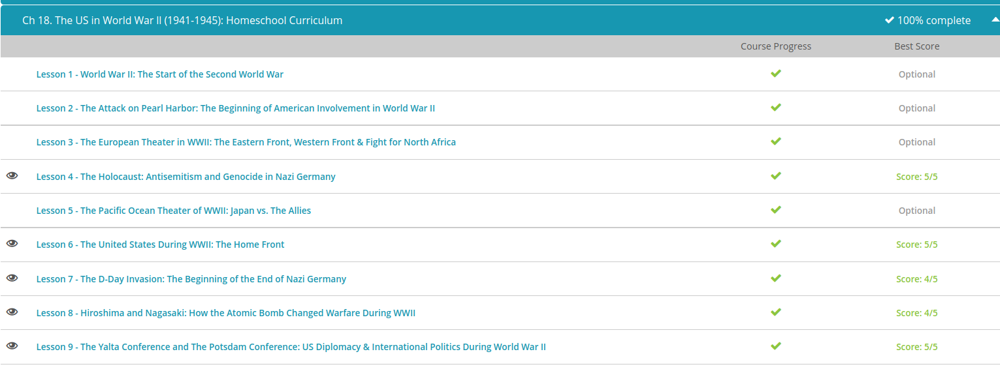

### Andrew Garber
### The US in World War Two
### November 28

#### The Holocaust
 - The term Holocaust typically refers to the persecution and mass murder of as many as 11 million people by the Nazis, or German fascists, between 1933 and 1945. Though history cannot hold just one person responsible for all of the atrocities carried out, the Holocaust corresponds with the political rise of one man: Adolf Hitler. He became Chancellor of Germany on January 30, 1933. By the middle of the next year, he was dictator with the title of Fuhrer.
 - Hitler had started cleansing, what he called, ''the master race'' almost as soon as he took office. In addition to the nearly six million Jews he targeted, there were more than five million non-Jewish victims as well. The Nazi regime tried to eliminate anyone who might pose a political threat, including communists, journalists and various Christians who opposed Hitler, those they believed would dilute the Aryan gene pool, such as Romani people, Jews, Black people, individuals with disabilities, incarcerated people, and others who were perceived by the Nazi government as a drain on the economy, in addition to groups they just didn't like, such as LGBTQ people. (Though Nazi Hatred for LGBTQ groups was not, as is commonly believed, an "original" tenet of Nazi policy: Ernst Rohm was an openly gay man. It was a later addition to Nazi ideology in an effort to ensure "moral superiority".)
 - Depending on the offense, people might find themselves subject to heavy labor, forced abortions and sterilization. They were very likely to have their assets stolen and then be imprisoned in a concentration camp anywhere in the Third German Empire, or Third Reich, where they were often executed or worked to death. The exact number of camps varies, depending on the definition, but there were dozens of main camps, many with sub-units, serving different functions. Current estimates total about 20,000 camps.
 - Since at least the end of WWI, Hitler had specifically blamed Jews for his nation's problems. Antisemitism wasn't a new phenomenon in Europe, but the Nazis ramped up the prejudice to a murderous level. First, Jews were identified by voluntary registration, other research, like census and immigration records and synagogue membership, and through informants who were paid bounties. Then, beginning in 1933, a series of increasingly strict laws stripped away Jewish rights, including land ownership. They were barred from many professions like law, medicine, journalism and the military
 - The Night of Broken Glass, or Kristallnacht, in November 1938 marked a turning point in Jewish persecution. As retribution for the murder of a German embassy employee in Paris by a German-born Jewish student, more than 9,000 Jewish-owned businesses, homes and synagogues were destroyed or vandalized. As many as 91 Jewish men were murdered, and upwards of 30,000 were arrested and sent to concentration camps.
 - After invading Poland in 1939, Hitler ordered the separation of citizens the Nazis considered to be ''undesirable'' from the rest of the population. Hundreds of thousands of Jews were relocated into ghettos located near railroad lines. Within months, Polish Jews became enslaved and had to wear a white Star of David on their arms. Eventually, Jews throughout the Reich were required to wear the recognizable yellow Star of David on their chests.
 - But as the Nazis conquered more and more territory, they encountered more and more people that they believed to be ''sub-humans,'' including Allied POWs who fit their description. Germany began deporting Jews to concentration camps. Those who were allowed to remain at home for the time being became slave labor in the war industries. In newly occupied lands, the Nazis thought the easiest solution was to simply kill as many Jews as possible on the spot, or pay local citizens to do it for them, but many others were sent to camps. Meanwhile, Hitler's allies began to start their own cleansing programs.
 - By the summer of 1941, the Fuhrer ordered the systematic extermination of all Jewish people in Europe. Called the Final Solution, this genocide program began at Auschwitz, but ultimately included six death camps, all in Poland, specially equipped for mass murder. European Jews, plus some others considered ''undesirable,'' were typically deported by freight and cattle cars, packed shoulder to shoulder for days without room to sit, without protection from weather and without food, water or bathroom facilities. Those who survived the train ride were separated upon arrival.
 - Useful prisoners were tattooed with a number, stripped of their clothes and belongings, shaved and hosed down. They were often allowed to live as long as they were productive workers for the German war machine. Those who weren't useful enough were killed immediately, including almost all children and older adults. A number of execution methods were tested, but by January of 1942, Zyklon-B gas became the preferred method. The earliest victims were buried in mass graves, but cremation soon became the only sustainable option.
 - Over the next two years, the death camps were continually expanded, but following D-Day, the Allied invasion of Northern France on June 6, 1944, the camps increased the executions to a record daily high of 9,000 at Auschwitz—faster than they could dispose of the bodies. After the Soviet army liberated the first camp in July, the Nazis started eliminating as much evidence as possible, destroying camps and moving the prisoners as the Allies closed in. By the time Auschwitz was discovered in January 1945, up to two million people had been murdered there. The first camp to be liberated by American troops was Buchenwald in April 1945.

#### The American Home Front
 - World War II had been raging for more than two years before the United States entered in December 1941. Life was changed almost overnight - not just for the 16 million men and women who joined the armed services, but for those who stayed home, as well. World War II had a profound influence on American government, economy and society.
 - Personal decisions, like what to have for dinner or what to wear to the office, were shaped (if not dictated) by the needs of the army. There was a rationing program that controlled the purchase of certain items needed for the war, like gasoline, and distinct shortages of other goods. Prices and wages were fixed. A massive propaganda campaign run by the United States government urged Americans to conserve wherever possible, grow their own vegetables in a 'Victory Garden' and clean their plates. Even fashion was affected by war shortages, since commercially-produced fabric was needed for uniforms - not for long ball gowns, vests or cuffs.
 - Even entertainment was affected by the demands and interests of a wartime nation. When 95% of professional baseball players traded in jerseys for uniforms, including even Joe DiMaggio, a 'second string' of athletes got a chance at the big leagues - including women. Many of the nation's most famous actors, such as Clark Gable and Jimmy Stewart, also joined the armed forces, but Hollywood still cranked out feature films. Movies typically started with updates and footage from the front lines, often adding cartoons with negative caricatures of the enemy, followed by the main feature.
 - World War II had an enormous impact on the federal government. A network of new agencies emerged to coordinate the war effort on the battle front and the home front. Most of these were dissolved after 1945, but Americans still became accustomed to looking to the president and Washington for solutions to problems, rather than local or state government. And even though measures like price and wage fixing ended with the war, there was also a lasting influence when it came to federal oversight of the nation's economy.
 - The propaganda machine cranked out posters encouraging American production and investment. Even before Pearl Harbor, President Roosevelt had promised America's allies that the nation would become the world's 'arsenal of democracy,' and it did. The United States unleashed its productive might, lifting the nation out of the Great Depression and forging lasting links between the military and industry. Factories that had once manufactured consumer goods converted to war production. For example, Ford Motor Company could build one B-24 bomber every HOUR. American workers produced 14,000 ships, 80,000 landing craft, 100,000 tanks and armored cars, 300,000 airplanes, 15 million guns with 41 billion rounds of ammunition, and two atomic bombs. Through it all, posters on factory walls reminded workers that every accident, every sick day, every extra minute on a break was time lost to the enemy.
 - The war not only encouraged the growth of big business, it also accelerated the growth of commercial agriculture. American farms multiplied their output of wheat, corn and other foods. Ironically, American civilians faced shortages of many food items.
 - Finally, World War II had dramatic social effects. Many jobs that had previously been closed to women and African-Americans suddenly opened up when millions of men went overseas to fight. Thanks to a popular 1942 song, women in the war industries were nicknamed Rosie the Riveter, epitomized by a now-famous poster from the Westinghouse Company. By the mid-1940s, more than a third of American women were in the workforce, up nearly 50% from before the war. While most women left their positions when the men returned, their experience laid the groundwork for the women's rights movement in coming decades.
 - The war also spurred change for African-Americans. Before the war, they had suffered legal discrimination and segregation and had twice the rate of unemployment. When World War II started, 50% of all defense manufacturers refused to hire black men. They were banned from the Marine Corps and Air Corps, and could only serve as messmen in the Navy. In the army, African-Americans were generally restricted to service duties. A 1941 protest agitated for the chance to serve equally in the military and in war production. The shortage of labor caused many employers to relent, and the defense industries were desegregated by executive order. Similarly, casualty rates opened up combat positions to minorities, and by the end of the war, African-Americans served with distinction in all ranks in many positions, including pilots and medics. The races still weren't socially and legally equal, but World War II was a milestone in the fight for civil rights.

#### D-Day
 - The D-day landings were an instrumental event in WW2, and the successor to previous Allied naval landings such as Operation Torch in North Africa, and Operation Husky in Sicily. Operation Overlord was the largest amphibious invasion on record, although precise numbers are difficult to pinpoint because so many nations were involved. On D-Day, 11,000 or more Allied aircraft dropped bombs and paratroopers, targeted Nazi troops moving to the front line, kept every German airplane away from the beaches until dark and stopped every enemy U-boat that approached the English Channel. By D-Day+5, up to 7000 vessels had participated, and before it was over, nearly 2 million men had taken part in the invasion effort.
 - Coordination among the Allies remained paramount in the weeks to come. From his headquarters in Normandy, General Eisenhower (commander of Allied forces) linked American ground troops with scattered paratroopers, and directed British movements, as well. The Germans were defeated in one bloody battle after another until Paris was liberated on August 25, 1944 by General Patton, leading a very real army this time. The general sent a famous telegram to his commander reading, 'Dear Ike: Today I spat in the Seine' (that's the river that runs through Paris). By the end of 1944, the Allies were approaching the Rhine River, the border between Germany and France. But the engagements had taken their toll, and many experienced troops were lost, to be replaced by fresh recruits.
 - Keeping all of these forward units supplied was also a logistical challenge, and a special transport group nicknamed the 'Red Ball Express' was organized. Comprised mostly of African Americans, they drove continuously in tag-team fashion to bring the combat troops as much fuel, food and ammunition as possible to advance as fast as the Nazis could retreat. But as the supply line grew, it slowed down, and soon, a shortage of fuel was seriously hindering the invasion.
 - Hitler took advantage of the opportunity to mount one last-ditch, surprise offensive against the American and British line. On December 16, 1944, the Nazis smashed against a 60-mile front, making significant headway especially against the inexperienced reinforcements. It has been called the Battle of the Bulge because of the 'bulge' in the Allied front where Nazis had taken ground. Although the Allied line never completely broke, many small units were surrounded, prompting General Eisenhower to drop in airborne troops in critical locations. The Americans suffered approximately 77,000 casualties, and the commanders realized that Hitler was going to fight this war out to the very end.
 - By late January 1945, all of the ground lost in the Battle of the Bulge was recaptured, and the Allies approached Germany from both sides. As the Soviets closed in from the east, civilian refugees fled the border region and moved into the city of Dresden. On February 13, British and American bombers began attacking, starting fires, leaving the city in ruins, and killing tens of thousands of people. It is one of the most controversial Allied actions of the war, but such air raids helped contribute to Germany's defeat.
 - In March, the western Allies found an intact bridge across the Rhine River and within a week, ground troops were invading Germany itself. A month later, they had met up with the Soviet Army. On April 30, 1945, Hitler shot and killed himself; Germany surrendered on May 8, 1945. This is commonly called VE Day, for Victory in Europe, and it happened to be President Harry Truman's birthday. The war in the western theater was over, but it would drag on for several more months in the Pacific.

#### Hiroshima and Nagasaki - The Start of the Atomic Age
 - In March 1945, American troops conquered Iwo Jima. Just 350 miles from Japan, the island's defenders fought nearly to the last man. A third of all U.S. Marine casualties in the entire war were at Iwo Jima. Meanwhile, American bombers were raining destruction on Japan, targeting airfields and ports and cities. After just two days, miles of city streets were leveled, a million people were left homeless and 100,000 people were dead - and that was just in Tokyo. But Japan refused to surrender. When American troops invaded Okinawa, they met even stiffer resistance. The Japanese defenders and civilians fought desperately for nearly three months, and sent in a rain of kamikaze attacks. Before it was over, they had inflicted nearly 50,000 U.S. casualties while losing as many as 200,000 of their own, but they still refused to surrender.
 - While he deliberated the planned invasion, President Truman learned about the Manhattan Project, a secret program to develop a powerful new weapon: the atomic bomb. It began, in some ways, before America even entered the war. Upon Adolf Hitler's rise to power, Albert Einstein, the famous German Jewish physicist, had fled to the United States. And then in 1939, Einstein and other leading scientists learned that Germany was working to split a uranium atom. They quickly contacted President Roosevelt to urge him to begin a nuclear program, and thus began America's Advisory Committee on Uranium. From very humble beginnings with just $6,000 and three university labs, the program grew to include 30 sites in the U.S., Canada and Britain, with more than $2 billion in funding. In 1941, it was code-named the Manhattan Project, though its main facility was high in the mountains of Los Alamos, New Mexico. In addition to developing an atomic weapon, the program also gathered intelligence on Germany's project from behind enemy lines. Ultimately, the Manhattan Project employed over 130,000 people. Under the direction of J. Robert Oppenheimer, the massive research project was kept secret from even the vice-president. Ironically, the Soviet Union had learned about it from a well-placed spy.
 - After experimenting with both uranium and plutonium, as well as trying both explosion- and implosion-type weapons, the world's first nuclear bomb was detonated at the Trinity Site, in the desert of southern New Mexico. Even the scientists who had developed the bomb were shocked by its power. A mushroom cloud stretched 40,000 feet into the sky. The blinding flash was visible for 200 miles, and a shock wave blew out windows 100 miles away. The desert for half a mile was turned into glass. Civilian witnesses to the destruction were assured that an ammunition dump had exploded.
 - By most accounts from the period, the decision to use the new weapon against Japan was fairly simple. The slow progress of the island invasions and Japan's refusal to surrender were becoming expensive, both in terms of dollars and human casualties. The war had been a bloody grind that laid waste to large swaths of Asia and Europe. If the goal was to end the war as soon as possible, why wouldn't America and its allies use every weapon at its disposal to do just that? Keep in mind that the conventional bombings in Germany and Japan up to that point were already deadly and destructive to civilian targets. Truman also justified the attack as retribution for Pearl Harbor, saying, 'When you have to deal with a beast, you have to treat him as a beast.' Finally, using this impressive new weapon was a way to project an image of power to Josef Stalin and the Soviet Union, with whom tensions were increasing quickly. There was potential for the new weapon to improve the American position in the negotiations to follow the conclusion to the fighting.
 - Truman approved the bombing of selected Japanese targets. Before they were dropped, the Potsdam Declaration of July 26 sent an ultimatum to Japan: surrender unconditionally or face prompt and utter destruction. The Emperor never responded. It was a poor decision.
 - On August 6, 1945, the American bomber Enola Gay dropped a bomb nicknamed 'Little Boy' on Hiroshima, a center of war industries and military operations. Temperatures reached tens of millions of degrees, and the flash was ten times brighter than the sun. Within minutes, two-thirds of the city's buildings disappeared and up to 80,000 people died. But Japan did not surrender. Three days later, August 9, the United States dropped a second nuclear weapon, called 'Fat Man,' on Nagasaki. A third of the city and roughly 40,000 people were destroyed. That same day the Soviet Union, with whom Japan had tried to make peace, invaded Japanese-occupied Manchuria in northeastern China, an area which was vital for Japan's access to coal and other strategic resources. Finally, with almost no ability to wage war and unwilling to endure more destruction and loss of life, Emperor Hirohito decided to surrender, without knowing Truman had called off any further atomic strikes. Although a few Japanese generals attempted a military coup, preferring to fight to the death rather than surrender, they were defeated. On August 15, 1945, the Emperor explained his decision to surrender in a radio broadcast to his people. Because of time zones, the announcement reached the United States on August 14, widely considered VJ Day in America, although a treaty wasn't actually signed for several weeks. World War II was finally over.

#### Yalta and Potsdam
 - Each man had his own agenda when they gathered in Russia for the Yalta Conference. In reality, Stalin held most of the cards; his Red Army now occupied much of Eastern Europe where it had driven out the Nazis, and it was preparing to invade Berlin itself. And what Stalin wanted most was to spread communism. Still, Roosevelt was determined to convince the Soviets to declare war on Japan, a promise Stalin was willing to make in exchange for a greater sphere of influence in Asia.
 - Churchill (completely uninformed of this arrangement) was most concerned about the fate of Poland, half of which Stalin intended to keep. But Poland's sovereignty was the reason Britain had joined WWII in the first place. Churchill couldn't realistically force the Soviets out of Poland without a new fight, but he insisted that Eastern European nations under new Soviet influence be guaranteed free elections. Stalin agreed.
 - Perhaps most importantly, though, the Big Three divided up Germany and the city of Berlin into four temporary occupation zones: one for each of their nations and another one for France. Other nations or regions controlled by Axis powers were also slated for occupation, including Korea.
 - In July 1945, Germany was defeated, but the Allied leaders still had a Pacific war to win and a lot of cleaning up to do in Europe. They met one last time at the Potsdam Conference in Germany to finish the work. The most significant outcome of this conference may have been the Potsdam Declaration, issued jointly by America, Britain and China, threatening 'prompt and utter destruction' if Japan did not surrender unconditionally. As for Europe, the leaders argued over treaties and borders and the redrawing of Poland, but easily agreed that Germany would be demilitarized and discriminatory laws from the Nazi era would be repealed. While a new government was being constructed, Germany would be managed via the four zones determined at Yalta.
 - In many ways, a major issue at Potsdam was the tension among the leaders. One awkward situation was the addition of Clement Attlee to the British delegation. The results of the July 5 Prime Ministerial election weren't yet tallied when the Potsdam Conference opened, leaving Churchill in charge. But half-way through the Conference, it was finally announced that Churchill had lost his bid for reelection; Attlee replaced him at the negotiating table. The United States, of course, also had a new player - Harry Truman, who had acceded to the presidency after Roosevelt's death.
 - Stalin tried to take advantage of the change in leadership in a thinly-veiled power grab, making territorial and financial demands contrary to the Atlantic Charter. He defended his interests as self-defense against Germany. But President Truman didn't trust Stalin as his predecessor had, and proved to be much less willing to negotiate such issues. Unfortunately, what Truman had hoped would be a major bargaining chip (the revelation that American scientists had just successfully tested the world's first atomic bomb) turned out to be anti-climactic; Stalin had actually known about the development of the bomb long before Truman had, thanks to his spies.
 - It was clear that without a common enemy, Great Britain, the Soviet Union, and the United States were no longer unified in purpose. The leaders of these and many other nations had been able to talk through their differences for five years, but Potsdam concluded the wartime diplomacy. A powerful alliance turned to post-war resentment, suspicion and mistrust. The world's next great conflict, the Cold War, was just around the corner.

