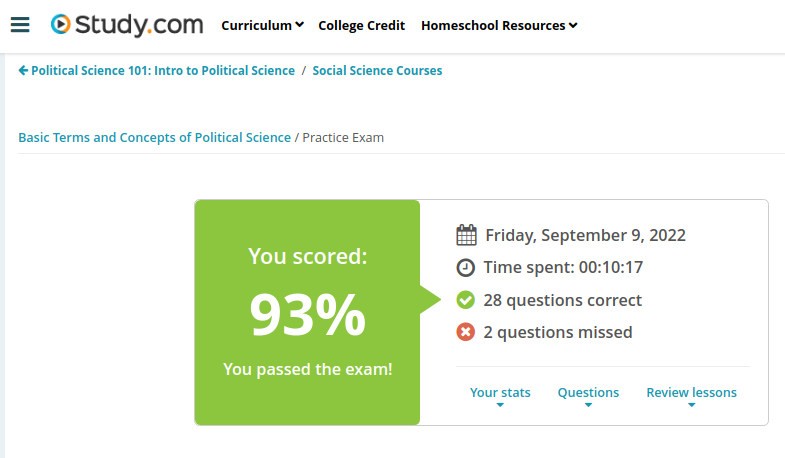

#### Andrew Garber
#### Sep 9 2022
#### Chapter 1: Basic Terms and Concepts of Political Science

#### What Is Political Science
Politics is not a cleanly define word or term, rather it is a spectrum determined by who is analyzing it. Some say it is everything that governments and states do, some say that it is the process by which elected officials get elected in a democracy, or take power in monarchies and dictatorships, while being separate from the actual administration of governmental work. Others claim that it is nothing but a societal factor by which large societal decisions are made and offered, Hannah Arendt claiming it as, "the interaction of 'free and equal citizens' in a society" - though how this applies to societies in which people are not free and equal, is not explained. 
Despite this debate, the most generally accepted group of definition is:
 - Politics is the art of government, both how you gain power and what you do with it, and how those not in power(opposition parties, or regular citizens not involved in daily governance) act and their power.
 - Politics is the interaction of citizens in the public sphere
 - Politics is a process of conflict resolution through negotiation, conciliation and compromise
 - Politics is the power-struggle that determines how limited resources are allocated
 - Politics is an inherently corrupt activity that has a tendency towards manipulation

#### The rules of American democracy*
 - Democracy
        - Democracy is government by the people, in a democracy all citizens(except those legally unable to do so, be it criminals or those not yet of age) have the right to participate in the political process
        - The peoples' views are important because, at the end of the day, any authority that the government has comes from them, the people of the country.
 - Constitutionalism 
        -  The Constitution is the rule-book of American democracy, It specifies the form that the government must take, and it sets boundaries that government leaders cannot cross. Here in America, the Constitution calls for three branches of government - the executive, the legislative, and the judicial.
        - These branches are separated in a Democracy, so that no individual branch can amass too much power, leaving the ultimate power of American democracy in its rightful hands: the peoples.
 - Capitalism
        - Capitalism is an economic system that gives individuals and businesses the freedom they need to buy and sell their goods and services in an open and competitive market. 
        - People can choose for themselves what they produce, and they can set their own prices, usually based on the supply of similar goods and services and the demand for them. Citizens are also free to hold private property and to use it as they please.
        - This does not mean that the government is completely uninvolved in a modern economy, they set consumer protection laws that makes sure that workers and citizens are not taken advantage of - they given incentives to businesses to foster innovation.

#### The difference between Countries, Nations, States and Governments

 - States: A country and a state are effectively the same thing on the international stage, however in the world of political science State is generally used as it is more accurate and more generally understood.
 - Nations: A nation is a distinct population that are bound together by a common culture, history and tradition and are generally concentrated geographically. The Jewish nation, and the separate American Indian tribes are all independent nations(though within the borders of other distinct States).
 - The Institution of Government: The institution of government is a group of people with the authority over a unit of political power at a given time. They are the administrators and policy creators that keep the modern world running.
 - The process of government is the manner in which a political unit is government at a time. For example, government in the United States involves democratic representation and primarily free market principles in managing resources.

#### The concept of citizenship

Citizenship: A status held by a person that entitles the person to certain rights, privileges and protections of a state, and also imposes duties and obligations on the person to the state.

 - A government will protect its citizens from domestic crimes, terrorism, and foreign, economic and military threats. 
 - A citizen is also obligated to the state, most notably with loyalty to that state.
 - A citizen is also the citizen of the state, and local municipality they reside in. 
 - A citizen may also be the citizen of another state, either due to family, work, or for other reasons.
 - Civil society can be thought of as associational life. It's the organized activities and institutions in which people with shared interests and values participate. Civil society is neither based on for-profit business or the government. 

#### Direct vs Representative Democracy
 - Direct Democracy is a system of government in which citizens fully participate in the formation of government policy(but generally do not do the work of implement and enforcing it.) The most common example of this in modern States is the ballot referendum, by which voters can directly vote for or against laws/amendments that will impact their daily lives.
 - Representative Democracy is a system of government in which citizens elect individuals to represent them in government.
 - In a parliamentary system(a type of Representative Democracy), the executive branch is intertwined with that of the legislative. The executive, most commonly a Prime Minister, is elected by his colleagues in the parliament and elevated to the highest office for as long as he holds the confidence of his peers or his term expires.
 - In a Presidential System, the executive and legislative branches are disconnected in the electoral process. Citizens vote for legislature and chief executive separately. There is no guarantee that the same political party will hold both the legislative and executive branches, leading to divided government.

#### Political Justice
 - Distributive justice is concerned about the fairness or rightness of the distribution of resources in society. Distributive justice is an important concept in politics, since politics is often considered the art and process of determining who gets what, how they get it and when they get it. The most common example of this is tax revenue distributed, as some governments believe that their main priority is the economic welfare of their citizens, thus wealth is redistributed to the lower classes to form a more equal society.
 - Retributive justice concerns itself with punishment. It seeks to penalize those that violate its laws in a manner that is fair in light of the crime committed.
 - Corrective justice concerns correcting the damage done to an individual whose rights have been violated. For example, you have a right to be free from intentional injury and damage to your property caused by another.
 - Procedural justice is not about a just result, but rather a just, or due, process. It involves fair legal procedures and fair trials, along with fair elections.
 - A right, is a privilege or entitlement to act, abstain from acting or to be free from someone or thing from affecting you without your consent.  For example, the government does not have the right to stop you without some legal justification and usually cannot search your home without a warrant.
 - Human rights, on the other hand, are considered universal rights enjoyed by all human beings. Some basic human rights outlined in the United Nations' Universal Declaration of Human Rights include the right to life, liberty, equal protection of the law, property, thought, conscience and religion.

#### The relationship between political culture and political opinion
 - Public opinion is the collective preferences and attitudes of citizens concerning matters of government and public policy, often broken down into those generalized opinions of specific groups distributed throughout society both socially, ethnically, and geographically.
 - Political culture is the deeply rooted norms, values and beliefs a society has about political power and legitimacy and plays a large role in determining the relation of citizens to their political system. There are several types of political cultures, including but not limited to:
        - A parochial political culture is locally based. Citizens don't recognize a distinct political sphere of life, and there is little interest in politics. This type of political culture probably only exists today in relatively underdeveloped countries where lives are lived in rural communities with little or no interaction with the country's central government.
        - A subject political culture is one where citizens have knowledge of the political system, but either don't participate in politics much or are given little to no right of political dissent. This type of political culture may be found in the old monarchies of Europe or in authoritarian regimes where people are 'subjects' more than citizens.
        - A participant political culture is one where citizens are not only aware of the political system but are active participants in politics. Modern Western democracies, such as the United States and Great Britain, are examples.

 - In a parochial political culture, the opinions of the many are too isolated or not nearly powerful enough to have a direct impact on the actions of the government.
 - In a subject political culture, the opinions of the many are frequent suppressed by the government in order to maintain the status quo of leadership and policy.
 - In a participant political culture, the opinions of the many are the right by which governments have to rule, thus if the masses are unsatisfied with the actions of the government they can vote them out. 

#### Political economy
 - Political economy is defined as the study of how economic forces, such as supply and demand, trade, manufacturing and the distribution of wealth, relate to laws and the political environment, locally, nationally and globally.
 - A good example of political economy is international trade, if the chargers made in the US violate EU standards then either the design must be changed or a certain charger cannot be sold in much of Europe, one of the worlds largest markets. This expands EU standards worldwide, projecting soft power across the globe in an area one would not commonly think of as politically advantageous.
 - The 2008 economic crisis, a phenomenon that began in America did not stay in America as the massive loss of wealth suffered by overzealous banks caused a global economic recession, hampering economic growth for years and wiping out savings of tens of millions of people and increasing unemployment globally.

 - Quiz Results:
 - 