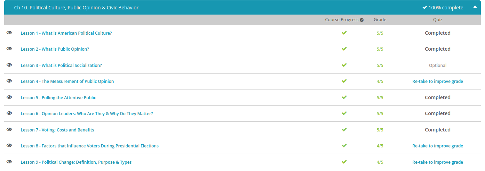

### Andrew Garber
### October 10
### Political Culture, Public Opinion & Civic Behavior

#### American Political Culture
 - the American principle that people have the right to pursue their dreams. This is 'the land of the free and the home of the brave', where a baby born in a log cabin can grow up to be president and where a college dropout can become the richest businessman in the world.
 - The American political culture is, of course, based on liberty. Generally speaking, this is the right to be free, as long as another's rights aren't harmed. Though many people believe liberty is the same thing as complete freedom, our liberty is somewhat restrained through laws and rules in order to protect other people's rights and safety. In the U.S., we have what is known as a limited government. This means that the power of our government is restricted by the Constitution. Our Bill of Rights guarantees that the government cannot infringe on certain civil liberties.
- Along with liberty, comes equality. This generally means people have the same or similar opportunities to compete and achieve in this country. Note that equality doesn't necessarily guarantee equal results. By balancing  liberty and equality, we actually get many different results. People are free to make different choices and achieve different results based on their personal choices. For instance, people who choose to go to medical school usually achieve a higher economic status than those who enter the workforce directly after high school.
 - Next, let's discuss democracy. A democracy is a government run by the people, through elected representatives. It's not exactly a 'majority rules' or 'winner takes all' system. The citizens of the U.S. elect the government officials, and the officials then exercise the governmental power. If the officials don't exercise the power the way the people want, then the people can impeach the officials or choose not to re-elect the officials.
 - That brings us to individualism. Generally, this means the individual's rights are valued above those of the government. This principle speaks to the 'independent spirit' and free will that characterizes many Americans. Think of the early colonists and the frontiersmen who settled the lands farther west. In America, initiative and independence are prized traits.
 - In some cases, American nationalism even includes the belief that we are superior to other nations. Many experts believe this type of nationalism can be helpful in times of strife or crises. For example, nationalism can serve as a sort of 'rallying point' during economic depression or wartime, because Americans share common feelings of patriotism and hope. President George W. Bush purposely appealed to this type of nationalism when responding to the American people directly after the 9/11 terrorist attacks.

#### Public Opinion
 - Public opinion is an expression of the general population's thoughts on a particular issue. Instead of saying 'Jane's opinion' or 'John's opinion,' we say 'public opinion' in order to represent a common, or popular, opinion on a particular issue. For example, a July 2014 poll showed that one in six Americans believes immigration to be the most important U.S. problem. In other words, the public opinion is that immigration is an important U.S. problem. Public opinion is a useful tool in politics and is often used when referring to political issues. It can be used to talk about a fiscal issue, like the budget deficit, or a social issue, like welfare benefits.
 - One of the main ways public opinion is determined is through public opinion polls. These are surveys commissioned by various groups in order to determine people's thoughts on particular matters. For example, the poll regarding immigration came from the Gallup Organization, which is an American company that publishes timely public opinion research on a multitude of topics through the use of the Gallup Poll. The Gallup Poll was first used in 1935 and routinely measures public opinion and attitudes on various political, social, and economic issues.
 - The history of [gallup](https://github.com/Garberchov/GARBER_INSTITUTE/blob/main/Q3-Q4_10TH/History/Completed%20Work/Current_Events_Summary_Session/history_of_polling.md)
 - Keep in mind, however, that a good sample will be a representative sample. A representative sample has the same basic characteristics as the general population. For example, the Hispanic population of America is approximately 17%. So, in our poll about immigration, the polled sample should also include a 17% portion of Hispanic Americans.
 - Let's take a look at how polling works. The Gallup Poll, and other polls like it, strives to gather accurate statistics. First, the pollsters must carefully design their questions. In order to produce accurate polling results, the questions must be objectively worded. This means the questions are phrased to be neutral and impartial. The questions shouldn't reflect the politician's or the pollster's views.
 - Keep in mind that an accurate sample will be a representative sample. A representative sample has the same basic characteristics as the general population. For example, let's say the population of Greenway City includes a 25% Italian population. A representative sample must also include a 25% Italian population.

#### Day 1

#### Polling the Public
 - the general public doesn't usually take the time to educate themselves on complex political issues. There is, however, a small portion of the public who make it their purpose to stay current with complex political issues.
 - We call groups of people who understand the nuances of politics, who stay on top of political events, and who vote in most, if not all, elections the attentive public. The thoughts and opinions of this specialized group is important for policy makers and for officials running for public office. An easy way to remember this would be to remember that you pay more attention to things you are interested in or already know a lot about. This is similar to how the attentive public is formed, too.
 - It is important to understand that anyone can become part of the attentive public. The attentive public do tend to be more educated than the general public, but being well educated doesn't automatically make someone part of the attentive public. For example, a nuclear engineer may be interested in issues of nuclear power policies, but may not be interested in a debate over international aid for sub-Saharan African countries.
 - How people feel about a particular issue, policy, or candidate is known as public opinion. It is extremely important in politics because it has a direct effect on the biggest concern for politicians: reelection. For example, how you feel about your favorite TV show has a direct effect on how long it stays on the air. If people start to dislike the plots and characters on a show, then the likelihood of that show getting cancelled becomes greater because people may stop watching it and convince others to stop watching it as well. The same is true for politicians.(Ironically, the possibility of a politician getting "cancelled" has become a literal concern instead of a figurative one.)
#### Opinion Leaders
 - Little of what happens in our political system is clearly black or white. In fact, many political issues rest in an ambiguous grey area. It doesn't help matters much when political candidates often try to avoid feeling too strongly on a topic so as not to alienate a voter base. Instead, when something happens in contemporary politics, we turn to people we trust to gauge how we should feel about something. We call these people opinion leaders.
 - In politics, opinion leaders interpret and disseminate political messages for the average person to help him or her understand complex political issues. Typically, the opinion leader is held in high esteem by those who accept his or her opinions. Examples of political opinion leaders include political pundits, or self-professed experts in a particular field, especially those who are called upon to provide comments or opinions in the media, such as public officials, celebrities, and media personalities.
 - The public on the whole has grown heavily skeptical towards politicians because people often feel that politicians may be attempting to manipulate them into feeling a certain way about an issue. Thus, what makes opinion leaders so important is that they are often seen as trustworthy and without a particular purpose. People are more inclined to accept a political message from someone they know rather than an elected official whom they have never met.
 - A classic example of using opinion leaders to engage the public on a political issue was the use of opinion leaders by Al Gore to raise awareness about climate change in his Climate Project. Gore found opinion leaders by recruiting individuals who were educated on environmental issues and saw themselves as influential in their community and among their friends and family. From there, he trained the opinion leaders on the information he wanted them to spread and enabled them to influence their communities. By using opinion leaders, Gore was able to educate and influence many Americans to take notice of climate change and change their actions(though if he had tried this in 2000, he might have been more successful :( )
#### Factors that Influence Voters
 - Perhaps, therefore, it's unreasonable to expect people to participate in the political process because the costs naturally outweigh the benefits. This view is supported by the rational choice theory. This theory is a general principle that assumes people make logical decisions that provide them with the greatest benefit and are in their best self-interest. Under the rational choice theory, voting is illogical and irrational behavior because it doesn't provide a sufficient benefit. Let's think for a moment about the benefits of voting. Most participating voters do so because they want to have an impact on their government. They want to share in the democratic process in a way in which they are entitled. However, in a country as large as the United States, it's highly unlikely that one person's vote will decide the outcome of a presidential election. But what would happen if everyone thought this way? What if no one voted? This is known as the paradox of participation. The paradox of participation recognizes that it's unreasonable to expect people to participate in the political process, but if everyone stops believing in the power of voting, the democratic process ceases. Without participation, there can be no process.
 -  Thestudy of voter behavior is an examination of why people voted the way they did. Many Americans closely follow political issues, but studies show that most do not. Most Americans therefore make their political decisions, and voting decisions, based on factors other than the issues. These factors include:
 -The voter's background and identification with the candidates
 -The voter's party identification
 -The voter's view of the incumbent's previous performance
 -For many voters, their impressions regarding particular candidates and political parties are deep-rooted. Most voters already know how they will vote, even in the early stages of a  -campaign. It is rare for campaigns to change the minds of voters, though sometimes a campaign can successfully sway enough voters to influence the predicted outcome of an election.
 - Consider the 2012 presidential election. Various polls showed that only around 10% of registered voters claimed to be undecided in the two months prior to Election Day. Of those 10%, approximately 40% claimed to be leaning toward a particular candidate
 - Next, let's look at how incumbent status can influence a voter's decision. A voter's view of an incumbent's previous performance greatly influences that voter's decision. Most presidential elections feature an incumbent candidate. Incumbent refers to the candidate who currently holds that particular political office. Since Obama was elected president in 2008, he was an incumbent, seeking reelection, in 2012.
- Unseating an incumbent president is difficult. For an incumbent to lose an election, some of the voters who voted for the incumbent in the previous election must switch allegiance. Many voters view an incumbent's performance based on the state of the national economy. When the economy is doing well, an incumbent has a good chance at reelection. The incumbent typically enjoys support from those affiliated with his or her party and will also gain the support of many Independents. However, when the economy is doing poorly, an incumbent might still enjoy support of those who identify with his or her party but won't likely gain the support of Independents.

#### Political change:
 - Big changes in your life may be to move to a new city, state, or country, or a change in jobs. You can even try really hard to change who runs the government. In fact, that last type of change is probably one of the biggest a group of people can experience. When there is a significant disruption in a government that leads to new or modified leadership or policies, we call this type of change political change.
 - If there is a group of people who feel that the government treats them unfairly and doesn't support them, while the government thinks that what they are doing is fine, then there is a friction that arises between the citizens and the government. In order to get things back into balance, either the citizens have to accept their way of life or the government has to be persuaded to do things differently. This is the purpose of political change. Political change is meant to restore balance from mismatched ideas and values between a government and the people that it leads.
 - Political changes most often stem from social or economic issues that a country may be facing. For instance, political change may be caused by social issues, such as the tensions between differing racial and ethnic groups or policies that deny specific groups of people civil rights. Political change may also occur if a country is suffering from economic turmoil and its citizens feel the pressure of not having enough money and feel that the government is not helping them out. (Though it is common for one party to call for these people to just "pull themselves up by their bootstraps")
 