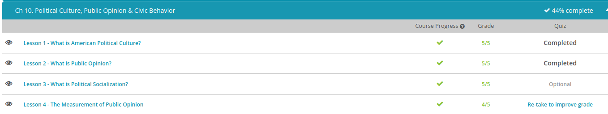

### Andrew Garber
### October 10
### Political Culture, Public Opinion & Civic Behavior

#### American Political Culture
 - the American principle that people have the right to pursue their dreams. This is 'the land of the free and the home of the brave', where a baby born in a log cabin can grow up to be president and where a college dropout can become the richest businessman in the world.
 - The American political culture is, of course, based on liberty. Generally speaking, this is the right to be free, as long as another's rights aren't harmed. Though many people believe liberty is the same thing as complete freedom, our liberty is somewhat restrained through laws and rules in order to protect other people's rights and safety. In the U.S., we have what is known as a limited government. This means that the power of our government is restricted by the Constitution. Our Bill of Rights guarantees that the government cannot infringe on certain civil liberties.
- Along with liberty, comes equality. This generally means people have the same or similar opportunities to compete and achieve in this country. Note that equality doesn't necessarily guarantee equal results. By balancing  liberty and equality, we actually get many different results. People are free to make different choices and achieve different results based on their personal choices. For instance, people who choose to go to medical school usually achieve a higher economic status than those who enter the workforce directly after high school.
 - Next, let's discuss democracy. A democracy is a government run by the people, through elected representatives. It's not exactly a 'majority rules' or 'winner takes all' system. The citizens of the U.S. elect the government officials, and the officials then exercise the governmental power. If the officials don't exercise the power the way the people want, then the people can impeach the officials or choose not to re-elect the officials.
 - That brings us to individualism. Generally, this means the individual's rights are valued above those of the government. This principle speaks to the 'independent spirit' and free will that characterizes many Americans. Think of the early colonists and the frontiersmen who settled the lands farther west. In America, initiative and independence are prized traits.
 - In some cases, American nationalism even includes the belief that we are superior to other nations. Many experts believe this type of nationalism can be helpful in times of strife or crises. For example, nationalism can serve as a sort of 'rallying point' during economic depression or wartime, because Americans share common feelings of patriotism and hope. President George W. Bush purposely appealed to this type of nationalism when responding to the American people directly after the 9/11 terrorist attacks.

#### Public Opinion
 - Public opinion is an expression of the general population's thoughts on a particular issue. Instead of saying 'Jane's opinion' or 'John's opinion,' we say 'public opinion' in order to represent a common, or popular, opinion on a particular issue. For example, a July 2014 poll showed that one in six Americans believes immigration to be the most important U.S. problem. In other words, the public opinion is that immigration is an important U.S. problem. Public opinion is a useful tool in politics and is often used when referring to political issues. It can be used to talk about a fiscal issue, like the budget deficit, or a social issue, like welfare benefits.
 - One of the main ways public opinion is determined is through public opinion polls. These are surveys commissioned by various groups in order to determine people's thoughts on particular matters. For example, the poll regarding immigration came from the Gallup Organization, which is an American company that publishes timely public opinion research on a multitude of topics through the use of the Gallup Poll. The Gallup Poll was first used in 1935 and routinely measures public opinion and attitudes on various political, social, and economic issues.
 - The history of [gallup](https://github.com/Garberchov/GARBER_INSTITUTE/blob/main/Q3-Q4_10TH/History/Completed%20Work/Current_Events_Summary_Session/history_of_polling.md)
 - Keep in mind, however, that a good sample will be a representative sample. A representative sample has the same basic characteristics as the general population. For example, the Hispanic population of America is approximately 17%. So, in our poll about immigration, the polled sample should also include a 17% portion of Hispanic Americans.
 - Let's take a look at how polling works. The Gallup Poll, and other polls like it, strives to gather accurate statistics. First, the pollsters must carefully design their questions. In order to produce accurate polling results, the questions must be objectively worded. This means the questions are phrased to be neutral and impartial. The questions shouldn't reflect the politician's or the pollster's views.
 - Keep in mind that an accurate sample will be a representative sample. A representative sample has the same basic characteristics as the general population. For example, let's say the population of Greenway City includes a 25% Italian population. A representative sample must also include a 25% Italian population.

#### Day 1
